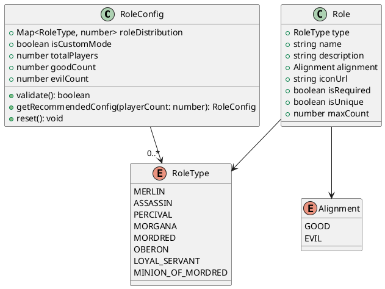
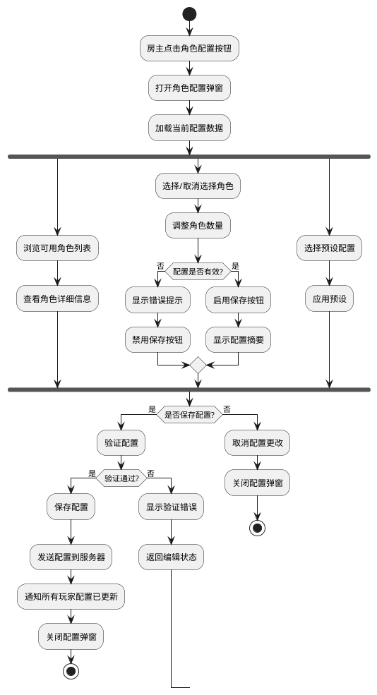
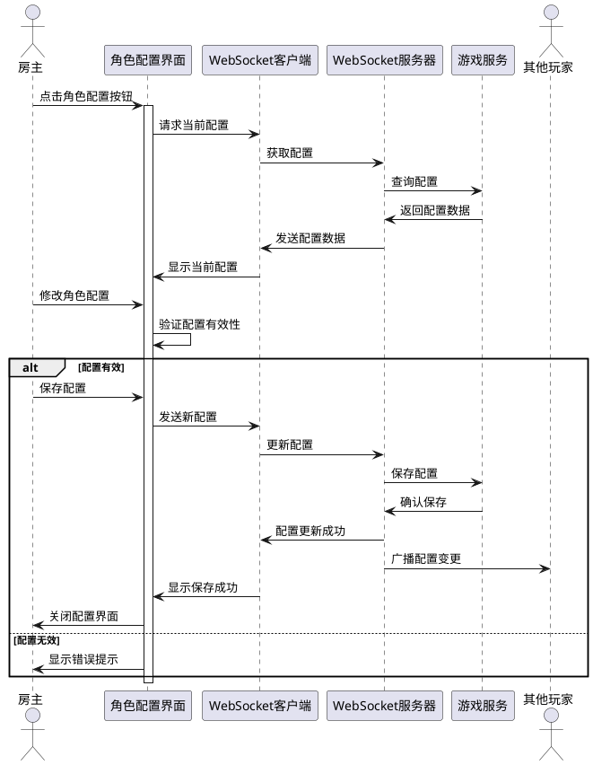
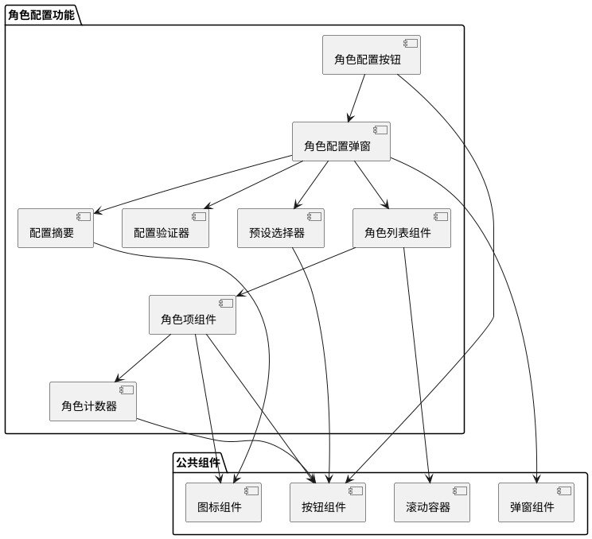

# Task 1.2.4: 实现房间角色配置功能

## 描述

实现游戏房间中的角色配置功能，允许房主选择游戏中将要使用的角色组合。该功能需要提供直观的界面，让房主能够根据玩家人数和游戏偏好，灵活配置不同角色的数量和类型，以满足多样化的游戏体验需求。

## 详细需求

### 功能需求

1. 角色配置界面

   - 房主可通过点击"角色配置"按钮打开配置界面
   - 配置界面以弹窗形式展示，不完全遮挡房间界面
   - 展示所有可用角色及其简要说明
   - 支持根据当前玩家数量推荐角色配置

2. 角色选择功能

   - 房主可以选择/取消选择特定角色
   - 显示每种角色的当前选择数量
   - 提供快速预设配置（如"标准配置"、"新手友好"等）
   - 确保选择的角色总数与玩家人数匹配

3. 配置验证与保存

   - 实时验证角色配置是否有效（如是否满足游戏规则要求）
   - 显示当前配置的正义/邪恶阵营比例
   - 保存配置并同步给房间内所有玩家
   - 提供重置为默认配置的选项

4. 配置展示

   - 在房间界面显示当前角色配置的简要信息
   - 非房主玩家可查看但不能修改配置
   - 配置变更时有通知提示给所有玩家

### 界面要求

1. 角色配置按钮位于房间界面适当位置，仅对房主可用
2. 配置界面设计美观，符合游戏整体风格
3. 角色图标清晰可辨，有对应的名称和简要说明
4. 选择/取消选择操作有明确的视觉反馈
5. 无效配置时提供明确的错误提示
6. 配置界面支持滚动浏览（当角色较多时）
7. 适配不同尺寸的设备屏幕

### 技术要求

1. 使用弹窗组件实现配置界面
2. 实现角色数据的动态加载和展示
3. 使用 WebSocket 实现配置的实时同步
4. 优化界面渲染性能，确保流畅体验
5. 实现配置数据的本地缓存，减少网络请求

## 实现步骤

1. 设计角色配置界面的视觉样式
2. 实现角色配置按钮及弹窗组件
3. 实现角色列表展示和选择功能
4. 实现配置验证逻辑
5. 实现配置保存和同步功能
6. 实现配置预设和推荐功能
7. 优化界面交互和动画效果
8. 实现配置变更通知机制

## 角色配置数据结构

## 角色配置界面流程图

## 角色配置交互序列图

## 角色配置组件结构图

## 角色配置功能（文本描述）

角色配置功能是阿瓦隆游戏房间中的重要功能，它允许房主根据玩家人数和游戏偏好，灵活配置游戏中将要使用的角色组合。该功能的设计遵循直观易用、灵活多样的原则：

1. **入口与权限**：

   - 角色配置按钮仅对房主可见且可用，位于房间界面右侧操作区
   - 非房主玩家可以查看当前配置，但不能修改
   - 房间信息区域显示当前是"标准配置"还是"自定义配置"

2. **配置界面设计**：

   - 配置界面以模态弹窗形式展示，半透明背景使玩家仍能看到房间状态
   - 顶部显示标题和当前玩家数量，底部是操作按钮（保存、取消、重置）
   - 中间区域分为两部分：左侧是角色列表，右侧是配置摘要和预设选项
   - 角色按阵营分组显示（正义/邪恶），使用对应的颜色标识

3. **角色选择机制**：

   - 每个角色项包含图标、名称、简要说明和数量选择器
   - 必选角色（如梅林、刺客）不可取消，但可调整数量（如有多个刺客）
   - 可选角色可以添加或移除，数量范围受游戏规则限制
   - 选择器使用"+/-"按钮，点击角色卡片可查看详细说明

4. **配置验证与反馈**：

   - 实时显示当前正义/邪恶阵营的角色数量和比例
   - 当配置无效时（如阵营比例不平衡、角色总数不匹配玩家数），显示红色警告
   - 提供明确的错误提示，如"邪恶阵营人数过多"或"总人数不足"
   - 无效配置时禁用保存按钮，防止错误配置被应用

5. **预设与推荐**：

   - 提供多种预设配置，如"标准配置"、"新手友好"、"高难度"等
   - 根据当前玩家数量自动推荐合适的配置
   - 预设选项以卡片形式展示，点击即可应用
   - 应用预设后仍可进行微调

6. **同步与通知**：

   - 配置保存后立即同步给所有玩家
   - 其他玩家收到配置变更通知，简要显示变更内容
   - 配置变更时有轻微的动画效果，引起玩家注意
   - 房间信息区域更新配置状态

通过这些设计，角色配置功能既满足了游戏多样性的需求，也保证了操作的简便性和直观性，使房主能够轻松创建符合当前玩家偏好的游戏体验。

## 验收标准

1. 房主能够通过点击角色配置按钮打开配置界面
2. 配置界面清晰展示所有可用角色及其说明
3. 房主能够增加/减少特定角色的数量
4. 系统能够实时验证配置是否有效，并提供明确的反馈
5. 配置界面提供预设选项，点击即可应用
6. 保存配置后，所有玩家能收到配置更新通知
7. 非房主玩家能查看但不能修改角色配置
8. 配置界面在不同尺寸的设备上都能正常显示
9. 角色图标和文字清晰可辨，没有模糊或像素化现象
10. 配置操作流畅，没有明显的延迟或卡顿

## 技术依赖

- PIXI.js 渲染引擎
- 弹窗组件库
- WebSocket 客户端（Socket.IO）
- 本地存储 API（缓存配置）

## 工作量估计

2 人天

## 相关文档

- [阿瓦隆游戏规则](待补充)
- [角色能力说明](待补充)
- [游戏平衡性设计](待补充)
