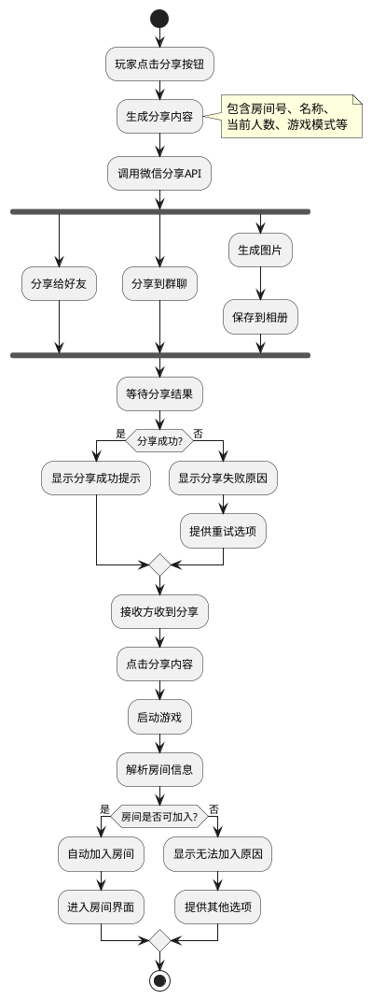
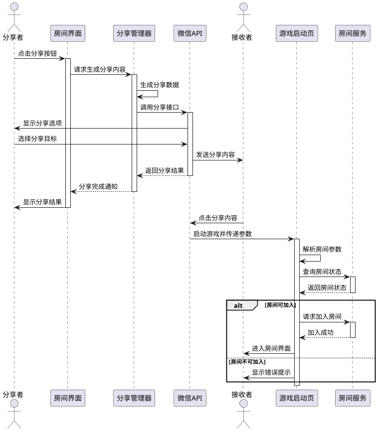
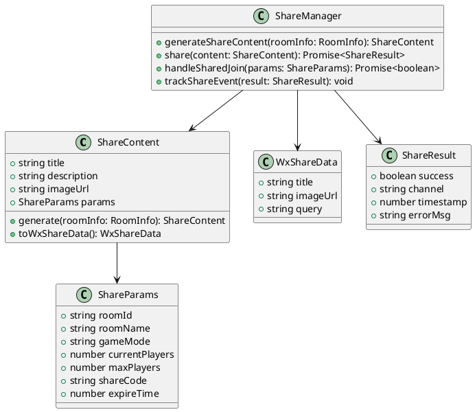
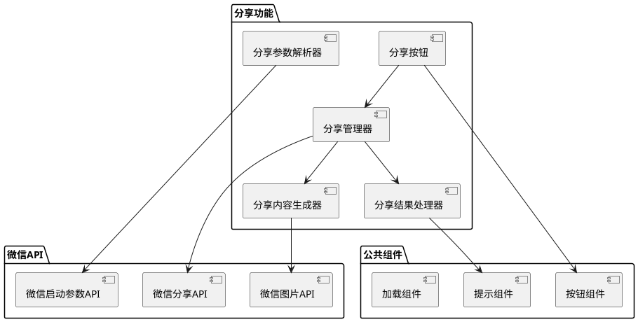

# Task 1.2.5: 实现房间分享功能

## 描述

实现游戏房间的分享功能，允许玩家通过微信分享房间信息给好友，以便邀请更多玩家加入游戏。该功能需要提供简单直观的操作方式，生成包含房间信息的分享卡片，并支持接收方通过分享内容直接加入房间。

## 详细需求

### 功能需求

1. 分享入口

   - 在房间界面提供明显的"邀请好友"或"分享房间"按钮
   - 按钮位置醒目，易于发现和点击
   - 可选择在房间信息区域提供额外的分享入口

2. 分享内容生成

   - 生成包含房间号、房间名称、游戏模式、当前人数等信息的分享卡片
   - 分享卡片包含游戏 logo 和主题图片，视觉效果吸引人
   - 分享文案简洁明了，包含邀请信息和房间基本情况
   - 支持自定义分享文案（可选功能）

3. 分享渠道

   - 支持分享给微信好友
   - 支持分享到微信群
   - 支持生成分享图片保存到本地（可选功能）

4. 分享后处理

   - 接收方点击分享内容后直接跳转到游戏
   - 自动识别房间号并尝试加入房间
   - 如房间已满或已开始游戏，显示相应提示

### 界面要求

1. 分享按钮设计醒目，使用通用的分享图标
2. 点击分享按钮后的操作流程简单直观
3. 分享卡片设计美观，符合游戏整体风格
4. 分享过程中有适当的加载提示
5. 分享成功/失败有明确的反馈

### 技术要求

1. 使用微信小游戏分享 API 实现分享功能
2. 优化分享卡片的生成速度
3. 确保分享链接的有效性和安全性
4. 实现分享统计和追踪（可选功能）
5. 处理各种异常情况，如分享失败、网络错误等

## 实现步骤

1. 设计分享按钮和交互流程
2. 实现分享卡片的生成逻辑
3. 集成微信分享 API
4. 实现分享后的跳转和房间加入逻辑
5. 添加分享统计和分析功能
6. 优化分享体验和性能
7. 测试各种分享场景和异常情况

## 分享功能流程图

## 分享交互序列图

## 分享数据结构

## 分享组件结构图

## 房间分享功能（文本描述）

房间分享功能是阿瓦隆游戏中促进社交传播的关键功能，它允许玩家方便地邀请好友加入游戏房间。该功能的设计遵循简单易用、高效直观的原则：

1. **分享入口设计**：

   - 主要分享按钮位于房间界面右上角，使用通用的"分享"图标，醒目且易于识别
   - 房间信息区域的房间号旁边有一个小型分享图标，提供额外的分享入口
   - 分享按钮有轻微的呼吸动效，在房间人数不足时更加明显，提示玩家邀请好友

2. **分享内容设计**：

   - 分享卡片采用游戏主题风格，上方是游戏 logo 和精美的角色插图
   - 卡片中部显示"[玩家昵称]邀请你加入阿瓦隆游戏"的个性化文案
   - 下方清晰展示房间号、当前人数/最大人数、游戏模式等关键信息
   - 卡片底部有"点击加入"的行动引导文案
   - 整体设计简洁大方，信息层次清晰

3. **分享操作流程**：

   - 点击分享按钮后，短暂显示"生成分享卡片中..."的加载提示
   - 生成完成后自动调用微信分享界面，玩家可选择分享对象
   - 分享过程简单直接，无需额外确认步骤
   - 分享完成后有简短的成功提示，不打断游戏体验

4. **接收方体验**：

   - 接收方点击分享内容后直接启动游戏
   - 如已安装游戏，则自动解析房间信息并尝试加入
   - 如未安装游戏，则引导下载安装
   - 加入房间过程自动化，无需手动输入房间号
   - 如房间已满或已开始游戏，显示友好提示并提供其他选项

5. **特殊功能**：

   - 支持生成带房间二维码的分享图片，可保存到相册
   - 分享链接具有有效期，超时后提示房间可能已关闭
   - 房主分享时可附带"房主邀请"标识，提高接受率
   - 支持追踪分享转化率，了解邀请效果

6. **异常处理**：
   - 分享失败时提供明确的错误提示和重试选项
   - 网络不稳定时采用轻量级分享内容，确保基本功能可用
   - 房间状态变化（如已开始游戏）时，接收方收到及时更新的提示
   - 提供备选的手动加入方式，增强可靠性

通过这些设计，房间分享功能不仅便于玩家邀请好友，还通过精美的分享内容和流畅的加入体验，提高了游戏的社交传播效果和新用户转化率。

## 验收标准

1. 房间界面中的分享按钮位置醒目，点击响应迅速
2. 分享卡片内容完整，包含房间号、房间名称、游戏模式、当前人数等信息
3. 分享卡片设计美观，符合游戏整体风格
4. 成功调用微信分享接口，可分享给好友和群聊
5. 接收方点击分享内容后能正确启动游戏并解析房间信息
6. 房间可加入时自动完成加入流程，无需手动输入房间号
7. 房间不可加入时（已满、已开始游戏等）显示明确的提示信息
8. 分享过程中的加载状态和结果有清晰的反馈
9. 在网络不稳定情况下仍能完成基本分享功能
10. 分享功能在不同机型和系统版本上表现一致

## 技术依赖

- 微信小游戏分享 API
- 微信小游戏启动参数 API
- 图片生成和处理库
- 网络状态检测 API

## 工作量估计

1.5 人天

## 相关文档

- [微信小游戏分享 API 文档](https://developers.weixin.qq.com/minigame/dev/api/share/wx.shareAppMessage.html)
- [微信小游戏启动参数文档](https://developers.weixin.qq.com/minigame/dev/api/base/app/life-cycle/wx.getLaunchOptionsSync.html)
- [分享卡片设计规范](待补充)
- [房间加入流程说明](待补充)
