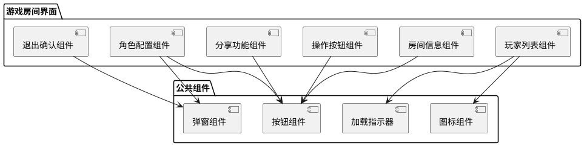
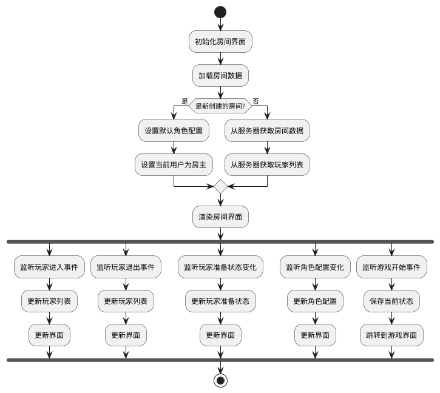
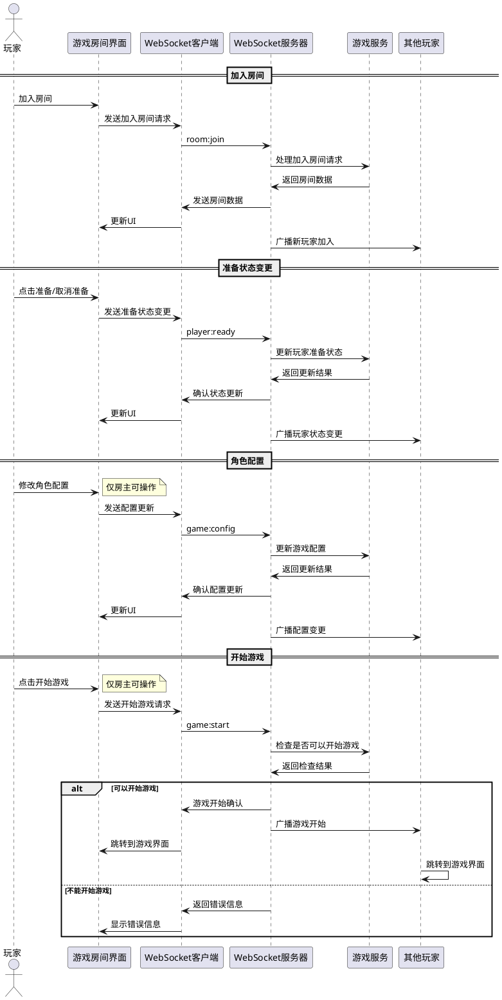
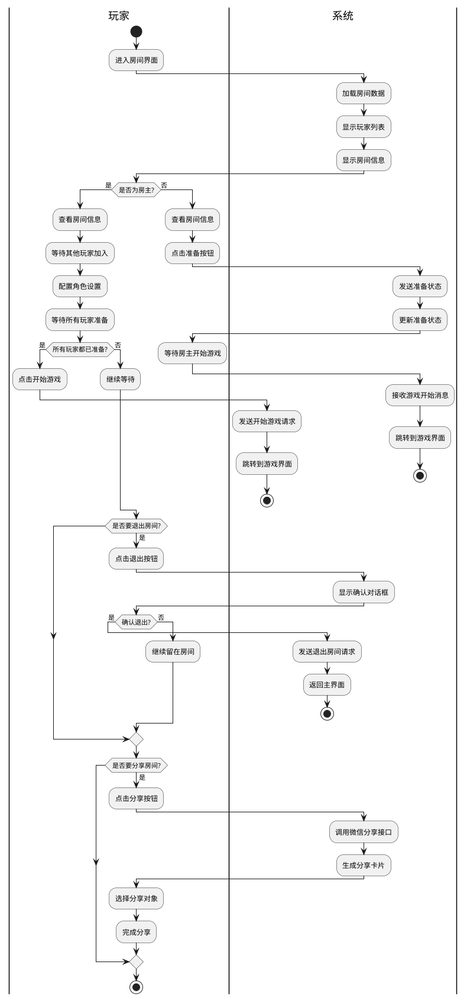

# 游戏房间界面技术方案

## 概述

游戏房间界面是玩家在游戏开始前的准备阶段所使用的界面。本文档详细说明游戏房间界面的技术实现方案，包括界面设计、组件结构、状态管理、网络通信等方面。

## 技术选型

1. **前端框架**：微信小游戏框架
2. **渲染引擎**：PIXI.js
3. **网络通信**：WebSocket (Socket.IO)
4. **状态管理**：自定义状态管理器

## 界面架构

### 界面布局

游戏房间界面主要分为以下几个部分：

1. 房间信息区（顶部）：显示房间号、游戏模式等信息
2. 玩家列表区（中部）：显示所有玩家及其准备状态
3. 操作按钮区（底部）：准备/取消按钮、开始游戏按钮（仅房主可见）等
4. 角色配置区（侧边栏或弹窗）：房主可配置游戏角色
5. 聊天区（可选，侧边栏）：简单的聊天功能

### 组件结构



## 状态管理

### 核心状态

```typescript
// 房间状态
interface RoomState {
  roomId: string; // 房间号
  roomName: string; // 房间名称
  hostId: string; // 房主ID
  gameMode: GameMode; // 游戏模式
  maxPlayers: number; // 最大玩家数
  roleConfig: RoleConfig; // 角色配置
  gameStatus: GameStatus; // 游戏状态（准备中、游戏中）
}

// 玩家状态
interface PlayerState {
  id: string; // 玩家ID
  nickname: string; // 玩家昵称
  avatar: string; // 玩家头像
  isReady: boolean; // 是否准备
  isHost: boolean; // 是否为房主
  joinTime: number; // 加入时间戳
}

// 房间内的综合状态
interface RoomViewState {
  currentUser: UserInfo; // 当前用户信息
  room: RoomState; // 房间状态
  players: PlayerState[]; // 玩家列表
  isConfiguring: boolean; // 是否正在配置角色
  isSharing: boolean; // 是否正在分享
  errorMessage: string; // 错误消息
}
```

### 状态管理流程图



## 网络通信

### WebSocket 事件

以下是游戏房间界面需要处理的主要 WebSocket 事件：

1. **连接相关事件**

   - `connect`：连接成功
   - `disconnect`：连接断开
   - `reconnect`：重新连接

2. **房间相关事件**

   - `room:join`：玩家加入房间
   - `room:leave`：玩家离开房间
   - `room:update`：房间信息更新
   - `room:error`：房间操作错误

3. **玩家相关事件**

   - `player:ready`：玩家准备状态变化
   - `player:update`：玩家信息更新

4. **游戏相关事件**
   - `game:config`：游戏配置更新
   - `game:start`：游戏开始
   - `game:cancel`：游戏取消

### 网络通信序列图



## 界面交互流程

### 用户操作流程图



## 错误处理

1. **网络错误**：

   - 断线时显示重连提示
   - 重连失败后提供手动重试选项
   - 持续重连失败提供退出选项

2. **业务错误**：

   - 角色配置错误：显示错误提示，恢复有效配置
   - 开始游戏条件不满足：显示详细原因（如人数不足、有玩家未准备）
   - 权限错误：非房主尝试房主操作时显示提示

3. **异常场景**：
   - 房主退出：转移房主权限给下一位玩家
   - 房间被解散：显示提示并返回主界面
   - 服务器维护：显示维护信息并提供退出选项

## 性能优化

1. **资源加载**：

   - 采用按需加载策略
   - 预加载下一阶段（游戏界面）资源
   - 缓存常用资源

2. **渲染优化**：

   - 使用精灵表（Sprite Sheet）合并纹理
   - 优化重绘逻辑，避免不必要的渲染
   - 对不常变化的元素使用缓存

3. **网络优化**：
   - 减少不必要的网络请求
   - 对频繁更新的数据使用增量更新
   - 实现请求合并和防抖动机制

## 开发与测试计划

1. **开发阶段**：

   - 阶段 1：基础界面框架实现（2 天）
   - 阶段 2：房间信息和玩家列表展示（2 天）
   - 阶段 3：准备状态和操作按钮功能（2 天）
   - 阶段 4：角色配置和分享功能（2 天）
   - 阶段 5：优化和修复（1 天）

2. **测试重点**：
   - 多人同时在房间的状态同步
   - 不同设备下的界面适配
   - 网络波动情况下的稳定性
   - 多次进出房间的状态正确性
   - 边界情况（满员、全员准备等）

## 相关任务

本技术方案涉及以下具体任务的实现：

- [Task 1.2.1: 设计并实现房间基本信息展示](./Task1.2.1_设计并实现房间基本信息展示.md)
- [Task 1.2.2: 实现玩家列表及状态展示](./Task1.2.2_实现玩家列表及状态展示.md)
- [Task 1.2.3: 实现准备及取消准备功能](./Task1.2.3_实现准备及取消准备功能.md)
- [Task 1.2.4: 实现房间角色配置功能](./Task1.2.4_实现房间角色配置功能.md)
- [Task 1.2.5: 实现房间分享功能](./Task1.2.5_实现房间分享功能.md)
