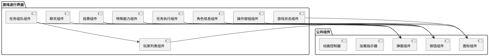
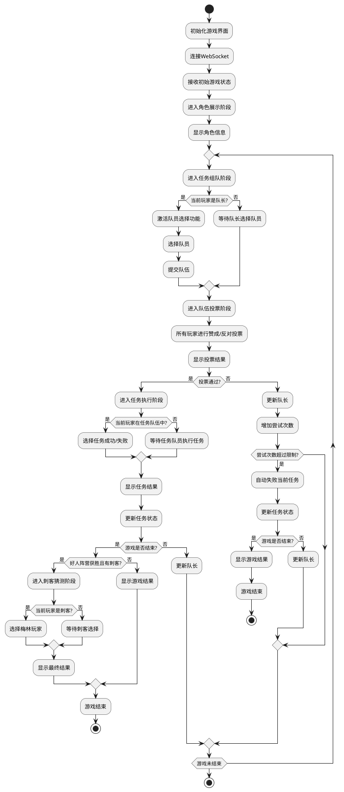
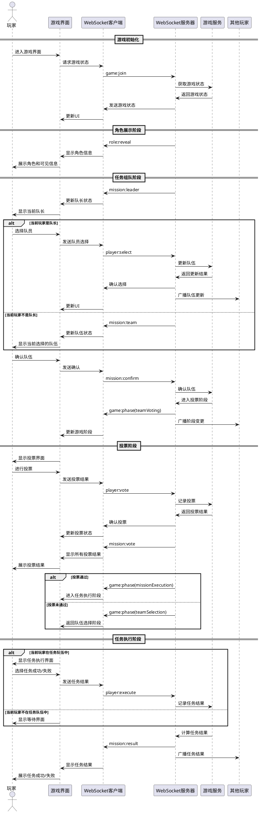

# 游戏进行界面技术方案

## 概述

游戏进行界面是阿瓦隆游戏中最核心的界面，玩家在此界面完成角色查看、任务组队、投票、任务执行等关键游戏环节。本文档详细说明游戏进行界面的技术实现方案，包括界面设计、组件结构、状态管理、网络通信等方面。

## 技术选型

1. **前端框架**：微信小游戏框架
2. **渲染引擎**：PIXI.js
3. **网络通信**：WebSocket (Socket.IO)
4. **状态管理**：自定义状态管理器
5. **动画效果**：GSAP 动画库

## 界面架构

### 界面布局

游戏进行界面采用分层设计，主要包括以下几个部分：

1. **底层背景**：游戏主题背景，营造游戏氛围
2. **游戏状态区**（顶部）：显示当前回合、任务成功/失败情况、队长标识等
3. **玩家区域**（中部）：显示所有玩家头像、名称及状态
4. **操作区域**（底部）：根据当前游戏阶段显示不同的操作按钮
5. **弹出层**：角色信息、任务组队、投票、任务执行等功能的弹窗
6. **聊天区域**（可折叠侧边栏）：玩家交流功能

### 组件结构



## 状态管理

### 核心状态

```typescript
// 游戏阶段枚举
enum GamePhase {
  ROLE_REVEAL = "roleReveal", // 角色展示阶段
  TEAM_SELECTION = "teamSelection", // 任务组队阶段
  TEAM_VOTING = "teamVoting", // 队伍投票阶段
  MISSION_EXECUTION = "missionExecution", // 任务执行阶段
  MISSION_RESULT = "missionResult", // 任务结果展示阶段
  ASSASSIN_PHASE = "assassinPhase", // 刺客猜测阶段
  GAME_OVER = "gameOver", // 游戏结束阶段
}

// 游戏状态
interface GameState {
  phase: GamePhase; // 当前游戏阶段
  round: number; // 当前回合数
  attempt: number; // 当前回合的尝试次数
  leader: string; // 当前队长ID
  missionResults: boolean[]; // 任务结果数组
  teamVotes: Record<string, boolean>; // 队伍投票结果
  missionVotes: Record<string, boolean>; // 任务投票结果
  selectedTeam: string[]; // 当前选择的队伍
  playerInfo: Record<string, PlayerInfo>; // 玩家信息
  visibleRoles: Record<string, string[]>; // 可见角色信息
}

// 玩家信息
interface PlayerInfo {
  id: string; // 玩家ID
  nickname: string; // 昵称
  avatar: string; // 头像
  role: string; // 角色
  isLeader: boolean; // 是否为队长
  isSelected: boolean; // 是否被选中参与任务
  hasVoted: boolean; // 是否已投票
}

// 界面状态
interface UIState {
  isRoleInfoVisible: boolean; // 角色信息是否可见
  isTeamSelectionActive: boolean; // 是否处于队伍选择状态
  isVotingActive: boolean; // 是否处于投票状态
  isMissionActive: boolean; // 是否处于任务执行状态
  isChatVisible: boolean; // 聊天面板是否可见
  activeModal: string | null; // 当前激活的弹窗
  animationPlaying: boolean; // 是否有动画正在播放
}
```

### 状态管理流程图



## 网络通信

### WebSocket 事件

以下是游戏进行界面需要处理的主要 WebSocket 事件：

1. **游戏状态事件**

   - `game:phase` - 游戏阶段变更
   - `game:update` - 游戏状态更新
   - `game:error` - 游戏操作错误

2. **角色相关事件**

   - `role:reveal` - 角色信息展示
   - `role:visibility` - 角色可见性信息

3. **任务相关事件**

   - `mission:leader` - 队长更新
   - `mission:team` - 队伍选择更新
   - `mission:vote` - 投票更新
   - `mission:result` - 任务结果
   - `mission:history` - 任务历史记录

4. **玩家操作事件**
   - `player:select` - 选择队员
   - `player:vote` - 投票操作
   - `player:execute` - 执行任务
   - `player:assassinate` - 刺客猜测
   - `player:chat` - 聊天消息

### 网络通信序列图



## 界面交互流程

### 角色信息展示

1. 游戏开始后，首先进入角色展示阶段
2. 显示玩家自己的角色卡片，包含角色名称、阵营、能力描述和图标
3. 根据角色可见性规则，显示可见的其他玩家角色信息
4. 玩家确认角色信息后，进入游戏主界面
5. 玩家可随时点击自己的头像查看角色信息

### 任务组队流程

1. 系统指定一名玩家为队长，在其头像上显示队长标识
2. 队长选择指定数量的玩家组成任务队伍
   - 队长点击玩家头像选择/取消选择
   - 界面实时显示已选玩家数量和需要的玩家数量
3. 队长确认队伍后，进入投票阶段
4. 非队长玩家在此阶段只能查看队长的选择，无法操作

### 投票流程

1. 所有玩家看到当前选定的队伍成员
2. 每位玩家进行赞成/反对投票
   - 显示赞成（拇指向上）和反对（拇指向下）按钮
   - 玩家点击按钮进行选择，确认后不可更改
3. 所有玩家完成投票后，显示投票结果
   - 显示每位玩家的投票选择
   - 显示投票是否通过的结果
4. 根据投票结果，进入任务执行阶段或返回队伍选择阶段

### 任务执行流程

1. 被选中参与任务的玩家看到任务执行界面
   - 好人阵营只能选择"任务成功"
   - 坏人阵营可以选择"任务成功"或"任务失败"
2. 非任务队员看到等待界面
3. 所有任务队员完成选择后，显示任务结果
   - 显示成功/失败的票数（不显示具体谁投的）
   - 更新任务状态板上的任务结果标记

### 特殊角色能力使用

1. 刺客在游戏结束前有机会猜测梅林
   - 显示所有好人阵营玩家
   - 刺客选择一名玩家作为猜测目标
2. 其他特殊角色能力（如湖中仙女）根据游戏规则在特定阶段激活

## 界面设计细节

### 游戏状态展示

1. 顶部状态栏显示：

   - 当前回合数（第几轮任务）
   - 当前尝试次数
   - 已完成任务的成功/失败状态
   - 当前队长标识

2. 使用直观的视觉元素：
   - 任务成功：蓝色盾牌图标
   - 任务失败：红色叉图标
   - 未完成任务：灰色问号图标
   - 当前任务：闪烁边框

### 玩家列表展示

1. 玩家头像排列成圆形或半圆形，便于查看所有玩家
2. 每个玩家项包含：
   - 头像（圆形）
   - 昵称
   - 状态标识（队长、当前发言、已投票等）
3. 特殊状态标识：
   - 队长：皇冠图标
   - 被选中参与任务：高亮边框
   - 已投票：投票图标
   - 当前玩家：特殊边框

### 动画效果

1. 阶段转换动画：
   - 使用淡入淡出和缩放效果
   - 重要阶段有特殊过渡效果
2. 投票动画：
   - 投票卡片翻转展示
   - 结果统计动画
3. 任务结果动画：
   - 成功/失败结果的动态展示
   - 任务标记更新动画
4. 队长转移动画：
   - 皇冠图标的移动效果

## 性能优化

1. **资源加载**：

   - 游戏开始前预加载所有必要资源
   - 使用精灵图（Sprite Sheet）减少纹理切换
   - 实现资源缓存机制

2. **渲染优化**：

   - 使用对象池管理频繁创建/销毁的元素
   - 优化重绘逻辑，避免不必要的渲染
   - 使用适当的分辨率和压缩格式

3. **网络优化**：
   - 减少不必要的网络请求
   - 实现状态压缩和增量更新
   - 添加网络状态指示和重连机制

## 异常处理

1. **网络异常**：

   - 断线时显示重连提示
   - 自动重连机制
   - 重连后状态同步

2. **游戏状态异常**：

   - 状态不一致时请求完整状态更新
   - 错误操作提示
   - 防止重复操作

3. **用户操作异常**：
   - 操作超时提醒
   - 误操作确认机制
   - 操作冲突解决策略

## 相关任务

本技术方案涉及以下具体任务的实现：

- [Task 1.3.1: 设计并实现角色信息展示界面](./Task1.3.1_设计并实现角色信息展示界面.md)
- [Task 1.3.2: 实现任务组队界面](./Task1.3.2_实现任务组队界面.md)
- [Task 1.3.3: 实现投票界面](./Task1.3.3_实现投票界面.md)
- [Task 1.3.4: 实现任务执行界面](./Task1.3.4_实现任务执行界面.md)
- [Task 1.3.5: 实现游戏状态和进度展示](./Task1.3.5_实现游戏状态和进度展示.md)
- [Task 1.3.6: 实现玩家交流功能](./Task1.3.6_实现玩家交流功能.md)
- [Task 1.3.7: 实现特殊角色能力界面](./Task1.3.7_实现特殊角色能力界面.md)
