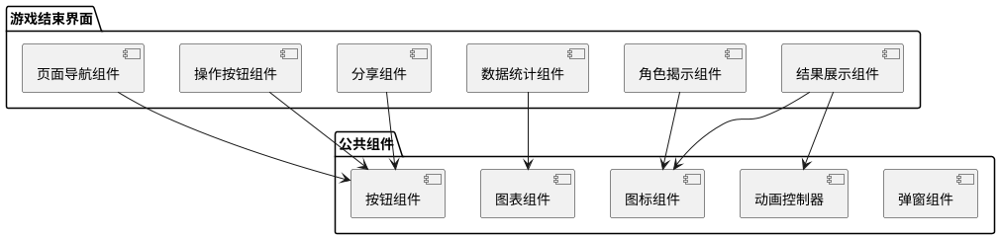
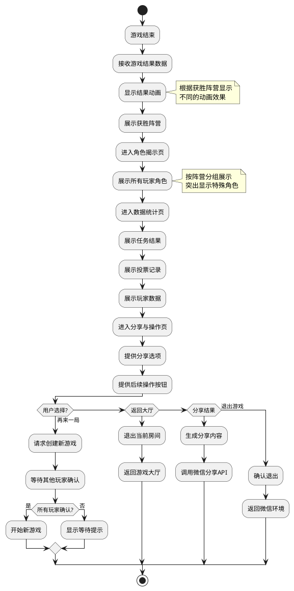

# 游戏结束界面技术方案

## 概述

游戏结束界面是阿瓦隆游戏的最终环节，展示游戏结果、角色揭示和数据统计，并提供分享和后续操作选项。本文档详细说明游戏结束界面的技术实现方案，包括界面设计、组件结构、数据处理和交互流程。

## 技术选型

1. **前端框架**：微信小游戏框架
2. **渲染引擎**：PIXI.js
3. **动画效果**：GSAP 动画库
4. **数据可视化**：自定义图表组件
5. **分享功能**：微信小游戏分享 API

## 界面架构

### 界面布局

游戏结束界面采用分页设计，主要包括以下几个部分：

1. **结果展示页**：显示获胜阵营和胜利动画
2. **角色揭示页**：展示所有玩家的真实角色
3. **数据统计页**：展示任务成功/失败、投票记录等数据
4. **分享与操作页**：提供分享和后续操作选项

用户可通过滑动或点击标签切换不同页面。

### 组件结构



## 数据结构

### 游戏结果数据

```typescript
// 游戏结果枚举
enum GameResult {
  GOOD_WIN = "goodWin", // 好人阵营获胜
  EVIL_WIN_MISSIONS = "evilWinMissions", // 坏人阵营通过任务获胜
  EVIL_WIN_ASSASSIN = "evilWinAssassin", // 坏人阵营通过刺客猜测获胜
  EVIL_WIN_VOTES = "evilWinVotes", // 坏人阵营通过连续投票失败获胜
}

// 游戏结束数据
interface GameEndData {
  result: GameResult; // 游戏结果
  winningTeam: "good" | "evil"; // 获胜阵营
  players: PlayerEndInfo[]; // 玩家结束信息
  missions: MissionResult[]; // 任务结果
  votingHistory: VotingRecord[]; // 投票历史
  assassinTarget?: string; // 刺客猜测目标（如果有）
  gameStats: GameStatistics; // 游戏统计数据
  gameId: string; // 游戏ID
  duration: number; // 游戏持续时间（秒）
}

// 玩家结束信息
interface PlayerEndInfo {
  id: string; // 玩家ID
  nickname: string; // 昵称
  avatar: string; // 头像
  role: string; // 角色
  alignment: "good" | "evil"; // 阵营
  isWinner: boolean; // 是否获胜
  missionParticipation: number; // 参与任务次数
  votingStats: {
    // 投票统计
    approve: number; // 赞成次数
    reject: number; // 反对次数
  };
}

// 任务结果
interface MissionResult {
  round: number; // 回合数
  teamSize: number; // 队伍大小
  team: string[]; // 队伍成员ID
  success: boolean; // 是否成功
  failVotes: number; // 失败票数
  attempts: number; // 尝试次数
}

// 投票记录
interface VotingRecord {
  round: number; // 回合数
  attempt: number; // 尝试次数
  leader: string; // 队长ID
  team: string[]; // 队伍成员ID
  votes: Record<string, boolean>; // 投票结果（玩家ID -> 是否赞成）
  approved: boolean; // 是否通过
}

// 游戏统计数据
interface GameStatistics {
  totalRounds: number; // 总回合数
  totalVotes: number; // 总投票次数
  totalAttempts: number; // 总尝试次数
  successMissions: number; // 成功任务数
  failedMissions: number; // 失败任务数
  averageTeamApprovalRate: number; // 平均队伍通过率
}
```

## 界面流程

### 结果展示流程图



## 交互设计

### 结果展示页

1. **胜利动画**：

   - 好人阵营获胜：显示亚瑟王剑和圆桌骑士的胜利场景
   - 坏人阵营获胜：显示莫德雷德和邪恶势力的胜利场景
   - 动画持续 3-5 秒，可点击跳过

2. **结果展示**：

   - 大标题显示"好人阵营胜利"或"邪恶阵营胜利"
   - 副标题显示胜利原因（如"成功完成 3 个任务"或"刺客成功刺杀梅林"）
   - 使用对应阵营的颜色主题（蓝色/红色）

3. **过渡效果**：
   - 向上滑动或点击"继续"按钮进入下一页
   - 页面切换使用滑动过渡动画

### 角色揭示页

1. **角色展示**：

   - 将所有玩家按阵营分为两组展示
   - 每个玩家项包含头像、昵称、角色名称和角色图标
   - 特殊角色（如梅林、刺客）有突出显示效果

2. **揭示动画**：

   - 角色信息卡片初始为背面状态
   - 依次翻转展示每个玩家的真实角色
   - 可点击"全部揭示"立即显示所有角色

3. **交互功能**：
   - 点击角色卡片可查看详细角色描述
   - 提供"查看规则"按钮，可查看角色能力说明

### 数据统计页

1. **任务结果展示**：

   - 使用图形化方式展示 5 轮任务的成功/失败情况
   - 显示每轮任务的队伍成员和失败票数
   - 使用时间轴形式展示任务进程

2. **投票记录展示**：

   - 展示每轮投票的详细情况
   - 显示队长、队伍成员和每位玩家的投票选择
   - 提供筛选和展开/折叠功能

3. **玩家数据展示**：
   - 显示每位玩家的参与任务次数、投票统计等数据
   - 使用图表形式直观展示数据对比
   - 可按不同指标排序

### 分享与操作页

1. **分享功能**：

   - 提供"分享结果"按钮，生成游戏结果分享卡片
   - 分享内容包含游戏结果、角色分布和简要统计
   - 支持分享到微信好友和群聊

2. **后续操作**：

   - "再来一局"：保持当前房间，开始新游戏
   - "返回大厅"：退出当前房间，返回游戏大厅
   - "退出游戏"：完全退出游戏，返回微信环境

3. **其他功能**：
   - "保存战报"：将游戏数据保存到个人记录
   - "举报问题"：提供反馈渠道

## 技术实现细节

### 动画效果实现

1. **胜利动画**：

   - 使用 GSAP 实现元素动画
   - 预加载动画资源，确保流畅播放
   - 实现动画跳过功能，避免用户等待

2. **翻转效果**：

   - 使用 CSS 3D 变换实现卡片翻转
   - 添加适当的缓动效果，增强视觉体验
   - 实现批量翻转和单个翻转两种模式

3. **页面切换**：
   - 实现滑动检测和页面切换逻辑
   - 添加页面指示器，显示当前位置
   - 优化页面切换性能，避免卡顿

### 数据可视化

1. **图表组件**：

   - 实现自定义图表组件，展示任务结果和投票数据
   - 支持交互式操作，如点击查看详情
   - 优化渲染性能，处理大量数据

2. **数据处理**：

   - 对原始游戏数据进行预处理和聚合
   - 计算统计指标，如参与率、成功率等
   - 实现数据缓存，提高加载速度

3. **动态更新**：
   - 支持数据的动态加载和更新
   - 实现数据变化的过渡动画
   - 处理数据加载异常情况

### 分享功能实现

1. **分享内容生成**：

   - 根据游戏结果动态生成分享文案和图片
   - 优化分享内容的可读性和吸引力
   - 添加游戏标识和邀请信息

2. **微信分享集成**：

   - 集成微信小游戏分享 API
   - 处理分享回调和结果跟踪
   - 实现分享统计功能

3. **分享权限处理**：
   - 处理用户拒绝分享的情况
   - 提供备选的分享方式
   - 确保分享内容符合平台规范

## 性能优化

1. **资源加载**：

   - 实现资源的按需加载和预加载策略
   - 优化图片资源，减少加载时间
   - 使用缓存机制，避免重复加载

2. **渲染优化**：

   - 减少重绘和重排操作
   - 使用图层合成技术，提高动画性能
   - 优化大量数据的渲染方式

3. **内存管理**：
   - 及时释放不需要的资源
   - 避免内存泄漏问题
   - 优化大数据集的处理方式

## 异常处理

1. **数据异常**：

   - 处理数据缺失或格式错误的情况
   - 提供默认值和降级显示
   - 记录异常并上报

2. **网络异常**：

   - 处理网络请求失败的情况
   - 实现数据的本地缓存
   - 提供重试机制

3. **用户操作异常**：
   - 防止重复操作和快速点击
   - 添加操作确认机制
   - 提供清晰的错误提示

## 相关任务

本技术方案涉及以下具体任务的实现：

- [Task 1.4.1: 设计并实现游戏结果展示](./Task1.4.1_设计并实现游戏结果展示.md)
- [Task 1.4.2: 实现角色揭示功能](./Task1.4.2_实现角色揭示功能.md)
- [Task 1.4.3: 实现游戏数据统计展示](./Task1.4.3_实现游戏数据统计展示.md)
- [Task 1.4.4: 实现结果分享功能](./Task1.4.4_实现结果分享功能.md)
- [Task 1.4.5: 实现后续操作选项](./Task1.4.5_实现后续操作选项.md)
