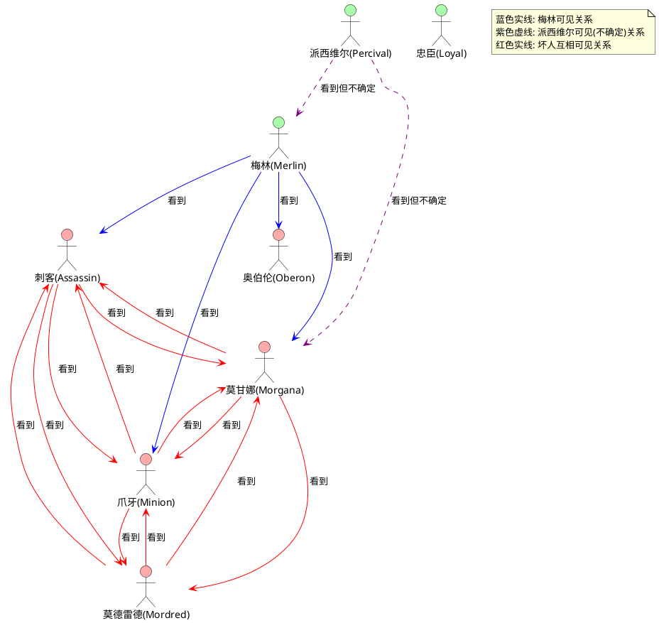
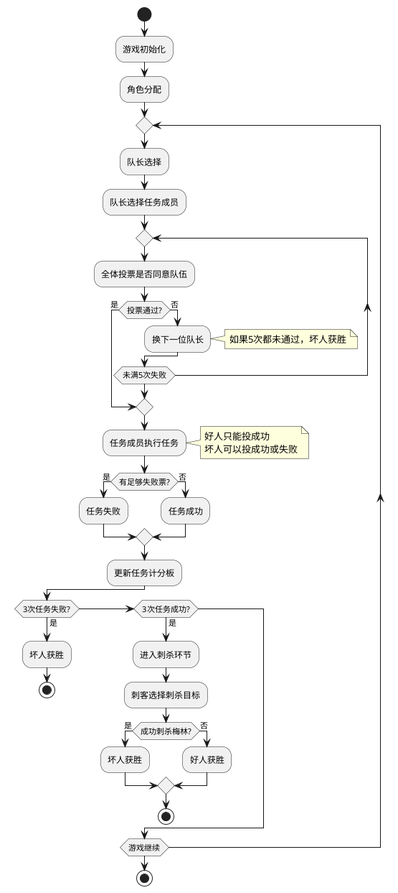

# 阿瓦隆角色能力关系图

## 角色知情关系图

下面使用 PlantUML 图表展示阿瓦隆游戏中角色之间的知情关系，即哪些角色能看到其他角色。



## 游戏人数与角色分配关系图

以下图表展示了不同游戏人数下的标准角色分配方案：

```plantuml
@startuml 阿瓦隆角色分配方案

' 设置图表类型
!define RECTANGLE class
!define GOODRECT class
!define EVILRECT class

skinparam class {
  BackgroundColor white
  BorderColor black
  ArrowColor black
}

skinparam GOODRECT {
  BackgroundColor #AAFFAA
  BorderColor Green
}

skinparam EVILRECT {
  BackgroundColor #FFAAAA
  BorderColor Red
}

' 主游戏配置
RECTANGLE GameConfig {
  PlayerCount: int
  GoodRoles: List<Role>
  EvilRoles: List<Role>
  RequiredRoles: List<Role>
}

' 好人角色
GOODRECT Merlin
GOODRECT Percival
GOODRECT LoyalServant

' 坏人角色
EVILRECT Assassin
EVILRECT Morgana
EVILRECT Mordred
EVILRECT Oberon
EVILRECT Minion

' 游戏配置
RECTANGLE "5 Players" as Config5 {
  GoodCount: 3
  EvilCount: 2
}

RECTANGLE "6 Players" as Config6 {
  GoodCount: 4
  EvilCount: 2
}

RECTANGLE "7 Players" as Config7 {
  GoodCount: 4
  EvilCount: 3
}

RECTANGLE "8 Players" as Config8 {
  GoodCount: 5
  EvilCount: 3
}

RECTANGLE "9 Players" as Config9 {
  GoodCount: 6
  EvilCount: 3
}

RECTANGLE "10 Players" as Config10 {
  GoodCount: 6
  EvilCount: 4
}

' 不同人数配置的角色组成
Config5 --> Merlin : 1
Config5 --> LoyalServant : 2
Config5 --> Assassin : 1
Config5 --> Minion : 1

Config6 --> Merlin : 1
Config6 --> Percival : 1
Config6 --> LoyalServant : 2
Config6 --> Assassin : 1
Config6 --> Morgana : 1

Config7 --> Merlin : 1
Config7 --> Percival : 1
Config7 --> LoyalServant : 2
Config7 --> Assassin : 1
Config7 --> Morgana : 1
Config7 --> Minion : 1

Config8 --> Merlin : 1
Config8 --> Percival : 1
Config8 --> LoyalServant : 3
Config8 --> Assassin : 1
Config8 --> Morgana : 1
Config8 --> Mordred : 1

Config9 --> Merlin : 1
Config9 --> Percival : 1
Config9 --> LoyalServant : 4
Config9 --> Assassin : 1
Config9 --> Morgana : 1
Config9 --> Mordred : 1

Config10 --> Merlin : 1
Config10 --> Percival : 1
Config10 --> LoyalServant : 4
Config10 --> Assassin : 1
Config10 --> Morgana : 1
Config10 --> Mordred : 1
Config10 --> Oberon : 1

@enduml
```



## 角色决策树图

下面的决策树展示了不同角色在游戏中的决策流程和策略选择：

```plantuml
@startuml 阿瓦隆角色决策树

!define GoodColor #AAFFAA
!define EvilColor #FFAAAA

' 设置风格
skinparam ArrowColor Black
skinparam NodeBackgroundColor White
skinparam NodeBorderColor Black

' 定义节点形状
skinparam usecase {
  BackgroundColor White
  BorderColor Black
}

' 梅林决策树
usecase "梅林" as Merlin #GoodColor
usecase "识别坏人" as M1
usecase "决定是否引导" as M2
usecase "明显引导" as M3
usecase "隐晦引导" as M4
usecase "不引导" as M5

Merlin --> M1
M1 --> M2
M2 --> M3 : 如果坏人明显
M2 --> M4 : 如果情况紧急
M2 --> M5 : 如果身份可能暴露

' 派西维尔决策树
usecase "派西维尔" as Percival #GoodColor
usecase "辨别真梅林" as P1
usecase "保护梅林" as P2
usecase "伪装梅林" as P3

Percival --> P1
P1 --> P2 : 如果确定
P2 --> P3 : 如果梅林处境危险

' 刺客决策树
usecase "刺客" as Assassin #EvilColor
usecase "混淆信息" as A1
usecase "观察可能的梅林" as A2
usecase "选择刺杀目标" as A3

Assassin --> A1
A1 --> A2
A2 --> A3 : 游戏结束时

' 莫甘娜决策树
usecase "莫甘娜" as Morgana #EvilColor
usecase "迷惑派西维尔" as MO1
usecase "伪装好人" as MO2

Morgana --> MO1
Morgana --> MO2

' 决策关系
M4 ..> P1 : 影响
MO1 ..> P1 : 干扰
M3 ..> A2 : 被观察
MO2 ..> A1 : 协作

@enduml
```

## 任务执行流程图

下面的流程图展示了阿瓦隆游戏中任务执行的流程和角色决策点：



这些图表可以帮助开发团队更好地理解阿瓦隆游戏中角色之间的关系和游戏机制，为游戏逻辑实现提供清晰的视觉参考。
