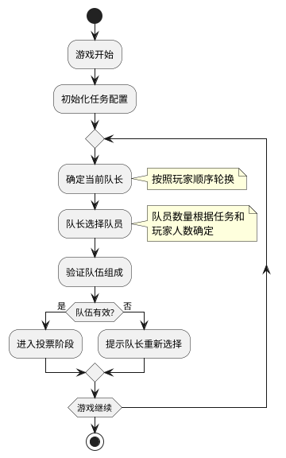
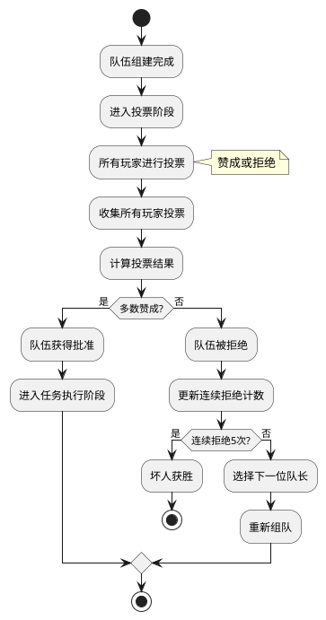
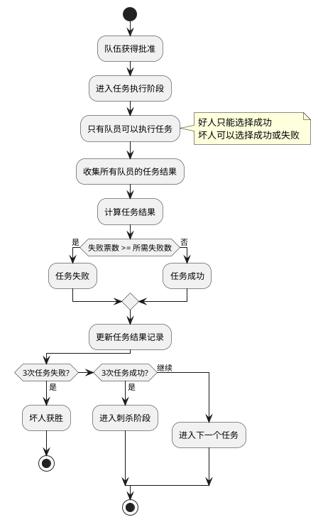

# Story 2.2: 任务系统 - 技术方案

## 技术架构

### 核心模块

- 队长管理器：负责队长轮换和队长选择逻辑
- 组队管理器：处理队长选择队员的逻辑和验证
- 投票系统：收集和统计玩家投票
- 任务执行器：处理任务执行和结果计算
- 任务结果管理器：统计和展示任务结果

### 数据结构

```typescript
// 任务状态枚举
enum MissionStatus {
  NOT_STARTED = "not_started", // 未开始
  TEAM_BUILDING = "team_building", // 组队阶段
  VOTING = "voting", // 投票阶段
  EXECUTING = "executing", // 执行阶段
  SUCCEEDED = "succeeded", // 任务成功
  FAILED = "failed", // 任务失败
}

// 投票类型枚举
enum VoteType {
  APPROVE = "approve", // 赞成
  REJECT = "reject", // 拒绝
}

// 任务结果类型枚举
enum MissionResultType {
  SUCCESS = "success", // 成功
  FAIL = "fail", // 失败
}

// 任务配置
interface MissionConfig {
  missionNumber: number; // 任务编号
  requiredTeamSize: number; // 所需队员数量
  requiredFailures: number; // 任务失败所需的失败票数
}

// 队长信息
interface Captain {
  playerId: string; // 玩家ID
  roundNumber: number; // 轮次编号
  missionNumber: number; // 任务编号
}

// 队伍信息
interface Team {
  captainId: string; // 队长ID
  memberIds: string[]; // 队员ID列表
  roundNumber: number; // 轮次编号
  missionNumber: number; // 任务编号
  isApproved: boolean; // 是否被批准
  votes: Map<string, VoteType>; // 玩家投票记录
}

// 任务结果
interface MissionResult {
  missionNumber: number; // 任务编号
  teamMemberIds: string[]; // 队员ID列表
  captainId: string; // 队长ID
  result: MissionResultType; // 任务结果
  successCount: number; // 成功票数
  failCount: number; // 失败票数
}

// 任务状态
interface MissionState {
  missionNumber: number; // 任务编号
  status: MissionStatus; // 任务状态
  currentRound: number; // 当前轮次
  currentCaptainId: string; // 当前队长ID
  currentTeam: Team | null; // 当前队伍
  rejectedTeams: Team[]; // 被拒绝的队伍
  result: MissionResult | null; // 任务结果
}

// 游戏任务状态
interface GameMissionState {
  currentMissionNumber: number; // 当前任务编号
  missions: MissionState[]; // 所有任务状态
  captainHistory: Captain[]; // 队长历史
  consecutiveRejections: number; // 连续拒绝次数
  missionResults: MissionResult[]; // 任务结果历史
}
```

## 实现细节

### 队长轮换与组队机制



1. 队长选择逻辑：

   ```typescript
   function selectNextCaptain(
     game: Game,
     previousCaptainIndex: number
   ): Player {
     const playerCount = game.players.length;
     const nextCaptainIndex = (previousCaptainIndex + 1) % playerCount;
     return game.players[nextCaptainIndex];
   }
   ```

2. 组队验证逻辑：

   ```typescript
   function validateTeam(team: Team, missionConfig: MissionConfig): boolean {
     // 验证队员数量是否符合要求
     if (team.memberIds.length !== missionConfig.requiredTeamSize) {
       return false;
     }

     // 验证队员是否都是游戏中的玩家
     // 验证是否有重复队员
     // 其他验证逻辑...

     return true;
   }
   ```

### 投票系统



1. 投票收集逻辑：

   ```typescript
   function collectVote(game: Game, playerId: string, vote: VoteType): void {
     // 验证玩家是否可以投票
     if (!canPlayerVote(game, playerId)) {
       throw new Error("Player cannot vote at this time");
     }

     // 记录玩家投票
     game.currentMission.currentTeam.votes.set(playerId, vote);

     // 检查是否所有玩家都已投票
     if (game.currentMission.currentTeam.votes.size === game.players.length) {
       // 计算投票结果
       calculateVoteResult(game);
     }
   }
   ```

2. 投票结果计算：

   ```typescript
   function calculateVoteResult(game: Game): void {
     const votes = game.currentMission.currentTeam.votes;
     let approveCount = 0;
     let rejectCount = 0;

     // 统计赞成和拒绝票数
     votes.forEach((vote) => {
       if (vote === VoteType.APPROVE) approveCount++;
       else rejectCount++;
     });

     // 判断投票结果
     if (approveCount > rejectCount) {
       // 队伍获得批准
       approveTeam(game);
     } else {
       // 队伍被拒绝
       rejectTeam(game);
     }
   }
   ```

### 任务执行机制



1. 任务执行逻辑：

   ```typescript
   function executeMission(
     game: Game,
     playerId: string,
     result: MissionResultType
   ): void {
     // 验证玩家是否是队员
     if (!isTeamMember(game, playerId)) {
       throw new Error("Only team members can execute the mission");
     }

     // 验证好人是否只能选择成功
     if (isGoodPlayer(game, playerId) && result === MissionResultType.FAIL) {
       throw new Error("Good players can only choose success");
     }

     // 记录任务结果
     game.currentMission.executionResults.set(playerId, result);

     // 检查是否所有队员都已执行任务
     if (
       game.currentMission.executionResults.size ===
       game.currentMission.currentTeam.memberIds.length
     ) {
       // 计算任务最终结果
       calculateMissionResult(game);
     }
   }
   ```

2. 任务结果计算：

   ```typescript
   function calculateMissionResult(game: Game): void {
     const results = game.currentMission.executionResults;
     let successCount = 0;
     let failCount = 0;

     // 统计成功和失败票数
     results.forEach((result) => {
       if (result === MissionResultType.SUCCESS) successCount++;
       else failCount++;
     });

     // 判断任务结果
     const missionConfig = getMissionConfig(
       game.currentMission.missionNumber,
       game.players.length
     );
     if (failCount >= missionConfig.requiredFailures) {
       // 任务失败
       finalizeMissionAsFailed(game, successCount, failCount);
     } else {
       // 任务成功
       finalizeMissionAsSucceeded(game, successCount, failCount);
     }
   }
   ```

### 任务结果统计与展示

1. 任务结果记录：

   ```typescript
   function recordMissionResult(game: Game, result: MissionResult): void {
     // 添加到任务结果历史
     game.missionResults.push(result);

     // 更新任务状态
     game.missions[result.missionNumber - 1].status =
       result.result === MissionResultType.SUCCESS
         ? MissionStatus.SUCCEEDED
         : MissionStatus.FAILED;

     // 检查游戏是否结束
     checkGameEnd(game);
   }
   ```

2. 游戏结束检查：

   ```typescript
   function checkGameEnd(game: Game): void {
     // 统计成功和失败的任务数
     let successCount = 0;
     let failCount = 0;

     game.missionResults.forEach((result) => {
       if (result.result === MissionResultType.SUCCESS) successCount++;
       else failCount++;
     });

     // 判断游戏是否结束
     if (successCount >= 3) {
       // 进入刺杀阶段
       enterAssassinationPhase(game);
     } else if (failCount >= 3) {
       // 坏人获胜
       endGameWithEvilVictory(game);
     } else {
       // 继续下一个任务
       startNextMission(game);
     }
   }
   ```

## 前后端交互

### API 接口

1. 队长选择队员：

   ```
   POST /api/game/{gameId}/mission/team
   请求体：{captainId: string, memberIds: string[]}
   响应：{success: boolean, message?: string, team?: Team}
   ```

2. 投票：

   ```
   POST /api/game/{gameId}/mission/vote
   请求体：{playerId: string, vote: VoteType}
   响应：{success: boolean, message?: string}
   ```

3. 执行任务：

   ```
   POST /api/game/{gameId}/mission/execute
   请求体：{playerId: string, result: MissionResultType}
   响应：{success: boolean, message?: string}
   ```

4. 获取当前任务状态：
   ```
   GET /api/game/{gameId}/mission/status
   响应：{currentMission: MissionState, missionResults: MissionResult[]}
   ```

### 安全考虑

1. 验证玩家身份和权限
2. 防止非队员执行任务
3. 确保好人只能选择成功
4. 防止重复投票或执行任务
5. 保护任务结果信息，只在适当时机展示

## 异常处理

1. 队长选择无效队员：返回错误信息，要求重新选择
2. 非队员尝试执行任务：拒绝请求，记录异常行为
3. 好人尝试选择失败：拒绝请求，提示规则限制
4. 投票或执行超时：自动处理（可配置默认行为）

## 测试方案

1. 单元测试：

   - 测试队长轮换逻辑
   - 测试投票统计算法
   - 测试任务结果计算

2. 集成测试：

   - 测试完整的任务流程
   - 测试多轮投票和拒绝逻辑
   - 测试连续拒绝导致游戏结束的情况

3. 用户测试：
   - 验证界面交互的清晰度
   - 测试不同设备上的体验一致性
   - 收集用户对任务流程的反馈
