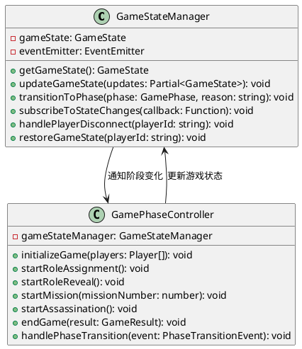
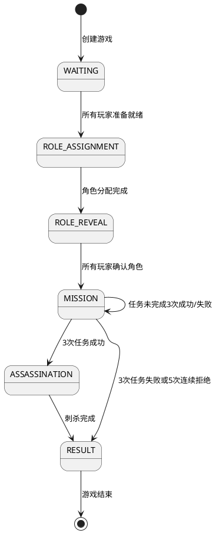
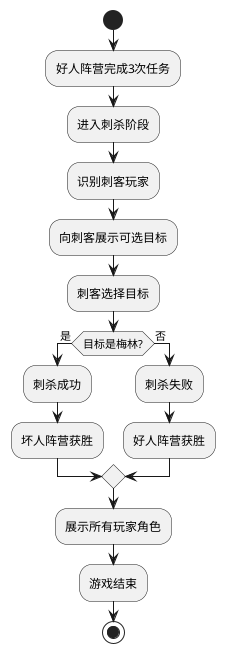

# Story 2.3: 游戏进程控制 - 技术方案

## 技术架构

### 核心模块

- 游戏状态管理器：负责维护游戏的全局状态和阶段
- 阶段转换控制器：处理游戏阶段之间的转换逻辑
- 刺杀阶段管理器：处理刺杀阶段的特殊逻辑
- 游戏结果处理器：统计和展示游戏结果
- 异常处理器：处理游戏过程中的异常情况

### 数据结构

```typescript
// 游戏阶段枚举
enum GamePhase {
  WAITING = "waiting", // 等待开始
  ROLE_ASSIGNMENT = "role_assignment", // 角色分配阶段
  ROLE_REVEAL = "role_reveal", // 角色揭示阶段
  MISSION = "mission", // 任务阶段
  ASSASSINATION = "assassination", // 刺杀阶段
  RESULT = "result", // 结果展示阶段
  ENDED = "ended", // 游戏结束
}

// 游戏状态
interface GameState {
  gameId: string; // 游戏ID
  status: GamePhase; // 当前游戏阶段
  players: Player[]; // 玩家列表
  playerRoles: Map<string, PlayerRole>; // 玩家角色映射
  currentMissionNumber: number; // 当前任务编号
  missions: MissionState[]; // 任务状态列表
  missionResults: MissionResult[]; // 任务结果列表
  captainHistory: Captain[]; // 队长历史
  consecutiveRejections: number; // 连续拒绝次数
  assassinationTarget: string | null; // 刺杀目标
  gameResult: GameResult | null; // 游戏结果
  createdAt: Date; // 创建时间
  updatedAt: Date; // 更新时间
}

// 游戏结果
interface GameResult {
  winner: Faction; // 获胜阵营
  reason: string; // 获胜原因
  assassinationSuccess?: boolean; // 刺杀是否成功
  assassinationTarget?: string; // 刺杀目标
  missionSuccessCount: number; // 任务成功次数
  missionFailCount: number; // 任务失败次数
  playerRoles: Map<string, PlayerRole>; // 所有玩家的角色
}

// 阶段转换事件
interface PhaseTransitionEvent {
  previousPhase: GamePhase; // 前一阶段
  currentPhase: GamePhase; // 当前阶段
  reason: string; // 转换原因
  data?: any; // 附加数据
}

// 刺杀结果
interface AssassinationResult {
  assassinId: string; // 刺客ID
  targetId: string; // 目标ID
  isMerlin: boolean; // 目标是否是梅林
  gameResult: GameResult; // 游戏结果
}
```

## 实现细节

### 游戏状态管理



1. 游戏状态管理逻辑：

   ```typescript
   class GameStateManager {
     private gameState: GameState;
     private eventEmitter: EventEmitter;

     constructor(gameId: string, players: Player[]) {
       // 初始化游戏状态
       this.gameState = {
         gameId,
         status: GamePhase.WAITING,
         players,
         playerRoles: new Map(),
         currentMissionNumber: 0,
         missions: [],
         missionResults: [],
         captainHistory: [],
         consecutiveRejections: 0,
         assassinationTarget: null,
         gameResult: null,
         createdAt: new Date(),
         updatedAt: new Date(),
       };

       this.eventEmitter = new EventEmitter();
     }

     // 获取当前游戏状态
     public getGameState(): GameState {
       return { ...this.gameState };
     }

     // 更新游戏状态
     public updateGameState(updates: Partial<GameState>): void {
       const previousState = { ...this.gameState };
       this.gameState = {
         ...this.gameState,
         ...updates,
         updatedAt: new Date(),
       };

       // 触发状态更新事件
       this.eventEmitter.emit("stateUpdated", {
         previousState,
         currentState: this.gameState,
       });

       // 如果阶段发生变化，触发阶段转换事件
       if (previousState.status !== this.gameState.status) {
         this.eventEmitter.emit("phaseTransition", {
           previousPhase: previousState.status,
           currentPhase: this.gameState.status,
           reason: "状态更新",
         });
       }
     }

     // 转换到新阶段
     public transitionToPhase(phase: GamePhase, reason: string): void {
       const previousPhase = this.gameState.status;
       this.updateGameState({ status: phase });

       // 触发阶段转换事件
       this.eventEmitter.emit("phaseTransition", {
         previousPhase,
         currentPhase: phase,
         reason,
       });
     }

     // 订阅状态变化
     public subscribeToStateChanges(callback: Function): void {
       this.eventEmitter.on("stateUpdated", callback);
     }

     // 处理玩家断线
     public handlePlayerDisconnect(playerId: string): void {
       // 标记玩家断线
       const players = this.gameState.players.map((p) =>
         p.id === playerId ? { ...p, isConnected: false } : p
       );
       this.updateGameState({ players });

       // 检查是否需要暂停游戏
       this.checkGamePause();
     }

     // 恢复玩家游戏状态
     public restoreGameState(playerId: string): void {
       // 标记玩家重新连接
       const players = this.gameState.players.map((p) =>
         p.id === playerId ? { ...p, isConnected: true } : p
       );
       this.updateGameState({ players });

       // 检查是否可以恢复游戏
       this.checkGameResume();
     }

     // 检查是否需要暂停游戏
     private checkGamePause(): void {
       const disconnectedCount = this.gameState.players.filter(
         (p) => !p.isConnected
       ).length;

       // 如果断线玩家超过一定比例，暂停游戏
       if (disconnectedCount > this.gameState.players.length / 3) {
         this.eventEmitter.emit("gamePaused", {
           reason: "过多玩家断线",
           disconnectedCount,
         });
       }
     }

     // 检查是否可以恢复游戏
     private checkGameResume(): void {
       const disconnectedCount = this.gameState.players.filter(
         (p) => !p.isConnected
       ).length;

       // 如果断线玩家数量降低到阈值以下，恢复游戏
       if (disconnectedCount <= this.gameState.players.length / 4) {
         this.eventEmitter.emit("gameResumed", {
           reason: "大多数玩家已重新连接",
         });
       }
     }
   }
   ```

### 游戏阶段转换



1. 阶段转换控制逻辑：

   ```typescript
   class GamePhaseController {
     private gameStateManager: GameStateManager;

     constructor(gameStateManager: GameStateManager) {
       this.gameStateManager = gameStateManager;

       // 订阅阶段转换事件
       this.gameStateManager.subscribeToPhaseTransition(
         this.handlePhaseTransition.bind(this)
       );
     }

     // 初始化游戏
     public initializeGame(players: Player[]): void {
       // 更新游戏状态
       this.gameStateManager.updateGameState({
         players,
         status: GamePhase.WAITING,
       });
     }

     // 开始角色分配
     public startRoleAssignment(): void {
       const gameState = this.gameStateManager.getGameState();

       // 检查是否所有玩家都已准备
       const allReady = gameState.players.every((p) => p.isReady);
       if (!allReady) {
         throw new Error("Not all players are ready");
       }

       // 转换到角色分配阶段
       this.gameStateManager.transitionToPhase(
         GamePhase.ROLE_ASSIGNMENT,
         "所有玩家已准备就绪"
       );
     }

     // 开始角色揭示
     public startRoleReveal(): void {
       const gameState = this.gameStateManager.getGameState();

       // 检查是否所有角色都已分配
       if (gameState.playerRoles.size !== gameState.players.length) {
         throw new Error("Not all roles are assigned");
       }

       // 转换到角色揭示阶段
       this.gameStateManager.transitionToPhase(
         GamePhase.ROLE_REVEAL,
         "角色分配完成"
       );
     }

     // 开始任务
     public startMission(missionNumber: number): void {
       const gameState = this.gameStateManager.getGameState();

       // 检查是否所有玩家都已确认角色
       const allConfirmed = gameState.players.every((p) => p.roleConfirmed);
       if (!allConfirmed) {
         throw new Error("Not all players have confirmed their roles");
       }

       // 创建新任务
       const newMission: MissionState = {
         missionNumber,
         status: MissionStatus.NOT_STARTED,
         currentRound: 1,
         currentCaptainId: null,
         currentTeam: null,
         rejectedTeams: [],
         result: null,
       };

       // 更新游戏状态
       this.gameStateManager.updateGameState({
         status: GamePhase.MISSION,
         currentMissionNumber: missionNumber,
         missions: [...gameState.missions, newMission],
       });

       // 选择第一位队长
       this.selectFirstCaptain(missionNumber);
     }

     // 开始刺杀阶段
     public startAssassination(): void {
       const gameState = this.gameStateManager.getGameState();

       // 检查是否满足进入刺杀阶段的条件
       const successCount = gameState.missionResults.filter(
         (r) => r.result === MissionResultType.SUCCESS
       ).length;

       if (successCount < 3) {
         throw new Error("Cannot start assassination phase yet");
       }

       // 转换到刺杀阶段
       this.gameStateManager.transitionToPhase(
         GamePhase.ASSASSINATION,
         "好人阵营完成3次任务"
       );
     }

     // 结束游戏
     public endGame(result: GameResult): void {
       // 更新游戏状态
       this.gameStateManager.updateGameState({
         status: GamePhase.RESULT,
         gameResult: result,
       });
     }

     // 处理阶段转换
     public handlePhaseTransition(event: PhaseTransitionEvent): void {
       console.log(
         `Game phase transitioned from ${event.previousPhase} to ${event.currentPhase} due to: ${event.reason}`
       );

       // 根据新阶段执行相应的初始化逻辑
       switch (event.currentPhase) {
         case GamePhase.ROLE_ASSIGNMENT:
           this.initializeRoleAssignment();
           break;
         case GamePhase.ROLE_REVEAL:
           this.initializeRoleReveal();
           break;
         case GamePhase.MISSION:
           this.initializeMission();
           break;
         case GamePhase.ASSASSINATION:
           this.initializeAssassination();
           break;
         case GamePhase.RESULT:
           this.initializeResult();
           break;
       }
     }

     // 选择第一位队长
     private selectFirstCaptain(missionNumber: number): void {
       const gameState = this.gameStateManager.getGameState();

       // 随机选择第一位队长
       const randomIndex = Math.floor(Math.random() * gameState.players.length);
       const firstCaptain = gameState.players[randomIndex];

       // 更新当前任务的队长
       const missions = [...gameState.missions];
       missions[missionNumber - 1].currentCaptainId = firstCaptain.id;

       // 记录队长历史
       const captainHistory = [
         ...gameState.captainHistory,
         {
           playerId: firstCaptain.id,
           roundNumber: 1,
           missionNumber,
         },
       ];

       // 更新游戏状态
       this.gameStateManager.updateGameState({
         missions,
         captainHistory,
       });
     }

     // 初始化角色分配阶段
     private initializeRoleAssignment(): void {
       // 实现角色分配阶段的初始化逻辑
     }

     // 初始化角色揭示阶段
     private initializeRoleReveal(): void {
       // 实现角色揭示阶段的初始化逻辑
     }

     // 初始化任务阶段
     private initializeMission(): void {
       // 实现任务阶段的初始化逻辑
     }

     // 初始化刺杀阶段
     private initializeAssassination(): void {
       // 实现刺杀阶段的初始化逻辑
     }

     // 初始化结果阶段
     private initializeResult(): void {
       // 实现结果阶段的初始化逻辑
     }
   }
   ```

### 刺杀阶段实现



1. 刺杀阶段管理逻辑：

   ```typescript
   class AssassinationManager {
     private gameStateManager: GameStateManager;

     constructor(gameStateManager: GameStateManager) {
       this.gameStateManager = gameStateManager;
     }

     // 开始刺杀阶段
     public startAssassination(): void {
       const gameState = this.gameStateManager.getGameState();

       // 检查是否满足进入刺杀阶段的条件
       const successCount = gameState.missionResults.filter(
         (r) => r.result === MissionResultType.SUCCESS
       ).length;

       if (successCount < 3) {
         throw new Error("Cannot start assassination phase yet");
       }

       // 转换到刺杀阶段
       this.gameStateManager.transitionToPhase(
         GamePhase.ASSASSINATION,
         "好人阵营完成3次任务"
       );
     }

     // 获取刺客玩家ID
     public getAssassinPlayerId(): string | null {
       const gameState = this.gameStateManager.getGameState();

       // 查找刺客角色的玩家
       for (const [playerId, role] of gameState.playerRoles.entries()) {
         if (role.roleType === RoleType.ASSASSIN) {
           return playerId;
         }
       }

       return null;
     }

     // 获取可选的刺杀目标
     public getAssassinationTargets(): Player[] {
       const gameState = this.gameStateManager.getGameState();
       const assassinId = this.getAssassinPlayerId();

       if (!assassinId) {
         throw new Error("Assassin not found");
       }

       // 获取所有好人阵营的玩家
       return gameState.players.filter((player) => {
         const role = gameState.playerRoles.get(player.id);
         return role && isGoodRole(role.roleType);
       });
     }

     // 执行刺杀
     public executeAssassination(
       assassinId: string,
       targetId: string
     ): AssassinationResult {
       const gameState = this.gameStateManager.getGameState();

       // 验证刺客身份
       const assassinRole = gameState.playerRoles.get(assassinId);
       if (!assassinRole || assassinRole.roleType !== RoleType.ASSASSIN) {
         throw new Error("Only the assassin can perform assassination");
       }

       // 验证目标是否是好人阵营
       const targetRole = gameState.playerRoles.get(targetId);
       if (!targetRole || !isGoodRole(targetRole.roleType)) {
         throw new Error("Assassination target must be from the good faction");
       }

       // 判断刺杀结果
       const isMerlin = targetRole.roleType === RoleType.MERLIN;
       const winner = isMerlin ? Faction.EVIL : Faction.GOOD;
       const reason = isMerlin
         ? "刺客成功刺杀梅林"
         : "刺客刺杀失败，好人阵营获胜";

       // 创建游戏结果
       const gameResult: GameResult = {
         winner,
         reason,
         assassinationSuccess: isMerlin,
         assassinationTarget: targetId,
         missionSuccessCount: gameState.missionResults.filter(
           (r) => r.result === MissionResultType.SUCCESS
         ).length,
         missionFailCount: gameState.missionResults.filter(
           (r) => r.result === MissionResultType.FAIL
         ).length,
         playerRoles: gameState.playerRoles,
       };

       // 创建刺杀结果
       const assassinationResult: AssassinationResult = {
         assassinId,
         targetId,
         isMerlin,
         gameResult,
       };

       // 更新游戏状态
       this.gameStateManager.updateGameState({
         assassinationTarget: targetId,
         gameResult,
       });

       // 转换到结果阶段
       this.gameStateManager.transitionToPhase(
         GamePhase.RESULT,
         "刺杀阶段完成"
       );

       return assassinationResult;
     }
   }
   ```

### 游戏结果展示

1. 游戏结果处理逻辑：

   ```typescript
   class GameResultManager {
     private gameStateManager: GameStateManager;

     constructor(gameStateManager: GameStateManager) {
       this.gameStateManager = gameStateManager;
     }

     // 获取游戏结果
     public getGameResult(): GameResult | null {
       const gameState = this.gameStateManager.getGameState();
       return gameState.gameResult;
     }

     // 生成游戏统计
     public generateGameStatistics(): GameStatistics {
       const gameState = this.gameStateManager.getGameState();
       const result = gameState.gameResult;

       if (!result) {
         throw new Error("Game has not ended yet");
       }

       // 计算任务统计
       const missionStats = gameState.missionResults.map((mission) => ({
         missionNumber: mission.missionNumber,
         result: mission.result,
         successCount: mission.successCount,
         failCount: mission.failCount,
         captainName: this.getPlayerName(mission.captainId),
         teamMembers: mission.teamMemberIds.map((id) => this.getPlayerName(id)),
       }));

       // 计算玩家统计
       const playerStats = gameState.players.map((player) => {
         const role = gameState.playerRoles.get(player.id);
         const captainCount = gameState.captainHistory.filter(
           (c) => c.playerId === player.id
         ).length;
         const missionParticipation = gameState.missionResults.filter((m) =>
           m.teamMemberIds.includes(player.id)
         ).length;

         return {
           playerId: player.id,
           playerName: player.name,
           role: role ? role.roleType : null,
           faction: role ? (isGoodRole(role.roleType) ? "good" : "evil") : null,
           captainCount,
           missionParticipation,
           isAssassin: role?.roleType === RoleType.ASSASSIN,
           isMerlin: role?.roleType === RoleType.MERLIN,
           wasAssassinated:
             player.id === gameState.assassinationTarget &&
             role?.roleType === RoleType.MERLIN,
         };
       });

       // 创建游戏统计
       return {
         gameId: gameState.gameId,
         winner: result.winner,
         reason: result.reason,
         playerCount: gameState.players.length,
         missionStats,
         playerStats,
         duration: this.calculateGameDuration(gameState),
         timestamp: new Date(),
       };
     }

     // 获取玩家名称
     private getPlayerName(playerId: string): string {
       const gameState = this.gameStateManager.getGameState();
       const player = gameState.players.find((p) => p.id === playerId);
       return player ? player.name : "未知玩家";
     }

     // 计算游戏时长
     private calculateGameDuration(gameState: GameState): number {
       const startTime = gameState.createdAt.getTime();
       const endTime = gameState.updatedAt.getTime();
       return Math.floor((endTime - startTime) / 1000); // 秒数
     }
   }
   ```

## 前后端交互

### API 接口

1. 游戏状态管理：

   ```
   GET /api/game/{gameId}/state
   响应：{gameState: GameState}
   ```

2. 阶段转换：

   ```
   POST /api/game/{gameId}/phase
   请求体：{phase: GamePhase, reason: string}
   响应：{success: boolean, message?: string, gameState?: GameState}
   ```

3. 刺杀操作：

   ```
   POST /api/game/{gameId}/assassination
   请求体：{assassinId: string, targetId: string}
   响应：{success: boolean, message?: string, result?: AssassinationResult}
   ```

4. 获取游戏结果：
   ```
   GET /api/game/{gameId}/result
   响应：{gameResult: GameResult, statistics: GameStatistics}
   ```

### 安全考虑

1. 验证玩家身份和权限
2. 防止非刺客执行刺杀
3. 确保游戏阶段转换的合法性
4. 保护角色信息，只在适当时机展示
5. 防止客户端作弊修改游戏状态

## 异常处理

1. 玩家断线：暂存状态，等待重连
2. 非法操作：拒绝请求，记录异常行为
3. 游戏状态不一致：强制同步服务端状态
4. 超时处理：自动处理（可配置默认行为）

## 测试方案

1. 单元测试：

   - 测试游戏状态管理逻辑
   - 测试阶段转换逻辑
   - 测试刺杀判定逻辑

2. 集成测试：

   - 测试完整的游戏流程
   - 测试异常情况处理
   - 测试断线重连场景

3. 用户测试：
   - 验证界面交互的清晰度
   - 测试不同设备上的体验一致性
   - 收集用户对游戏流程的反馈
