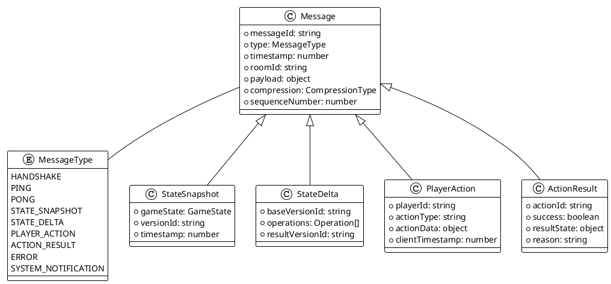
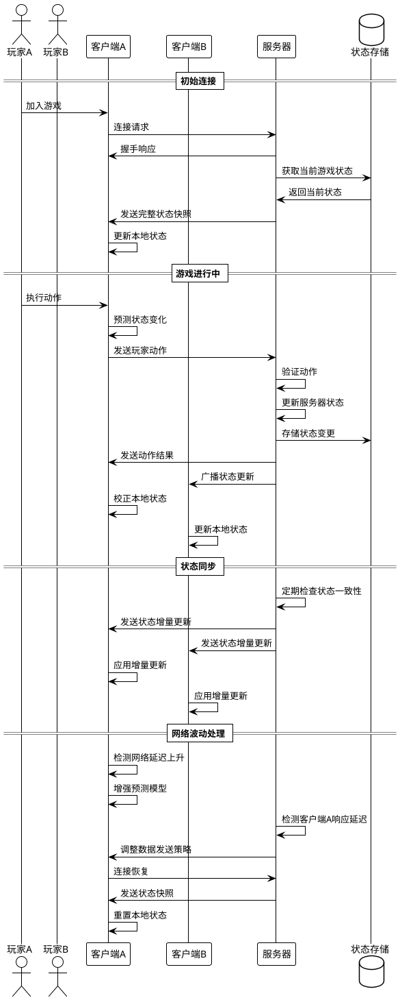

# Story 3.1: 实时数据同步 - 技术方案

## 系统概述

阿瓦隆微信小游戏的实时数据同步系统负责确保所有玩家在游戏过程中看到一致的游戏状态。该系统采用客户端-服务器架构，以服务器为权威数据源，客户端通过预测和校正机制提供流畅的游戏体验。

## 技术架构

### 总体架构

```plantuml
@startuml
!theme plain
skinparam linetype ortho

cloud "微信小游戏平台" {
  [微信API网关]
}

package "客户端" {
  [游戏界面层]
  [游戏逻辑层]
  [本地状态管理器]
  [网络同步模块]
  [预测与校正系统]
}

package "服务端" {
  [负载均衡器]
  [游戏服务器集群] as GameServers {
    [房间管理服务]
    [游戏状态服务]
    [事件处理服务]
    [数据广播服务]
  }
  [状态存储] as StateDB
  [游戏日志服务]
}

database "Redis集群" {
  [状态缓存]
  [消息队列]
}

database "MongoDB" {
  [游戏历史记录]
}

[游戏界面层] --> [游戏逻辑层]
[游戏逻辑层] --> [本地状态管理器]
[本地状态管理器] <--> [预测与校正系统]
[本地状态管理器] <--> [网络同步模块]
[网络同步模块] <--> [微信API网关]
[微信API网关] <--> [负载均衡器]
[负载均衡器] --> [GameServers]
[GameServers] <--> [StateDB]
[房间管理服务] --> [状态缓存]
[游戏状态服务] <--> [状态缓存]
[事件处理服务] --> [消息队列]
[GameServers] --> [游戏日志服务]
[游戏日志服务] --> [游戏历史记录]

@enduml
```

### 核心组件

1. **客户端网络同步模块**：

   - 负责与服务器建立和维护 WebSocket 连接
   - 处理消息的序列化与反序列化
   - 实现消息的可靠传输（包括重试、确认等机制）

2. **客户端状态管理器**：

   - 维护本地游戏状态
   - 处理来自服务器的状态更新
   - 与游戏逻辑层交互，提供状态访问接口

3. **预测与校正系统**：

   - 在等待服务器响应期间预测游戏状态变化
   - 当服务器状态到达时校正本地状态
   - 平滑处理状态矫正，避免视觉跳跃

4. **服务端游戏状态服务**：

   - 作为权威数据源维护游戏状态
   - 验证客户端动作的合法性
   - 解决可能的状态冲突

5. **数据广播服务**：

   - 负责将状态变更广播至房间内所有玩家
   - 实现消息的优先级排序和节流
   - 根据网络条件调整数据传输策略

6. **状态存储**：
   - 定期持久化游戏状态
   - 支持状态快照和回滚

## 数据同步策略

### 消息类型



### 同步流程



## 实现细节

### 1. 状态同步算法

采用基于操作的状态同步（Operation-based Synchronization）和基于状态的同步（State-based Synchronization）相结合的方式：

- **普通操作**：使用操作同步，仅传输玩家动作和结果
- **关键状态变更**：使用完整状态同步，确保一致性
- **定期同步**：每 30 秒发送一次完整状态快照，防止状态偏移

### 2. 增量更新实现

```typescript
// 状态增量生成
function generateStateDelta(
  previousState: GameState,
  currentState: GameState
): StateDelta {
  const delta: StateDelta = {
    baseVersionId: previousState.versionId,
    operations: [],
    resultVersionId: currentState.versionId,
  };

  // 检测并记录玩家状态变化
  if (!deepEqual(previousState.players, currentState.players)) {
    delta.operations.push({
      type: "UPDATE_PLAYERS",
      path: "players",
      value: currentState.players,
    });
  }

  // 检测并记录游戏阶段变化
  if (previousState.gamePhase !== currentState.gamePhase) {
    delta.operations.push({
      type: "UPDATE_GAME_PHASE",
      path: "gamePhase",
      value: currentState.gamePhase,
    });
  }

  // 检测并记录任务状态变化
  if (!deepEqual(previousState.missions, currentState.missions)) {
    delta.operations.push({
      type: "UPDATE_MISSIONS",
      path: "missions",
      value: currentState.missions,
    });
  }

  // ... 其他状态变更检测

  return delta;
}

// 应用状态增量
function applyStateDelta(baseState: GameState, delta: StateDelta): GameState {
  // 验证版本ID匹配
  if (baseState.versionId !== delta.baseVersionId) {
    throw new Error("State version mismatch");
  }

  // 克隆基础状态
  const newState = deepClone(baseState);

  // 应用所有操作
  for (const operation of delta.operations) {
    switch (operation.type) {
      case "UPDATE_PLAYERS":
        newState.players = operation.value;
        break;
      case "UPDATE_GAME_PHASE":
        newState.gamePhase = operation.value;
        break;
      case "UPDATE_MISSIONS":
        newState.missions = operation.value;
        break;
      // ... 处理其他操作类型
    }
  }

  // 更新版本ID
  newState.versionId = delta.resultVersionId;

  return newState;
}
```

### 3. 预测与校正机制

```typescript
class PredictionSystem {
  private localState: GameState;
  private lastConfirmedState: GameState;
  private pendingActions: PlayerAction[] = [];

  // 应用本地预测
  public applyPrediction(action: PlayerAction): void {
    // 记录待确认的动作
    this.pendingActions.push(action);

    // 应用本地预测
    const predictedState = this.generatePredictedState(this.localState, action);
    this.localState = predictedState;

    // 通知游戏界面更新
    this.notifyStateUpdate(this.localState);
  }

  // 当服务器确认结果返回时
  public handleServerConfirmation(
    action: PlayerAction,
    serverState: GameState
  ): void {
    // 移除已确认的动作
    this.pendingActions = this.pendingActions.filter(
      (a) => a.actionId !== action.actionId
    );

    // 更新最后确认的状态
    this.lastConfirmedState = serverState;

    // 检查是否需要校正
    if (!this.isStateConsistent(this.localState, serverState)) {
      // 执行状态校正
      this.reconcileState(serverState);
    }
  }

  // 检查本地状态与服务器状态是否一致
  private isStateConsistent(
    localState: GameState,
    serverState: GameState
  ): boolean {
    // 实现状态一致性检查逻辑
    return deepEqual(localState, serverState);
  }

  // 校正本地状态
  private reconcileState(serverState: GameState): void {
    // 使用服务器状态作为新的基础状态
    this.localState = deepClone(serverState);

    // 重新应用所有未确认的动作
    for (const action of this.pendingActions) {
      this.localState = this.generatePredictedState(this.localState, action);
    }

    // 通知游戏界面更新
    this.notifyStateUpdate(this.localState, true); // true表示这是一次校正更新
  }

  // 生成预测状态
  private generatePredictedState(
    baseState: GameState,
    action: PlayerAction
  ): GameState {
    // 根据动作类型生成预测状态
    // ...具体实现略
    return predictedState;
  }

  // 通知状态更新
  private notifyStateUpdate(
    state: GameState,
    isReconciliation: boolean = false
  ): void {
    // 发送状态更新事件
    eventEmitter.emit("state-updated", { state, isReconciliation });
  }
}
```

### 4. 消息压缩策略

1. **JSON 压缩**：使用`msgpack`进行二进制序列化，减少文本 JSON 的传输开销
2. **数据差异压缩**：对于增量更新，只传输变更的字段
3. **数据批处理**：将短时间内的多个更新合并为一次传输
4. **选择性同步**：根据游戏阶段和事件重要性调整同步频率和内容

### 5. 网络优化策略

1. **消息优先级**：为不同类型的消息分配优先级，确保关键状态更新优先发送
2. **自适应更新频率**：根据网络条件和游戏状态动态调整同步频率
3. **带宽控制**：实现流量控制，避免在网络条件不佳时发送过多数据
4. **状态压缩**：使用位域和枚举等紧凑数据结构减小状态体积

## 性能指标与监控

### 关键性能指标

1. **状态同步延迟**：从服务器状态变更到客户端应用变更的时间，目标<500ms
2. **带宽使用**：每个房间每秒的平均数据传输量，目标<20KB/s
3. **状态一致性**：客户端与服务器状态不一致的发生率，目标<0.1%
4. **校正频率**：客户端需要执行状态校正的频率，目标<1 次/分钟
5. **CPU 使用率**：同步逻辑所消耗的 CPU 资源，客户端目标<10%，服务端目标<30%

### 监控系统

实现全面的监控系统，包括：

1. **客户端性能指标**：网络延迟、帧率、同步频率、校正频率
2. **服务端性能指标**：CPU 使用率、内存使用、活跃连接数、消息处理速率
3. **异常监控**：状态不一致次数、同步失败次数、消息处理错误
4. **业务指标**：活跃房间数、平均房间大小、游戏完成率

## 安全考虑

1. **消息验证**：所有客户端消息必须通过数字签名验证，防止伪造
2. **状态验证**：服务器严格验证所有客户端动作的合法性，防止作弊
3. **速率限制**：实现客户端消息的速率限制，防止 DoS 攻击
4. **加密传输**：使用 TLS/WSS 加密 WebSocket 通信
5. **状态审计**：服务器保留完整的状态变更日志，以便事后审查

## 测试计划

1. **单元测试**：各组件的功能测试，覆盖各种同步场景
2. **集成测试**：客户端和服务器间的交互测试
3. **性能测试**：在各种负载下的系统表现测试
4. **网络模拟测试**：模拟各种网络条件（延迟、丢包、断连）下的系统表现
5. **压力测试**：测试系统在超负荷情况下的表现和恢复能力

## 部署与扩展

1. **集群部署**：服务器采用水平扩展的集群部署
2. **区域部署**：在不同地理位置部署服务器，减少网络延迟
3. **负载均衡**：使用动态负载均衡，根据服务器负载分配新房间
4. **资源自动扩展**：根据活跃房间数自动扩展或收缩服务器资源
