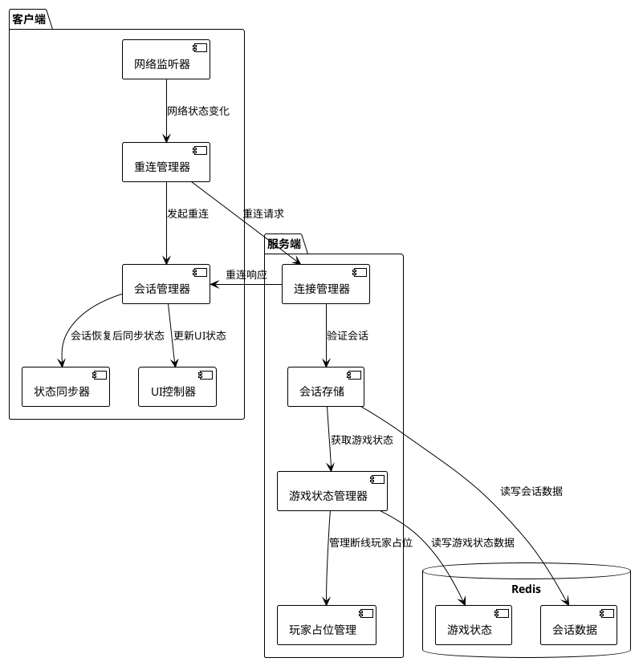
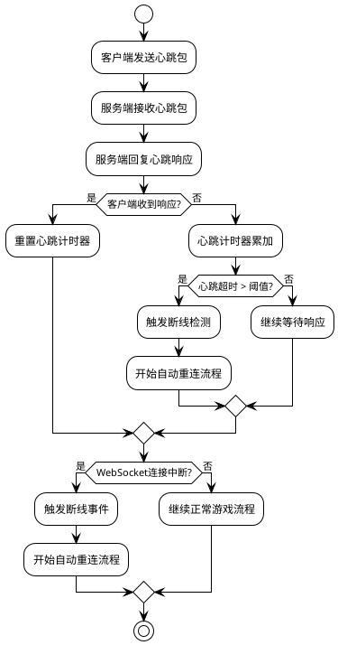
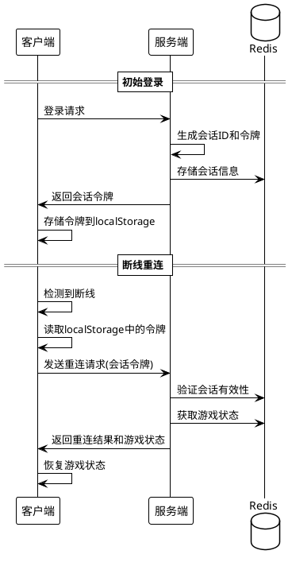
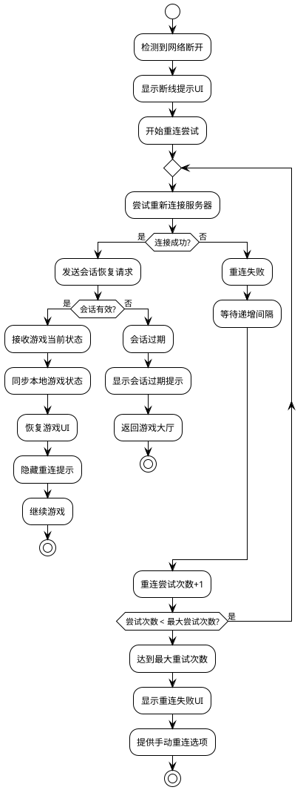

# 阿瓦隆小游戏断线重连机制技术方案

## 1. 概述

断线重连机制是阿瓦隆微信小游戏的关键功能，用于确保玩家在网络中断后能够顺利重新连接游戏并恢复游戏状态。本文档详细说明断线重连机制的技术实现方案，包括断线检测、会话恢复、状态同步等关键环节。

## 2. 系统架构

### 2.1 整体架构图



### 2.2 核心组件

1. **客户端**

   - 网络监听器：监控网络状态变化
   - 重连管理器：管理自动重连尝试
   - 会话管理器：处理会话标识和恢复逻辑
   - 状态同步器：负责游戏状态的同步和恢复
   - UI 控制器：提供重连相关的界面反馈

2. **服务端**

   - 连接管理器：处理连接和重连请求
   - 会话存储：存储和检索玩家会话信息
   - 游戏状态管理器：维护和恢复游戏状态
   - 玩家占位管理：管理断线玩家的占位和状态

3. **数据存储**
   - Redis：存储会话数据和游戏状态

## 3. 技术实现方案

### 3.1 断线检测机制



#### 心跳机制

- **实现方式**：采用 WebSocket 定期心跳包
- **心跳频率**：每 15 秒发送一次
- **超时判断**：连续 3 次心跳无响应（45 秒）判定为断线
- **网络事件监听**：监听微信小游戏提供的网络状态变化事件

```javascript
// 客户端心跳实现示例
class HeartbeatManager {
  constructor(websocket, options = {}) {
    this.ws = websocket;
    this.interval = options.interval || 15000; // 15秒
    this.timeout = options.timeout || 45000; // 45秒
    this.timer = null;
    this.lastResponse = Date.now();
    this.onTimeout = options.onTimeout || (() => {});
  }

  start() {
    this.timer = setInterval(() => {
      this.sendHeartbeat();
      this.checkTimeout();
    }, this.interval);
  }

  sendHeartbeat() {
    if (this.ws.readyState === WebSocket.OPEN) {
      this.ws.send(JSON.stringify({ type: "heartbeat" }));
    }
  }

  onHeartbeatResponse() {
    this.lastResponse = Date.now();
  }

  checkTimeout() {
    if (Date.now() - this.lastResponse > this.timeout) {
      this.onTimeout();
    }
  }

  stop() {
    clearInterval(this.timer);
  }
}
```

### 3.2 会话恢复机制

#### 会话标识设计

- **会话 ID**：UUID 格式，每次玩家登录游戏时生成
- **会话令牌**：JWT 格式，包含玩家 ID、会话 ID、过期时间等信息
- **存储方式**：客户端存储在 localStorage，服务端存储在 Redis



#### 服务端会话存储结构

```json
{
  "sessionId": "550e8400-e29b-41d4-a716-446655440000",
  "playerId": "user_123456",
  "nickname": "玩家A",
  "roomId": "room_789",
  "gameState": {
    "role": "梅林",
    "gamePhase": "voting",
    "currentRound": 2
  },
  "connectionStatus": "disconnected",
  "disconnectTime": 1647123456789,
  "expiryTime": 1647123636789
}
```

### 3.3 客户端重连逻辑



#### 自动重连策略

- **重连次数**：最多尝试 5 次自动重连
- **重连间隔**：采用指数退避算法（1s, 2s, 4s, 8s, 16s）
- **UI 反馈**：重连过程中显示进度并允许手动重连
- **状态恢复**：重连成功后，客户端请求最新游戏状态，服务端推送完整状态

```javascript
// 客户端重连管理器示例
class ReconnectionManager {
  constructor(options = {}) {
    this.maxAttempts = options.maxAttempts || 5;
    this.baseDelay = options.baseDelay || 1000;
    this.attemptCount = 0;
    this.onReconnecting = options.onReconnecting || (() => {});
    this.onReconnected = options.onReconnected || (() => {});
    this.onFailed = options.onFailed || (() => {});
  }

  startReconnection(connectionHandler) {
    this.attemptCount = 0;
    this.reconnect(connectionHandler);
  }

  reconnect(connectionHandler) {
    if (this.attemptCount >= this.maxAttempts) {
      this.onFailed();
      return;
    }

    const delay = this.baseDelay * Math.pow(2, this.attemptCount);
    this.onReconnecting(this.attemptCount + 1, this.maxAttempts);

    setTimeout(() => {
      connectionHandler()
        .then(() => this.onReconnected())
        .catch(() => {
          this.attemptCount++;
          this.reconnect(connectionHandler);
        });
    }, delay);
  }

  manualReconnect(connectionHandler) {
    this.attemptCount = 0;
    this.reconnect(connectionHandler);
  }
}
```

### 3.4 服务端会话管理

#### 玩家占位机制

- **超时时间**：断线玩家在游戏中保留位置 3 分钟
- **状态标记**：玩家状态标记为"断线"，UI 上显示特殊标识
- **超时处理**：超时后视为玩家退出游戏，其他玩家收到通知

#### 游戏进程处理

- **轮次处理**：断线玩家的任务自动由系统代为执行（好人自动成功，坏人自动失败）
- **投票处理**：断线玩家的投票轮次自动跳过或设置默认值
- **角色操作**：特殊角色（如梅林、刺客等）断线时，系统提供有限操作

```javascript
// 服务端会话管理示例代码
class SessionManager {
  constructor(redisClient) {
    this.redis = redisClient;
    this.expiryTime = 3 * 60 * 1000; // 3分钟
  }

  async storeSession(sessionId, playerData) {
    const sessionData = {
      ...playerData,
      disconnectTime: null,
      connectionStatus: "connected",
      expiryTime: null,
    };

    await this.redis.hset(`session:${sessionId}`, sessionData);
    await this.redis.expire(`session:${sessionId}`, 86400); // 1天过期
  }

  async markDisconnected(sessionId) {
    const now = Date.now();
    const expiryTime = now + this.expiryTime;

    await this.redis.hset(`session:${sessionId}`, {
      disconnectTime: now,
      connectionStatus: "disconnected",
      expiryTime: expiryTime,
    });

    // 设置会话过期任务
    setTimeout(async () => {
      const session = await this.redis.hgetall(`session:${sessionId}`);
      if (session && session.connectionStatus === "disconnected") {
        // 处理玩家超时离开
        this.handleSessionExpiry(sessionId, session);
      }
    }, this.expiryTime);
  }

  async restoreSession(sessionId) {
    const session = await this.redis.hgetall(`session:${sessionId}`);
    if (!session) return null;

    // 检查会话是否过期
    if (session.expiryTime && Date.now() > session.expiryTime) {
      await this.redis.del(`session:${sessionId}`);
      return null;
    }

    // 恢复会话状态
    await this.redis.hset(`session:${sessionId}`, {
      disconnectTime: null,
      connectionStatus: "connected",
      expiryTime: null,
    });

    return session;
  }

  async handleSessionExpiry(sessionId, session) {
    // 通知房间中的其他玩家
    // 从游戏中移除玩家
    await this.redis.del(`session:${sessionId}`);
  }
}
```

## 4. 错误处理与边界情况

### 4.1 多设备登录

- 同一账号在新设备登录时，旧设备会收到"账号在其他设备登录"的提示
- 旧设备会被强制登出，新设备接管会话
- 断线重连优先处理最后活跃的设备

### 4.2 网络波动处理

- 对于频繁、短暂的网络波动，采用缓冲策略
- 短时间内（5 秒）连续断线重连不重置重连尝试计数
- 游戏操作采用乐观更新，先本地执行，再确认服务端结果

### 4.3 游戏状态不一致处理

- 重连后，服务端全量推送游戏状态
- 客户端与服务端状态对比，发现不一致时以服务端为准
- 关键操作采用事务 ID，避免重连后的操作重复执行

## 5. 性能与优化

### 5.1 流量优化

- 重连后的状态同步采用增量数据策略，减少传输数据量
- WebSocket 连接失败后，自动降级为 HTTP 轮询
- 关键游戏数据本地缓存，减少重连后的数据同步量

### 5.2 响应时间优化

- 会话数据使用 Redis 存储，确保快速检索
- 断线重连请求优先级高于普通请求
- 关键路径代码优化，确保重连处理迅速

## 6. 测试策略

### 6.1 测试场景

- 正常断线重连：网络临时中断后恢复
- 长时间断线：超过会话保留时间的断线
- 网络波动：频繁的短暂断线
- 游戏关键节点断线：任务执行、投票环节的断线
- 多玩家同时断线：多人同时断网的情况

### 6.2 测试方法

- 单元测试：各组件功能测试
- 集成测试：客户端与服务端交互测试
- 压力测试：大量玩家同时断线重连
- 真机测试：不同网络环境下的表现
- 模拟测试：人为制造各种网络异常情况

## 7. 安全考虑

- 会话令牌使用 JWT，包含过期时间和签名
- 重连请求需要验证会话有效性
- 防止会话劫持：关键操作需要二次验证
- 异常行为监控：检测非正常的重连模式

## 8. 上线与监控

### 8.1 监控指标

- 断线率：玩家断线的频率
- 重连成功率：断线后重连成功的比例
- 重连时间：从断线到重连成功的平均时间
- 会话过期率：断线后会话过期的比例

### 8.2 报警机制

- 重连成功率低于 90%时触发报警
- 平均重连时间超过 10 秒触发报警
- 短时间内大量玩家断线触发报警

## 9. 总结

断线重连机制是阿瓦隆微信小游戏的关键功能，通过心跳检测、会话管理和状态同步等技术手段，确保玩家在网络不稳定环境下也能获得良好的游戏体验。系统设计遵循可靠性、实时性和安全性原则，同时兼顾性能和用户体验。
