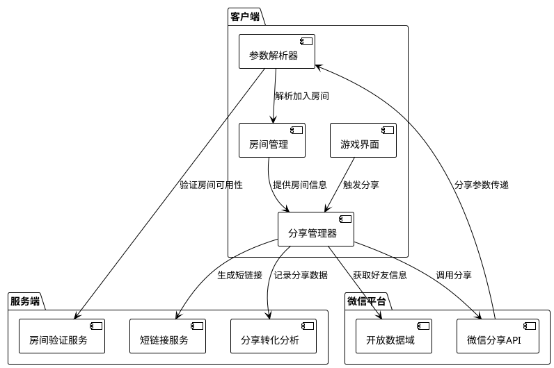

# 阿瓦隆小游戏微信分享与邀请功能技术方案

## 1. 概述

微信分享与邀请功能是阿瓦隆微信小游戏的重要社交功能，通过利用微信平台的社交能力，实现游戏内容和房间信息的快速分享，促进用户增长和提升游戏体验。本文档详细说明此功能的技术实现方案，包括分享机制、邀请流程、数据结构和接口设计。

## 2. 系统架构

### 2.1 整体架构图



### 2.2 核心组件

1. **客户端**

   - 分享管理器：负责处理分享逻辑和生成分享内容
   - 参数解析器：处理从分享链接进入的参数解析
   - 房间管理：提供房间信息和处理加入房间请求

2. **微信平台**

   - 微信分享 API：微信提供的原生分享功能
   - 开放数据域：用于安全获取玩家微信信息

3. **服务端**
   - 分享转化分析：跟踪和分析分享数据
   - 房间验证服务：验证房间状态和可加入性
   - 短链接服务：生成分享用的短链接

## 3. 技术实现方案

### 3.1 分享内容设计

#### 分享卡片结构

分享卡片将包含以下元素：

- 游戏标题和 LOGO
- 房间号和创建者信息
- 邀请语和行动号召
- 预览图（可根据游戏阶段动态生成）

#### 动态生成分享图

1. 使用 Canvas 绘制分享图，包含游戏元素和房间信息
2. 根据房间状态（等待中/游戏中）生成不同风格的图片
3. 使用`wx.shareAppMessage`的`imageUrl`参数设置自定义图片

```javascript
// 分享图生成示例
function generateShareImage(room) {
  return new Promise((resolve, reject) => {
    const canvas = wx.createCanvas();
    const ctx = canvas.getContext("2d");
    canvas.width = 500;
    canvas.height = 400;

    // 设置背景
    ctx.fillStyle = "#1a237e";
    ctx.fillRect(0, 0, 500, 400);

    // 绘制游戏标志
    const logo = wx.createImage();
    logo.onload = () => {
      ctx.drawImage(logo, 200, 50, 100, 100);

      // 绘制文本信息
      ctx.fillStyle = "#ffffff";
      ctx.font = "bold 24px Arial";
      ctx.textAlign = "center";
      ctx.fillText("阿瓦隆", 250, 180);

      ctx.font = "18px Arial";
      ctx.fillText(`房间号: ${room.roomCode}`, 250, 220);
      ctx.fillText(`创建者: ${room.creatorName}`, 250, 250);
      ctx.fillText("点击加入游戏!", 250, 300);

      // 转换为图片URL
      wx.canvasToTempFilePath({
        canvas,
        success: (res) => {
          resolve(res.tempFilePath);
        },
        fail: reject,
      });
    };
    logo.src = "images/avalon_logo.png";
  });
}
```

### 3.2 分享参数设计

分享链接将包含以下参数：

- `roomId`: 房间唯一标识
- `shareFrom`: 分享来源玩家 ID
- `timestamp`: 分享时间戳（用于验证有效期）
- `scene`: 场景值（如"room_invite"）

为确保安全性，可以添加签名参数：

```javascript
function generateShareParams(roomId, playerId) {
  const timestamp = Date.now();
  const scene = "room_invite";
  const rawParams = `roomId=${roomId}&shareFrom=${playerId}&timestamp=${timestamp}&scene=${scene}`;

  // 可选：添加签名以防篡改
  const sign = md5(rawParams + APP_SECRET);

  return rawParams + `&sign=${sign}`;
}
```

### 3.3 分享触发与处理

#### 分享触发实现

```javascript
// shareManager.js
class ShareManager {
  // 分享房间邀请
  async shareRoomInvite(room) {
    try {
      // 1. 获取房间信息
      const roomInfo = await this.getRoomShareInfo(room.roomId);

      // 2. 生成分享图
      const shareImageUrl = await generateShareImage(roomInfo);

      // 3. 构建分享参数
      const queryParams = generateShareParams(
        room.roomId,
        app.globalData.playerId
      );

      // 4. 调用微信分享API
      wx.shareAppMessage({
        title: `【阿瓦隆】${roomInfo.creatorName}邀请你加入游戏!`,
        imageUrl: shareImageUrl,
        query: queryParams,
        success: (res) => {
          // 记录分享数据
          this.logShareEvent(room.roomId, "success");
        },
        fail: (err) => {
          console.error("分享失败:", err);
          this.logShareEvent(room.roomId, "fail", err);
        },
      });
    } catch (error) {
      console.error("准备分享时发生错误:", error);
    }
  }

  // 获取房间分享信息
  async getRoomShareInfo(roomId) {
    // 从服务器或本地获取房间详细信息
    return await roomService.getRoomDetails(roomId);
  }

  // 记录分享事件
  logShareEvent(roomId, result, error = null) {
    // 向服务器报告分享事件数据
    wx.request({
      url: `${API_BASE_URL}/api/share/log`,
      method: "POST",
      data: {
        roomId,
        playerId: app.globalData.playerId,
        result,
        timestamp: Date.now(),
        error: error ? error.message : null,
      },
    });
  }
}
```

#### 分享链接处理

在小游戏启动时（`app.js`）处理分享链接：

```javascript
// app.js
App({
  onLaunch(options) {
    // 处理启动参数
    this.handleLaunchOptions(options);
  },

  onShow(options) {
    // 当小游戏从后台进入前台显示时，也可能带有分享参数
    this.handleLaunchOptions(options);
  },

  handleLaunchOptions(options) {
    // 检查是否包含分享参数
    if (options.query && options.query.scene === "room_invite") {
      // 保存邀请参数，等用户登录后处理
      this.globalData.pendingInvite = {
        roomId: options.query.roomId,
        shareFrom: options.query.shareFrom,
        timestamp: options.query.timestamp,
      };

      // 如果用户已登录，直接处理邀请
      if (this.globalData.isLoggedIn) {
        this.handlePendingInvite();
      }
    }
  },

  handlePendingInvite() {
    const invite = this.globalData.pendingInvite;
    if (!invite) return;

    // 清除待处理邀请
    this.globalData.pendingInvite = null;

    // 验证邀请有效性（如检查时间戳是否在有效期内）
    const now = Date.now();
    const validityPeriod = 24 * 60 * 60 * 1000; // 24小时有效期

    if (now - invite.timestamp > validityPeriod) {
      wx.showToast({
        title: "邀请已过期",
        icon: "none",
      });
      return;
    }

    // 验证房间状态
    roomService
      .checkRoomStatus(invite.roomId)
      .then((roomStatus) => {
        if (roomStatus.isValid && roomStatus.canJoin) {
          // 记录分享转化
          shareAnalyticsService.logInviteConversion(
            invite.roomId,
            invite.shareFrom
          );

          // 导航到房间
          wx.navigateTo({
            url: `/pages/room/room?roomId=${invite.roomId}`,
          });
        } else {
          // 显示无法加入的原因
          wx.showModal({
            title: "无法加入房间",
            content: roomStatus.message || "房间不可用",
            showCancel: false,
          });
        }
      })
      .catch((error) => {
        console.error("验证房间状态失败:", error);
        wx.showToast({
          title: "连接服务器失败",
          icon: "none",
        });
      });
  },

  globalData: {
    isLoggedIn: false,
    pendingInvite: null,
  },
});
```

### 3.4 转化跟踪与数据分析

在服务端实现分享转化跟踪：

```javascript
// server/services/shareAnalyticsService.js
class ShareAnalyticsService {
  // 记录分享事件
  async logShareEvent(data) {
    const { roomId, playerId, result, timestamp, error } = data;

    await db.collection("share_events").insertOne({
      roomId,
      playerId,
      result,
      timestamp: new Date(timestamp),
      error,
      type: "share",
    });
  }

  // 记录分享转化（通过分享链接加入）
  async logInviteConversion(roomId, shareFrom, newPlayerId) {
    await db.collection("share_events").insertOne({
      roomId,
      sharedBy: shareFrom,
      joinedBy: newPlayerId,
      timestamp: new Date(),
      type: "conversion",
    });

    // 更新分享者的邀请统计
    await db
      .collection("player_stats")
      .updateOne(
        { playerId: shareFrom },
        { $inc: { successfulInvites: 1 } },
        { upsert: true }
      );
  }

  // 获取分享统计数据
  async getShareStats(period = "day") {
    // 按天/周/月聚合数据
    const aggregationPipeline = [
      {
        $match: {
          timestamp: {
            $gte: this.getPeriodStartDate(period),
          },
        },
      },
      {
        $group: {
          _id: {
            type: "$type",
            date: this.getDateGrouping("$timestamp", period),
          },
          count: { $sum: 1 },
        },
      },
      {
        $sort: {
          "_id.date": 1,
        },
      },
    ];

    return await db
      .collection("share_events")
      .aggregate(aggregationPipeline)
      .toArray();
  }

  // 辅助方法：获取周期开始日期
  getPeriodStartDate(period) {
    const now = new Date();
    switch (period) {
      case "day":
        return new Date(now.setHours(0, 0, 0, 0));
      case "week":
        const day = now.getDay();
        return new Date(now.setDate(now.getDate() - day));
      case "month":
        return new Date(now.getFullYear(), now.getMonth(), 1);
      default:
        return new Date(now.setHours(0, 0, 0, 0));
    }
  }

  // 辅助方法：按周期分组日期
  getDateGrouping(dateField, period) {
    switch (period) {
      case "day":
        return { $dateToString: { format: "%Y-%m-%d", date: dateField } };
      case "week":
        return { $dateToString: { format: "%Y-WK%U", date: dateField } };
      case "month":
        return { $dateToString: { format: "%Y-%m", date: dateField } };
      default:
        return { $dateToString: { format: "%Y-%m-%d", date: dateField } };
    }
  }
}

module.exports = new ShareAnalyticsService();
```

## 4. 房间状态验证

### 4.1 验证服务设计

```javascript
// server/services/roomValidationService.js
class RoomValidationService {
  // 验证房间状态与可加入性
  async validateRoomJoin(roomId, playerId) {
    try {
      // 1. 检查房间是否存在
      const room = await this.getRoomById(roomId);
      if (!room) {
        return {
          isValid: false,
          canJoin: false,
          message: "房间不存在或已关闭",
        };
      }

      // 2. 检查房间状态
      if (room.status === "playing") {
        return {
          isValid: true,
          canJoin: false,
          message: "游戏已经开始，无法加入",
        };
      }

      // 3. 检查房间人数
      if (room.players.length >= room.maxPlayers) {
        return {
          isValid: true,
          canJoin: false,
          message: "房间已满，无法加入",
        };
      }

      // 4. 检查玩家是否已在房间中
      const playerInRoom = room.players.some((p) => p.playerId === playerId);
      if (playerInRoom) {
        return {
          isValid: true,
          canJoin: true,
          message: "你已经在房间中",
          rejoining: true,
        };
      }

      // 5. 房间可以加入
      return {
        isValid: true,
        canJoin: true,
        message: "可以加入房间",
      };
    } catch (error) {
      console.error("验证房间状态失败:", error);
      return {
        isValid: false,
        canJoin: false,
        message: "服务器错误，请稍后重试",
      };
    }
  }

  // 获取房间信息
  async getRoomById(roomId) {
    return await db.collection("rooms").findOne({ roomId });
  }
}

module.exports = new RoomValidationService();
```

### 4.2 API 接口设计

```javascript
// server/controllers/roomController.js
const roomValidationService = require("../services/roomValidationService");

exports.checkRoomStatus = async (req, res) => {
  try {
    const { roomId } = req.params;
    const playerId = req.user.playerId;

    const validationResult = await roomValidationService.validateRoomJoin(
      roomId,
      playerId
    );

    res.json(validationResult);
  } catch (error) {
    console.error("检查房间状态失败:", error);
    res.status(500).json({
      isValid: false,
      canJoin: false,
      message: "服务器错误，请稍后重试",
    });
  }
};

// server/routes/api.js
const roomController = require("../controllers/roomController");

router.get(
  "/rooms/:roomId/status",
  auth.authenticate,
  roomController.checkRoomStatus
);
```

## 5. 界面与用户体验设计

### 5.1 分享入口设计

分享按钮应该位于明显且便于操作的位置，建议：

- 房间信息面板中添加明显的"邀请好友"按钮
- 使用微信原生界面风格，提高用户熟悉度
- 分享成功后提供反馈（如"邀请已发送"）

### 5.2 通过分享进入的体验优化

从分享链接进入时，应该提供流畅的体验：

- 明确提示用户正在通过邀请进入
- 显示邀请者信息，增强社交感
- 如无法加入房间，提供明确原因和替代操作

## 6. 安全性与限制考虑

### 6.1 安全措施

- 对敏感参数（如房间 ID）进行签名验证，防止篡改
- 添加时间戳和有效期检查，防止过期链接被滥用
- 限制单个用户的分享频率，防止垃圾分享行为

### 6.2 平台限制适应

- 遵循微信对分享内容和频率的限制
- 做好降级处理，当分享 API 调用失败时提供替代方案
- 适配微信不同版本的分享 API 变化

## 7. 测试策略

### 7.1 测试场景

- 正常分享：在不同场景下生成分享，验证内容正确性
- 分享进入：验证通过分享链接正确进入房间
- 异常场景：测试房间已满、已开始、已解散等情况
- 分享统计：验证分享和转化数据是否正确记录
- 性能测试：大量分享和快速进入的性能表现

### 7.2 测试方法

- 单元测试：验证各模块功能
- 集成测试：客户端与服务端交互测试
- 真机测试：不同设备和微信版本测试
- 用户测试：邀请内部用户进行实际使用测试

## 8. 上线与监控

### 8.1 监控指标

- 分享成功率：分享成功与失败的比例
- 转化率：通过分享进入并加入房间的比例
- 邀请效率：每个玩家通过邀请带来的新玩家数量
- 用户反馈：关于分享功能的用户反馈和问题报告

### 8.2 优化策略

- 基于数据分析持续优化分享内容和流程
- A/B 测试不同分享文案和图片效果
- 根据用户反馈调整分享界面和体验

## 9. 总结

微信分享与邀请功能是阿瓦隆微信小游戏的重要社交功能，通过充分利用微信平台的社交能力，能够显著提升游戏的传播效率和用户获取能力。本方案从技术实现、用户体验和安全性多方面详细设计了功能实现方案，为后续开发提供了明确指导。
