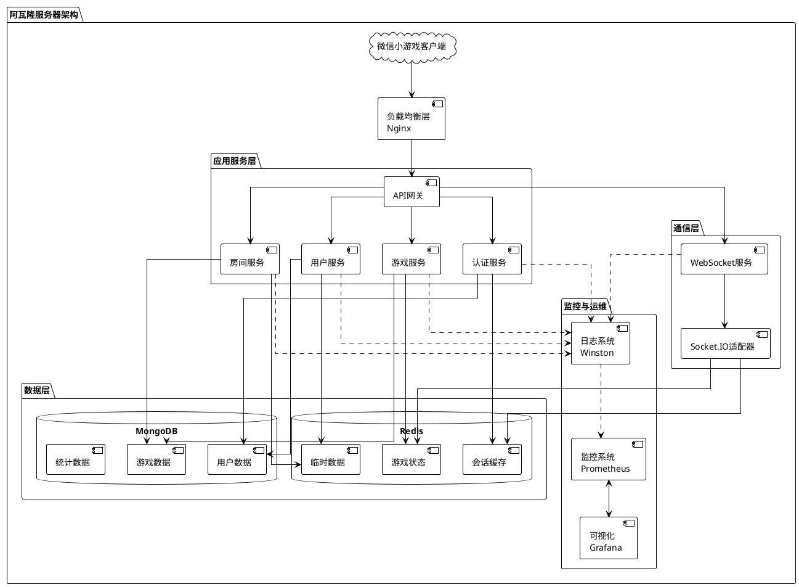
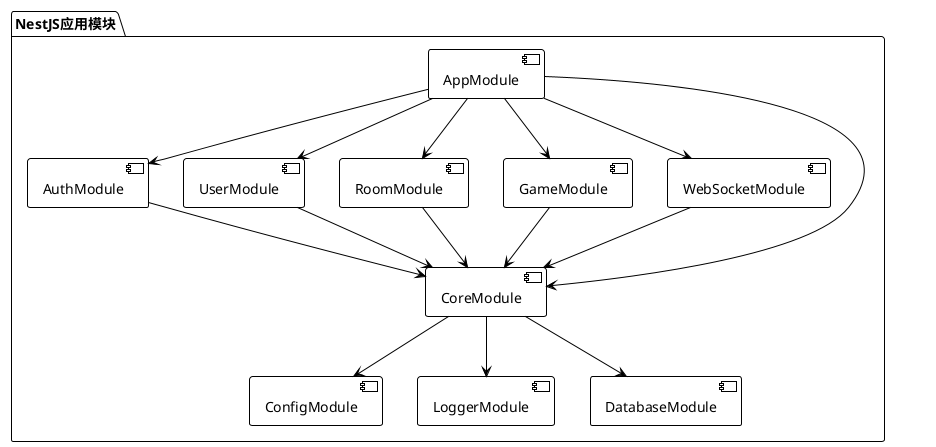
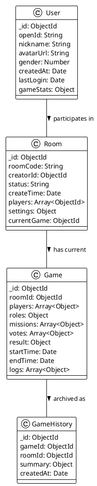
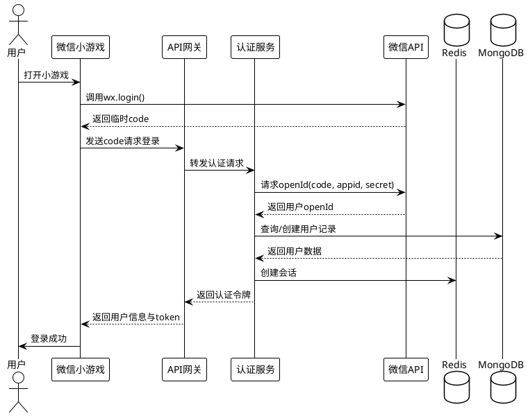
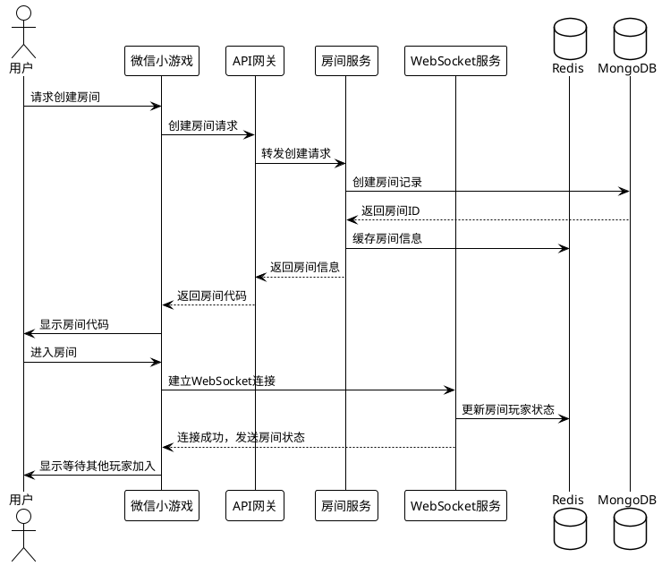
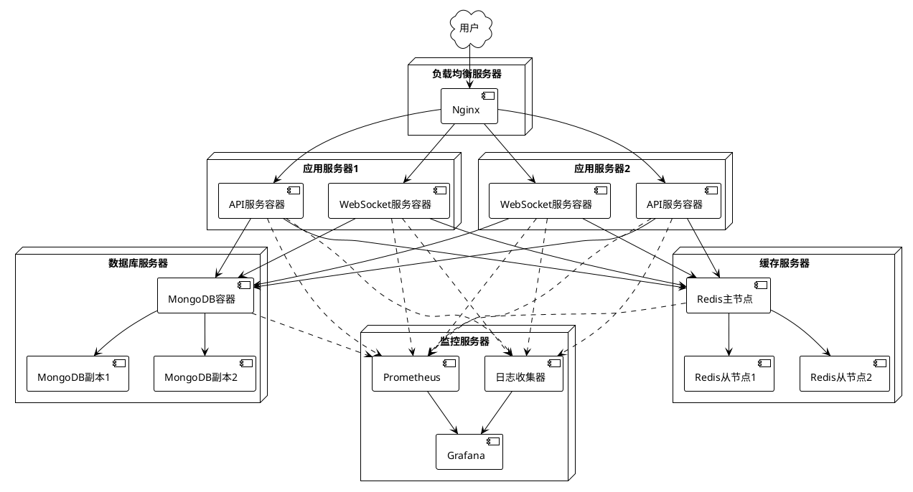

# 技术方案: 基础服务架构

## 1. 总体架构

阿瓦隆微信小游戏的基础服务架构采用分层设计，包括以下几个核心层次：



## 2. 核心组件说明

### 2.1 负载均衡层

采用 Nginx 作为前端负载均衡器，提供以下功能：

- HTTP/HTTPS 请求的负载均衡
- WebSocket 连接的反向代理
- 静态资源缓存
- SSL 终结
- 基本的 DDoS 防护

Nginx 配置示例：

```nginx
# HTTP服务器
server {
    listen 80;
    server_name avalon-game.example.com;

    # 重定向到HTTPS
    return 301 https://$host$request_uri;
}

# HTTPS服务器
server {
    listen 443 ssl;
    server_name avalon-game.example.com;

    # SSL配置
    ssl_certificate /etc/nginx/ssl/avalon.crt;
    ssl_certificate_key /etc/nginx/ssl/avalon.key;

    # API请求代理
    location /api/ {
        proxy_pass http://api_servers;
        proxy_set_header Host $host;
        proxy_set_header X-Real-IP $remote_addr;
    }

    # WebSocket代理
    location /socket.io/ {
        proxy_pass http://websocket_servers;
        proxy_http_version 1.1;
        proxy_set_header Upgrade $http_upgrade;
        proxy_set_header Connection "upgrade";
        proxy_set_header Host $host;
    }
}

# 上游服务器组
upstream api_servers {
    server 10.0.0.1:3000;
    server 10.0.0.2:3000;
    server 10.0.0.3:3000;
}

upstream websocket_servers {
    server 10.0.0.4:3001;
    server 10.0.0.5:3001;
    hash $remote_addr consistent;
}
```

### 2.2 应用服务层

基于 NestJS 框架构建，采用模块化设计，主要包含以下模块：



#### 模块职责

- **AppModule**: 应用程序根模块，整合其他所有模块
- **AuthModule**: 处理用户认证、授权和会话管理
- **UserModule**: 用户信息管理和操作
- **RoomModule**: 游戏房间的创建、管理和状态维护
- **GameModule**: 游戏核心逻辑和状态管理
- **WebSocketModule**: WebSocket 连接和实时通信
- **CoreModule**: 全局共享服务和工具
- **ConfigModule**: 配置管理，支持不同环境
- **LoggerModule**: 日志管理和输出
- **DatabaseModule**: 数据库连接和操作

### 2.3 数据层

#### 2.3.1 MongoDB

使用 MongoDB 作为主数据库，存储持久化数据。主要集合设计：



#### 2.3.2 Redis

使用 Redis 处理临时数据、缓存和会话信息：

- **会话管理**: 存储用户会话和认证信息
- **游戏状态缓存**: 缓存当前游戏状态，提高访问性能
- **实时数据**: 存储需要快速访问的临时数据
- **消息队列**: 处理服务间通信和事件排队

Redis 键设计示例：

```
# 会话
session:{sessionId} -> { userId, openId, expires, ... }

# 用户在线状态
user:online:{userId} -> { connectionId, roomId, lastActive }

# 房间信息缓存
room:{roomId} -> { roomCode, status, playerCount, ... }

# 游戏状态
game:state:{gameId} -> { currentRound, currentPhase, ... }

# 任务队列
queue:game:events -> [ { type, data, timestamp }, ... ]
```

### 2.4 监控与运维

采用以下工具进行系统监控和运维管理：

- **Winston**: 多级别、多目标的日志记录
- **Prometheus**: 收集和存储服务指标
- **Grafana**: 可视化监控数据和创建仪表板
- **健康检查 API**: 监控系统各组件状态

## 3. 数据流程

### 3.1 用户认证流程



### 3.2 游戏房间创建流程



## 4. 部署架构

采用 Docker 容器化部署，使用 Docker Compose 管理服务组合：



## 5. 技术栈详情

### 5.1 后端框架

- **Node.js**: v16.x 或更高
- **TypeScript**: ^4.5.x
- **NestJS**: ^9.0.0
- **Socket.IO**: ^4.5.x
- **Mongoose**: ^6.5.x (MongoDB 连接)
- **IORedis**: ^5.2.x (Redis 客户端)
- **Passport**: ^0.6.x (认证库)
- **Winston**: ^3.8.x (日志)
- **NestJS Config**: 使用环境变量和配置文件
- **Class-validator**: 数据验证
- **Helmet**: HTTP 安全

### 5.2 存储

- **MongoDB**: v5.0.x (主数据存储)
- **Redis**: v6.2.x (缓存和会话)

### 5.3 监控

- **Prometheus**: 指标收集
- **Grafana**: 指标可视化
- **Winston**: 日志收集
- **Sentry**: 错误跟踪

### 5.4 部署

- **Docker**: 容器化
- **Docker Compose**: 多容器管理
- **Nginx**: 负载均衡
- **腾讯云**: 云服务部署
- **GitHub Actions**: CI/CD

## 6. 安全考虑

- 使用 HTTPS 加密所有通信
- 实现 JWT 令牌认证，设置合理的过期时间
- 加密敏感数据
- 实现速率限制防止 DoS 攻击
- XSS 和 CSRF 防护
- 输入验证和参数净化
- 定期安全审核和更新

## 7. 扩展性设计

- 使用微服务架构允许独立扩展各组件
- 无状态 API 设计，支持水平扩展
- 使用 Redis 分布式缓存提高性能
- 使用消息队列进行解耦
- 使用 MongoDB 分片处理数据增长
- 基于指标的自动扩展策略

## 8. 风险与缓解措施

| 风险                 | 缓解措施                                  |
| -------------------- | ----------------------------------------- |
| 服务器负载过高       | 实现自动扩展和负载均衡                    |
| 数据库性能瓶颈       | 缓存热数据，考虑分片和索引优化            |
| 网络延迟影响游戏体验 | 使用 WebSocket 减少通信开销，优化数据结构 |
| 单点故障             | 实现服务冗余和故障转移                    |
| 数据丢失             | 定期备份和数据复制策略                    |

## 9. 开发和部署流程

1. 使用 Git 进行版本控制
2. 遵循 GitFlow 分支模型
3. 代码审查和自动化测试
4. CI/CD 自动化构建和部署
5. 环境隔离 (开发、测试、生产)
6. 蓝绿部署降低发布风险
7. 回滚策略

## 10. 参考资料

- [NestJS 官方文档](https://docs.nestjs.com/)
- [MongoDB 文档](https://docs.mongodb.com/)
- [Redis 文档](https://redis.io/documentation)
- [Socket.IO 文档](https://socket.io/docs/)
