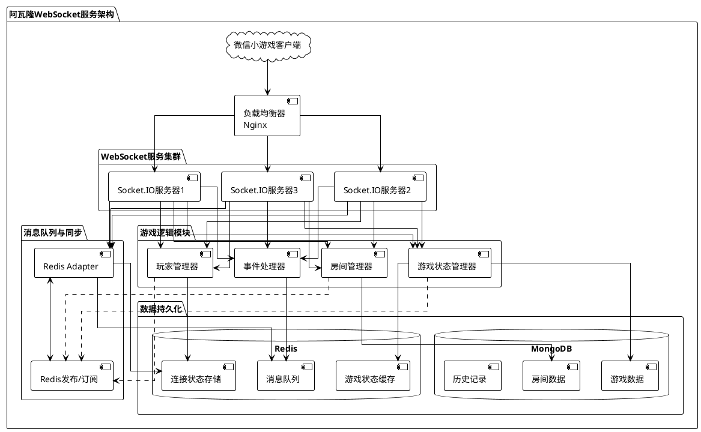
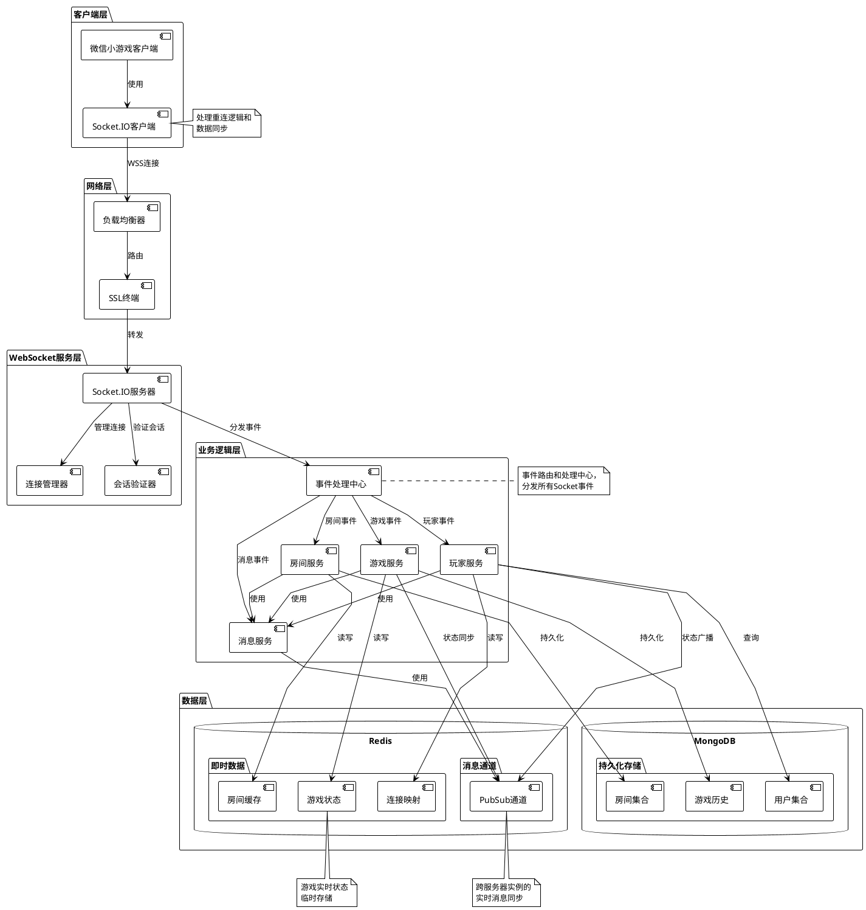
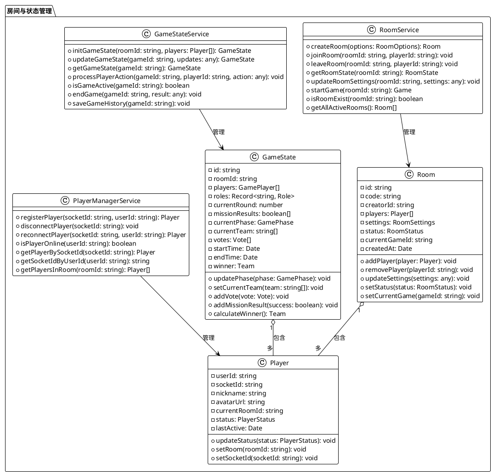
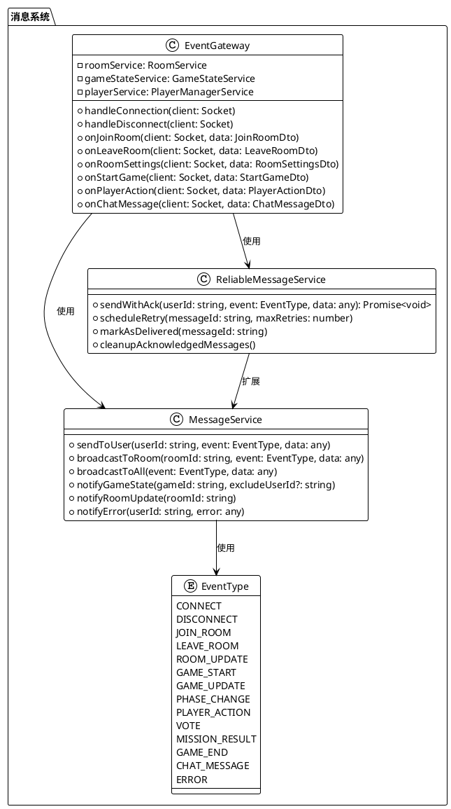
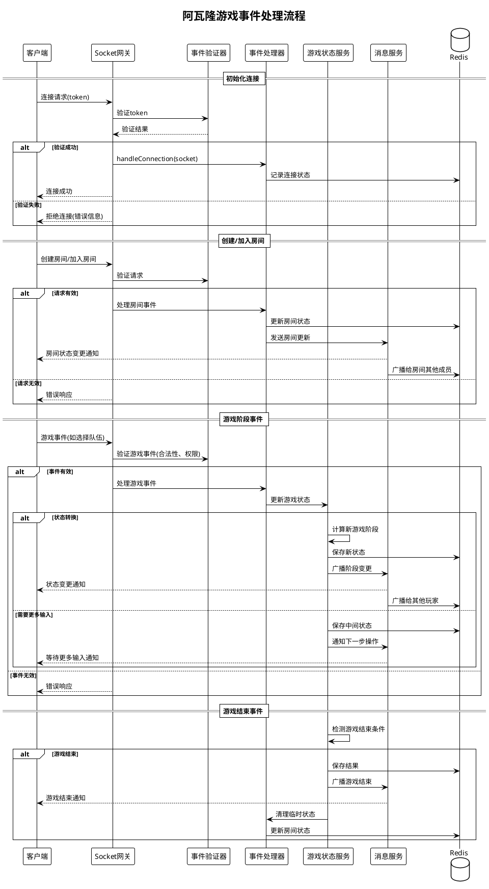
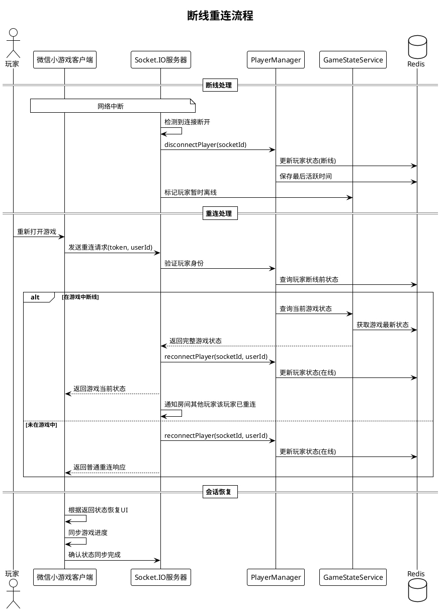
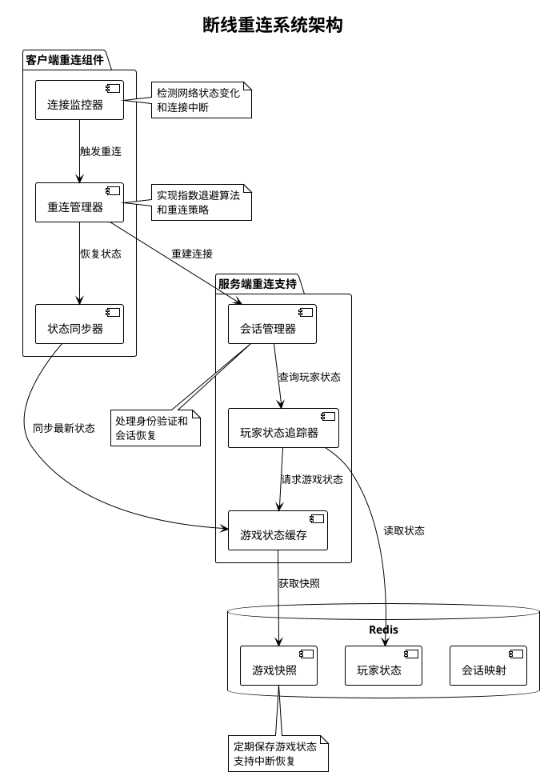
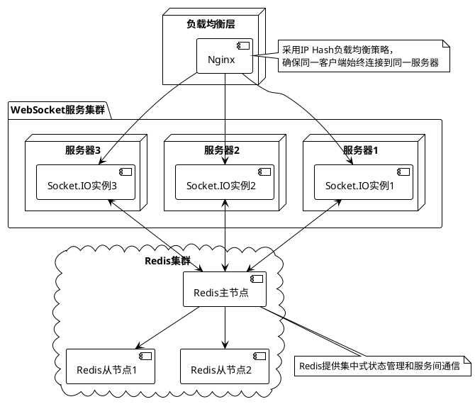

# 技术方案: WebSocket 服务

## 1. 总体架构

阿瓦隆微信小游戏的 WebSocket 服务采用基于 Socket.IO 的实时通信架构，实现游戏数据实时同步、玩家交互和状态一致性维护。



### 1.1 组件交互详细架构

以下是阿瓦隆 WebSocket 服务中各组件之间的详细交互架构：



## 2. 核心组件设计

### 2.1 Socket.IO 服务器

基于 NestJS 和 Socket.IO 实现 WebSocket 服务，主要功能包括：

- 连接建立和验证
- 事件路由和处理
- 状态同步
- 消息广播
- 错误处理

### 2.2 Redis 适配器

使用 Redis 适配器实现 Socket.IO 的集群化，确保跨服务器实例的消息传递和状态共享：

```typescript
// socket-io.adapter.ts 示例
import { IoAdapter } from "@nestjs/platform-socket.io";
import { createAdapter } from "@socket.io/redis-adapter";
import { Redis } from "ioredis";
import { ConfigService } from "@nestjs/config";
import { INestApplication } from "@nestjs/common";

export class RedisIoAdapter extends IoAdapter {
  private adapterConstructor: ReturnType<typeof createAdapter>;

  constructor(
    app: INestApplication,
    private readonly configService: ConfigService
  ) {
    super(app);
  }

  async connectToRedis(): Promise<void> {
    const pubClient = new Redis({
      host: this.configService.get("REDIS_HOST"),
      port: this.configService.get("REDIS_PORT"),
      password: this.configService.get("REDIS_PASSWORD"),
      db: Number(this.configService.get("REDIS_DB", 0)),
    });

    const subClient = pubClient.duplicate();

    this.adapterConstructor = createAdapter(pubClient, subClient, {
      publishOnSpecificResponseChannel: true,
      requestsTimeout: 5000,
    });
  }

  createIOServer(port: number, options?: any): any {
    const server = super.createIOServer(port, options);
    server.adapter(this.adapterConstructor);
    return server;
  }
}
```

### 2.3 房间与游戏状态管理

设计房间和游戏状态管理系统，确保数据一致性和实时同步：



### 2.4 消息系统设计

基于事件驱动的消息系统设计，实现游戏事件和状态变更的实时传递：



### 2.5 游戏事件处理流程

游戏中的事件处理遵循一定的流程，确保状态一致性和实时响应：



### 2.6 事件处理器实现示例

以下是一个游戏事件处理器的具体实现示例：

```typescript
// game-events.gateway.ts
import {
  WebSocketGateway,
  WebSocketServer,
  SubscribeMessage,
  OnGatewayConnection,
  OnGatewayDisconnect,
  ConnectedSocket,
  MessageBody,
} from "@nestjs/websockets";
import { Server, Socket } from "socket.io";
import { UseGuards } from "@nestjs/common";
import { AuthGuard } from "../guards/auth.guard";
import { RoomService } from "../services/room.service";
import { GameStateService } from "../services/game-state.service";
import { PlayerService } from "../services/player.service";
import { MessageService } from "../services/message.service";
import {
  JoinRoomDto,
  CreateRoomDto,
  SelectTeamDto,
  VoteTeamDto,
  SubmitMissionDto,
  GameActionDto,
} from "../dto";
import { ClientEvents, ServerEvents } from "../enums/events.enum";
import { PlayerActionValidator } from "../validators/player-action.validator";

@WebSocketGateway({
  cors: {
    origin: "*",
  },
  namespace: "game",
})
@UseGuards(AuthGuard)
export class GameEventsGateway
  implements OnGatewayConnection, OnGatewayDisconnect
{
  @WebSocketServer()
  server: Server;

  constructor(
    private readonly roomService: RoomService,
    private readonly gameStateService: GameStateService,
    private readonly playerService: PlayerService,
    private readonly messageService: MessageService,
    private readonly actionValidator: PlayerActionValidator
  ) {}

  async handleConnection(client: Socket) {
    try {
      const userId = client.handshake.auth.userId;
      if (!userId) {
        client.disconnect();
        return;
      }

      const player = await this.playerService.registerPlayer(client.id, userId);
      client.emit(ServerEvents.AUTHENTICATION_RESULT, {
        success: true,
        player,
      });

      // 检查玩家是否在游戏中，如果是则恢复状态
      const activeRoom = await this.roomService.getPlayerActiveRoom(userId);
      if (activeRoom && activeRoom.currentGameId) {
        const gameState = await this.gameStateService.getGameState(
          activeRoom.currentGameId
        );
        if (gameState) {
          await this.playerService.reconnectPlayer(client.id, userId);
          client.join(activeRoom.id);
          client.emit(ServerEvents.RECONNECTION_RESULT, {
            success: true,
            roomId: activeRoom.id,
            gameState: this.gameStateService.prepareGameStateForPlayer(
              gameState,
              userId
            ),
          });

          // 通知房间其他玩家该玩家已重连
          this.messageService.broadcastToRoom(
            activeRoom.id,
            ServerEvents.PLAYER_RECONNECTED,
            { playerId: userId },
            [userId]
          );
        }
      }
    } catch (error) {
      client.emit(ServerEvents.ERROR, {
        message: "连接失败",
        details: error.message,
      });
      client.disconnect();
    }
  }

  async handleDisconnect(client: Socket) {
    try {
      const player = await this.playerService.getPlayerBySocketId(client.id);
      if (player) {
        await this.playerService.disconnectPlayer(client.id);

        // 如果玩家在房间中，通知其他人
        if (player.currentRoomId) {
          this.messageService.broadcastToRoom(
            player.currentRoomId,
            ServerEvents.PLAYER_DISCONNECTED,
            { playerId: player.userId },
            [player.userId]
          );
        }
      }
    } catch (error) {
      console.error("断开连接处理错误:", error);
    }
  }

  @SubscribeMessage(ClientEvents.CREATE_ROOM)
  async handleCreateRoom(
    @ConnectedSocket() client: Socket,
    @MessageBody() data: CreateRoomDto
  ) {
    try {
      const player = await this.playerService.getPlayerBySocketId(client.id);
      if (!player) {
        throw new Error("玩家未注册");
      }

      const room = await this.roomService.createRoom({
        creatorId: player.userId,
        settings: data.settings || {},
      });

      // 加入Socket.IO房间
      client.join(room.id);

      // 将玩家添加到房间
      await this.roomService.joinRoom(room.id, player.userId);

      // 响应客户端
      client.emit(ServerEvents.ROOM_CREATED, {
        success: true,
        room: this.roomService.sanitizeRoomForClient(room),
      });
    } catch (error) {
      client.emit(ServerEvents.ERROR, {
        action: ClientEvents.CREATE_ROOM,
        message: "创建房间失败",
        details: error.message,
      });
    }
  }

  @SubscribeMessage(ClientEvents.JOIN_ROOM)
  async handleJoinRoom(
    @ConnectedSocket() client: Socket,
    @MessageBody() data: JoinRoomDto
  ) {
    try {
      const player = await this.playerService.getPlayerBySocketId(client.id);
      if (!player) {
        throw new Error("玩家未注册");
      }

      // 验证房间存在性和可加入性
      const canJoin = await this.roomService.canJoinRoom(
        data.roomId,
        player.userId
      );
      if (!canJoin.success) {
        throw new Error(canJoin.message);
      }

      // 加入房间
      const room = await this.roomService.joinRoom(data.roomId, player.userId);

      // 加入Socket.IO房间
      client.join(room.id);

      // 响应客户端
      client.emit(ServerEvents.ROOM_JOINED, {
        success: true,
        room: this.roomService.sanitizeRoomForClient(room),
      });

      // 通知房间其他人
      this.messageService.broadcastToRoom(
        room.id,
        ServerEvents.PLAYER_JOINED,
        {
          roomId: room.id,
          player: this.playerService.sanitizePlayerForClient(player),
        },
        [player.userId]
      );
    } catch (error) {
      client.emit(ServerEvents.ERROR, {
        action: ClientEvents.JOIN_ROOM,
        message: "加入房间失败",
        details: error.message,
      });
    }
  }

  @SubscribeMessage(ClientEvents.START_GAME)
  async handleStartGame(
    @ConnectedSocket() client: Socket,
    @MessageBody() data: { roomId: string }
  ) {
    try {
      const player = await this.playerService.getPlayerBySocketId(client.id);
      if (!player) {
        throw new Error("玩家未注册");
      }

      const room = await this.roomService.getRoomById(data.roomId);
      if (!room) {
        throw new Error("房间不存在");
      }

      // 检查是否房主
      if (room.creatorId !== player.userId) {
        throw new Error("只有房主可以开始游戏");
      }

      // 检查玩家数量
      if (room.players.length < 5 || room.players.length > 10) {
        throw new Error("游戏需要5-10名玩家");
      }

      // 创建游戏
      const gameState = await this.gameStateService.createGame(
        room.id,
        room.players
      );

      // 更新房间状态
      await this.roomService.updateRoomGameState(room.id, gameState.gameId);

      // 分配角色并通知每个玩家
      for (const gamePlayer of gameState.players) {
        const playerSocket = await this.playerService.getSocketIdByUserId(
          gamePlayer.userId
        );
        if (playerSocket) {
          const playerView = this.gameStateService.prepareGameStateForPlayer(
            gameState,
            gamePlayer.userId
          );

          this.messageService.sendToUser(
            gamePlayer.userId,
            ServerEvents.ROLE_ASSIGNED,
            {
              role: gamePlayer.role,
              visibleRoles: playerView.visibleRoles,
            }
          );
        }
      }

      // 广播游戏开始事件
      this.messageService.broadcastToRoom(room.id, ServerEvents.GAME_STARTED, {
        gameId: gameState.gameId,
        phase: gameState.phase,
        leader: gameState.currentLeader,
        players: gameState.players.map((p) => ({
          userId: p.userId,
          nickname: p.nickname,
          avatarUrl: p.avatarUrl,
          isConnected: p.isConnected,
        })),
      });
    } catch (error) {
      client.emit(ServerEvents.ERROR, {
        action: ClientEvents.START_GAME,
        message: "开始游戏失败",
        details: error.message,
      });
    }
  }

  @SubscribeMessage(ClientEvents.SELECT_TEAM)
  async handleSelectTeam(
    @ConnectedSocket() client: Socket,
    @MessageBody() data: SelectTeamDto
  ) {
    try {
      // 玩家验证
      const player = await this.playerService.getPlayerBySocketId(client.id);
      if (!player) {
        throw new Error("玩家未注册");
      }

      // 获取游戏状态
      const gameState = await this.gameStateService.getGameStateByRoomId(
        data.roomId
      );
      if (!gameState) {
        throw new Error("游戏不存在");
      }

      // 验证操作合法性
      const validationResult = this.actionValidator.validateTeamSelection(
        gameState,
        player.userId,
        data.selectedTeam
      );

      if (!validationResult.valid) {
        throw new Error(validationResult.message);
      }

      // 更新游戏状态
      const updatedState = await this.gameStateService.selectTeam(
        gameState.gameId,
        player.userId,
        data.selectedTeam
      );

      // 广播团队选择事件
      this.messageService.broadcastToRoom(
        data.roomId,
        ServerEvents.TEAM_SELECTED,
        {
          gameId: gameState.gameId,
          round: updatedState.round,
          leader: updatedState.currentLeader,
          selectedTeam: updatedState.currentTeam,
          phase: updatedState.phase,
        }
      );
    } catch (error) {
      client.emit(ServerEvents.ERROR, {
        action: ClientEvents.SELECT_TEAM,
        message: "选择团队失败",
        details: error.message,
      });
    }
  }

  // 其他游戏事件处理方法...
}
```

## 3. 断线重连机制

实现健壮的断线重连机制，确保玩家网络波动时能够无缝重新加入游戏：



### 3.1 断线重连详细设计

断线重连是实时游戏中至关重要的功能，阿瓦隆微信小游戏实现了一套完整的断线重连机制，主要包括以下几个核心组件：



### 3.2 断线重连关键策略

1. **会话保持**：

   - 服务器在玩家断线后保持其会话状态一段时间（默认 30 分钟）
   - 使用 Redis 存储玩家会话状态，并设置适当的过期时间
   - 记录玩家断线时间以计算断线时长

2. **状态恢复策略**：

   - 定期将游戏状态快照保存至 Redis
   - 玩家重连时，根据其断线前状态恢复到合适的游戏阶段
   - 向重连玩家发送完整的当前游戏状态

3. **重连算法**：

   - 客户端采用指数退避算法进行重连尝试
   - 初始重连延迟 1 秒，每次重试后延迟增加（1.5 倍增长）
   - 最大重连延迟 30 秒，最多重试 10 次

4. **用户体验优化**：

   - 断线期间游戏不会强制将玩家踢出
   - 重连过程中显示友好的加载提示
   - 重连成功后无缝恢复到断线前的游戏状态

5. **异常处理**：
   - 处理重连超时情况
   - 超过指定时间未能重连将视为放弃游戏
   - 提供手动重连选项

### 3.3 断线重连安全考虑

1. **身份验证**：

   - 重连时必须提供有效的用户标识和 token
   - 验证用户之前是否已经加入游戏
   - 防止非授权用户通过重连机制进入游戏

2. **状态一致性**：

   - 确保重连后游戏状态与服务器保持一致
   - 防止客户端伪造游戏状态
   - 关键游戏逻辑在服务器执行，客户端仅负责显示

3. **重连限制**：
   - 对频繁断线重连的玩家实施限制措施
   - 防止玩家利用断线回避游戏规则
   - 记录异常断线行为模式

### 3.4 服务端断线重连实现

以下是服务端断线重连关键代码示例：

````typescript
// player-manager.service.ts
import { Injectable } from "@nestjs/common";
import { InjectRedis } from "@nestjs/redis";
import { Redis } from "ioredis";

@Injectable()
export class PlayerManagerService {
  private readonly PLAYER_KEY_PREFIX = "player:";
  private readonly SOCKET_MAP_KEY = "socket:map";
  private readonly USER_SOCKET_KEY_PREFIX = "user:socket:";
  private readonly SESSION_TIMEOUT = 60 * 30; // 30分钟会话超时

  constructor(@InjectRedis() private readonly redis: Redis) {}

  // 玩家连接时注册
  async registerPlayer(socketId: string, userId: string): Promise<Player> {
    const playerKey = this.getPlayerKey(userId);
    const userSocketKey = this.getUserSocketKey(userId);

    // 获取现有玩家数据或创建新玩家
    let player = await this.getPlayerById(userId);
    if (!player) {
      player = {
        userId,
        socketId,
        status: PlayerStatus.ONLINE,
        lastActive: new Date().toISOString(),
        disconnectedAt: null,
        currentRoomId: null,
      };
    } else {
      player.socketId = socketId;
      player.status = PlayerStatus.ONLINE;
      player.lastActive = new Date().toISOString();
      player.disconnectedAt = null;
    }

    // 保存玩家数据
    await this.redis.set(playerKey, JSON.stringify(player));

    // 更新Socket ID映射
    await this.redis.hset(this.SOCKET_MAP_KEY, socketId, userId);
    await this.redis.set(userSocketKey, socketId);

    // 设置会话过期时间
    await this.redis.expire(playerKey, this.SESSION_TIMEOUT);
    await this.redis.expire(userSocketKey, this.SESSION_TIMEOUT);

    return player;
  }

  // 玩家断线处理
  async disconnectPlayer(socketId: string): Promise<void> {
    const userId = await this.redis.hget(this.SOCKET_MAP_KEY, socketId);
    if (!userId) return;

    const playerKey = this.getPlayerKey(userId);
    const userSocketKey = this.getUserSocketKey(userId);

    // 获取玩家数据
    const player = await this.getPlayerById(userId);
    if (!player) return;

    // 更新玩家状态
    player.status = PlayerStatus.DISCONNECTED;
    player.disconnectedAt = new Date().toISOString();
    player.lastActive = new Date().toISOString();

    // 保存更新后的状态
    await this.redis.set(playerKey, JSON.stringify(player));

    // 维持会话一定时间以支持重连
    await this.redis.expire(playerKey, this.SESSION_TIMEOUT);

    // 清理socketId映射
    await this.redis.hdel(this.SOCKET_MAP_KEY, socketId);
    await this.redis.del(userSocketKey);
  }

  // 玩家重连处理
  async reconnectPlayer(socketId: string, userId: string): Promise<Player> {
    const playerKey = this.getPlayerKey(userId);
    const userSocketKey = this.getUserSocketKey(userId);

    // 获取玩家数据
    const player = await this.getPlayerById(userId);
    if (!player) {
      // 如果找不到玩家数据，则创建新的
      return this.registerPlayer(socketId, userId);
    }

    // 计算断线时长
    let disconnectDuration = 0;
    if (player.disconnectedAt) {
      const disconnectedTime = new Date(player.disconnectedAt).getTime();
      disconnectDuration = Date.now() - disconnectedTime;
    }

    // 更新玩家状态
    player.socketId = socketId;
    player.status = PlayerStatus.ONLINE;
    player.lastActive = new Date().toISOString();
    player.disconnectedAt = null;

    // 保存更新后的状态
    await this.redis.set(playerKey, JSON.stringify(player));

    // 更新Socket ID映射
    await this.redis.hset(this.SOCKET_MAP_KEY, socketId, userId);
    await this.redis.set(userSocketKey, socketId);

    // 刷新会话过期时间
    await this.redis.expire(playerKey, this.SESSION_TIMEOUT);
    await this.redis.expire(userSocketKey, this.SESSION_TIMEOUT);

    return {
      ...player,
      disconnectDuration,
    };
  }

  // 获取玩家信息
  async getPlayerById(userId: string): Promise<Player | null> {
    const playerKey = this.getPlayerKey(userId);
    const playerData = await this.redis.get(playerKey);

    if (!playerData) return null;

    try {
      return JSON.parse(playerData);
    } catch (error) {
      return null;
    }
  }

  // 根据socketId查询玩家
  async getPlayerBySocketId(socketId: string): Promise<Player | null> {
    const userId = await this.redis.hget(this.SOCKET_MAP_KEY, socketId);
    if (!userId) return null;

    return this.getPlayerById(userId);
  }

  // 根据userId查询socketId
  async getSocketIdByUserId(userId: string): Promise<string | null> {
    const userSocketKey = this.getUserSocketKey(userId);
    return this.redis.get(userSocketKey);
  }

  // 检查玩家是否在线
  async isPlayerOnline(userId: string): Promise<boolean> {
    const player = await this.getPlayerById(userId);
    return player !== null && player.status === PlayerStatus.ONLINE;
  }

  // 获取玩家Redis键名
  private getPlayerKey(userId: string): string {
    return `${this.PLAYER_KEY_PREFIX}${userId}`;
  }

  // 获取用户->socket映射的键名
  private getUserSocketKey(userId: string): string {
    return `${this.USER_SOCKET_KEY_PREFIX}${userId}`;
  }
}

// 玩家状态枚举
export enum PlayerStatus {
  ONLINE = "online",
  DISCONNECTED = "disconnected",
  INACTIVE = "inactive",
}

// 玩家数据接口
export interface Player {
  userId: string;
  socketId: string;
  status: PlayerStatus;
  lastActive: string;
  disconnectedAt: string | null;
  currentRoomId: string | null;
  disconnectDuration?: number;
}

### 3.5 客户端断线重连实现

微信小游戏客户端的断线重连实现关键部分:

```typescript
// reconnect-manager.ts
import { Socket, io } from 'socket.io-client';

export class ReconnectManager {
  private socket: Socket | null = null;
  private userId: string;
  private token: string;
  private gameState: any = null;
  private roomId: string | null = null;
  private isConnected: boolean = false;
  private isReconnecting: boolean = false;
  private reconnectAttempts: number = 0;
  private maxReconnectAttempts: number = 10;
  private baseReconnectDelay: number = 1000; // 1秒
  private maxReconnectDelay: number = 30000; // 30秒
  private reconnectTimer: any = null;

  // 事件回调函数数组
  private onReconnectCallbacks: Function[] = [];
  private onReconnectSuccessCallbacks: Function[] = [];
  private onReconnectFailedCallbacks: Function[] = [];
  private onGameStateRestoredCallbacks: Function[] = [];

  // 初始化连接
  public initialize(userId: string, token: string): void {
    this.userId = userId;
    this.token = token;
    this.connect();
  }

  // 执行重连尝试
  private attemptReconnect(): void {
    if (!this.isReconnecting) return;

    // 超过最大重试次数
    if (this.reconnectAttempts >= this.maxReconnectAttempts) {
      this.isReconnecting = false;
      this.notifyReconnectFailed();
      return;
    }

    // 计算重连延迟（指数退避策略）
    const delay = Math.min(
      this.baseReconnectDelay * Math.pow(1.5, this.reconnectAttempts),
      this.maxReconnectDelay
    );

    // 设置重连定时器
    this.reconnectTimer = setTimeout(() => {
      this.reconnectAttempts++;
      this.connect();

      // 如果连接失败，继续尝试
      if (!this.isConnected) {
        this.attemptReconnect();
      }
    }, delay);
  }

  // 重连成功处理
  private handleReconnectSuccess(): void {
    // 发送重连请求
    this.socket?.emit('reconnect', {
      userId: this.userId,
      roomId: this.roomId,
    });

    // 通知重连成功
    this.notifyReconnectSuccess();
  }

  // 设置事件监听
  private setupEventListeners(): void {
    if (!this.socket) return;

    // 连接成功
    this.socket.on('connect', () => {
      this.isConnected = true;
      this.reconnectAttempts = 0;

      if (this.isReconnecting) {
        this.isReconnecting = false;
        this.handleReconnectSuccess();
      }
    });

    // 重连结果
    this.socket.on('reconnection_result', (data) => {
      if (data.success) {
        this.roomId = data.roomId || null;

        // 如果重连时在游戏中，恢复游戏状态
        if (data.gameState) {
          this.gameState = data.gameState;
          this.notifyGameStateRestored(data.gameState);
        }
      }
    });

    // 添加其他必要的事件监听...
  }
}
````

### 3.6 微信小游戏集成示例

在微信小游戏中使用重连管理器的简要代码示例：

```typescript
// game-network.ts
import { ReconnectManager } from "./reconnect-manager";

export class GameNetwork {
  private reconnectManager: ReconnectManager;
  private gameController: any; // 游戏控制器引用

  constructor(private apiBaseUrl: string) {
    // 初始化重连管理器
    this.reconnectManager = new ReconnectManager(`${this.apiBaseUrl}/game`);
    this.setupReconnectEvents();
  }

  // 初始化网络连接
  public initialize(userId: string, token: string): void {
    this.reconnectManager.initialize(userId, token);
  }

  // 设置重连事件处理
  private setupReconnectEvents(): void {
    // 重连开始
    this.reconnectManager.onReconnect(() => {
      // 显示重连UI
      wx.showLoading({
        title: "网络重连中...",
        mask: true,
      });
    });

    // 重连成功
    this.reconnectManager.onReconnectSuccess(() => {
      wx.hideLoading();
      wx.showToast({
        title: "网络已恢复",
        icon: "success",
        duration: 2000,
      });
    });

    // 游戏状态恢复
    this.reconnectManager.onGameStateRestored((gameState: any) => {
      // 通知游戏控制器恢复游戏状态
      if (this.gameController) {
        this.gameController.restoreGameState(gameState);

        // 根据游戏阶段显示相应UI
        switch (gameState.phase) {
          case "role_reveal":
            this.gameController.showRoleRevealScreen();
            break;
          case "team_building":
            this.gameController.showTeamBuildingScreen();
            break;
          case "mission_execution":
            this.gameController.showMissionExecutionScreen();
            break;
          // 其他游戏阶段...
        }
      }
    });
  }

  // 微信小游戏网络状态监控
  public startNetworkMonitoring(): void {
    wx.onNetworkStatusChange((res) => {
      if (res.isConnected && !this.reconnectManager.isSocketConnected()) {
        // 网络已恢复，尝试重连
        this.reconnectManager.reconnect();
      }
    });
  }
}
```

## 4. 扩展性与性能优化

### 4.1 集群扩展

设计支持水平扩展的 WebSocket 服务集群：



### 4.2 性能优化策略

1. **消息优化**

   - 消息压缩
   - 批量更新
   - 增量更新
   - 按需发送

   ```typescript
   // 消息压缩示例
   import * as msgpack from "msgpack-lite";

   export class MessageCompression {
     // 压缩消息
     static pack(data: any): Buffer {
       return msgpack.encode(data);
     }

     // 解压消息
     static unpack(buffer: Buffer): any {
       return msgpack.decode(buffer);
     }
   }
   ```

   下面是一个更完整的消息优化实现示例：

   ```typescript
   // message-optimizer.service.ts
   import { Injectable } from "@nestjs/common";
   import * as msgpack from "msgpack-lite";
   import * as jsonpatch from "fast-json-patch";

   @Injectable()
   export class MessageOptimizerService {
     private lastStateCache: Map<string, any> = new Map();
     private compressionEnabled: boolean = true;
     private incrementalUpdatesEnabled: boolean = true;
     private compressionThreshold: number = 1024; // 字节

     // 设置压缩配置
     public setCompressionOptions(options: {
       enabled: boolean;
       threshold?: number;
     }): void {
       this.compressionEnabled = options.enabled;
       if (options.threshold) {
         this.compressionThreshold = options.threshold;
       }
     }

     // 设置增量更新配置
     public setIncrementalOptions(options: { enabled: boolean }): void {
       this.incrementalUpdatesEnabled = options.enabled;
     }

     // 处理发送的消息
     public optimizeOutgoingMessage(
       type: string,
       data: any,
       userId: string
     ): any {
       const cacheKey = `${type}:${userId}`;
       let optimizedData = { ...data };
       let isIncremental = false;

       // 应用增量更新（如果启用）
       if (
         this.incrementalUpdatesEnabled &&
         this.lastStateCache.has(cacheKey) &&
         type.includes("state")
       ) {
         const lastState = this.lastStateCache.get(cacheKey);
         const patches = jsonpatch.compare(lastState, data);

         // 如果差异足够小，则发送补丁而不是完整数据
         if (
           patches.length > 0 &&
           patches.length < Object.keys(data).length / 3
         ) {
           optimizedData = {
             _isPatches: true,
             patches: patches,
           };
           isIncremental = true;
         }
       }

       // 缓存当前状态用于未来的增量更新
       if (type.includes("state") && !isIncremental) {
         this.lastStateCache.set(cacheKey, JSON.parse(JSON.stringify(data)));
       }

       // 应用压缩（如果启用且数据大小超过阈值）
       const jsonData = JSON.stringify(optimizedData);
       if (
         this.compressionEnabled &&
         jsonData.length > this.compressionThreshold
       ) {
         return {
           _compressed: true,
           data: msgpack.encode(optimizedData),
         };
       }

       return optimizedData;
     }

     // 处理接收的消息
     public processIncomingMessage(
       message: any,
       userId: string,
       lastState?: any
     ): any {
       // 如果消息是压缩的，则解压
       if (message._compressed) {
         message = msgpack.decode(message.data);
       }

       // 如果消息是增量更新补丁，则应用到上一个状态
       if (message._isPatches && lastState) {
         return jsonpatch.applyPatch(lastState, message.patches).newDocument;
       }

       return message;
     }

     // 清理缓存
     public clearCache(userId: string): void {
       for (const key of this.lastStateCache.keys()) {
         if (key.includes(userId)) {
           this.lastStateCache.delete(key);
         }
       }
     }
   }
   ```

2. **连接管理**

   - 连接池化
   - 心跳机制
   - 超时处理
   - 平滑关闭

   ```typescript
   // connection-manager.service.ts
   import { Injectable, OnModuleDestroy } from "@nestjs/common";
   import { InjectRedis } from "@nestjs/redis";
   import { Redis } from "ioredis";
   import { Server } from "socket.io";

   @Injectable()
   export class ConnectionManagerService implements OnModuleDestroy {
     private server: Server;
     private heartbeatInterval: NodeJS.Timeout;
     private readonly HEARTBEAT_INTERVAL = 30000; // 30秒
     private readonly CONNECTION_TIMEOUT = 60000; // 60秒
     private readonly GRACEFUL_SHUTDOWN_TIME = 5000; // 5秒
     private shuttingDown = false;

     constructor(@InjectRedis() private readonly redis: Redis) {
       // 启动心跳检测
       this.heartbeatInterval = setInterval(() => {
         this.performHeartbeat();
       }, this.HEARTBEAT_INTERVAL);
     }

     // 设置Socket.IO服务器引用
     setServer(server: Server): void {
       this.server = server;
     }

     // 获取活跃连接数
     async getActiveConnectionsCount(): Promise<number> {
       return this.server.engine.clientsCount;
     }

     // 心跳检测
     private async performHeartbeat(): Promise<void> {
       if (this.shuttingDown || !this.server) return;

       const sockets = await this.server.fetchSockets();

       for (const socket of sockets) {
         // 最后一次活动时间超过超时时间的连接将被关闭
         const lastActivity = socket.data.lastActivity || Date.now();
         const timeSinceActivity = Date.now() - lastActivity;

         if (timeSinceActivity > this.CONNECTION_TIMEOUT) {
           console.log(`断开不活跃连接: ${socket.id}`);
           socket.disconnect(true);
         } else if (timeSinceActivity > this.HEARTBEAT_INTERVAL / 2) {
           // 发送ping消息检查客户端是否还活着
           socket.emit("ping", null, (err: any, response: any) => {
             if (err) {
               console.log(`心跳检测失败: ${socket.id}, 错误: ${err}`);
               socket.disconnect(true);
             } else {
               // 更新最后活动时间
               socket.data.lastActivity = Date.now();
             }
           });
         }
       }
     }

     // 记录连接活动
     recordActivity(socketId: string): void {
       const socket = this.server.sockets.sockets.get(socketId);
       if (socket) {
         socket.data.lastActivity = Date.now();
       }
     }

     // 平滑关闭连接
     async gracefulShutdown(): Promise<void> {
       this.shuttingDown = true;

       // 清除心跳检测定时器
       clearInterval(this.heartbeatInterval);

       if (this.server) {
         // 通知所有客户端服务器即将关闭
         this.server.emit("server_shutdown", {
           message: "服务器即将维护，请稍后重新连接",
           reconnectAfter: 30000, // 建议30秒后重连
         });

         // 等待一段时间让客户端处理关闭通知
         await new Promise((resolve) =>
           setTimeout(resolve, this.GRACEFUL_SHUTDOWN_TIME)
         );

         // 关闭所有连接
         const sockets = await this.server.fetchSockets();
         for (const socket of sockets) {
           socket.disconnect(true);
         }

         // 关闭Socket.IO服务器
         await this.server.close();
       }
     }

     // 模块销毁时优雅关闭
     async onModuleDestroy(): Promise<void> {
       await this.gracefulShutdown();
     }
   }
   ```

3. **Redis 优化**

   - 缓存策略
   - 事件过滤
   - 有序集合排序
   - 管道批处理

   ```typescript
   // redis-optimizer.service.ts
   import { Injectable } from "@nestjs/common";
   import { InjectRedis } from "@nestjs/redis";
   import { Redis } from "ioredis";

   @Injectable()
   export class RedisOptimizerService {
     private readonly CACHE_EXPIRY = 300; // 5分钟缓存
     private readonly LEADERBOARD_KEY = "game:leaderboard";
     private readonly GAME_STATE_PREFIX = "game:state:";
     private readonly GAME_EVENT_CHANNEL = "game:events";

     constructor(@InjectRedis() private readonly redis: Redis) {}

     // 获取游戏状态，优先从缓存获取
     async getGameState(gameId: string): Promise<any> {
       const cacheKey = `${this.GAME_STATE_PREFIX}${gameId}`;

       // 尝试从缓存获取
       const cachedState = await this.redis.get(cacheKey);
       if (cachedState) {
         return JSON.parse(cachedState);
       }

       // 缓存未命中，从数据库获取
       // 这里示例从Redis获取，实际可能是MongoDB等
       const gameState = await this.fetchGameStateFromDatabase(gameId);

       // 将获取的状态写入缓存
       if (gameState) {
         await this.redis.set(
           cacheKey,
           JSON.stringify(gameState),
           "EX",
           this.CACHE_EXPIRY
         );
       }

       return gameState;
     }

     // 从数据库获取游戏状态（示例）
     private async fetchGameStateFromDatabase(gameId: string): Promise<any> {
       // 实际实现中，这可能是从MongoDB或其他存储中获取
       return { gameId, someData: "example" };
     }

     // 使用管道批量保存游戏事件
     async batchSaveGameEvents(
       events: Array<{ gameId: string; event: any }>
     ): Promise<void> {
       const pipeline = this.redis.pipeline();

       for (const { gameId, event } of events) {
         // 将事件保存到游戏的事件列表
         pipeline.rpush(`game:events:${gameId}`, JSON.stringify(event));

         // 同时发布事件到相应的频道
         pipeline.publish(
           this.GAME_EVENT_CHANNEL,
           JSON.stringify({
             gameId,
             eventType: event.type,
             timestamp: Date.now(),
           })
         );
       }

       // 执行管道命令
       await pipeline.exec();
     }

     // 使用有序集合存储和查询排行榜
     async updateLeaderboard(userId: string, score: number): Promise<void> {
       await this.redis.zadd(this.LEADERBOARD_KEY, score, userId);
     }

     // 获取排行榜前N名玩家
     async getTopPlayers(
       count: number = 10
     ): Promise<Array<{ userId: string; score: number }>> {
       const results = await this.redis.zrevrange(
         this.LEADERBOARD_KEY,
         0,
         count - 1,
         "WITHSCORES"
       );

       const leaderboard = [];
       for (let i = 0; i < results.length; i += 2) {
         leaderboard.push({
           userId: results[i],
           score: parseInt(results[i + 1], 10),
         });
       }

       return leaderboard;
     }

     // 获取玩家排名
     async getPlayerRank(userId: string): Promise<number> {
       const rank = await this.redis.zrevrank(this.LEADERBOARD_KEY, userId);
       return rank !== null ? rank + 1 : null; // 加1转为从1开始的排名
     }

     // 使用Lua脚本原子性更新游戏状态
     async atomicGameStateUpdate(gameId: string, updates: any): Promise<void> {
       const script = `
         local key = KEYS[1]
         local newUpdates = ARGV[1]
         local currentState = redis.call('GET', key)
         
         if not currentState then
           return redis.call('SET', key, newUpdates, 'EX', ${this.CACHE_EXPIRY})
         end
         
         local state = cjson.decode(currentState)
         local updates = cjson.decode(newUpdates)
         
         -- 合并更新
         for k, v in pairs(updates) do
           state[k] = v
         end
         
         return redis.call('SET', key, cjson.encode(state), 'EX', ${this.CACHE_EXPIRY})
       `;

       const cacheKey = `${this.GAME_STATE_PREFIX}${gameId}`;
       await this.redis.eval(script, 1, cacheKey, JSON.stringify(updates));
     }
   }
   ```

### 4.3 资源监控与伸缩

为了确保 WebSocket 服务的稳定运行，我们实现了资源监控和自动伸缩机制：

```typescript
// resource-monitor.service.ts
import { Injectable, Logger } from "@nestjs/common";
import { InjectRedis } from "@nestjs/redis";
import { Redis } from "ioredis";
import * as os from "os";

@Injectable()
export class ResourceMonitorService {
  private readonly logger = new Logger(ResourceMonitorService.name);
  private monitoringInterval: NodeJS.Timeout;
  private readonly SERVER_ID =
    process.env.SERVER_ID || `server-${Math.floor(Math.random() * 10000)}`;
  private readonly STATS_KEY_PREFIX = "server:stats:";
  private readonly MONITOR_INTERVAL = 60000; // 1分钟

  // 资源阈值设置
  private readonly thresholds = {
    cpuUsage: 80, // 80%
    memoryUsage: 85, // 85%
    connectionCount: 5000, // 最大连接数
  };

  constructor(@InjectRedis() private readonly redis: Redis) {
    // 启动资源监控
    this.startMonitoring();
  }

  // 启动监控
  private startMonitoring(): void {
    this.monitoringInterval = setInterval(async () => {
      await this.collectAndReportStats();
      await this.checkThresholds();
    }, this.MONITOR_INTERVAL);
  }

  // 停止监控
  public stopMonitoring(): void {
    if (this.monitoringInterval) {
      clearInterval(this.monitoringInterval);
    }
  }

  // 收集并报告服务器状态
  private async collectAndReportStats(): Promise<void> {
    try {
      // 收集CPU使用率
      const cpuUsage = await this.getCpuUsage();

      // 收集内存使用率
      const memoryUsage = await this.getMemoryUsage();

      // 收集连接数（示例值，实际应从Socket.IO服务器获取）
      const connectionCount = await this.getConnectionCount();

      // 构建统计数据
      const stats = {
        timestamp: Date.now(),
        cpuUsage,
        memoryUsage,
        connectionCount,
        heapUsed: process.memoryUsage().heapUsed,
        eventLoopDelay: await this.getEventLoopDelay(),
        serverId: this.SERVER_ID,
      };

      // 保存统计数据到Redis
      await this.redis.setex(
        `${this.STATS_KEY_PREFIX}${this.SERVER_ID}`,
        300, // 5分钟有效期
        JSON.stringify(stats)
      );

      // 发布统计数据到监控频道
      await this.redis.publish(
        "server:monitoring",
        JSON.stringify({
          type: "stats",
          data: stats,
        })
      );
    } catch (error) {
      this.logger.error(`统计数据收集失败: ${error.message}`, error.stack);
    }
  }

  // 检查阈值并发出告警
  private async checkThresholds(): Promise<void> {
    try {
      const statsKey = `${this.STATS_KEY_PREFIX}${this.SERVER_ID}`;
      const statsData = await this.redis.get(statsKey);

      if (!statsData) return;

      const stats = JSON.parse(statsData);
      const alerts = [];

      // 检查CPU使用率
      if (stats.cpuUsage > this.thresholds.cpuUsage) {
        alerts.push({
          type: "cpu_high",
          value: stats.cpuUsage,
          threshold: this.thresholds.cpuUsage,
          serverId: this.SERVER_ID,
        });
      }

      // 检查内存使用率
      if (stats.memoryUsage > this.thresholds.memoryUsage) {
        alerts.push({
          type: "memory_high",
          value: stats.memoryUsage,
          threshold: this.thresholds.memoryUsage,
          serverId: this.SERVER_ID,
        });
      }

      // 检查连接数
      if (stats.connectionCount > this.thresholds.connectionCount) {
        alerts.push({
          type: "connections_high",
          value: stats.connectionCount,
          threshold: this.thresholds.connectionCount,
          serverId: this.SERVER_ID,
        });
      }

      // 发送告警
      if (alerts.length > 0) {
        await this.redis.publish(
          "server:alerts",
          JSON.stringify({
            timestamp: Date.now(),
            alerts,
          })
        );

        this.logger.warn(`资源告警: ${JSON.stringify(alerts)}`);
      }
    } catch (error) {
      this.logger.error(`阈值检查失败: ${error.message}`, error.stack);
    }
  }

  // 获取CPU使用率
  private async getCpuUsage(): Promise<number> {
    return new Promise((resolve) => {
      const cpus = os.cpus();
      let totalIdle = 0;
      let totalTick = 0;

      for (const cpu of cpus) {
        for (const type in cpu.times) {
          totalTick += cpu.times[type];
        }
        totalIdle += cpu.times.idle;
      }

      // 简化计算，实际项目中可能需要更复杂的逻辑
      const idlePercent = totalIdle / totalTick;
      const usagePercent = 100 - idlePercent * 100;

      resolve(parseFloat(usagePercent.toFixed(2)));
    });
  }

  // 获取内存使用率
  private getMemoryUsage(): number {
    const totalMem = os.totalmem();
    const freeMem = os.freemem();
    const usedPercent = ((totalMem - freeMem) / totalMem) * 100;

    return parseFloat(usedPercent.toFixed(2));
  }

  // 获取连接数 (示例)
  private async getConnectionCount(): Promise<number> {
    // 实际项目中应从Socket.IO服务器获取真实连接数
    return Math.floor(Math.random() * 1000);
  }

  // 获取事件循环延迟 (示例)
  private async getEventLoopDelay(): Promise<number> {
    return new Promise((resolve) => {
      const start = Date.now();
      setImmediate(() => {
        const delay = Date.now() - start;
        resolve(delay);
      });
    });
  }
}
```

## 5. 通信协议设计

### 5.1 客户端-服务器事件定义

```typescript
// 事件定义示例
export enum ClientEvents {
  // 房间相关
  JOIN_ROOM = "join_room",
  CREATE_ROOM = "create_room",
  LEAVE_ROOM = "leave_room",
  UPDATE_ROOM_SETTINGS = "update_room_settings",

  // 游戏相关
  START_GAME = "start_game",
  SELECT_TEAM = "select_team",
  VOTE_TEAM = "vote_team",
  SUBMIT_MISSION = "submit_mission",
  GUESS_MERLIN = "guess_merlin",

  // 系统相关
  REQUEST_GAME_STATE = "request_game_state",
  PING = "ping",
  AUTHENTICATE = "authenticate",
  RECONNECT = "reconnect",

  // 社交相关
  SEND_CHAT = "send_chat",
}

export enum ServerEvents {
  // 房间相关
  ROOM_JOINED = "room_joined",
  ROOM_CREATED = "room_created",
  ROOM_UPDATED = "room_updated",
  PLAYER_JOINED = "player_joined",
  PLAYER_LEFT = "player_left",

  // 游戏相关
  GAME_STARTED = "game_started",
  GAME_STATE_UPDATED = "game_state_updated",
  PHASE_CHANGED = "phase_changed",
  TEAM_SELECTED = "team_selected",
  VOTE_RESULT = "vote_result",
  MISSION_RESULT = "mission_result",
  GAME_ENDED = "game_ended",
  ROLE_ASSIGNED = "role_assigned",

  // 系统相关
  AUTHENTICATION_RESULT = "authentication_result",
  RECONNECTION_RESULT = "reconnection_result",
  ERROR = "error",
  PONG = "pong",

  // 社交相关
  CHAT_MESSAGE = "chat_message",
}
```

### 5.2 游戏状态数据结构

```typescript
// 游戏状态数据结构示例
interface GameState {
  gameId: string;
  roomId: string;
  phase: GamePhase;
  round: number;
  players: GamePlayer[];
  currentLeader: string;
  currentTeam: string[];
  missionResults: boolean[];
  voteTrack: number;
  votes: Vote[];
  teamSize: number;
  missionRequirements: MissionRequirement[];
  lastUpdated: number;
}

interface GamePlayer {
  userId: string;
  nickname: string;
  avatarUrl: string;
  isConnected: boolean;
  role?: Role; // 仅发送给玩家自己
  visibleRoles?: { userId: string; role: Role }[]; // 根据角色能看到的其他玩家角色
}

interface Vote {
  round: number;
  teamVote: boolean;
  missionVote?: boolean; // 仅对任务队员
}

enum GamePhase {
  WAITING = "waiting",
  ROLE_REVEAL = "role_reveal",
  TEAM_BUILDING = "team_building",
  TEAM_VOTING = "team_voting",
  MISSION_EXECUTION = "mission_execution",
  ASSASSINATION = "assassination",
  GAME_END = "game_end",
}

enum Role {
  MERLIN = "merlin",
  PERCIVAL = "percival",
  LOYAL_SERVANT = "loyal_servant",
  ASSASSIN = "assassin",
  MORGANA = "morgana",
  MORDRED = "mordred",
  OBERON = "oberon",
}

enum Team {
  GOOD = "good",
  EVIL = "evil",
}
```

## 6. 安全性考虑

### 6.1 认证与授权

1. **Socket 连接认证**

   - JWT 令牌验证
   - 连接握手校验
   - 会话有效期管理

2. **权限控制**
   - 基于角色的访问控制
   - 操作验证(如房主权限)
   - 防止非法操作

### 6.2 防作弊措施

1. **客户端验证**

   - 关键逻辑服务端处理
   - 输入验证和净化
   - 状态一致性校验

2. **异常检测**

   - 操作频率监控
   - 非法操作检测
   - 状态异常检测

3. **数据完整性**
   - 消息签名
   - 游戏日志记录
   - 关键操作审计

## 7. 测试策略

1. **单元测试**

   - Socket 事件处理器
   - 游戏状态管理逻辑
   - 消息传递机制

2. **集成测试**

   - 多服务协作
   - Redis 适配器功能
   - 消息广播和路由

3. **性能测试**

   - 高并发连接测试
   - 消息吞吐量测试
   - 延迟测试
   - 断线重连压力测试

4. **模拟真实场景**
   - 完整游戏流程测试
   - 网络波动模拟
   - 多客户端同时操作

## 8. 实现步骤

1. 搭建基础 Socket.IO 服务框架
2. 实现 Redis 适配器和集群支持
3. 设计并实现房间和游戏状态管理
4. 开发消息系统和事件处理
5. 实现断线重连和状态恢复机制
6. 优化性能和资源使用
7. 实现安全措施和防作弊功能
8. 进行全面测试和性能调优

## 9. 参考资料

- [Socket.IO 官方文档](https://socket.io/docs/)
- [Socket.IO Redis 适配器](https://socket.io/docs/v4/redis-adapter/)
- [NestJS WebSocket 文档](https://docs.nestjs.com/websockets/gateways)
- [Redis 发布/订阅功能](https://redis.io/topics/pubsub)
- [WebSocket 最佳实践](https://github.com/websockets/ws#how-to-avoid-memory-leaks)
- [实时游戏状态同步策略](https://www.gabrielgambetta.com/client-server-game-architecture.html)
