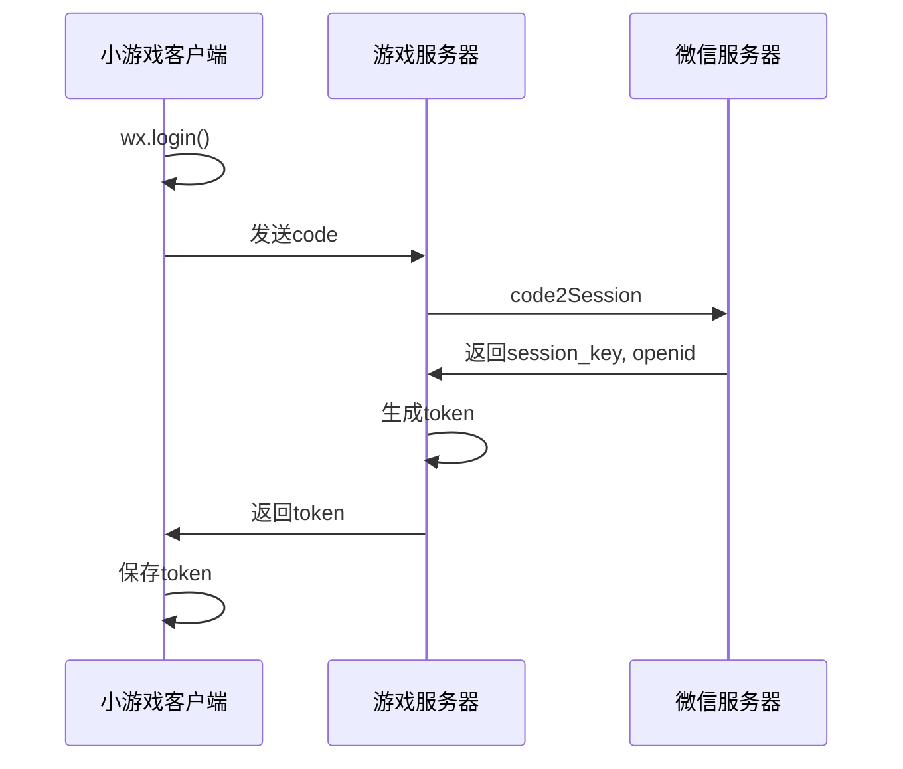

# 微信接入服务技术方案

## 1. 方案概述

本技术方案详细描述阿瓦隆微信小游戏与微信平台的接入方案，确保游戏能够无缝集成到微信小游戏生态中，充分利用微信平台提供的用户、社交、支付等能力，为用户提供完整的游戏体验。

## 2. 系统架构

### 2.1 总体架构

微信接入服务作为整个游戏系统与微信平台之间的桥梁，包含以下几个主要模块：

1. **微信授权与登录模块**：处理用户登录、授权、会话管理等功能
2. **用户信息处理模块**：获取和管理用户基本信息、加密数据处理等
3. **社交功能模块**：实现好友邀请、分享、排行榜等功能
4. **支付与订阅模块**：处理支付请求、订单管理、支付回调等
5. **数据分析模块**：收集、处理、上报用户行为数据


### 2.2 与其他模块的关系

微信接入服务与系统其他模块的交互关系如下：

- **与基础服务架构的关系**：使用基础服务架构提供的核心服务、日志系统等
- **与 WebSocket 服务的关系**：提供用户身份验证信息，支持实时游戏连接
- **与游戏逻辑服务的关系**：提供用户标识和权限，支持游戏内各种微信功能调用
- **与数据存储服务的关系**：存储和读取用户微信数据、支付记录等

## 3. 功能设计

### 3.1 微信登录与授权

#### 3.1.1 登录流程

1. 小游戏客户端调用 `wx.login()` 获取临时登录凭证 code
2. 服务端接收 code，调用微信 `code2Session` 接口获取 session_key 和 openid
3. 服务端生成自定义登录态 token，返回给客户端
4. 客户端保存 token，后续请求携带该 token 进行身份验证



#### 3.1.2 会话管理

- 使用 Redis 存储用户会话信息
- 实现 token 自动刷新机制
- 处理多设备登录冲突

### 3.2 用户信息处理

#### 3.2.1 用户信息获取

1. 基础信息：OpenID、UnionID（如有）、昵称、头像等
2. 加密数据处理：使用 session_key 解密用户敏感数据

#### 3.2.2 用户数据存储

- 设计用户模型，存储用户微信相关信息
- 实现数据更新和同步策略

### 3.3 社交功能接入

#### 3.3.1 开放数据域

- 实现游戏内开放数据域，用于展示好友信息和排行榜
- 开放数据域与主域的通信机制

#### 3.3.2 分享与邀请

- 实现游戏内分享功能，支持多种分享场景
- 设计邀请链接和邀请奖励机制
- 跟踪分享转化率和邀请效果

### 3.4 支付与订阅

#### 3.4.1 支付流程

- 实现微信支付接口调用
- 设计订单创建、查询、取消等功能
- 处理支付回调通知

#### 3.4.2 商品管理

- 设计游戏内商品系统
- 实现商品购买和消费逻辑

### 3.5 数据上报与分析

#### 3.5.1 数据收集

- 设计用户行为数据收集点
- 实现数据收集客户端 SDK

#### 3.5.2 数据处理与上报

- 实现数据预处理和过滤
- 支持批量上报和实时上报
- 对接微信数据分析平台

## 4. 技术实现

### 4.1 开发环境与工具

- 微信开发者工具
- NestJS 后端框架
- TypeScript 语言
- Redis 会话存储
- MongoDB 数据持久化

### 4.2 核心 API 与组件

#### 4.2.1 微信官方 API

- 登录：code2Session
- 用户信息：getUserInfo, getUserProfile
- 支付：requestPayment
- 分享：shareAppMessage, showShareMenu
- 数据分析：aldSendEvent（阿拉丁）或相关数据分析 SDK

#### 4.2.2 自定义组件

- 授权管理器：处理登录和授权流程
- 支付管理器：处理支付相关逻辑
- 社交管理器：处理分享和邀请功能
- 数据上报管理器：处理数据采集和上报

### 4.3 安全措施

- 请求签名验证
- 数据传输加密
- 防刷与风控策略
- 敏感信息保护

## 5. 接口设计

### 5.1 客户端接口

```typescript
// 登录接口
POST /api/wx/login
Request: { code: string }
Response: { token: string, expires: number, userInfo?: UserInfo }

// 用户信息更新接口
POST /api/wx/updateUserInfo
Request: { encryptedData: string, iv: string }
Response: { success: boolean, userInfo: UserInfo }

// 支付创建接口
POST /api/wx/createOrder
Request: { productId: string, quantity: number }
Response: { orderId: string, payParams: WxPayParams }

// 查询订单接口
GET /api/wx/getOrder/{orderId}
Response: { order: OrderInfo }

// 数据上报接口
POST /api/wx/report
Request: { events: Event[] }
Response: { success: boolean }
```

### 5.2 服务端内部接口

```typescript
// 用户服务接口
interface UserService {
  getUserByOpenId(openId: string): Promise<User>;
  createOrUpdateUser(userInfo: UserInfo): Promise<User>;
}

// 支付服务接口
interface PaymentService {
  createOrder(
    userId: string,
    productId: string,
    quantity: number
  ): Promise<Order>;
  handlePaymentCallback(data: WxPaymentCallback): Promise<void>;
  queryOrder(orderId: string): Promise<Order>;
}

// 数据分析服务接口
interface AnalyticsService {
  trackEvent(
    userId: string,
    eventName: string,
    eventParams: any
  ): Promise<void>;
  batchTrackEvents(events: AnalyticsEvent[]): Promise<void>;
}
```

## 6. 数据模型

### 6.1 用户模型

```typescript
interface User {
  _id: string;
  openId: string;
  unionId?: string;
  sessionKey?: string;
  nickname?: string;
  avatarUrl?: string;
  gender?: number;
  country?: string;
  province?: string;
  city?: string;
  language?: string;
  createdAt: Date;
  updatedAt: Date;
  lastLoginAt: Date;
}
```

### 6.2 订单模型

```typescript
interface Order {
  _id: string;
  userId: string;
  openId: string;
  productId: string;
  productName: string;
  quantity: number;
  totalFee: number;
  status: "pending" | "paid" | "failed" | "refunded";
  wxOrderId?: string;
  prepayId?: string;
  transactionId?: string;
  createdAt: Date;
  paidAt?: Date;
}
```

### 6.3 事件模型

```typescript
interface AnalyticsEvent {
  _id?: string;
  userId: string;
  openId: string;
  eventName: string;
  eventParams: any;
  timestamp: Date;
  sessionId?: string;
}
```

## 7. 异常处理

### 7.1 常见异常

- 登录失败：网络问题、code 过期、服务器异常
- 支付异常：订单创建失败、支付超时、回调处理失败
- 数据上报异常：网络问题、数据格式错误

### 7.2 处理策略

- 实现全面的错误码和错误信息体系
- 客户端重试机制
- 服务端异常日志记录和告警
- 关键操作的事务和补偿机制

## 8. 测试策略

### 8.1 单元测试

- 各服务模块的单元测试
- 接口参数验证测试
- 异常处理测试

### 8.2 集成测试

- 微信 API 调用测试
- 支付流程测试
- 数据上报流程测试

### 8.3 性能测试

- 并发登录测试
- 高频支付测试
- 大批量数据上报测试

## 9. 部署与运维

### 9.1 部署架构

- 使用容器化部署
- 负载均衡设置
- 多实例高可用

### 9.2 监控与告警

- 接口调用监控
- 错误率监控
- 支付成功率监控
- 关键指标告警

## 10. 风险与应对

| 风险             | 可能性 | 影响 | 应对措施                                             |
| ---------------- | ------ | ---- | ---------------------------------------------------- |
| 微信 API 变更    | 中     | 高   | 定期关注微信开发文档更新，设计松耦合架构便于适配变化 |
| 支付流程异常     | 中     | 高   | 完善的日志和监控，建立支付问题快速响应机制           |
| 数据上报丢失     | 低     | 中   | 本地缓存重要数据，实现失败重试机制                   |
| 用户信息安全问题 | 低     | 高   | 严格遵循微信安全规范，实施数据加密和访问控制         |

## 11. 扩展与优化

### 11.1 短期优化

- 缓存优化，提高接口响应速度
- 批量处理数据上报，减少网络请求

### 11.2 中长期扩展

- 支持更多微信小游戏能力（如云开发、音视频等）
- 接入更多第三方数据分析平台
- 实现跨平台账号系统，支持未来可能的多平台发布

## 12. 参考资料

- [微信小游戏开发文档](https://developers.weixin.qq.com/minigame/dev/guide/)
- [微信支付开发文档](https://pay.weixin.qq.com/wiki/doc/api/index.html)
- [NestJS 官方文档](https://docs.nestjs.com/)
- [Redis 文档](https://redis.io/documentation)
- [MongoDB 文档](https://docs.mongodb.com/)
