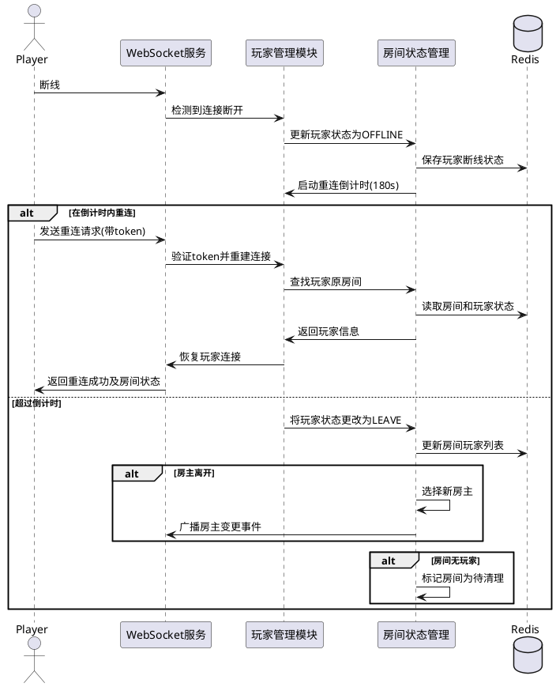

# Task 5.1.3: 开发玩家加入和离开房间功能

## 描述

开发玩家加入和离开游戏房间的功能，包括通过房间号加入房间、通过邀请链接加入房间、主动离开房间以及处理玩家意外断线等情况。需要确保加入和离开流程的稳定性，并正确处理边界情况。

## 验收标准

1. 实现通过房间号加入房间的功能，包括接口和业务逻辑
2. 实现通过邀请链接（分享卡片）加入房间的功能
3. 支持玩家主动离开房间，并正确处理房主离开的特殊情况
4. 实现玩家断线检测和自动标记离线状态
5. 提供重连机制，允许短时间内断线的玩家重新加入原房间
6. 确保房间状态更新的一致性，避免并发问题
7. 所有操作在高并发情况下仍能正常工作

## 详细任务

### 1. 玩家加入房间

- 实现通过房间号加入房间的 REST API
- 实现通过房间号加入房间的 WebSocket 事件处理
- 开发邀请链接生成和解析功能
- 实现加入房间时的有效性检查（房间是否存在、是否满员、是否可加入）
- 实现加入通知，向房间内所有玩家推送新玩家加入事件

### 2. 玩家离开房间

- 实现玩家主动离开房间的 API 和事件处理
- 开发房主离开房间的特殊逻辑（转移房主权限）
- 实现玩家离开通知，向房间内其他玩家推送
- 处理最后一名玩家离开导致房间关闭的情况

### 3. 断线检测与处理

- 实现 WebSocket 连接断开的检测
- 开发玩家状态标记机制（在线、离线、离开）
- 实现玩家断线后的倒计时机制，超时后自动移除
- 保存断线玩家的会话信息，为重连做准备

### 4. 断线重连机制

- 实现玩家重连到原房间的功能
- 开发断线重连的状态恢复机制
- 实现重连成功后的事件通知
- 处理重连失败的错误情况

### 5. 并发控制与一致性

- 实现房间玩家列表的并发更新控制
- 开发乐观锁或其他机制防止并发问题
- 确保关键操作的原子性
- 提供数据一致性验证机制

## 技术关键点

1. 使用 WebSocket 心跳机制检测玩家在线状态
2. 利用 Redis 实现分布式锁，解决并发加入/离开的问题
3. 设计合理的断线重连机制，包括会话保持和状态恢复
4. 实现房主权限转移的算法，确保房间始终有房主
5. 优化重连流程，减少玩家断线后的等待时间

## 工作量估计

- 玩家加入房间：2 人天
- 玩家离开房间：1.5 人天
- 断线检测与处理：1.5 人天
- 断线重连机制：2 人天
- 并发控制与一致性：1 人天

总计：8 人天

## 相关文档

- [房间管理服务技术方案](../技术方案.md)
- [Task 5.1.1: 设计房间数据结构和状态管理](./Task5.1.1-设计房间数据结构和状态管理.md)

## 重连流程示例

