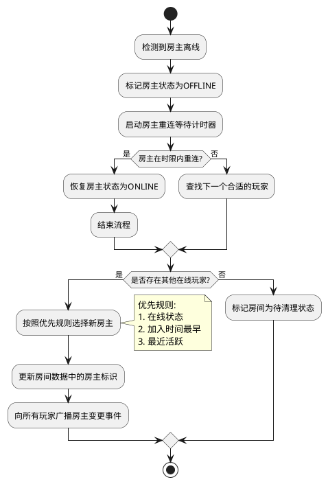

# Task 5.1.4: 房间管理和权限控制实现

## 描述

实现游戏房间的管理功能和权限控制系统，包括房主特权操作（踢出玩家、转移房主权限、更改房间设置等）以及各类权限验证机制。确保只有授权用户能执行特定操作，并维护房间的秩序和公平性。

## 验收标准

1. 实现房主踢出其他玩家的功能
2. 实现房主转移权限给其他玩家的功能
3. 支持房主关闭房间的操作
4. 为所有房间操作添加权限验证机制，确保只有授权用户能执行特定操作
5. 实现房间操作日志记录，便于追踪和问题排查
6. 在房主意外离线时提供自动权限转移机制
7. 提供玩家权限查询接口，用于前端 UI 展示

## 详细任务

### 1. 房主操作功能

- 实现踢出玩家功能（REST API 和 WebSocket 事件）
- 开发房主主动转移权限的功能
- 实现房主关闭房间的功能
- 开发房间锁定/解锁功能（防止新玩家加入）
- 实现房主强制开始游戏的功能

### 2. 权限控制系统

- 设计并实现房间角色权限模型（房主、普通玩家）
- 开发权限验证中间件，用于 API 和 WebSocket 事件
- 实现操作权限缓存，提高验证效率
- 开发权限冲突解决机制

### 3. 自动权限转移

- 实现房主离线检测机制
- 开发房主自动转移算法（基于加入时间、活跃度等）
- 实现权限转移的事件通知
- 处理多人同时申请房主权限的冲突情况

### 4. 房间操作日志

- 设计房间操作日志数据结构
- 实现关键操作的日志记录（创建、踢人、转移权限等）
- 开发日志查询接口
- 实现日志定期清理机制

### 5. 前端权限展示

- 提供查询玩家在房间中权限的 API
- 开发权限变更的实时通知
- 实现权限验证结果的错误处理和反馈
- 为权限操作提供统一的前端接口

## 技术关键点

1. 基于角色的访问控制（RBAC）模型实现
2. 使用装饰器模式简化权限验证代码
3. 利用 Redis 缓存权限信息，提高验证效率
4. 实现可靠的自动权限转移算法，确保房间始终有房主
5. 添加操作频率限制，防止滥用房主权限

## 工作量估计

- 房主操作功能：2 人天
- 权限控制系统：2 人天
- 自动权限转移：1.5 人天
- 房间操作日志：1 人天
- 前端权限展示：0.5 人天

总计：7 人天

## 相关文档

- [房间管理服务技术方案](../技术方案.md)
- [Task 5.1.1: 设计房间数据结构和状态管理](./Task5.1.1-设计房间数据结构和状态管理.md)
- [Task 5.1.3: 开发玩家加入和离开房间功能](./Task5.1.3-开发玩家加入和离开房间功能.md)

## 权限模型示例

```typescript
// 房间角色枚举
enum RoomRole {
  OWNER = "owner", // 房主
  PLAYER = "player", // 普通玩家
}

// 房间操作权限枚举
enum RoomPermission {
  JOIN_ROOM = "join_room", // 加入房间
  LEAVE_ROOM = "leave_room", // 离开房间
  UPDATE_SETTINGS = "update_settings", // 更新房间设置
  KICK_PLAYER = "kick_player", // 踢出玩家
  TRANSFER_OWNERSHIP = "transfer_ownership", // 转移房主
  CLOSE_ROOM = "close_room", // 关闭房间
  START_GAME = "start_game", // 开始游戏
  READY = "ready", // 准备就绪
}

// 角色-权限映射
const RolePermissions = {
  [RoomRole.OWNER]: [
    RoomPermission.JOIN_ROOM,
    RoomPermission.LEAVE_ROOM,
    RoomPermission.UPDATE_SETTINGS,
    RoomPermission.KICK_PLAYER,
    RoomPermission.TRANSFER_OWNERSHIP,
    RoomPermission.CLOSE_ROOM,
    RoomPermission.START_GAME,
    RoomPermission.READY,
  ],
  [RoomRole.PLAYER]: [
    RoomPermission.JOIN_ROOM,
    RoomPermission.LEAVE_ROOM,
    RoomPermission.READY,
  ],
};
```

## 自动权限转移流程


