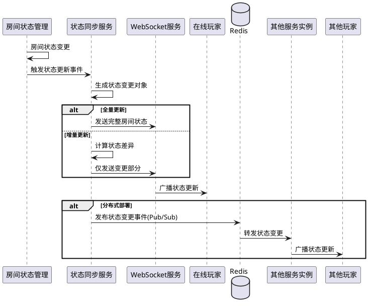

# Task 5.1.5: 房间状态同步和查询接口

## 描述

实现房间状态的实时同步和查询接口，确保所有玩家能够获取到最新的房间状态信息。开发高效的查询机制，支持各种查询条件，并提供实时的状态更新推送。该功能是保证游戏体验一致性的关键组件。

## 验收标准

1. 实现房间状态的实时同步机制，状态变更时自动推送给房间内所有玩家
2. 提供获取房间完整信息的 REST API，支持不同的查询条件
3. 开发房间列表查询接口，支持分页和多种过滤条件
4. 实现对房间特定信息的增量更新，减少网络传输量
5. 确保状态同步的延迟不超过 300ms（95%分位数）
6. 所有查询接口响应时间不超过 500ms（90%分位数）
7. 支持大量并发查询（至少支持每秒 200 次查询）

## 详细任务

### 1. 房间状态同步机制

- 实现基于 WebSocket 的状态同步推送
- 开发房间状态变更的监听器
- 实现增量更新机制，只发送变更部分
- 设计状态同步的优先级和频率控制
- 实现状态同步失败的重试机制

### 2. 房间基本查询接口

- 实现根据房间 ID 查询完整信息的 API
- 开发根据房间号查询的 API
- 实现查询玩家所在房间的 API
- 支持查询结果格式化和字段过滤
- 添加缓存机制优化频繁查询

### 3. 房间列表查询

- 实现活跃房间列表查询接口
- 支持按状态、玩家数量、创建时间等条件过滤
- 实现分页查询和排序
- 开发高效的列表查询索引
- 实现查询结果缓存

### 4. 增量状态更新

- 设计增量更新数据结构
- 实现变更检测算法，高效识别状态变化
- 开发状态版本控制机制，确保增量更新的连续性
- 实现客户端增量合并算法建议

### 5. 性能优化

- 实现 Redis 查询缓存
- 对大规模并发查询进行压力测试
- 优化查询索引和数据结构
- 实现查询限流和保护机制
- 开发查询性能监控指标

## 技术关键点

1. 使用 Socket.IO 的房间功能实现高效广播
2. 采用乐观锁和版本控制实现状态一致性
3. 利用 Redis Pub/Sub 机制实现跨实例状态同步
4. 设计高效的增量更新算法，减少网络传输
5. 实现基于队列的状态更新机制，避免广播风暴

## 工作量估计

- 房间状态同步机制：2 人天
- 房间基本查询接口：1 人天
- 房间列表查询：1.5 人天
- 增量状态更新：2 人天
- 性能优化：1.5 人天

总计：8 人天

## 相关文档

- [房间管理服务技术方案](../技术方案.md)
- [Task 5.1.1: 设计房间数据结构和状态管理](./Task5.1.1-设计房间数据结构和状态管理.md)

## 状态同步流程



## 房间查询 API 示例

### 查询单个房间

```
GET /api/rooms/:roomId
响应:
{
  "roomId": "abc123",
  "roomCode": "123456",
  "status": "waiting",
  "playerLimit": 7,
  "players": [
    {
      "id": "user1",
      "nickname": "玩家1",
      "status": "online",
      "isOwner": true,
      "joinedAt": "2023-05-01T12:00:00Z"
    },
    ...
  ],
  "settings": {
    "roleConfig": {
      "merlin": true,
      "percival": true,
      ...
    },
    "autoStart": false
  },
  "createdAt": "2023-05-01T12:00:00Z",
  "updatedAt": "2023-05-01T12:05:00Z"
}
```

### 查询房间列表

```
GET /api/rooms?status=waiting&playerCount=5-7&page=1&limit=10
响应:
{
  "total": 42,
  "page": 1,
  "limit": 10,
  "rooms": [
    {
      "roomId": "abc123",
      "roomCode": "123456",
      "status": "waiting",
      "playerCount": 5,
      "playerLimit": 7,
      "createdAt": "2023-05-01T12:00:00Z"
    },
    ...
  ]
}
```
