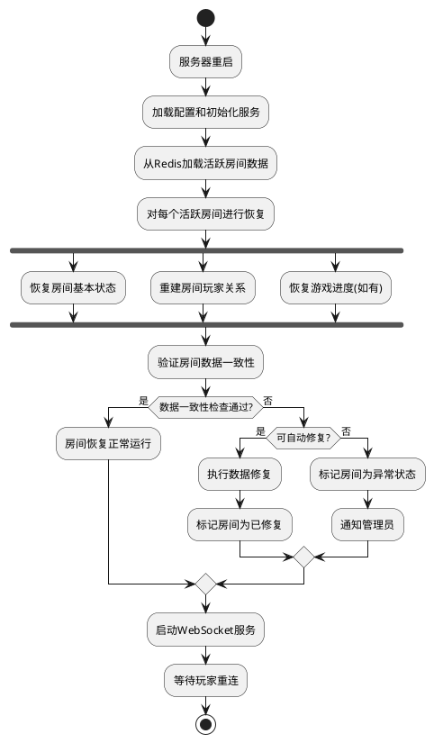

# Task 5.1.6: 异常情况处理机制

## 描述

实现房间服务中各种异常情况的处理机制，包括玩家异常断线、网络波动、服务器宕机、数据不一致等情况的检测、恢复和补偿策略。确保游戏在各种异常情况下仍能提供稳定的体验，并能自动恢复或提供降级服务。

## 验收标准

1. 实现玩家异常断线的检测和处理机制，保留玩家在房间中的状态
2. 支持服务器重启后恢复进行中的房间状态
3. 实现数据一致性检查和修复机制，解决不同客户端状态不一致的问题
4. 提供房间异常状态的自动恢复能力（如长时间无响应的房间）
5. 实现服务降级策略，在系统压力过大时保证核心功能可用
6. 提供完善的错误日志和监控机制，便于问题排查
7. 所有错误处理都有恰当的用户反馈，不会出现无提示的功能失效

## 详细任务

### 1. 玩家异常断线处理

- 实现 WebSocket 连接断开检测
- 开发玩家状态保持机制，支持一定时间内的状态恢复
- 实现玩家异常断线的通知机制
- 开发长时间断线后的自动清理和资源回收

### 2. 服务器容灾与恢复

- 实现房间状态的持久化存储
- 开发服务重启后的房间状态加载机制
- 实现分布式部署下的会话恢复策略
- 设计房间数据定期备份和恢复机制

### 3. 数据一致性处理

- 实现客户端与服务器状态一致性校验
- 开发数据不一致时的冲突解决策略
- 实现状态强制同步机制
- 设计并实现定期数据一致性检查

### 4. 房间异常状态恢复

- 开发房间活跃度监控机制
- 实现长时间无活动房间的自动关闭
- 设计并实现卡死房间的检测和恢复
- 开发房间异常状态的手动干预接口

### 5. 服务降级策略

- 设计负载过高时的处理策略
- 实现核心功能和非核心功能的区分
- 开发动态调整房间容量的机制
- 实现请求排队和延迟处理机制

### 6. 监控与报警

- 设计详细的错误日志记录规范
- 实现关键指标的监控
- 开发异常情况的报警机制
- 实现问题追踪和复现工具

## 技术关键点

1. 利用 Redis 的发布订阅机制实现分布式系统的状态同步
2. 设计基于乐观锁的数据一致性策略
3. 使用心跳机制实现玩家在线状态监控
4. 实现优雅降级机制，在高负载情况下保证核心功能
5. 采用幂等设计原则，确保操作可重复执行

## 工作量估计

- 玩家异常断线处理：1.5 人天
- 服务器容灾与恢复：2 人天
- 数据一致性处理：2 人天
- 房间异常状态恢复：1.5 人天
- 服务降级策略：1 人天
- 监控与报警：1 人天

总计：9 人天

## 相关文档

- [房间管理服务技术方案](../技术方案.md)
- [Task 5.1.3: 开发玩家加入和离开房间功能](./Task5.1.3-开发玩家加入和离开房间功能.md)
- [Task 5.1.5: 房间状态同步和查询接口](./Task5.1.5-房间状态同步和查询接口.md)

## 异常处理流程示例

### 服务器宕机恢复流程



### 数据一致性恢复流程

```plantuml
@startuml
participant "客户端" as Client
participant "WebSocket服务" as WebSocket
participant "房间状态管理" as RoomState
database "Redis" as Redis

Client -> WebSocket: 发送状态校验请求(版本号)
WebSocket -> RoomState: 检查状态版本
RoomState -> Redis: 获取当前房间状态

alt 状态一致
  RoomState --> WebSocket: 返回状态一致标志
  WebSocket --> Client: 响应状态一致
else 状态不一致
  RoomState -> RoomState: 计算需要同步的状态数据
  RoomState --> WebSocket: 返回完整房间状态
  WebSocket --> Client: 发送正确的房间状态
  Client -> Client: 更新本地状态
endif

@enduml
```
