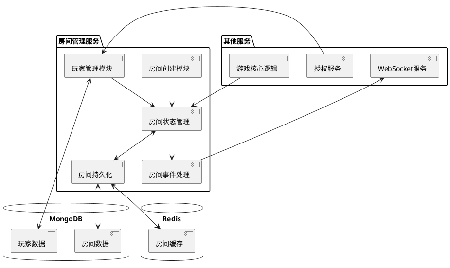
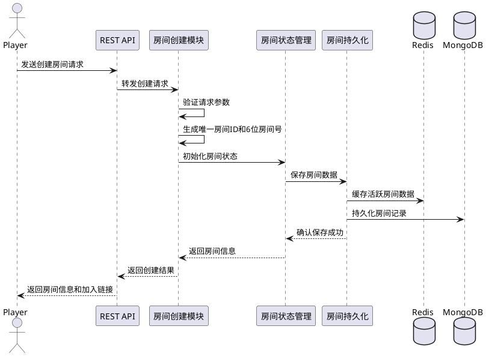
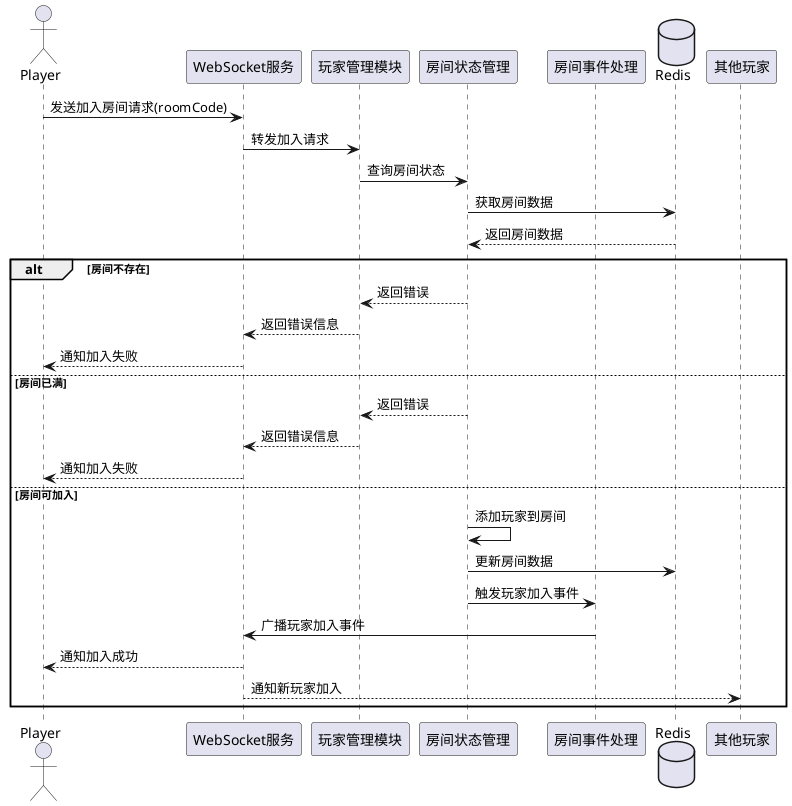
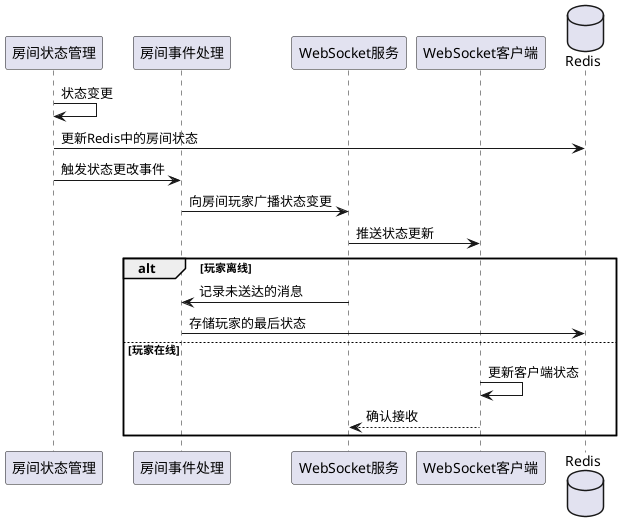

# 房间管理服务技术方案

## 1. 系统设计

### 1.1 系统架构

房间管理服务作为游戏逻辑服务的关键组成部分，负责处理所有与游戏房间相关的操作。该服务采用微服务架构，与其他服务组件配合完成房间管理功能。



### 1.2 技术选型

1. **服务框架**：NestJS（基于 Node.js 的企业级框架）
2. **实时通信**：Socket.IO（实现 WebSocket 通信）
3. **数据存储**：
   - Redis：存储活跃房间状态和临时数据
   - MongoDB：持久化存储房间历史数据和统计信息
4. **负载均衡**：使用 Redis 实现基于房间 ID 的会话亲和性（Session Affinity）
5. **消息队列**：可选使用 RabbitMQ 处理高并发场景下的房间事件

## 2. 数据模型

### 2.1 房间模型（Room）

```typescript
interface Room {
  id: string; // 房间唯一ID
  roomCode: string; // 6位数字房间号（用于加入）
  ownerId: string; // 房主ID
  status: RoomStatus; // 房间状态
  playerLimit: number; // 最大玩家数（5-10）
  players: Player[]; // 房间内玩家列表
  settings: GameSettings; // 游戏设置
  createdAt: Date; // 创建时间
  updatedAt: Date; // 最后更新时间
  gameId?: string; // 关联的游戏ID（如果已开始）
}

enum RoomStatus {
  WAITING = "waiting", // 等待玩家加入
  READY = "ready", // 准备开始游戏
  PLAYING = "playing", // 游戏进行中
  FINISHED = "finished", // 游戏已结束
  CLOSED = "closed", // 房间已关闭
}

interface GameSettings {
  roleConfig: RoleConfig; // 角色配置
  useCustomRoles: boolean; // 是否使用自定义角色
  customRoles?: Role[]; // 自定义角色列表
  autoStart: boolean; // 是否自动开始（满员时）
  allowMidwayJoin: boolean; // 是否允许中途加入
}

interface RoleConfig {
  merlin: boolean; // 梅林
  percival: boolean; // 派西维尔
  morgana: boolean; // 莫甘娜
  mordred: boolean; // 莫德雷德
  assassin: boolean; // 刺客
  oberon: boolean; // 奥伯伦
  loyalServantCount: number; // 忠臣数量
  minionCount: number; // 爪牙数量
}
```

### 2.2 玩家模型（在房间中）

```typescript
interface Player {
  id: string; // 玩家ID
  nickname: string; // 昵称
  avatarUrl: string; // 头像URL
  status: PlayerStatus; // 玩家状态
  isOwner: boolean; // 是否为房主
  joinedAt: Date; // 加入时间
  lastActiveAt: Date; // 最后活跃时间
  role?: Role; // 分配的角色（游戏开始后）
  seatIndex: number; // 座位索引
}

enum PlayerStatus {
  ONLINE = "online", // 在线
  OFFLINE = "offline", // 离线
  READY = "ready", // 已准备
  PLAYING = "playing", // 游戏中
}
```

## 3. API 设计

### 3.1 REST API

#### 创建房间

```
POST /api/rooms
请求体:
{
  "playerLimit": 7,
  "settings": { ... } // 游戏设置
}
响应:
{
  "roomId": "abc123",
  "roomCode": "123456",
  "ownerId": "user123",
  "status": "waiting",
  "joinUrl": "https://game.example.com/join/123456"
}
```

#### 加入房间

```
POST /api/rooms/:roomCode/join
响应:
{
  "roomId": "abc123",
  "status": "waiting",
  "players": [ ... ],
  "settings": { ... }
}
```

#### 获取房间信息

```
GET /api/rooms/:roomId
响应:
{
  "roomId": "abc123",
  "roomCode": "123456",
  "status": "waiting",
  "players": [ ... ],
  "settings": { ... }
}
```

#### 更新房间设置

```
PUT /api/rooms/:roomId/settings
请求体:
{
  "settings": { ... } // 新游戏设置
}
响应:
{
  "success": true,
  "settings": { ... } // 更新后的设置
}
```

### 3.2 WebSocket 事件

```
// 客户端事件
socket.emit('room:join', { roomCode: '123456' });
socket.emit('room:leave');
socket.emit('room:ready', { ready: true });
socket.emit('room:kick', { playerId: 'user456' });
socket.emit('room:updateSettings', { settings: { ... } });
socket.emit('room:startGame');

// 服务器事件
socket.on('room:joined', (data) => { ... });
socket.on('room:playerJoined', (data) => { ... });
socket.on('room:playerLeft', (data) => { ... });
socket.on('room:playerReady', (data) => { ... });
socket.on('room:playerKicked', (data) => { ... });
socket.on('room:settingsUpdated', (data) => { ... });
socket.on('room:gameStarting', (data) => { ... });
socket.on('room:error', (error) => { ... });
```

## 4. 关键流程

### 4.1 房间创建流程



### 4.2 玩家加入房间流程



### 4.3 房间状态同步流程



## 5. 异常处理

### 5.1 玩家异常掉线

1. 检测到玩家 WebSocket 连接断开
2. 标记玩家状态为 OFFLINE 但保留在房间中
3. 启动计时器（可配置，默认 3 分钟）
4. 如果玩家在超时前重连，恢复玩家状态
5. 如果超时仍未重连，根据房间配置决定：
   - 将玩家从房间移除
   - 如果是房主，转移房主权限给下一位玩家
   - 如果房间空了，标记房间为待清理状态

### 5.2 服务器故障恢复

1. 使用 Redis 持久化房间状态
2. 服务重启后，从 Redis 加载活跃房间数据
3. 对于断线的玩家，保留其状态并等待重连
4. 保持房间状态一致性，并通知所有重连的玩家当前状态

## 6. 性能与扩展性

### 6.1 性能优化

1. 使用 Redis 存储活跃房间数据，提高读写性能
2. 采用房间 ID 哈希算法，保证同一房间的请求路由到同一服务实例
3. 针对房间列表查询进行缓存优化
4. 采用批量更新方式减少数据库写入频率

### 6.2 扩展性设计

1. 采用微服务架构，房间服务可独立扩展
2. 使用 Redis Pub/Sub 机制跨实例同步房间事件
3. 服务实例水平扩展能力，支持集群部署
4. 预留服务发现和负载均衡机制

## 7. 安全性考虑

1. 房间号采用 6 位随机数，避免连续或可预测
2. 实施请求频率限制，防止创建房间和加入房间的 DoS 攻击
3. 验证用户身份和操作权限，特别是房主特权操作
4. 对 WebSocket 连接进行身份验证和会话管理
5. 敏感操作日志记录，方便审计和问题排查
