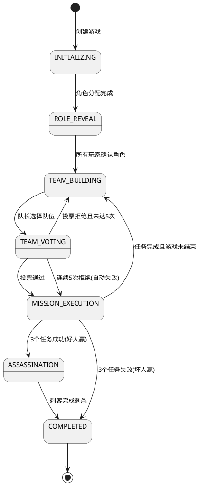

# Task 5.2.1: 游戏状态和流程管理

## 描述

设计并实现游戏状态管理系统和游戏流程控制，为阿瓦隆游戏提供可靠的状态转换和生命周期管理。该系统需要基于有限状态机（FSM）模式，确保游戏状态转换的清晰和可控，并能够支持阿瓦隆游戏的所有阶段和规则。

## 验收标准

1. 实现基于有限状态机的游戏状态管理系统，支持所有阿瓦隆游戏状态
2. 提供游戏生命周期管理，包括创建、开始、进行和结束
3. 实现状态转换验证，确保状态转换符合游戏规则
4. 支持游戏进程中的异常处理，如玩家断线重连后的状态恢复
5. 提供游戏状态查询和监听接口，便于前端展示
6. 确保状态转换的原子性和一致性，避免状态错乱
7. 实现游戏流程配置系统，支持不同玩家人数的任务配置

## 详细任务

### 1. 游戏状态定义和设计

- 设计完整的游戏状态枚举，包括初始化、角色展示、组队、投票等状态
- 实现状态对象模型，包含状态属性和转换规则
- 设计状态机框架，支持状态注册、转换和查询
- 实现状态转换验证器，确保转换合法性

### 2. 游戏生命周期管理

- 实现游戏创建逻辑，基于房间信息和玩家配置
- 开发游戏启动流程，包括角色分配和初始状态设置
- 实现游戏结束处理，包括结果计算和数据存储
- 开发游戏暂停和恢复机制（可选）

### 3. 任务轮次管理

- 实现任务轮次初始化，根据玩家人数设置对应的任务要求
- 开发轮次切换逻辑，包括队长指定、任务成功/失败判定
- 实现连续投票拒绝处理（5 次拒绝后自动失败）
- 开发任务记分和胜负判定逻辑

### 4. 状态转换与事件系统

- 实现状态转换触发器，基于游戏事件驱动状态变更
- 开发状态转换钩子（Hooks），支持前置和后置处理
- 实现状态变更通知机制，推送状态更新给客户端
- 设计状态转换事务，确保原子性和一致性

### 5. 异常处理与状态恢复

- 实现玩家断线重连后的状态恢复机制
- 开发游戏状态验证器，检测和修复不一致状态
- 实现游戏超时处理，防止因玩家不操作导致游戏卡死
- 设计应急预案，处理极端异常情况

## 技术关键点

1. 使用 TypeScript 类型系统确保状态转换的类型安全
2. 采用发布-订阅模式实现事件驱动的状态转换
3. 利用 Redis 事务或 Lua 脚本确保状态更新的原子性
4. 设计高效的状态缓存策略，平衡性能和一致性
5. 实现基于版本控制的状态同步，确保客户端状态一致性

## 工作量估计

- 游戏状态定义和设计：2 人天
- 游戏生命周期管理：1.5 人天
- 任务轮次管理：2 人天
- 状态转换与事件系统：2 人天
- 异常处理与状态恢复：1.5 人天

总计：9 人天

## 相关文档

- [游戏核心逻辑技术方案](../技术方案.md)
- [阿瓦隆游戏规则](../../../阿瓦隆游戏规则.md)

## 游戏状态流转图

## 任务配置参考

| 玩家人数 | 第 1 轮任务 | 第 2 轮任务 | 第 3 轮任务 | 第 4 轮任务 | 第 5 轮任务 |
| -------- | ----------- | ----------- | ----------- | ----------- | ----------- |
| 5 人     | 2 人/1 失败 | 3 人/1 失败 | 2 人/1 失败 | 3 人/1 失败 | 3 人/1 失败 |
| 6 人     | 2 人/1 失败 | 3 人/1 失败 | 4 人/1 失败 | 3 人/1 失败 | 4 人/1 失败 |
| 7 人     | 2 人/1 失败 | 3 人/1 失败 | 3 人/1 失败 | 4 人/2 失败 | 4 人/1 失败 |
| 8 人     | 3 人/1 失败 | 4 人/1 失败 | 4 人/1 失败 | 5 人/2 失败 | 5 人/1 失败 |
| 9 人     | 3 人/1 失败 | 4 人/1 失败 | 4 人/1 失败 | 5 人/2 失败 | 5 人/1 失败 |
| 10 人    | 3 人/1 失败 | 4 人/1 失败 | 4 人/1 失败 | 5 人/2 失败 | 5 人/1 失败 |

</rewritten_file>
