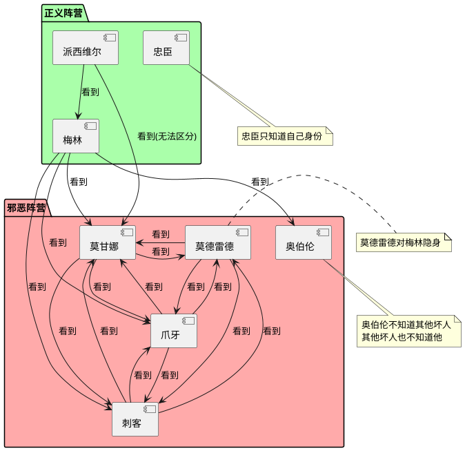

# Task 5.2.2: 角色分配与管理

## 描述

设计并实现阿瓦隆游戏的角色分配与管理系统，确保游戏中角色的公平分配、信息可见性控制和角色特殊能力的实现。该系统需要支持不同玩家人数下的角色配置，管理角色之间的信息可见关系，并提供角色验证和查询功能。

## 验收标准

1. 实现角色随机分配算法，确保角色分配的公平性
2. 支持自定义角色配置，适应不同玩家人数和游戏偏好
3. 实现角色信息可见性控制，确保只有特定角色能看到其他角色信息
4. 提供角色验证系统，确保角色分配符合游戏规则
5. 实现角色特殊能力，如梅林预知、刺客刺杀等功能
6. 实现角色信息保密措施，防止客户端作弊获取额外信息
7. 提供角色信息查询接口，便于客户端展示

## 详细任务

### 1. 角色定义与模型设计

- 设计角色数据模型，包括角色类型、阵营和特殊能力
- 实现角色关系映射，定义哪些角色可以看到哪些其他角色
- 开发角色特性定义系统，支持角色特殊能力的扩展
- 设计角色配置模板，支持不同玩家人数的预设配置

### 2. 角色分配算法

- 实现基于玩家人数的角色自动配置
- 开发角色随机分配算法，确保分配结果的随机性和公平性
- 实现角色分配验证器，确保角色分配符合游戏规则
- 支持自定义角色分配（可选），允许房主调整角色配置

### 3. 角色信息可见性控制

- 实现基于角色类型的信息过滤器，控制可见信息范围
- 开发角色信息查询接口，根据查询者角色返回适当信息
- 实现信息加密与鉴权机制，防止非法获取角色信息
- 开发角色信息展示逻辑，为前端提供适当的数据结构

### 4. 角色特殊能力实现

- 实现梅林的预知能力，能够识别坏人（莫德雷德除外）
- 开发派西维尔的能力，能够识别梅林和莫甘娜
- 实现刺客的刺杀功能，包括目标选择和结果验证
- 开发莫德雷德的隐身能力，对梅林隐藏身份

### 5. 角色验证与安全措施

- 实现服务端角色验证，防止客户端篡改角色信息
- 开发角色操作权限控制，确保特定操作只能由特定角色执行
- 实现角色信息加密传输，防止网络嗅探获取信息
- 开发反作弊措施，检测并处理角色相关的作弊行为

## 技术关键点

1. 使用加密机制保护角色信息传输和存储
2. 实现高效的角色信息查询和过滤算法
3. 设计合理的权限控制机制，确保角色操作的安全性
4. 使用随机数生成器确保角色分配的随机性和公平性
5. 采用服务端验证模式，防止客户端作弊

## 角色信息可见性矩阵

| 角色     | 看到的信息                     |
| -------- | ------------------------------ |
| 梅林     | 知道所有坏人（除莫德雷德）     |
| 派西维尔 | 知道梅林和莫甘娜（但无法区分） |
| 忠臣     | 只知道自己的身份               |
| 莫德雷德 | 知道所有坏人                   |
| 莫甘娜   | 知道所有坏人                   |
| 奥伯伦   | 只知道自己的身份               |
| 刺客     | 知道所有坏人                   |
| 爪牙     | 知道所有坏人                   |

## 默认角色配置

| 玩家人数 | 梅林 | 派西维尔 | 忠臣 | 莫德雷德 | 莫甘娜 | 奥伯伦 | 刺客 | 爪牙 |
| -------- | ---- | -------- | ---- | -------- | ------ | ------ | ---- | ---- |
| 5 人     | 1    | 1        | 1    | 0        | 0      | 0      | 1    | 1    |
| 6 人     | 1    | 1        | 2    | 0        | 0      | 0      | 1    | 1    |
| 7 人     | 1    | 1        | 2    | 1        | 1      | 0      | 1    | 0    |
| 8 人     | 1    | 1        | 3    | 1        | 1      | 0      | 1    | 0    |
| 9 人     | 1    | 1        | 4    | 1        | 1      | 0      | 1    | 0    |
| 10 人    | 1    | 1        | 4    | 1        | 1      | 1      | 1    | 0    |

## 工作量估计

- 角色定义与模型设计：1 人天
- 角色分配算法：1.5 人天
- 角色信息可见性控制：2 人天
- 角色特殊能力实现：2 人天
- 角色验证与安全措施：1.5 人天

总计：8 人天

## 相关文档

- [游戏核心逻辑技术方案](../技术方案.md)
- [阿瓦隆游戏规则](../../../阿瓦隆游戏规则.md)

## 角色关系图

