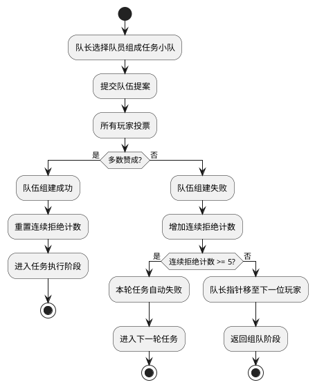

# Task 5.2.3: 组队和投票系统

## 描述

设计并实现阿瓦隆游戏的组队和投票系统，该系统是游戏核心玩法的关键部分，负责管理队长选择、队伍组建、投票过程和结果统计。系统需要确保投票的公平性、实时性和保密性，同时支持连续拒绝机制和任务轮次转换。

## 验收标准

1. 实现队长轮换机制，确保队长按照游戏规则顺序轮换
2. 提供组队功能，允许当前队长选择任务队员
3. 实现投票系统，支持所有玩家对提议的队伍进行赞成或反对
4. 支持连续拒绝计数功能，在连续 5 次拒绝后自动处理任务失败
5. 实现投票结果统计和展示功能，确保所有玩家可以看到投票结果
6. 提供轮次管理功能，在投票通过后转入任务执行阶段
7. 支持投票操作的超时处理，防止玩家不操作导致游戏卡死

## 详细任务

### 1. 队长轮换系统

- 实现队长指针管理，跟踪当前队长和下一个队长
- 开发队长轮换算法，确保按照座位顺序轮换
- 实现队长特权管理，只允许当前队长执行组队操作
- 设计队长标识通知机制，确保所有玩家知道当前队长

### 2. 组队功能实现

- 开发队伍选择界面数据结构，支持队长选择队员
- 实现队伍成员验证，确保队伍人数符合当前轮次要求
- 设计队伍提案记录系统，保存历史提案信息
- 实现组队完成后的状态转换，进入投票阶段

### 3. 投票系统核心功能

- 实现投票选项（赞成/反对）管理
- 开发投票收集机制，收集所有玩家的投票
- 实现投票结果计算，统计赞成和反对票数
- 设计投票结果展示逻辑，向所有玩家展示投票结果
- 实现投票超时处理，处理玩家未投票的情况

### 4. 连续拒绝机制

- 实现连续拒绝计数器，跟踪连续拒绝次数
- 开发连续拒绝判定逻辑，在连续 5 次拒绝后自动失败
- 实现连续拒绝状态重置，在任务成功后重置计数器
- 设计连续拒绝提示机制，向玩家展示当前连续拒绝状态

### 5. 轮次管理与状态转换

- 实现投票后的状态转换逻辑，根据投票结果决定下一步
- 开发轮次进度追踪，记录当前进行到第几轮任务
- 实现轮次结果记录，保存每轮任务的结果
- 设计轮次信息展示，向玩家提供当前游戏进度

## 技术关键点

1. 使用原子操作确保投票计数的准确性和一致性
2. 实现实时投票状态更新，确保所有玩家能看到投票进度
3. 采用服务端验证模式，防止客户端篡改投票结果
4. 设计合理的超时机制，处理玩家不操作的情况
5. 实现投票历史记录，便于游戏回顾和问题排查

## 投票流程图



## 各轮次任务人数要求

| 玩家人数 | 第 1 轮任务 | 第 2 轮任务 | 第 3 轮任务 | 第 4 轮任务 | 第 5 轮任务 |
| -------- | ----------- | ----------- | ----------- | ----------- | ----------- |
| 5 人     | 2 人        | 3 人        | 2 人        | 3 人        | 3 人        |
| 6 人     | 2 人        | 3 人        | 4 人        | 3 人        | 4 人        |
| 7 人     | 2 人        | 3 人        | 3 人        | 4 人        | 4 人        |
| 8 人     | 3 人        | 4 人        | 4 人        | 5 人        | 5 人        |
| 9 人     | 3 人        | 4 人        | 4 人        | 5 人        | 5 人        |
| 10 人    | 3 人        | 4 人        | 4 人        | 5 人        | 5 人        |

## 投票状态数据结构

```typescript
interface VoteProposal {
  roundIndex: number; // 当前轮次索引 (0-4)
  attemptIndex: number; // 当前尝试索引 (0-4)
  leader: string; // 当前队长ID
  proposedTeam: string[]; // 提议的队员ID列表
  votes: {
    [playerId: string]: boolean; // 玩家投票结果 (true为赞成，false为反对)
  };
  voteResult?: boolean; // 投票最终结果
  timestamp: number; // 提案时间戳
  expireTime: number; // 投票截止时间
}
```

## 工作量估计

- 队长轮换系统：1 人天
- 组队功能实现：1.5 人天
- 投票系统核心功能：2 人天
- 连续拒绝机制：1 人天
- 轮次管理与状态转换：1.5 人天

总计：7 人天

## 相关文档

- [游戏核心逻辑技术方案](../技术方案.md)
- [阿瓦隆游戏规则](../../../阿瓦隆游戏规则.md)
- [Task5.2.1-游戏状态和流程管理](./Task5.2.1-游戏状态和流程管理.md)
