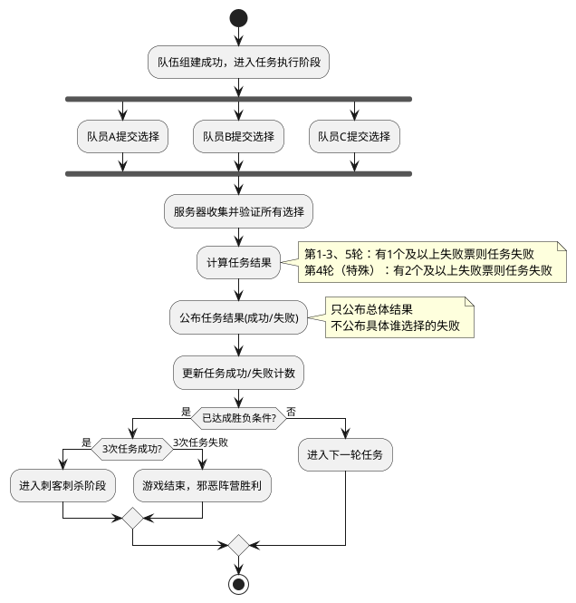

# Task 5.2.4: 任务执行系统

## 描述

设计并实现阿瓦隆游戏的任务执行系统，该系统负责管理已组建队伍的任务执行过程，收集队员的任务执行选择（成功/失败），计算任务结果，并处理任务结果对游戏状态的影响。系统需要确保任务执行的隐秘性，特别是坏人选择失败的情况不被其他玩家知晓。

## 验收标准

1. 实现任务执行界面数据结构，支持队员提交任务选择
2. 确保仅参与任务的队员可以执行任务操作
3. 实现不同角色的任务执行权限控制（如好人只能选择成功）
4. 提供任务结果计算功能，根据规则判定任务成功或失败
5. 实现任务结果公示功能，仅展示成功/失败结果不暴露个人选择
6. 支持特殊轮次规则（如第 4 轮任务需要至少 2 个失败票）
7. 实现任务执行超时处理，防止玩家不操作导致游戏卡死

## 详细任务

### 1. 任务执行界面与交互设计

- 实现任务执行选择界面数据结构，支持成功/失败选择
- 开发队员身份验证系统，确保只有队员可以参与任务
- 实现角色权限控制，限制好人只能选择任务成功
- 设计任务执行状态展示，显示已提交和未提交玩家

### 2. 任务选择收集与验证

- 实现任务选择收集机制，收集所有队员的选择
- 开发选择验证系统，确保选择符合角色规则
- 实现选择加密存储，防止非法查看其他玩家选择
- 设计选择提交确认机制，防止误操作

### 3. 任务结果计算与公示

- 实现任务结果计算逻辑，根据失败票数判定任务结果
- 开发特殊轮次规则处理，如第 4 轮任务特殊规则
- 实现任务结果公示界面，展示总体结果不暴露个人选择
- 设计任务历史记录，保存每轮任务的结果和统计信息

### 4. 任务结果影响处理

- 实现任务结果对游戏进度的影响处理
- 开发任务成功/失败计数更新逻辑
- 实现胜负判定逻辑，在达成条件时触发相应结局
- 设计任务结果通知机制，向所有玩家广播结果

### 5. 异常处理与安全措施

- 实现任务执行超时处理，对未在限定时间内做出选择的玩家进行处理
- 开发防作弊措施，防止玩家通过客户端修改选择或查看他人选择
- 实现数据一致性检查，确保所有客户端显示相同的任务结果
- 设计日志记录系统，记录关键操作以便后期审计

## 技术关键点

1. 使用加密机制保护任务选择信息，防止数据泄露
2. 实现服务端验证逻辑，确保选择符合角色规则
3. 设计合理的超时处理机制，避免游戏卡死
4. 采用安全的随机数生成器，确保结果展示的随机性
5. 实现任务结果的原子化计算和广播

## 任务执行流程图



## 任务结果数据结构

```typescript
interface MissionExecution {
  roundIndex: number; // 任务轮次索引 (0-4)
  teamMembers: string[]; // 执行任务的队员ID
  requiredFailures: number; // 任务失败所需的最少失败票数
  choices: {
    [playerId: string]: boolean; // 玩家选择 (true为成功，false为失败)
  };
  failureCount?: number; // 失败票数量（仅服务端可见）
  missionResult?: boolean; // 任务结果 (true为成功，false为失败)
  timestamp: number; // 任务执行时间
  expireTime: number; // 任务执行截止时间
}
```

## 工作量估计

- 任务执行界面与交互设计：1.5 人天
- 任务选择收集与验证：1.5 人天
- 任务结果计算与公示：1 人天
- 任务结果影响处理：1 人天
- 异常处理与安全措施：1 人天

总计：6 人天

## 相关文档

- [游戏核心逻辑技术方案](../技术方案.md)
- [阿瓦隆游戏规则](../../../阿瓦隆游戏规则.md)
- [Task5.2.1-游戏状态和流程管理](./Task5.2.1-游戏状态和流程管理.md)
- [Task5.2.3-组队和投票系统](./Task5.2.3-组队和投票系统.md)
