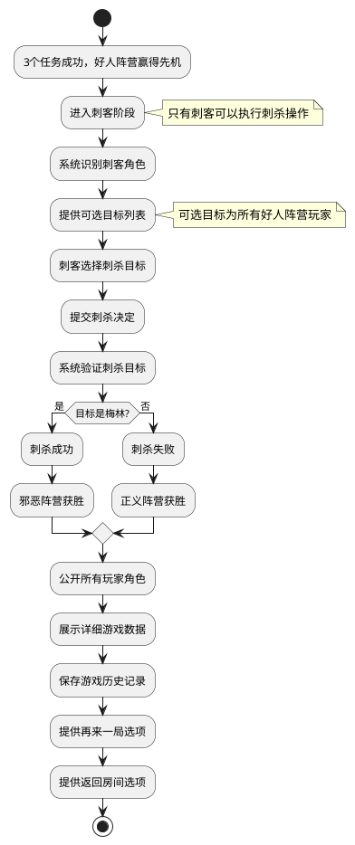

# Task 5.2.5: 刺客阶段与游戏结束处理

## 描述

设计并实现阿瓦隆游戏的刺客阶段和游戏结束处理功能。刺客阶段是阿瓦隆游戏的关键环节，允许邪恶阵营在任务失败后通过正确识别并刺杀梅林来逆转游戏结果。本任务包括刺客选择目标、结果判定、游戏结束处理以及数据统计与展示等功能。

## 验收标准

1. 实现刺客阶段功能，允许刺客角色选择一名玩家作为刺杀目标
2. 提供刺杀结果判定功能，确定最终游戏胜负
3. 实现游戏结果展示，包括所有玩家角色信息公开
4. 提供游戏数据统计功能，记录游戏关键数据
5. 实现游戏历史记录保存，便于回顾和分析
6. 支持游戏结束后的交互功能，如再来一局、返回房间等
7. 确保刺客阶段的操作安全，防止非刺客角色执行刺杀操作

## 详细任务

### 1. 刺客阶段功能实现

- 实现刺客角色识别与权限控制，确保只有刺客可以执行刺杀
- 开发刺杀目标选择界面，允许刺客从所有好人阵营玩家中选择目标
- 实现刺杀操作验证，确保选择有效且符合游戏规则
- 设计刺杀结果判定逻辑，根据是否刺杀到梅林决定最终胜负

### 2. 游戏结果处理与展示

- 实现游戏结果计算，根据任务完成情况和刺杀结果确定胜负
- 开发角色信息公开功能，在游戏结束后展示所有玩家的真实角色
- 实现游戏结果通知机制，向所有玩家广播游戏结果
- 设计特殊情况处理，如提前结束游戏时的结果处理

### 3. 游戏数据统计与分析

- 实现游戏数据收集功能，记录关键游戏数据如任务成功率、投票情况等
- 开发玩家表现统计，记录每个玩家的关键操作和决策
- 实现游戏回顾功能，允许玩家查看游戏过程中的关键节点
- 设计数据导出功能，便于后期分析和优化

### 4. 游戏历史记录与存储

- 实现游戏历史记录功能，保存完整游戏过程和结果
- 开发历史记录查询接口，支持按照不同条件查询历史游戏
- 实现数据安全存储，确保游戏数据不被篡改
- 设计数据清理策略，合理管理历史数据存储空间

### 5. 游戏结束后交互功能

- 实现"再来一局"功能，便于玩家快速开始新游戏
- 开发返回房间功能，允许玩家回到房间进行新的配置
- 实现玩家评分系统，允许玩家对本局游戏进行评价
- 设计游戏结束后的社交互动功能，如发送表情、聊天等

## 技术关键点

1. 使用事务确保刺杀操作的原子性和一致性
2. 实现安全的角色验证机制，防止非法刺杀操作
3. 设计高效的游戏数据存储结构，兼顾查询效率和存储空间
4. 采用可靠的消息推送机制，确保所有玩家收到游戏结果
5. 实现游戏状态的完整备份和恢复机制

## 刺客阶段流程图



## 游戏结果数据结构

```typescript
interface GameResult {
  gameId: string; // 游戏ID
  startTime: number; // 游戏开始时间
  endTime: number; // 游戏结束时间
  playerCount: number; // 玩家数量
  winningTeam: TeamType; // 获胜阵营 (GOOD/EVIL)
  missions: {
    success: number; // 成功任务数
    fail: number; // 失败任务数
  };
  assassinationResult?: {
    // 刺客阶段结果
    assassin: string; // 刺客玩家ID
    target: string; // 目标玩家ID
    successful: boolean; // 是否成功刺杀梅林
  };
  players: {
    [playerId: string]: {
      role: RoleType; // 玩家角色
      team: TeamType; // 玩家阵营
      isLeader: number[]; // 担任队长的轮次
      proposedTeams: number[]; // 提议的队伍次数
      joinedTeams: number[]; // 参与的任务次数
      votes: {
        // 投票记录
        approve: number; // 赞成票数
        reject: number; // 反对票数
      };
    };
  };
  gameSettings: GameSettings; // 游戏设置
  roomId: string; // 房间ID
}
```

## 工作量估计

- 刺客阶段功能实现：1.5 人天
- 游戏结果处理与展示：1 人天
- 游戏数据统计与分析：1.5 人天
- 游戏历史记录与存储：1 人天
- 游戏结束后交互功能：1 人天

总计：6 人天

## 相关文档

- [游戏核心逻辑技术方案](../技术方案.md)
- [阿瓦隆游戏规则](../../../阿瓦隆游戏规则.md)
- [Task5.2.1-游戏状态和流程管理](./Task5.2.1-游戏状态和流程管理.md)
- [Task5.2.2-角色分配与管理](./Task5.2.2-角色分配与管理.md)
- [Task5.2.4-任务执行系统](./Task5.2.4-任务执行系统.md)
