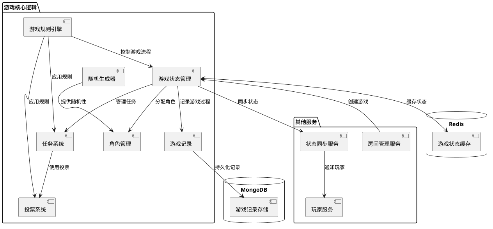
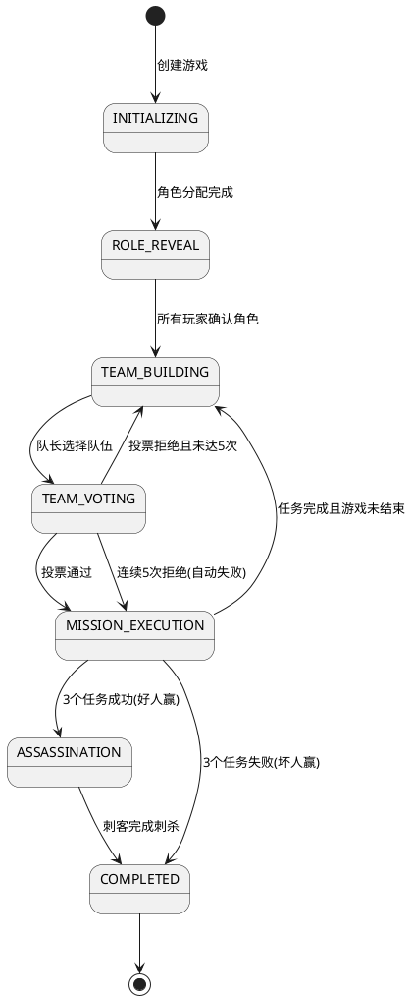
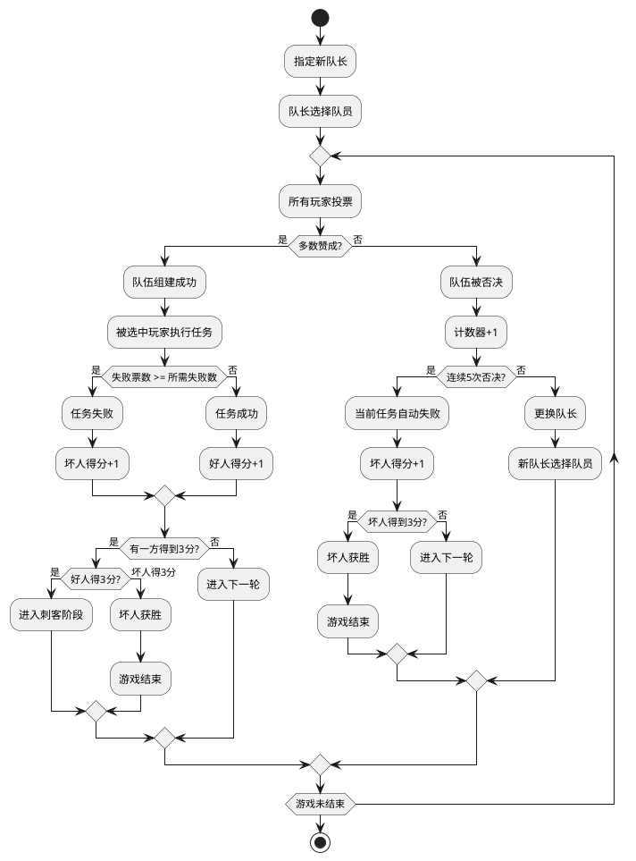
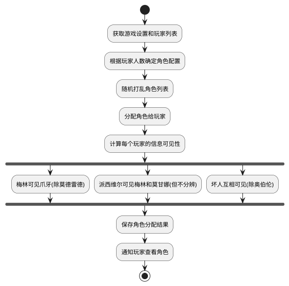
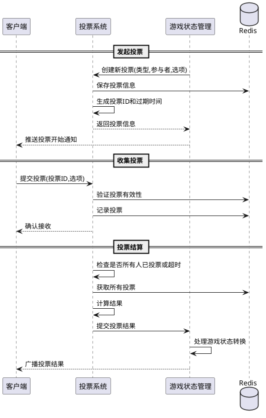
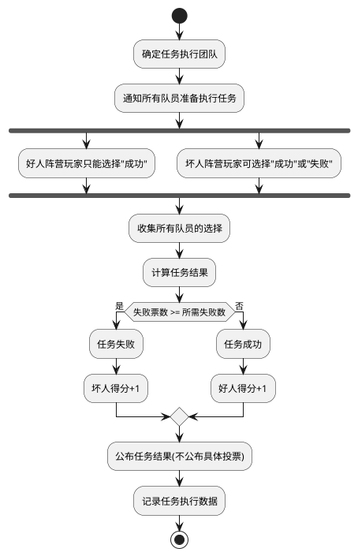
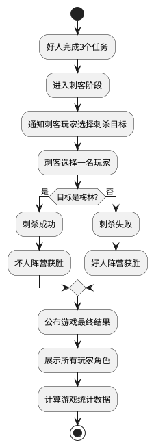
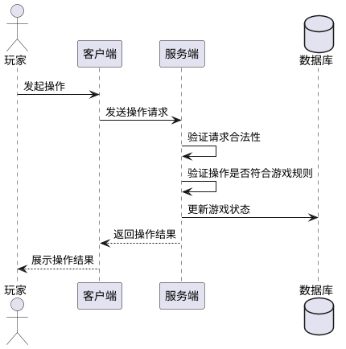

# 游戏核心逻辑技术方案

## 1. 系统设计

### 1.1 系统架构

游戏核心逻辑是整个阿瓦隆游戏的中心部分，负责实现和管理游戏规则、状态和流程。它通过与房间管理服务和状态同步服务的协作，提供完整的游戏体验。



### 1.2 技术选型

1. **编程语言与框架**：TypeScript + NestJS
2. **状态管理**：采用状态机模式，使用有限状态机（FSM）管理游戏流程
3. **随机性生成**：使用密码学安全的随机数生成器确保公平性
4. **数据存储**：
   - Redis：存储活跃游戏状态和临时数据
   - MongoDB：持久化存储游戏记录和统计数据
5. **事件系统**：基于发布-订阅模式的事件驱动架构
6. **安全性**：服务端权威模型，关键逻辑和验证均在服务端执行

## 2. 数据模型

### 2.1 游戏模型（Game）

```typescript
interface Game {
  id: string; // 游戏唯一ID
  roomId: string; // 关联的房间ID
  status: GameStatus; // 游戏状态
  players: GamePlayer[]; // 玩家列表
  currentRound: number; // 当前轮次
  leaderIndex: number; // 当前队长索引
  rounds: Round[]; // 轮次记录
  settings: GameSettings; // 游戏设置
  createdAt: Date; // 创建时间
  startedAt?: Date; // 开始时间
  endedAt?: Date; // 结束时间
  result?: GameResult; // 游戏结果
}

enum GameStatus {
  INITIALIZING = "initializing", // 初始化中
  ROLE_REVEAL = "role_reveal", // 角色展示阶段
  TEAM_BUILDING = "team_building", // 组队阶段
  TEAM_VOTING = "team_voting", // 队伍投票阶段
  MISSION_EXECUTION = "mission_execution", // 任务执行阶段
  ASSASSINATION = "assassination", // 刺杀阶段
  COMPLETED = "completed", // 游戏结束
}

interface GameResult {
  winner: TeamType; // 获胜阵营
  winReason: string; // 获胜原因
  goodTeamScore: number; // 好人阵营得分
  evilTeamScore: number; // 坏人阵营得分
  assassinTarget?: string; // 刺客刺杀目标
  mvp?: string; // 最有价值玩家
}

enum TeamType {
  GOOD = "good", // 好人阵营
  EVIL = "evil", // 坏人阵营
}
```

### 2.2 玩家模型（在游戏中）

```typescript
interface GamePlayer {
  id: string; // 玩家ID
  nickname: string; // 昵称
  avatarUrl: string; // 头像URL
  role: Role; // 角色
  team: TeamType; // 所属阵营
  isLeader: boolean; // 是否为当前队长
  leaderCount: number; // 担任队长次数
  voteRecord: VoteRecord[]; // 投票记录
  missionRecord: MissionRecord[]; // 任务记录
  visiblePlayers: string[]; // 可见玩家ID列表（基于角色能力）
  seatIndex: number; // 座位索引
}

interface Role {
  id: RoleType; // 角色类型
  name: string; // 角色名称
  team: TeamType; // 所属阵营
  description: string; // 角色描述
  abilities: Ability[]; // 角色能力
}

enum RoleType {
  MERLIN = "merlin", // 梅林
  PERCIVAL = "percival", // 派西维尔
  LOYAL_SERVANT = "loyal_servant", // 忠臣
  ASSASSIN = "assassin", // 刺客
  MORGANA = "morgana", // 莫甘娜
  MORDRED = "mordred", // 莫德雷德
  OBERON = "oberon", // 奥伯伦
  MINION = "minion", // 普通爪牙
}

interface Ability {
  type: AbilityType; // 能力类型
  target: TargetType; // 目标类型
  condition?: Condition; // 触发条件
}

enum AbilityType {
  SEE_ALIGNMENT = "see_alignment", // 看到阵营
  SEE_ROLE = "see_role", // 看到角色
  HIDE_FROM = "hide_from", // 对特定角色隐藏
  IMPERSONATE = "impersonate", // 伪装成其他角色
  ASSASSINATE = "assassinate", // 刺杀能力
}
```

### 2.3 轮次与任务模型

```typescript
interface Round {
  roundNumber: number; // 轮次编号
  requiredPlayers: number; // 所需玩家数
  failsRequired: number; // 需要多少失败票才算失败
  leaderIndex: number; // 队长玩家索引
  teamProposals: TeamProposal[]; // 队伍提议记录
  mission?: Mission; // 执行的任务
  status: RoundStatus; // 轮次状态
}

enum RoundStatus {
  TEAM_BUILDING = "team_building", // 组建队伍中
  TEAM_APPROVED = "team_approved", // 队伍已批准
  MISSION_SUCCESS = "mission_success", // 任务成功
  MISSION_FAIL = "mission_fail", // 任务失败
  REJECTED_LIMIT = "rejected_limit", // 达到拒绝上限(5次)
}

interface TeamProposal {
  proposalNumber: number; // 提议编号
  leaderIndex: number; // 提议的队长索引
  selectedPlayers: string[]; // 选中的玩家ID
  votes: Vote[]; // 投票记录
  approved: boolean; // 是否被批准
  createdAt: Date; // 创建时间
}

interface Vote {
  playerId: string; // 投票玩家ID
  approve: boolean; // 是否赞成
  timestamp: Date; // 投票时间
}

interface Mission {
  roundNumber: number; // 轮次编号
  team: string[]; // 执行队伍（玩家ID列表）
  actions: MissionAction[]; // 任务行动列表
  result: MissionResult; // 任务结果
  timestamp: Date; // 完成时间
}

enum MissionResult {
  SUCCESS = "success", // 任务成功
  FAIL = "fail", // 任务失败
}

interface MissionAction {
  playerId: string; // 执行玩家ID
  success: boolean; // 是否选择成功
  timestamp: Date; // 执行时间
}
```

## 3. 游戏状态流转

游戏核心逻辑使用有限状态机（FSM）模式管理游戏流程，确保状态转换的清晰和可控。

### 3.1 游戏状态转换图



### 3.2 任务轮次流程



## 4. 关键功能设计

### 4.1 角色分配与信息可见性

角色分配需要确保随机性和公平性，同时根据角色能力控制信息可见性。



角色信息可见性矩阵（Y 轴可以看到 X 轴）：

| 角色 \ 可见 | 梅林 | 派西维尔 | 忠臣 | 莫甘娜 | 莫德雷德 | 刺客 | 奥伯伦 | 爪牙 |
| ----------- | ---- | -------- | ---- | ------ | -------- | ---- | ------ | ---- |
| 梅林        | ✓    | ✗        | ✗    | ✓      | ✗        | ✓    | ✓      | ✓    |
| 派西维尔    | ✓    | ✓        | ✗    | ✓      | ✗        | ✗    | ✗      | ✗    |
| 忠臣        | ✗    | ✗        | ✓    | ✗      | ✗        | ✗    | ✗      | ✗    |
| 莫甘娜      | ✗    | ✗        | ✗    | ✓      | ✓        | ✓    | ✗      | ✓    |
| 莫德雷德    | ✗    | ✗        | ✗    | ✓      | ✓        | ✓    | ✗      | ✓    |
| 刺客        | ✗    | ✗        | ✗    | ✓      | ✓        | ✓    | ✗      | ✓    |
| 奥伯伦      | ✗    | ✗        | ✗    | ✗      | ✗        | ✗    | ✓      | ✗    |
| 爪牙        | ✗    | ✗        | ✗    | ✓      | ✓        | ✓    | ✗      | ✓    |

### 4.2 投票系统设计

投票系统需要确保公平性和防作弊设计，同时提供灵活的计票和结果处理机制。



### 4.3 任务执行机制

任务执行是阿瓦隆的核心环节，需要保证隐私性和结果的准确性。



### 4.4 刺客阶段设计

当好人阵营完成 3 个任务后，进入刺客阶段，这是坏人阵营的最后机会。



## 5. API 设计

### 5.1 游戏流程控制 API

```
// 创建游戏
POST /api/games
请求体:
{
  "roomId": "room123",
  "settings": { ... }
}
响应:
{
  "gameId": "game456",
  "status": "initializing"
}

// 开始游戏
POST /api/games/:gameId/start
响应:
{
  "gameId": "game456",
  "status": "role_reveal",
  "message": "游戏已开始，角色分配完成"
}

// 获取游戏状态
GET /api/games/:gameId
响应:
{
  "gameId": "game456",
  "status": "team_building",
  "currentRound": 1,
  "leaderIndex": 2,
  "goodScore": 0,
  "evilScore": 0,
  ...
}

// 获取玩家游戏信息（包含角色和可见信息）
GET /api/games/:gameId/players/:playerId
响应:
{
  "playerId": "player789",
  "role": {
    "id": "merlin",
    "name": "梅林",
    "team": "good",
    "description": "..."
  },
  "visiblePlayers": [
    {
      "playerId": "player123",
      "info": {
        "team": "evil"
      }
    },
    ...
  ]
}
```

### 5.2 WebSocket 事件

```javascript
// 游戏事件（服务器 -> 客户端）
socket.on('game:created', (data) => { ... });
socket.on('game:started', (data) => { ... });
socket.on('game:roleRevealed', (data) => { ... });
socket.on('game:leaderChanged', (data) => { ... });
socket.on('game:teamProposed', (data) => { ... });
socket.on('game:teamVoteStarted', (data) => { ... });
socket.on('game:teamVoteEnded', (data) => { ... });
socket.on('game:missionStarted', (data) => { ... });
socket.on('game:missionEnded', (data) => { ... });
socket.on('game:assassinationStarted', (data) => { ... });
socket.on('game:ended', (data) => { ... });

// 玩家操作（客户端 -> 服务器）
socket.emit('game:confirmRole', { gameId, playerId });
socket.emit('game:proposeTeam', { gameId, playerId, selectedPlayers });
socket.emit('game:voteTeam', { gameId, playerId, approve });
socket.emit('game:executeMission', { gameId, playerId, success });
socket.emit('game:assassinate', { gameId, playerId, targetId });
```

### 5.3 游戏设置 API

```
// 获取默认游戏设置
GET /api/games/settings/default?playerCount=7
响应:
{
  "playerCount": 7,
  "roles": [
    "merlin", "percival", "loyal_servant", "loyal_servant",
    "assassin", "morgana", "mordred"
  ],
  "missions": [
    {"round": 1, "requiredPlayers": 2, "failsRequired": 1},
    {"round": 2, "requiredPlayers": 3, "failsRequired": 1},
    {"round": 3, "requiredPlayers": 3, "failsRequired": 1},
    {"round": 4, "requiredPlayers": 4, "failsRequired": 2},
    {"round": 5, "requiredPlayers": 4, "failsRequired": 1}
  ]
}

// 验证自定义游戏设置
POST /api/games/settings/validate
请求体:
{
  "playerCount": 7,
  "roles": [ ... ],
  "missions": [ ... ]
}
响应:
{
  "valid": true,
  "errors": []
}
```

## 6. 安全与防作弊

### 6.1 服务端权威模型

所有游戏逻辑和验证均在服务端执行，客户端只负责展示和输入。这种设计可以防止客户端修改游戏数据或者规避游戏规则。



### 6.2 角色信息保护

角色信息是游戏中最敏感的数据，需要特别保护：

1. 玩家角色信息加密传输
2. 客户端仅存储当前玩家的角色信息
3. 可见信息基于服务端计算，不在客户端完整存储所有玩家角色

### 6.3 防作弊措施

1. **任务执行验证**：

   - 好人阵营玩家的"任务失败"选择会被服务端自动纠正为"任务成功"
   - 非队员的任务执行请求会被拒绝

2. **操作频率限制**：

   - 限制玩家操作频率，防止 DoS 攻击
   - 对同一玩家的快速重复操作进行过滤

3. **客户端输入验证**：

   - 验证数据格式和范围
   - 检查操作合法性和时序

4. **游戏状态防篡改**：
   - 使用数字签名保护关键游戏数据
   - 定期验证客户端与服务端状态一致性

### 6.4 日志和审计

详细记录所有关键操作，包括：

- 角色分配记录
- 每次投票详情
- 任务执行记录
- 玩家所有关键操作

这些日志可用于：

- 游戏回放功能
- 异常行为检测
- 问题排查和分析

## 7. 性能考虑

### 7.1 状态管理优化

1. **增量更新**：

   - 只发送变更的状态部分，减少网络传输量
   - 客户端状态合并机制，降低带宽需求

2. **延迟加载**：
   - 非关键游戏数据按需加载
   - 历史记录和统计信息延迟查询

### 7.2 资源使用

1. **内存占用**：

   - 单个游戏实例内存占用 < 5MB
   - 优化数据结构减少冗余信息

2. **服务器容量**：
   - 每台标准服务器支持 500+ 并发游戏
   - 横向扩展支持更高并发需求

### 7.3 性能指标

1. **响应时间**：

   - 游戏操作响应时间 < 200ms (95%分位数)
   - 状态同步延迟 < 300ms (95%分位数)

2. **并发能力**：
   - 单实例支持 500+ 并发游戏
   - 支持 5000+ 同时在线玩家

## 8. 扩展性设计

### 8.1 游戏变体支持

设计灵活的规则引擎，支持未来添加游戏变体：

1. **角色能力模块化**：

   - 使用策略模式实现角色能力
   - 支持新角色的容易添加

2. **规则配置化**：
   - 游戏规则可通过配置文件调整
   - 支持"湖中仙女"等扩展规则

### 8.2 功能扩展接口

1. **观察者模式**：

   - 支持添加游戏旁观功能
   - 便于实现直播和回放

2. **统计与分析**：
   - 预留数据分析接口
   - 支持玩家数据统计和排行
