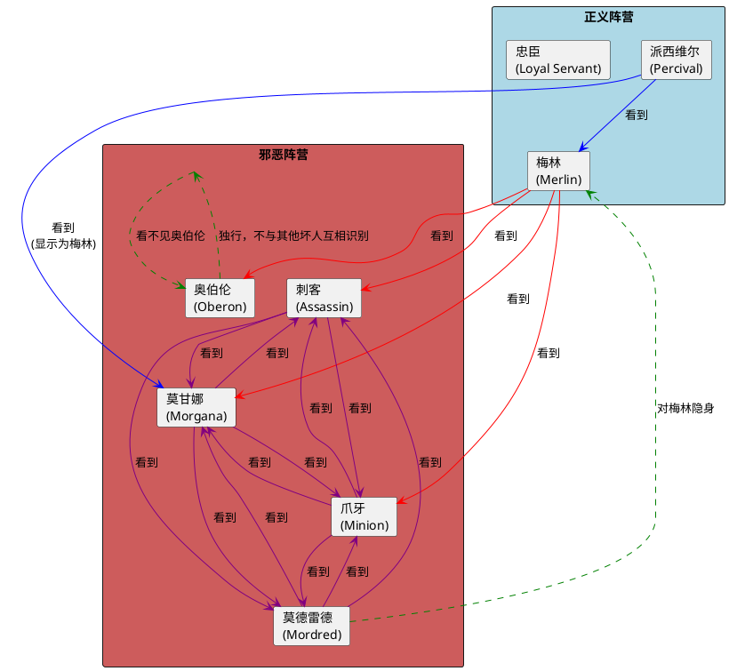
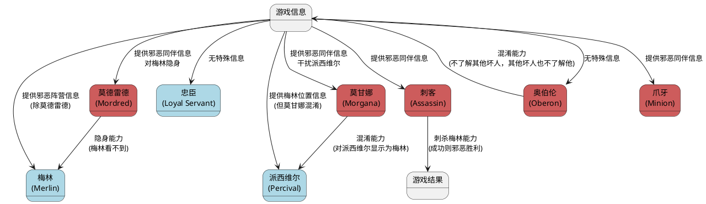
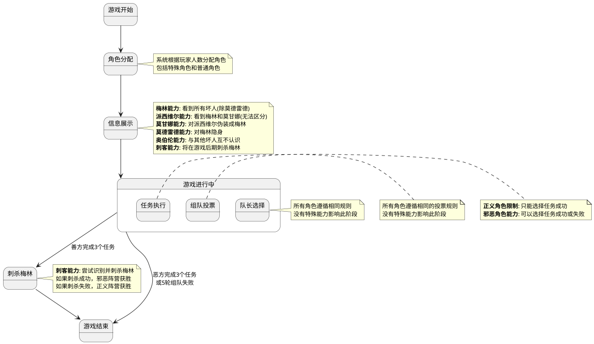
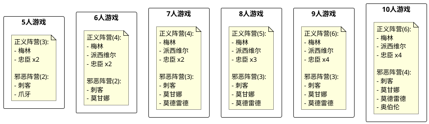
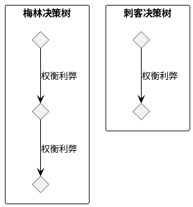

# 阿瓦隆角色能力关系图

## 角色信息可见性关系

下图展示了阿瓦隆游戏中各角色之间的信息可见性关系，即哪些角色能够看到其他角色的身份或特殊信息。

## 角色能力作用关系

下图展示了阿瓦隆游戏中各角色特殊能力的作用关系，包括信息获取和游戏结果影响。

## 游戏不同阶段中角色能力的应用

下图展示了在阿瓦隆游戏的不同阶段中，各角色特殊能力的应用时机和影响。

## 角色对游戏信息的感知矩阵

下表展示了各个角色对其他角色身份信息的感知能力。"Y"表示可以看到，"N"表示看不到，"P"表示部分信息或混淆。

| 角色\感知对象 | 梅林 | 派西维尔 | 忠臣 | 刺客 | 莫甘娜 | 莫德雷德 | 奥伯伦 | 爪牙 |
| ------------- | ---- | -------- | ---- | ---- | ------ | -------- | ------ | ---- |
| 梅林          | Y    | N        | N    | Y    | Y      | N        | Y      | Y    |
| 派西维尔      | Y    | Y        | N    | N    | P      | N        | N      | N    |
| 忠臣          | N    | N        | N    | N    | N      | N        | N      | N    |
| 刺客          | N    | N        | N    | Y    | Y      | Y        | N      | Y    |
| 莫甘娜        | N    | N        | N    | Y    | Y      | Y        | N      | Y    |
| 莫德雷德      | N    | N        | N    | Y    | Y      | Y        | N      | Y    |
| 奥伯伦        | N    | N        | N    | N    | N      | N        | Y      | N    |
| 爪牙          | N    | N        | N    | Y    | Y      | Y        | N      | Y    |

_注释:_

- Y: 可以看到该角色身份
- N: 看不到该角色身份
- P: 部分信息/混淆（例如派西维尔看到莫甘娜会显示为梅林，无法区分）

## 不同玩家人数下的角色配置

以下是根据不同玩家人数（5-10 人）的推荐角色配置：

## 游戏中角色能力的决策树

下图展示了在游戏不同阶段，角色能力如何影响决策过程：

