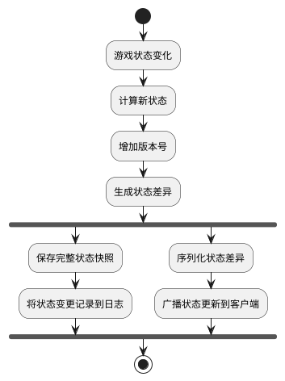

# Task 5.3.1: 状态数据模型与版本控制

## 描述

设计并实现游戏状态数据模型和版本控制系统，为阿瓦隆游戏提供高效、一致的状态同步基础。该任务包括定义状态数据结构、实现状态版本管理、设计增量更新机制和开发状态序列化/反序列化功能。

## 验收标准

1. 完成游戏状态数据模型设计，支持所有阿瓦隆游戏状态和操作
2. 实现状态版本控制机制，能够跟踪和管理状态变更历史
3. 设计增量状态更新机制，减少数据传输量
4. 实现高效的状态序列化和反序列化，支持快速的状态保存和恢复
5. 提供状态验证机制，确保数据完整性和一致性
6. 确保状态模型设计支持断线重连和状态恢复场景
7. 单元测试覆盖率不低于 85%

## 详细任务

### 1. 状态数据模型设计

- 设计游戏核心状态模型，包含游戏阶段、玩家信息、角色分配、任务状态等
- 实现可观察状态与隐藏状态分离，确保信息安全
- 设计玩家视图状态模型，根据角色显示不同信息
- 开发状态快照功能，支持完整状态保存

### 2. 版本控制系统实现

- 实现状态版本号机制，每次状态变更递增版本号
- 开发状态变更日志系统，记录所有状态变更及原因
- 实现版本对比功能，用于计算状态差异
- 设计版本冲突解决策略，处理并发更新问题

### 3. 增量更新机制

- 实现状态差异计算算法，生成最小变更集
- 设计增量更新数据结构，高效表示状态变化
- 开发状态补丁应用机制，将增量更新应用到当前状态
- 实现更新批处理，合并短时间内的多次小更新

### 4. 序列化与反序列化

- 实现高效的状态序列化机制，支持完整状态和增量状态
- 开发压缩算法，减少序列化数据大小
- 设计反序列化验证逻辑，防止无效或恶意数据
- 兼容不同版本的状态数据结构，支持向前兼容

### 5. 状态一致性与验证

- 实现状态校验和机制，验证状态完整性
- 开发状态矫正算法，修复不一致的状态
- 设计状态回滚机制，支持错误恢复
- 实现定期状态对账，确保长期一致性

## 技术关键点

1. 使用不可变数据结构（Immutable.js）减少状态管理复杂度
2. 采用类似 Git 的版本控制模型管理状态变更历史
3. 实现高效的 JSON 差异算法，计算最小状态差异
4. 使用 Protocol Buffers 或类似技术实现高效序列化
5. 利用 TypeScript 类型系统确保状态数据类型安全

## 工作量估计

- 状态数据模型设计：2 人天
- 版本控制系统实现：1.5 人天
- 增量更新机制：2 人天
- 序列化与反序列化：1.5 人天
- 状态一致性与验证：1 人天

总计：8 人天

## 相关文档

- [状态同步服务概述](./README.md)
- [游戏核心逻辑技术方案](../Story5.2_游戏核心逻辑/技术方案.md)

## 状态数据结构示例

```typescript
// 游戏状态数据结构示例
interface GameState {
  gameId: string;
  version: number;
  timestamp: number;
  phase: GamePhase;
  players: Player[];
  currentRound: number;
  missions: Mission[];
  votes: Vote[];
  teamProposal?: TeamProposal;
  leaderIndex: number;
  consecutiveRejects: number;
  gameResult?: GameResult;
}

// 玩家状态
interface Player {
  id: string;
  name: string;
  isOnline: boolean;
  role?: Role; // 对于该玩家可见
  team?: Team; // 对于该玩家可见
  visibleRoles?: {
    // 该玩家可见的其他玩家角色
    [playerId: string]: {
      role?: Role;
      team?: Team;
    };
  };
}

// 版本控制元数据
interface StateVersion {
  version: number;
  timestamp: number;
  changeType: ChangeType;
  changedBy: string; // playerId 或 system
  changes: StateChange[];
  checksum: string; // 状态校验和
}
```

## 状态同步流程图


