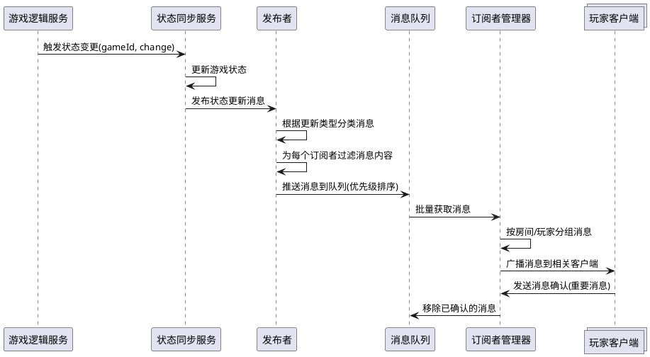

# Task5.3.2 实时广播与订阅机制

## 1. 任务描述

为游戏状态同步服务设计和实现实时广播与订阅机制，确保游戏状态变化能够高效、及时地传递给所有相关客户端。该机制需要支持房间级别的消息发布与订阅，支持定向和广播消息，并确保消息传递的可靠性和实时性。

## 2. 验收标准

1. 实现房间级别的消息发布订阅系统，支持至少 100 个并发房间
2. 消息广播延迟不超过 100ms（在正常网络条件下）
3. 支持针对特定玩家、特定角色或全房间的消息发送
4. 提供消息优先级机制，确保关键状态更新优先处理
5. 实现消息确认机制，确保重要消息被所有目标客户端接收
6. 提供简洁易用的 API 接口，便于游戏逻辑服务调用
7. 支持消息过滤，根据玩家角色和权限过滤敏感信息
8. 支持至少每秒 10 条的消息吞吐量（单房间）

## 3. 详细任务

### 3.1 设计订阅模型

1. 设计基于房间 ID 的订阅模型，支持客户端订阅特定房间的状态更新
2. 实现订阅权限控制，确保玩家只能订阅自己参与的房间
3. 设计消息类型系统，区分不同类型的状态更新（如游戏进度更新、玩家操作、系统消息等）
4. 定义消息格式，包含必要的元数据（时间戳、版本号、发送者、消息类型等）

### 3.2 实现发布者（Publisher）

1. 实现中央消息发布器，负责接收状态变更并发布消息
2. 支持消息分发策略，如广播、多播和单播
3. 实现消息过滤逻辑，根据接收者身份过滤信息
4. 设计消息缓冲和批处理机制，优化高频率消息场景
5. 实现消息优先级队列，确保关键消息优先处理

### 3.3 实现订阅者（Subscriber）

1. 设计客户端订阅器，支持订阅和取消订阅操作
2. 实现消息接收和处理逻辑，包括消息解析和状态应用
3. 设计消息确认机制，支持重要消息的确认回执
4. 实现订阅状态管理，跟踪每个客户端的订阅信息
5. 设计重连后的订阅恢复机制

### 3.4 优化传输效率

1. 实现消息压缩，减少网络传输数据量
2. 设计增量更新机制，只传输状态变化部分
3. 优化 WebSocket 通信配置，减少延迟
4. 实现消息合并策略，在适当情况下合并多个消息
5. 设计自适应的消息发送频率控制机制

### 3.5 实现消息可靠性

1. 设计消息持久化机制，确保临时断线期间的消息不丢失
2. 实现消息重传机制，处理未收到确认的重要消息
3. 设计消息序列号和排序机制，确保消息按正确顺序处理
4. 实现心跳检测，及时发现连接异常
5. 设计消息日志系统，记录关键消息传递过程，便于问题排查

## 4. 技术要点

1. 使用 Socket.IO 实现 WebSocket 通信，利用其房间和命名空间特性
2. 设计基于 Redis 的发布订阅机制，支持水平扩展
3. 采用 MessagePack 进行消息序列化，提高传输效率
4. 使用 TypeScript 强类型定义消息格式，确保类型安全
5. 实现节流和防抖机制，避免消息风暴
6. 使用 LRU 缓存存储最近的消息，支持新连接的快速同步

## 5. 工作量估计

| 子任务         | 预估工作量（人天） |
| -------------- | ------------------ |
| 设计订阅模型   | 1                  |
| 实现发布者     | 2                  |
| 实现订阅者     | 2                  |
| 优化传输效率   | 1.5                |
| 实现消息可靠性 | 1.5                |
| 测试和调优     | 2                  |
| **总计**       | **10**             |

## 6. 相关文档

- [状态同步服务技术方案](./技术方案.md)
- [Task5.3.1\_状态数据模型与版本控制](./Task5.3.1_状态数据模型与版本控制.md)
- [WebSocket 服务设计文档](../../Epic4_服务器架构设计/Story4.2_WebSocket服务/技术方案.md)

## 7. 实时广播流程示例



## 8. 订阅管理结构

```typescript
// 订阅信息接口
interface Subscription {
  clientId: string; // 客户端ID
  gameId: string; // 游戏房间ID
  playerId: string; // 玩家ID
  role?: string; // 玩家角色(可选)
  lastMessageId?: string; // 最后接收的消息ID
  filters?: string[]; // 消息过滤器
  createdAt: number; // 订阅创建时间
  updatedAt: number; // 最后活动时间
}

// 消息接口
interface StateUpdateMessage {
  id: string; // 消息唯一ID
  gameId: string; // 目标游戏ID
  type: MessageType; // 消息类型
  priority: number; // 优先级(1-5)
  version: number; // 状态版本号
  payload: any; // 消息内容
  targets?: string[]; // 目标接收者(为空表示广播)
  requireAck: boolean; // 是否需要确认
  timestamp: number; // 时间戳
}

// 消息类型枚举
enum MessageType {
  GAME_STATE_FULL, // 完整游戏状态
  GAME_STATE_DELTA, // 增量状态更新
  PLAYER_ACTION, // 玩家操作
  SYSTEM_EVENT, // 系统事件
  CHAT_MESSAGE, // 聊天消息
  ERROR_NOTIFICATION, // 错误通知
}
```
