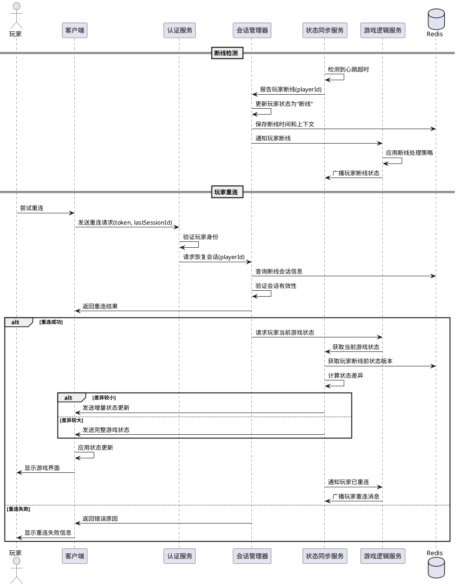

# Task5.3.3 断线重连与状态恢复

## 1. 任务描述

设计并实现阿瓦隆游戏的断线重连与状态恢复机制，确保玩家在网络连接中断后能够快速重新加入游戏，并恢复到最新的游戏状态，保持游戏体验的连续性。断线重连机制必须能够处理各种网络异常情况，并在重连成功后同步玩家错过的游戏状态变更。

## 2. 验收标准

1. 断线玩家重连后，能在 3 秒内恢复到最新游戏状态（在正常网络条件下）
2. 支持玩家在不同设备上重连并恢复游戏状态
3. 在玩家断线期间，系统能够保持其游戏席位最少 5 分钟
4. 处理断线期间累积的状态变更，确保玩家重连后获得完整的游戏进程信息
5. 支持关键游戏阶段（如投票、任务执行等）的状态保持和恢复
6. 能够处理多人同时断线和重连的场景
7. 断线重连过程中，保证游戏数据的一致性和安全性
8. 提供断线重连状态监控和统计功能

## 3. 详细任务

### 3.1 会话管理

1. 设计玩家会话数据结构，包含连接信息、认证状态和上下文信息
2. 实现会话创建、更新和过期机制，支持跨设备会话管理
3. 设计会话状态持久化方案，确保服务重启后会话信息不丢失
4. 实现会话超时和清理机制，合理释放资源
5. 开发会话认证和安全机制，确保只有合法玩家可以重连

### 3.2 断线检测与处理

1. 实现基于心跳的连接状态检测机制，及时发现断线情况
2. 设计断线事件处理流程，包括状态标记和通知其他玩家
3. 实现断线玩家的游戏状态保持策略，确保游戏可以继续进行
4. 开发断线玩家的角色临时处理机制（如自动跳过回合或 AI 代替）
5. 设计不同游戏阶段的断线处理策略

### 3.3 重连机制

1. 实现玩家重连请求处理流程，包括身份验证和会话恢复
2. 设计重连协议，支持客户端传递上下文信息（如上次断线时间、版本号等）
3. 开发重连状态匹配算法，确定玩家应该重连到哪个游戏和房间
4. 实现重连成功后的通知机制，告知其他玩家
5. 处理重连失败情况，提供合适的错误信息和恢复建议

### 3.4 状态同步与恢复

1. 设计状态恢复策略，根据断线时长和状态差异选择不同的同步方式
2. 实现状态差异计算和增量同步机制，优化网络传输
3. 开发状态合并算法，处理断线期间的游戏状态变更
4. 设计断线期间关键事件的回放机制，让玩家了解错过的游戏进程
5. 实现状态验证机制，确保恢复后的游戏状态一致性

### 3.5 异常情况处理

1. 设计网络波动处理策略，减少频繁断线重连的影响
2. 实现长时间断线的特殊处理，如超过保留时间的处理方式
3. 开发服务端重启后的玩家重连处理机制
4. 设计并发重连情况的处理策略，避免状态混乱
5. 实现重连过程中的错误恢复机制

## 4. 技术要点

1. 使用 Redis 存储会话信息和临时状态数据，支持分布式部署
2. 基于 Socket.IO 的重连机制，利用其内置的重连和房间功能
3. 设计高效的状态差异计算算法，减少重连时的数据传输量
4. 使用版本控制和状态快照结合的方式管理游戏状态
5. 实现可靠的分布式锁机制，处理并发重连请求
6. 采用事件溯源模式记录关键游戏事件，支持状态重建

## 5. 工作量估计

| 子任务         | 预估工作量（人天） |
| -------------- | ------------------ |
| 会话管理       | 2                  |
| 断线检测与处理 | 2                  |
| 重连机制       | 2.5                |
| 状态同步与恢复 | 3                  |
| 异常情况处理   | 1.5                |
| 测试和调优     | 2                  |
| **总计**       | **13**             |

## 6. 相关文档

- [状态同步服务技术方案](./技术方案.md)
- [Task5.3.2\_实时广播与订阅机制](./Task5.3.2_实时广播与订阅机制.md)
- [Task5.3.1\_状态数据模型与版本控制](./Task5.3.1_状态数据模型与版本控制.md)

## 7. 断线重连流程



## 8. 会话数据结构

```typescript
// 玩家会话数据
interface PlayerSession {
  sessionId: string; // 会话唯一标识
  playerId: string; // 玩家ID
  gameId?: string; // 当前游戏ID
  roomId?: string; // 当前房间ID
  deviceInfo: {
    // 设备信息
    deviceId: string; // 设备ID
    platform: string; // 平台(iOS/Android/Web)
    clientVersion: string; // 客户端版本
  };
  connectionState: ConnectionState; // 连接状态
  stateVersion: number; // 最后同步的状态版本
  lastActiveTime: number; // 最后活动时间
  disconnectTime?: number; // 断线时间
  reconnectCount: number; // 重连次数
  authToken: string; // 认证令牌
  expiresAt: number; // 会话过期时间
}

// 连接状态枚举
enum ConnectionState {
  CONNECTED, // 已连接
  DISCONNECTED, // 已断线
  RECONNECTING, // 重连中
  EXPIRED, // 已过期
}

// 重连请求
interface ReconnectRequest {
  playerId: string; // 玩家ID
  sessionId?: string; // 上一个会话ID
  authToken: string; // 认证令牌
  stateVersion?: number; // 客户端当前状态版本
  timestamp: number; // 请求时间戳
}

// 重连响应
interface ReconnectResponse {
  success: boolean; // 重连是否成功
  sessionId?: string; // 新的会话ID
  gameId?: string; // 游戏ID
  roomId?: string; // 房间ID
  stateUpdateType: "FULL" | "DELTA"; // 状态更新类型
  reconnectToken?: string; // 重连令牌(用于后续短时间重连)
  errorCode?: number; // 错误代码
  errorMessage?: string; // 错误消息
}
```
