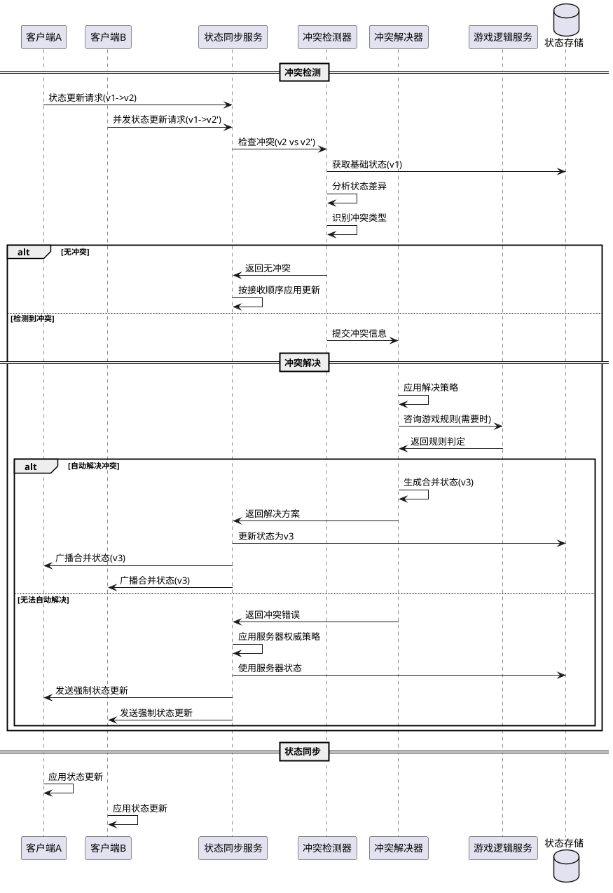

# Task5.3.4 冲突检测与解决机制

## 1. 任务描述

设计并实现阿瓦隆游戏的状态冲突检测与解决机制，确保在多客户端环境下游戏状态的一致性和准确性。当多个玩家同时进行操作或网络延迟导致状态更新顺序混乱时，系统需要能够检测出潜在的冲突，并采用合适的策略自动解决这些冲突，保持游戏的公平性和连续性。

## 2. 验收标准

1. 能够检测出至少 95%的状态冲突情况，包括并发操作和顺序错乱
2. 在检测到冲突后，系统能在 200 毫秒内完成冲突解决（在标准网络条件下）
3. 冲突解决规则符合游戏逻辑，确保游戏规则的正确执行
4. 支持不同类型冲突的差异化处理策略
5. 解决冲突后，所有客户端状态能够快速收敛到一致
6. 实现冲突日志记录机制，便于后期分析和优化
7. 冲突解决过程对玩家透明，不影响正常游戏体验
8. 系统能承受每秒至少 5 次的并发冲突解决

## 3. 详细任务

### 3.1 冲突类型识别与分类

1. 设计冲突类型分类体系，识别常见的冲突场景
2. 实现操作时序冲突检测算法，解决操作顺序不一致问题
3. 开发状态不一致冲突检测，处理客户端和服务器状态差异
4. 设计并发操作冲突检测，解决多玩家同时操作的冲突
5. 实现特殊游戏阶段（如投票、任务分配）的冲突检测逻辑

### 3.2 冲突检测机制

1. 实现基于版本号的冲突检测，跟踪状态变更序列
2. 设计状态哈希比对机制，快速检测状态不一致
3. 开发操作日志分析系统，识别可能的冲突操作
4. 实现定期状态校验过程，主动发现潜在冲突
5. 设计异常状态转换检测，识别违反游戏规则的状态变更

### 3.3 冲突解决策略

1. 实现基于时间戳的优先级解决策略，先到先得
2. 设计基于规则的冲突解决机制，根据游戏规则自动决策
3. 开发服务器权威策略，当冲突无法自动解决时以服务器决策为准
4. 实现操作合并机制，尝试保留多个操作的意图
5. 设计冲突升级处理，对于复杂冲突提供人工干预接口

### 3.4 状态同步与修复

1. 设计冲突解决后的状态广播机制，确保所有客户端更新
2. 实现增量修复策略，只更新发生冲突的状态部分
3. 开发回滚和重放机制，必要时回滚到无冲突状态再重放操作
4. 设计客户端状态自修复机制，处理轻微的状态差异
5. 实现强制同步触发器，在检测到严重不一致时触发全量同步

### 3.5 监控与优化

1. 设计冲突监控指标体系，跟踪冲突发生率和解决效率
2. 实现冲突日志记录和分析工具，支持问题排查
3. 开发冲突热点分析，识别频繁发生冲突的游戏环节
4. 设计自适应冲突解决策略，根据历史数据优化解决方案
5. 实现性能基准测试，评估冲突解决对系统性能的影响

## 4. 技术要点

1. 使用向量时钟(Vector Clock)或类似机制跟踪分布式操作顺序
2. 采用乐观并发控制(Optimistic Concurrency Control)减少锁定
3. 实现基于事件溯源(Event Sourcing)的状态重建机制
4. 使用结构化合并(Structural Merge)算法处理状态差异
5. 设计基于 CRDT(Conflict-free Replicated Data Types)的自动合并数据结构
6. 采用有限状态机(FSM)验证状态转换的合法性

## 5. 工作量估计

| 子任务             | 预估工作量（人天） |
| ------------------ | ------------------ |
| 冲突类型识别与分类 | 2                  |
| 冲突检测机制       | 3                  |
| 冲突解决策略       | 3.5                |
| 状态同步与修复     | 2.5                |
| 监控与优化         | 2                  |
| 测试和调优         | 3                  |
| **总计**           | **16**             |

## 6. 相关文档

- [状态同步服务技术方案](./技术方案.md)
- [Task5.3.1\_状态数据模型与版本控制](./Task5.3.1_状态数据模型与版本控制.md)
- [Task5.3.3\_断线重连与状态恢复](./Task5.3.3_断线重连与状态恢复.md)
- [游戏核心逻辑技术方案](../Story5.2_游戏核心逻辑/技术方案.md)

## 7. 冲突检测与解决流程



## 8. 冲突处理数据结构

```typescript
// 冲突类型枚举
enum ConflictType {
  CONCURRENT_MODIFICATION, // 并发修改冲突
  ORDERING_CONFLICT, // 操作顺序冲突
  STATE_INCONSISTENCY, // 状态不一致冲突
  RULE_VIOLATION, // 规则违反冲突
  VERSION_CONFLICT, // 版本冲突
}

// 冲突信息
interface ConflictInfo {
  id: string; // 冲突ID
  type: ConflictType; // 冲突类型
  gameId: string; // 游戏ID
  baseVersion: number; // 基础版本
  conflictingOperations: {
    // 冲突操作
    playerId: string; // 玩家ID
    operation: any; // 操作内容
    timestamp: number; // 操作时间戳
    clientVersion: number; // 客户端状态版本
  }[];
  affectedStateKeys: string[]; // 受影响的状态键
  detectedAt: number; // 检测时间
  gamePhase: string; // 游戏阶段
  severity: "LOW" | "MEDIUM" | "HIGH"; // 冲突严重程度
}

// 冲突解决策略
enum ResolutionStrategy {
  TIMESTAMP_PRIORITY, // 时间戳优先
  SERVER_AUTHORITY, // 服务器权威
  MERGE_OPERATIONS, // 合并操作
  RULE_BASED, // 基于规则
  ROLLBACK_REPLAY, // 回滚重放
  MANUAL_RESOLUTION, // 人工解决
}

// 冲突解决结果
interface ConflictResolution {
  conflictId: string; // 冲突ID
  resolved: boolean; // 是否已解决
  strategy: ResolutionStrategy; // 采用的解决策略
  resultState?: any; // 解决后的状态
  winningOperation?: string; // 采纳的操作(如果适用)
  resolutionTime: number; // 解决耗时(毫秒)
  requiresClientSync: boolean; // 是否需要客户端同步
  logDetail: string; // 解决过程详情
}

// 状态差异比较结果
interface StateDiff {
  baseVersion: number; // 基础版本
  paths: {
    // 变更路径
    path: string; // 状态路径
    oldValue: any; // 旧值
    newValue: any; // 新值
    changedBy: string[]; // 由哪些操作改变
    conflicted: boolean; // 是否有冲突
  }[];
  hasConflicts: boolean; // 是否包含冲突
}
```
