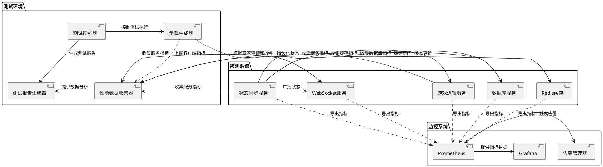

# Task5.3.5 性能优化和压力测试

## 1. 任务描述

针对阿瓦隆游戏状态同步服务进行全面的性能优化和压力测试，确保系统在高并发、高负载情况下能够保持稳定运行，并提供流畅的游戏体验。该任务包括识别性能瓶颈、实施优化措施、设计和执行压力测试方案，以及建立性能监控体系，确保服务满足游戏运营的需求。

## 2. 验收标准

1. 状态同步服务能够支持至少 100 个并发游戏房间，每个房间 10 名玩家
2. 单房间状态更新延迟在正常网络条件下不超过 100ms
3. 系统在满负荷运行时 CPU 利用率不超过 70%，内存使用合理
4. 网络带宽利用率优化，平均每个客户端连接带宽消耗不超过 10KB/s
5. 断线重连时间不超过 3 秒（包括状态恢复）
6. 压力测试结果显示系统在 150%预期负载下仍能稳定运行至少 2 小时
7. 建立完整的性能监控体系，覆盖关键性能指标
8. 编写详细的性能测试报告和优化建议文档

## 3. 详细任务

### 3.1 性能分析与瓶颈识别

1. 使用性能分析工具识别代码中的性能热点和瓶颈
2. 分析数据结构和算法效率，找出可优化点
3. 评估网络通信模式，识别不必要的通信开销
4. 检查数据库查询和缓存使用情况，找出优化空间
5. 分析内存使用模式，识别潜在的内存泄漏和过度分配

### 3.2 服务端优化

1. 优化状态差异计算算法，减少 CPU 开销
2. 实现高效的内存管理策略，减少垃圾回收压力
3. 优化数据库访问模式，合理使用索引和查询优化
4. 实现多层缓存架构，减少重复计算和数据库访问
5. 应用异步处理和任务队列，提高并发处理能力
6. 优化服务间通信，减少网络开销和延迟

### 3.3 网络传输优化

1. 实现高效的消息批处理和合并策略，减少通信次数
2. 优化消息序列化格式，减小传输数据大小
3. 实现消息压缩机制，进一步减少带宽使用
4. 设计智能的状态过滤机制，只传输必要信息
5. 优化 WebSocket 配置，减少连接开销和提高吞吐量
6. 实现自适应传输策略，根据网络条件调整传输方式

### 3.4 压力测试方案设计

1. 设计模拟真实玩家行为的测试脚本
2. 建立可扩展的压力测试环境，支持模拟大量并发连接
3. 设计不同场景的测试用例（正常负载、峰值负载、长时间运行等）
4. 准备性能指标收集和分析工具
5. 制定压力测试执行计划和评估标准

### 3.5 压力测试执行与分析

1. 执行基准测试，建立性能基线
2. 进行梯度负载测试，逐步增加负载直至系统极限
3. 执行长时间稳定性测试，验证系统在持续负载下的表现
4. 模拟网络异常、服务崩溃等故障场景，测试系统恢复能力
5. 收集并分析测试数据，生成测试报告
6. 根据测试结果提出进一步优化建议

### 3.6 性能监控与警报系统

1. 设计关键性能指标监控方案
2. 实现实时性能数据收集和可视化
3. 建立性能异常警报机制，及时发现问题
4. 开发性能历史数据分析工具，支持趋势分析
5. 设计自动化性能测试和报告生成系统

## 4. 技术要点

1. 使用 Node.js 性能分析工具（如 Clinic.js, flame graphs）识别性能热点
2. 应用 Immutable.js 等不可变数据结构减少内存分配和提高比较效率
3. 利用 Redis 缓存和优化查询模式提高数据访问速度
4. 采用 MessagePack 或 Protocol Buffers 优化数据序列化
5. 使用 Artillery 或 JMeter 等工具进行压力测试
6. 应用 Prometheus + Grafana 监控系统收集和可视化性能指标
7. 实现基于 Node.js 流(Stream)的高效数据处理

## 5. 工作量估计

| 子任务             | 预估工作量（人天） |
| ------------------ | ------------------ |
| 性能分析与瓶颈识别 | 2                  |
| 服务端优化         | 4                  |
| 网络传输优化       | 3                  |
| 压力测试方案设计   | 2                  |
| 压力测试执行与分析 | 3                  |
| 性能监控与警报系统 | 2                  |
| **总计**           | **16**             |

## 6. 相关文档

- [状态同步服务技术方案](./技术方案.md)
- [Task5.3.2\_实时广播与订阅机制](./Task5.3.2_实时广播与订阅机制.md)
- [Task5.3.3\_断线重连与状态恢复](./Task5.3.3_断线重连与状态恢复.md)
- [微服务性能优化指南](../../Epic4_服务器架构设计/性能优化指南.md)

## 7. 性能测试架构

## 8. 性能指标与监控内容

| 分类           | 指标           | 说明                                 | 目标值   |
| -------------- | -------------- | ------------------------------------ | -------- |
| **响应时间**   | 状态同步延迟   | 从状态变更到客户端接收的时间         | <100ms   |
|                | 操作响应时间   | 从客户端发出操作到收到确认的时间     | <200ms   |
|                | 重连恢复时间   | 客户端重连后恢复游戏状态的时间       | <3s      |
| **吞吐量**     | 每秒状态更新数 | 系统每秒处理的状态更新数             | >1000    |
|                | 每秒消息数     | 系统每秒处理的 WebSocket 消息数      | >5000    |
|                | 并发游戏数     | 系统同时支持的游戏房间数             | >100     |
| **资源利用率** | CPU 使用率     | 服务器 CPU 使用百分比                | <70%     |
|                | 内存使用率     | 服务器内存使用百分比                 | <80%     |
|                | 网络带宽       | 每个客户端连接的带宽使用             | <10KB/s  |
| **可靠性**     | 错误率         | 状态更新操作的错误率                 | <0.1%    |
|                | 崩溃频率       | 服务重启或崩溃的频率                 | <0.01/天 |
|                | 状态不一致率   | 检测到客户端与服务器状态不一致的比例 | <0.5%    |
| **其他**       | 垃圾回收时间   | Node.js 垃圾回收暂停时间             | <50ms    |
|                | Redis 命中率   | 缓存命中 vs 未命中比例               | >90%     |
|                | 连接稳定性     | WebSocket 连接平均持续时间           | >30 分钟 |

## 9. 压力测试场景

1. **基础负载测试**：模拟 100 个游戏房间，每个房间 8-10 名玩家，正常游戏进行
2. **峰值负载测试**：模拟 200 个游戏房间突发同时进行关键操作（如投票）
3. **长时间稳定性测试**：正常负载下连续运行 24 小时，监控性能衰减
4. **网络波动测试**：模拟不同程度的网络延迟、丢包和不稳定性
5. **快速扩容测试**：从低负载快速增加到高负载，测试系统适应能力
6. **批量重连测试**：模拟大量玩家同时断线后短时间内重新连接
7. **混合场景测试**：组合多种操作和负载模式，模拟真实游戏环境
