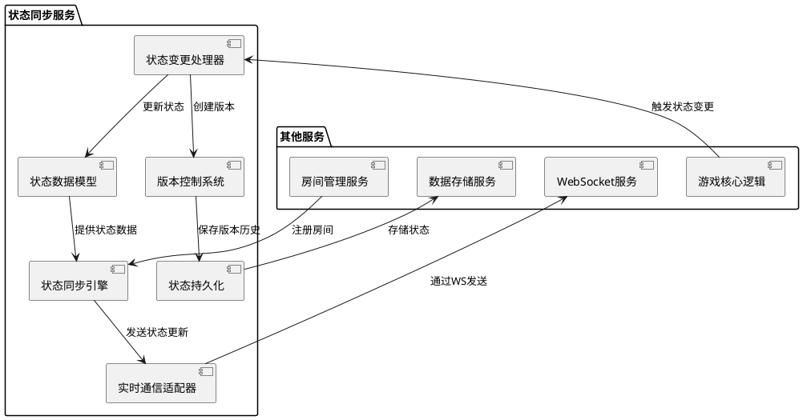
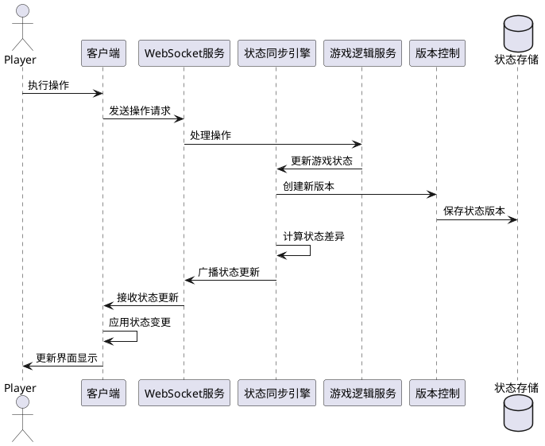
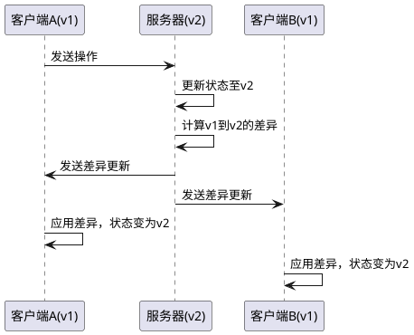
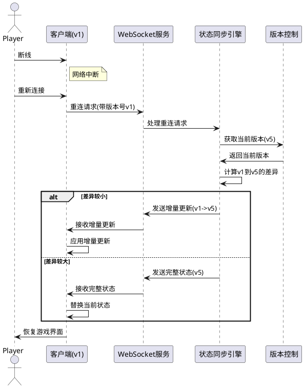

# 状态同步服务技术方案

## 1. 系统设计

### 1.1 系统架构

状态同步服务是阿瓦隆游戏的核心服务之一，负责确保多个客户端之间的游戏状态一致性。该服务采用分层架构，包括数据模型层、同步引擎层、通信层和持久化层。

### 1.2 技术选型

- **开发语言**：TypeScript
- **后端框架**：NestJS
- **实时通信**：Socket.IO
- **状态管理**：Immutable.js 和自定义状态管理
- **序列化**：MessagePack 或 Protocol Buffers
- **状态差异计算**：jsondiffpatch 或自定义差异算法
- **持久化存储**：MongoDB 和 Redis
- **版本控制**：自定义版本控制系统

### 1.3 系统组件

#### 1.3.1 状态数据模型

负责定义游戏状态的数据结构和类型，包括游戏状态、玩家状态、角色信息等。使用 TypeScript 接口和类型定义确保类型安全。

#### 1.3.2 状态同步引擎

核心组件，负责处理状态变更、计算状态差异、广播状态更新。实现状态的一致性管理和冲突解决。

#### 1.3.3 版本控制系统

管理状态的版本历史，支持状态回滚、版本比对和增量更新。每次状态变更都会生成新的版本号和变更记录。

#### 1.3.4 实时通信适配器

封装 WebSocket 通信细节，处理状态更新的广播和接收，管理连接和重连逻辑。

#### 1.3.5 状态持久化

负责将状态数据和版本历史持久化到数据库，支持游戏恢复和历史回放。

## 2. 数据流设计

### 2.1 状态同步流程

### 2.2 状态更新的差异传输

为了减少网络流量和提高性能，系统采用增量状态更新机制。只传输状态的变化部分，而不是完整状态。

### 2.3 断线重连流程

当玩家断线后重新连接，系统需要将该玩家的状态同步到最新。

## 3. 状态一致性保障

### 3.1 冲突检测与解决

当多个客户端同时提交操作时，可能会导致状态冲突。系统采用以下策略处理冲突：

1. **基于版本的冲突检测**：每个状态更新都包含基础版本号，服务器检查是否与当前版本一致
2. **服务器决策优先**：所有状态变更最终由服务器决定，客户端操作仅作为请求
3. **乐观并发控制**：允许客户端基于当前状态做出决策，服务器验证和合并变更
4. **自动冲突解决**：对于可自动解决的冲突，系统根据预定规则自动合并

### 3.2 状态验证

为确保状态的正确性和完整性，系统实现了多层验证机制：

1. **类型验证**：使用 TypeScript 静态类型检查确保状态结构正确
2. **业务规则验证**：确保状态变更符合游戏规则和逻辑
3. **校验和验证**：计算状态的哈希值，检测数据是否被篡改
4. **一致性检查**：定期对比客户端和服务器状态，确保一致性

### 3.3 状态恢复机制

系统提供多种状态恢复机制，应对异常情况：

1. **定期快照**：每隔一定时间或重要操作后创建完整状态快照
2. **增量回放**：基于基础快照和后续操作日志重建状态
3. **状态回滚**：当检测到错误时，回滚到上一个已知正确的状态
4. **差异修复**：计算客户端与服务器状态差异，只更新不一致部分

## 4. 性能优化

### 4.1 数据传输优化

1. **增量更新**：只传输状态变更部分，减少数据量
2. **数据压缩**：使用 MessagePack 或二进制协议减少传输大小
3. **状态过滤**：根据玩家角色过滤不可见信息，减少敏感数据传输
4. **批量更新**：合并短时间内的多次状态更新，减少通信次数

### 4.2 计算优化

1. **不可变数据结构**：使用 Immutable.js 提高状态比较和更新效率
2. **局部更新**：只计算和处理发生变化的状态部分
3. **懒计算**：延迟计算不立即需要的状态派生数据
4. **缓存机制**：缓存频繁访问的状态和计算结果

### 4.3 存储优化

1. **分层存储**：热数据使用 Redis，冷数据使用 MongoDB
2. **合理分区**：按游戏 ID 分区存储状态数据，提高查询效率
3. **状态压缩**：存储时压缩状态数据，减少存储空间
4. **过期清理**：自动清理过期的历史状态数据

## 5. 安全考虑

### 5.1 数据安全

1. **状态加密**：敏感状态数据（如角色信息）在传输和存储时加密
2. **访问控制**：严格控制状态数据的访问权限，确保玩家只能访问自己可见的信息
3. **数据验证**：严格验证客户端提交的状态更新请求，防止非法操作
4. **安全审计**：记录关键状态操作日志，便于追踪和审计

### 5.2 防作弊措施

1. **服务器权威性**：所有游戏状态由服务器维护和验证，客户端无法直接修改
2. **状态校验**：使用校验和和签名机制验证状态完整性
3. **行为分析**：监控异常的状态更新请求，识别可能的作弊行为
4. **时间戳验证**：检测操作时间序列异常，防止回放攻击

## 6. 可扩展性设计

### 6.1 水平扩展

1. **无状态服务**：状态同步引擎设计为无状态服务，便于横向扩展
2. **分区策略**：按游戏 ID 或房间 ID 分区处理，实现负载均衡
3. **消息队列**：使用消息队列解耦状态更新处理，提高吞吐量
4. **读写分离**：状态查询和更新分离处理，优化性能

### 6.2 功能扩展

1. **插件系统**：状态处理器设计为可插拔架构，便于添加新功能
2. **中间件机制**：支持状态更新前后的自定义处理逻辑
3. **事件驱动**：基于事件的状态更新机制，便于添加新的事件监听器
4. **版本兼容**：状态模型设计考虑前向和后向兼容性，支持平滑升级

## 7. 监控与运维

### 7.1 监控指标

1. **状态同步延迟**：从状态变更到客户端接收的时间
2. **状态更新频率**：每秒状态更新次数
3. **状态数据大小**：完整状态和增量更新的平均大小
4. **版本冲突率**：发生版本冲突的比例
5. **状态恢复次数**：客户端状态恢复的频率和耗时

### 7.2 告警机制

1. **状态同步超时**：状态同步延迟超过阈值
2. **状态不一致**：检测到客户端与服务器状态不一致
3. **高冲突率**：短时间内版本冲突率超过阈值
4. **资源利用率**：CPU、内存、网络等资源利用率过高

## 8. 实施计划

### 8.1 开发阶段

1. **阶段一**：状态数据模型设计和基础同步机制实现（2 周）
2. **阶段二**：版本控制和增量更新系统开发（2 周）
3. **阶段三**：断线重连和状态恢复机制实现（1 周）
4. **阶段四**：性能优化和安全措施加强（1 周）
5. **阶段五**：集成测试和性能测试（1 周）

### 8.2 测试计划

1. **单元测试**：覆盖核心算法和组件功能
2. **集成测试**：验证各组件协同工作
3. **性能测试**：模拟高并发场景下的状态同步性能
4. **压力测试**：测试系统在极限负载下的稳定性
5. **故障测试**：模拟网络故障、服务崩溃等异常情况

## 9. 相关文档

- [Task5.3.1\_状态数据模型与版本控制](./Task5.3.1_状态数据模型与版本控制.md)
- [游戏核心逻辑技术方案](../Story5.2_游戏核心逻辑/技术方案.md)
- [WebSocket 服务技术方案](../../Epic4_服务器架构设计/Story4.2_WebSocket服务/技术方案.md)
