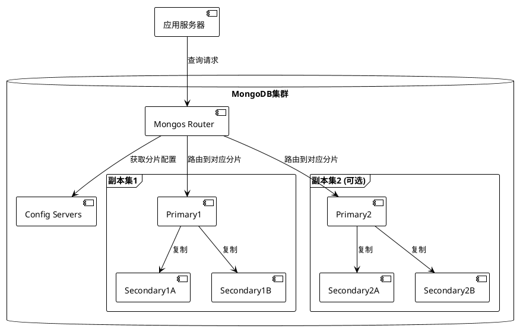

# Task 6.1.1: 用户数据存储设计

## 任务描述

设计阿瓦隆微信小游戏的用户数据存储方案，包括数据模型、数据库选型、索引策略和数据安全保护方案，确保系统高效、安全地管理用户数据。

## 详细要求

### 1. 数据模型设计

设计完整的用户数据模型，包括但不限于以下实体：

1. **用户基本信息**

   - 用户 ID、微信 OpenID、昵称、头像
   - 账号创建时间、最后登录时间
   - 游戏等级、信誉值等

2. **用户游戏统计**

   - 游戏总场次、胜率
   - 角色使用统计
   - 游戏表现指标

3. **用户设置**

   - 界面偏好
   - 游戏设置
   - 隐私选项

4. **社交关系**

   - 好友列表
   - 最近一起游戏的玩家

5. **用户行为日志**
   - 登录记录
   - 游戏行为
   - 功能使用情况

### 2. 数据库选型与设计

1. **选择数据库类型**

   - 确定使用 MongoDB 作为主要存储系统
   - 确定使用 Redis 作为缓存和会话管理

2. **MongoDB 集合设计**

   - users: 用户基本信息
   - gameStats: 用户游戏统计
   - userSettings: 用户设置
   - friendRelations: 好友关系
   - behaviorLogs: 用户行为日志

3. **数据库配置与优化**
   - 副本集配置
   - 分片策略（如需要）
   - 写关注级别设置

### 3. 索引策略设计

1. **用户集合索引**

   - userId（主索引，唯一）
   - openId（唯一索引）
   - nickname（普通索引）
   - gameLevel（用于排序查询）
   - lastLoginAt（用于活跃度分析）

2. **游戏统计索引**

   - userId（唯一索引）
   - totalGames, winCount（用于排行榜）

3. **好友关系索引**

   - userId + friendId（复合唯一索引）
   - userId + status（复合索引，用于查询）

4. **行为日志索引**
   - userId + timestamp（复合索引）
   - eventType + timestamp（用于事件分析）

### 4. 数据安全保护方案

1. **敏感数据加密**

   - 确定需要加密的敏感字段
   - 选择加密算法（如 AES-256）
   - 实现加密与解密流程

2. **数据库安全配置**

   - 启用 MongoDB 身份验证
   - 设置网络安全策略
   - 配置适当的访问权限

3. **数据备份策略**

   - 定时完整备份
   - 增量备份方案
   - 备份恢复测试流程

4. **隐私保护措施**
   - 用户数据匿名化处理
   - 数据访问审计
   - 数据生命周期管理

## 技术细节

### 1. MongoDB 架构设计



### 2. 数据模型示例（JSON 格式）

```json
// 用户文档示例
{
  "_id": ObjectId("5f8a726b1cd6f87654321098"),
  "userId": "user_12345",
  "openId": "wx_openid_abcdef",
  "unionId": "wx_unionid_123456",
  "nickname": "游戏达人",
  "avatarUrl": "https://wx.qlogo.cn/mmopen/vi_32/123456/0",
  "gender": 1,
  "region": "北京",
  "createdAt": ISODate("2023-01-15T08:30:00.000Z"),
  "lastLoginAt": ISODate("2023-05-20T14:45:23.000Z"),
  "isActive": true,
  "gameLevel": 8,
  "reputation": 92
}

// 游戏统计文档示例
{
  "_id": ObjectId("5f8a726b1cd6f87654321099"),
  "userId": "user_12345",
  "totalGames": 75,
  "winCount": 42,
  "goodSideCount": 45,
  "evilSideCount": 30,
  "goodSideWins": 28,
  "evilSideWins": 14,
  "roleStats": {
    "merlin": { "count": 12, "wins": 9 },
    "assassin": { "count": 8, "wins": 5 },
    "percival": { "count": 10, "wins": 7 },
    "loyal_servant": { "count": 23, "wins": 12 },
    "morgana": { "count": 14, "wins": 6 },
    "mordred": { "count": 8, "wins": 3 }
  },
  "successfulMissions": 35,
  "failedMissions": 25,
  "voteAccuracy": 0.82,
  "averageGameDuration": 22.5,
  "lastUpdated": ISODate("2023-05-20T15:10:45.000Z")
}
```

### 3. 索引创建脚本

```javascript
// 用户集合索引
db.users.createIndex({ userId: 1 }, { unique: true, background: true });
db.users.createIndex({ openId: 1 }, { unique: true, background: true });
db.users.createIndex({ nickname: 1 }, { background: true });
db.users.createIndex({ gameLevel: -1 }, { background: true });
db.users.createIndex({ lastLoginAt: -1 }, { background: true });

// 游戏统计集合索引
db.gameStats.createIndex({ userId: 1 }, { unique: true, background: true });
db.gameStats.createIndex({ totalGames: -1 }, { background: true });
db.gameStats.createIndex({ winCount: -1 }, { background: true });

// 好友关系集合索引
db.friendRelations.createIndex(
  { userId: 1, friendId: 1 },
  { unique: true, background: true }
);
db.friendRelations.createIndex({ userId: 1, status: 1 }, { background: true });
db.friendRelations.createIndex(
  { friendId: 1, status: 1 },
  { background: true }
);

// 行为日志集合索引
db.behaviorLogs.createIndex({ userId: 1, timestamp: -1 }, { background: true });
db.behaviorLogs.createIndex(
  { eventType: 1, timestamp: -1 },
  { background: true }
);
db.behaviorLogs.createIndex(
  { timestamp: -1 },
  { background: true, expireAfterSeconds: 7776000 }
); // 90天后过期
```

### 4. 敏感数据加密实现

```typescript
// 数据加密服务示例
import * as crypto from "crypto";

export class EncryptionService {
  private readonly algorithm = "aes-256-gcm";
  private readonly secretKey: Buffer;

  constructor() {
    // 从环境变量或安全存储获取密钥
    this.secretKey = Buffer.from(process.env.ENCRYPTION_KEY, "hex");
  }

  // 加密数据
  encrypt(text: string): {
    encryptedData: string;
    iv: string;
    authTag: string;
  } {
    // 生成随机初始化向量
    const iv = crypto.randomBytes(16);

    // 创建cipher
    const cipher = crypto.createCipheriv(this.algorithm, this.secretKey, iv);

    // 加密数据
    let encrypted = cipher.update(text, "utf8", "hex");
    encrypted += cipher.final("hex");

    // 获取认证标签
    const authTag = cipher.getAuthTag().toString("hex");

    return {
      encryptedData: encrypted,
      iv: iv.toString("hex"),
      authTag,
    };
  }

  // 解密数据
  decrypt(encryptedData: string, iv: string, authTag: string): string {
    // 创建decipher
    const decipher = crypto.createDecipheriv(
      this.algorithm,
      this.secretKey,
      Buffer.from(iv, "hex")
    );

    // 设置认证标签
    decipher.setAuthTag(Buffer.from(authTag, "hex"));

    // 解密数据
    let decrypted = decipher.update(encryptedData, "hex", "utf8");
    decrypted += decipher.final("utf8");

    return decrypted;
  }
}
```

## 验收标准

1. 所有数据模型设计文档已完成，包含字段定义和关系说明
2. 数据库架构设计文档已完成，包含集合设计和配置方案
3. 所有必要的索引设计已完成，并提供创建脚本
4. 数据安全与隐私保护方案已完成，明确处理敏感信息的方式
5. 数据备份和恢复方案已完成，包含定时备份策略
6. 完成实际数据库设置的技术验证，确认性能满足需求

## 依赖关系

- 依赖项目概述文档和整体技术架构设计
- 本任务将作为后续用户认证与授权服务、用户数据访问 API 等任务的基础

## 工作量估计

- 数据模型设计：1 人天
- 数据库架构与集合设计：1 人天
- 索引策略设计：0.5 人天
- 数据安全方案设计：1 人天
- 技术验证与文档编写：1.5 人天

总计：约 5 人天
