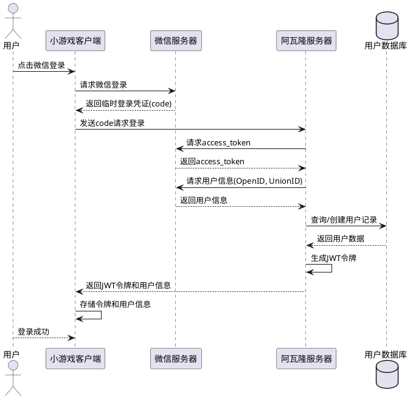
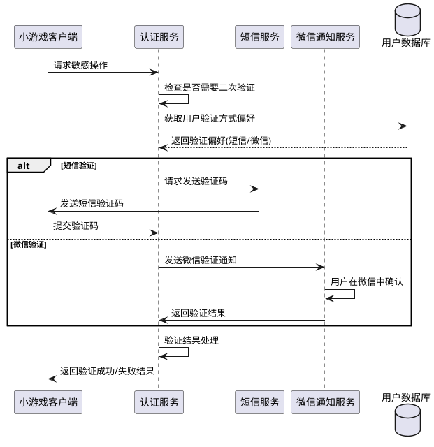

# Task 6.1.2: 用户认证与授权服务

## 任务描述

为阿瓦隆微信小游戏开发完整的用户认证与授权服务，包括基于微信登录的认证系统、JWT 令牌管理、用户权限控制以及安全的数据访问机制，确保系统安全性和用户数据隐私。

## 详细要求

### 1. 微信登录认证系统

1. **微信登录流程实现**

   - 微信登录授权请求处理
   - 获取用户 OpenID 和 UnionID
   - 用户首次登录自动注册机制
   - 登录状态维护与刷新

2. **登录态管理**

   - 登录会话创建与维护
   - 多端登录状态同步
   - 登录有效期与自动续期
   - 安全登出机制

3. **账号关联机制**
   - 微信账号与游戏内账号绑定
   - 多平台账号合并策略
   - 账号解绑处理机制
   - 账号迁移功能

### 2. JWT 令牌管理

1. **令牌生成与验证**

   - JWT 令牌结构设计
   - 令牌签名算法选择与实现
   - 令牌过期策略设计
   - 令牌验证与解析机制

2. **令牌安全策略**

   - 令牌吊销机制
   - 刷新令牌管理
   - 防止令牌泄露机制
   - 令牌轮换策略

3. **令牌载荷设计**
   - 用户基本信息载荷
   - 权限信息载荷
   - 设备信息载荷
   - 自定义附加信息

### 3. 用户权限管理

1. **权限模型设计**

   - 角色基础权限（普通用户、管理员等）
   - 功能级权限控制
   - 数据级权限控制
   - 自定义权限组

2. **权限授予与撤销**

   - 用户权限分配机制
   - 权限继承规则
   - 权限变更审计
   - 权限临时提升机制

3. **权限验证服务**
   - API 请求权限验证中间件
   - 资源访问权限检查
   - 管理员特殊权限处理
   - 权限缓存机制

### 4. 数据访问控制

1. **访问控制策略**

   - 基于角色的访问控制(RBAC)实现
   - 基于属性的访问控制(ABAC)辅助
   - 数据所有权校验规则
   - 敏感操作多因素验证

2. **API 安全措施**

   - RESTful API 认证机制
   - API 请求限流保护
   - 请求来源验证
   - 防 CSRF 攻击措施

3. **审计与监控**
   - 关键操作审计日志
   - 异常登录监控
   - 权限变更记录
   - 敏感数据访问追踪

## 技术细节

### 1. 微信登录流程



### 2. JWT 令牌结构设计

```json
// JWT标头
{
  "alg": "HS256",
  "typ": "JWT"
}

// JWT有效载荷
{
  "sub": "user_12345",         // 用户ID
  "openid": "wx_openid_xyz",   // 微信OpenID
  "name": "游戏玩家",           // 用户昵称
  "roles": ["user"],           // 用户角色
  "permissions": ["play_game", "view_stats"], // 权限列表
  "device_id": "device_67890", // 设备ID
  "iat": 1516239022,           // 签发时间
  "exp": 1516242622,           // 过期时间(1小时)
  "jti": "random-token-id-123" // 令牌唯一ID
}
```

### 3. 权限验证中间件示例

```typescript
// 权限验证中间件
import { Request, Response, NextFunction } from "express";
import jwt from "jsonwebtoken";
import { UnauthorizedError, ForbiddenError } from "../errors";
import { User } from "../models/user.model";
import { TokenBlacklistService } from "../services/token-blacklist.service";
import config from "../config";

export interface AuthRequest extends Request {
  user?: User;
  token?: string;
}

export class AuthMiddleware {
  // 验证JWT令牌
  static verifyToken(req: AuthRequest, res: Response, next: NextFunction) {
    const authHeader = req.headers.authorization;

    if (!authHeader || !authHeader.startsWith("Bearer ")) {
      return next(new UnauthorizedError("No token provided"));
    }

    const token = authHeader.split(" ")[1];

    try {
      // 检查令牌是否被吊销
      if (TokenBlacklistService.isBlacklisted(token)) {
        return next(new UnauthorizedError("Token has been revoked"));
      }

      // 验证令牌
      const decoded = jwt.verify(token, config.jwt.secret) as User;
      req.user = decoded;
      req.token = token;
      next();
    } catch (err) {
      if (err.name === "TokenExpiredError") {
        return next(new UnauthorizedError("Token expired"));
      }
      return next(new UnauthorizedError("Invalid token"));
    }
  }

  // 检查用户是否有指定权限
  static hasPermission(permission: string) {
    return (req: AuthRequest, res: Response, next: NextFunction) => {
      if (!req.user) {
        return next(new UnauthorizedError("User not authenticated"));
      }

      if (req.user.permissions && req.user.permissions.includes(permission)) {
        return next();
      }

      // 如果用户是管理员，自动拥有所有权限
      if (req.user.roles && req.user.roles.includes("admin")) {
        return next();
      }

      return next(
        new ForbiddenError(`Missing required permission: ${permission}`)
      );
    };
  }

  // 检查用户角色
  static hasRole(role: string) {
    return (req: AuthRequest, res: Response, next: NextFunction) => {
      if (!req.user) {
        return next(new UnauthorizedError("User not authenticated"));
      }

      if (req.user.roles && req.user.roles.includes(role)) {
        return next();
      }

      return next(new ForbiddenError(`Requires role: ${role}`));
    };
  }

  // 检查资源所有权
  static isResourceOwner(
    resourceIdParam: string,
    userIdField: string = "userId"
  ) {
    return async (req: AuthRequest, res: Response, next: NextFunction) => {
      if (!req.user) {
        return next(new UnauthorizedError("User not authenticated"));
      }

      const resourceId = req.params[resourceIdParam];

      // 如果用户是管理员，自动通过检查
      if (req.user.roles && req.user.roles.includes("admin")) {
        return next();
      }

      try {
        // 这里需要根据实际资源模型查询资源所有者
        const resource = await ResourceService.findById(resourceId);

        if (!resource) {
          return next(new NotFoundError("Resource not found"));
        }

        if (resource[userIdField] === req.user.sub) {
          return next();
        }

        return next(new ForbiddenError("Not the owner of this resource"));
      } catch (error) {
        return next(error);
      }
    };
  }
}
```

### 4. 多因素认证流程



## 验收标准

1. 微信登录流程完整实现，包括获取 OpenID、注册新用户等功能
2. JWT 令牌生成和验证机制正常工作，令牌包含必要的用户信息和权限
3. 权限管理系统能够正确控制用户对不同资源和功能的访问
4. 数据访问控制策略能有效保护用户数据，防止未授权访问
5. 令牌有效期、刷新机制和吊销机制正常工作
6. 敏感操作的多因素认证流程能够正确执行
7. 所有身份验证和授权相关的异常情况都有合理的错误处理
8. 完成安全性测试，确保无明显安全漏洞
9. 认证请求的平均响应时间低于 200ms
10. API 文档完整，包含身份验证和权限相关的所有端点

## 依赖关系

- 依赖 Task6.1.1 中设计的用户数据模型
- 本任务将作为其他服务认证和授权的基础设施
- 为 Task6.1.3(用户数据访问 API)提供安全基础

## 工作量估计

- 微信登录认证实现：1.5 人天
- JWT 令牌系统开发：1 人天
- 权限管理服务设计与实现：2 人天
- 数据访问控制策略实现：1 人天
- 安全测试与优化：1.5 人天
- 文档编写：1 人天

总计：约 8 人天
