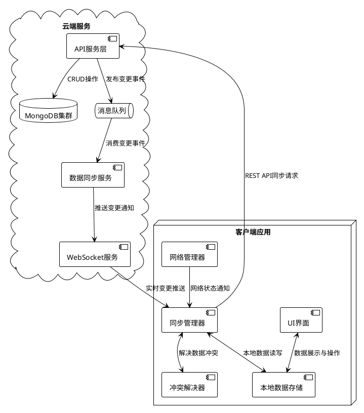
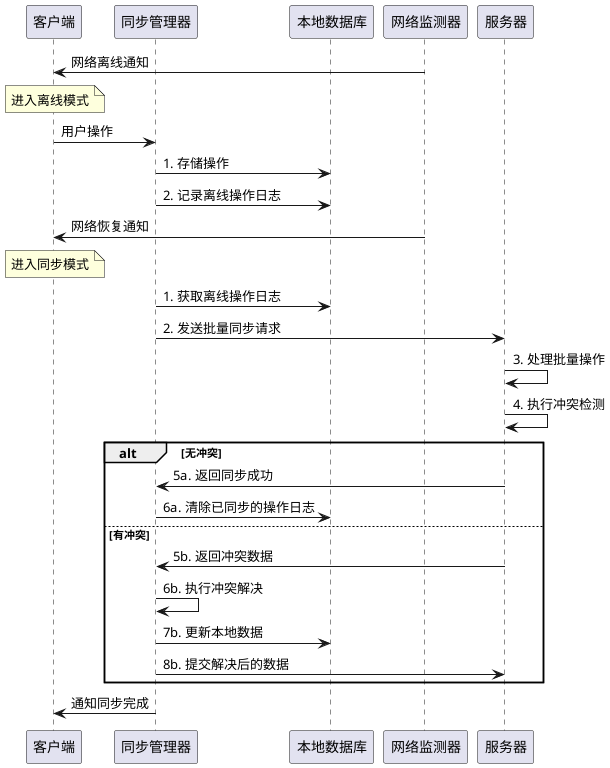

# Task 6.1.4: 用户数据同步机制

## 任务描述

为阿瓦隆微信小游戏设计和实现一套完整的用户数据同步机制，确保在多端、网络不稳定或离线情况下用户数据能够可靠地同步，同时解决潜在的数据冲突问题，为用户提供无缝的游戏体验。

## 详细要求

### 1. 数据变更检测机制

1. **版本控制与时间戳**

   - 数据版本号管理
   - 最后修改时间跟踪
   - 修改来源标记
   - 变更事件记录

2. **变更检测策略**

   - 基于时间戳的检测方法
   - 基于版本号的检测方法
   - 基于哈希值的快速比较
   - 字段级别变更追踪

3. **变更通知机制**
   - 实时变更通知
   - 轮询检测策略
   - 重连后检测同步
   - 变更优先级分级

### 2. 增量数据同步策略

1. **增量同步设计**

   - 仅同步变更数据而非全量更新
   - 差异计算算法
   - 增量更新序列化
   - 带宽优化措施

2. **同步流程**

   - 客户端发起同步流程
   - 服务端推送变更流程
   - 强制同步机制
   - 同步状态监控

3. **同步频率与策略**
   - 基于事件触发的即时同步
   - 定期批量同步
   - 智能节流策略
   - 网络条件适应策略

### 3. 数据冲突解决方案

1. **冲突检测方法**

   - 版本冲突检测
   - 并发修改检测
   - 字段级冲突识别
   - 依赖关系检查

2. **自动解决策略**

   - 基于时间戳的简单策略（后者胜）
   - 基于规则的智能合并
   - 基于数据类型的特殊处理
   - 应用层冲突逻辑解析

3. **人工干预机制**
   - 无法自动解决时的提示界面
   - 冲突数据展示与选择
   - 合并预览功能
   - 冲突解决历史记录

### 4. 离线数据缓存与同步

1. **离线数据存储**

   - 客户端本地数据存储设计
   - 离线操作日志记录
   - 存储空间管理策略
   - 数据安全保护

2. **重连同步处理**

   - 网络恢复检测
   - 离线变更批量提交
   - 服务器变更获取与合并
   - 同步结果验证

3. **离线功能限制**
   - 离线可用功能定义
   - 需要在线验证的操作标记
   - 临时授权机制
   - 离线模式用户体验优化

## 技术细节

### 1. 数据同步架构



### 2. 增量同步算法示例

```typescript
/**
 * 计算对象差异并生成增量更新
 */
export class DiffCalculator {
  /**
   * 计算两个对象之间的差异
   * @param oldObj 旧对象
   * @param newObj 新对象
   * @returns 包含变更的对象
   */
  static calculateDiff(oldObj: any, newObj: any): any {
    // 如果类型不同，直接返回新值
    if (typeof oldObj !== typeof newObj) {
      return { $set: newObj };
    }

    // 处理数组
    if (Array.isArray(oldObj) && Array.isArray(newObj)) {
      return this.calculateArrayDiff(oldObj, newObj);
    }

    // 处理对象
    if (
      oldObj &&
      newObj &&
      typeof oldObj === "object" &&
      typeof newObj === "object"
    ) {
      return this.calculateObjectDiff(oldObj, newObj);
    }

    // 处理基本类型
    if (oldObj !== newObj) {
      return { $set: newObj };
    }

    // 相同值，无需变更
    return null;
  }

  /**
   * 计算对象的差异
   */
  private static calculateObjectDiff(oldObj: any, newObj: any): any {
    const diff: any = {};
    let hasChanges = false;

    // 处理新增和修改的属性
    for (const key in newObj) {
      if (Object.prototype.hasOwnProperty.call(newObj, key)) {
        // 属性不存在于旧对象
        if (!(key in oldObj)) {
          if (!diff.$set) diff.$set = {};
          diff.$set[key] = newObj[key];
          hasChanges = true;
          continue;
        }

        // 计算嵌套属性的差异
        const propDiff = this.calculateDiff(oldObj[key], newObj[key]);
        if (propDiff) {
          // 扁平化差异路径
          if (propDiff.$set) {
            if (!diff.$set) diff.$set = {};
            diff.$set[key] = propDiff.$set;
            hasChanges = true;
          } else if (propDiff.$unset) {
            if (!diff.$unset) diff.$unset = {};
            diff.$unset[key] = propDiff.$unset;
            hasChanges = true;
          } else {
            // 处理嵌套对象的差异
            if (!diff.$nested) diff.$nested = {};
            diff.$nested[key] = propDiff;
            hasChanges = true;
          }
        }
      }
    }

    // 处理删除的属性
    for (const key in oldObj) {
      if (
        Object.prototype.hasOwnProperty.call(oldObj, key) &&
        !(key in newObj)
      ) {
        if (!diff.$unset) diff.$unset = {};
        diff.$unset[key] = true;
        hasChanges = true;
      }
    }

    return hasChanges ? diff : null;
  }

  /**
   * 计算数组的差异
   */
  private static calculateArrayDiff(oldArray: any[], newArray: any[]): any {
    // 对于小数组，可以使用简单的全量替换策略
    if (oldArray.length < 10 && newArray.length < 10) {
      return oldArray.toString() !== newArray.toString()
        ? { $set: newArray }
        : null;
    }

    // 对于大数组，计算最小编辑距离
    // 这里使用简化算法，实际项目中可能需要更复杂的LCS算法
    const operations: any = {
      $arrayOps: [],
    };

    let i = 0;
    let j = 0;

    // 找出相同的前缀
    while (
      i < oldArray.length &&
      i < newArray.length &&
      this.areEqual(oldArray[i], newArray[i])
    ) {
      i++;
    }

    // 找出相同的后缀
    while (
      j < oldArray.length - i &&
      j < newArray.length - i &&
      this.areEqual(
        oldArray[oldArray.length - 1 - j],
        newArray[newArray.length - 1 - j]
      )
    ) {
      j++;
    }

    const oldMiddle = oldArray.slice(i, oldArray.length - j);
    const newMiddle = newArray.slice(i, newArray.length - j);

    // 如果中间部分完全不同，采用替换策略
    if (oldMiddle.length === 0 && newMiddle.length > 0) {
      operations.$arrayOps.push({
        op: "insert",
        index: i,
        values: newMiddle,
      });
    } else if (newMiddle.length === 0 && oldMiddle.length > 0) {
      operations.$arrayOps.push({
        op: "remove",
        index: i,
        count: oldMiddle.length,
      });
    } else if (oldMiddle.length > 0 && newMiddle.length > 0) {
      operations.$arrayOps.push({
        op: "replace",
        index: i,
        values: newMiddle,
      });
    }

    return operations.$arrayOps.length > 0 ? operations : null;
  }

  /**
   * 比较两个值是否相等
   */
  private static areEqual(a: any, b: any): boolean {
    if (a === b) return true;

    if (a && b && typeof a === "object" && typeof b === "object") {
      if (Array.isArray(a) && Array.isArray(b)) {
        if (a.length !== b.length) return false;
        for (let i = 0; i < a.length; i++) {
          if (!this.areEqual(a[i], b[i])) return false;
        }
        return true;
      }

      const keysA = Object.keys(a);
      const keysB = Object.keys(b);

      if (keysA.length !== keysB.length) return false;

      for (const key of keysA) {
        if (!keysB.includes(key) || !this.areEqual(a[key], b[key])) {
          return false;
        }
      }

      return true;
    }

    return false;
  }
}
```

### 3. 冲突解决策略实现

```typescript
/**
 * 数据冲突解决器
 */
export class ConflictResolver {
  /**
   * 解决对象级别的冲突
   * @param base 基础对象(上次同步的版本)
   * @param local 本地修改的对象
   * @param remote 远程修改的对象
   * @returns 解决冲突后的对象
   */
  static resolveConflict(base: any, local: any, remote: any): any {
    // 如果本地或远程为null，采用非null的版本
    if (local === null) return remote;
    if (remote === null) return local;

    // 如果类型不同，优先采用远程版本
    if (typeof local !== typeof remote) {
      return remote;
    }

    // 处理数组
    if (Array.isArray(local) && Array.isArray(remote)) {
      return this.resolveArrayConflict(base as any[], local, remote);
    }

    // 处理对象
    if (typeof local === "object" && typeof remote === "object") {
      return this.resolveObjectConflict(base as object, local, remote);
    }

    // 基本类型，如果有冲突，优先使用远程值
    // 这里可以根据业务需求调整优先级策略
    if (local !== base && remote !== base && local !== remote) {
      return remote; // 冲突时远程优先
    }

    // 如果本地有变化而远程无变化，使用本地值
    if (local !== base && remote === base) {
      return local;
    }

    // 默认使用远程值
    return remote;
  }

  /**
   * 解决对象冲突
   */
  private static resolveObjectConflict(
    base: object,
    local: object,
    remote: object
  ): object {
    const result: any = { ...remote }; // 以远程为基础
    const baseObj = base || {};

    // 处理每个属性的冲突
    for (const key in local) {
      if (Object.prototype.hasOwnProperty.call(local, key)) {
        const localValue = (local as any)[key];
        const remoteValue = (remote as any)[key];
        const baseValue = (baseObj as any)[key];

        // 本地删除了属性
        if (localValue === undefined && baseValue !== undefined) {
          delete result[key];
          continue;
        }

        // 远程也有此属性，需要递归解决冲突
        if (Object.prototype.hasOwnProperty.call(remote, key)) {
          result[key] = this.resolveConflict(
            baseValue,
            localValue,
            remoteValue
          );
        } else {
          // 远程没有此属性，但本地有，保留本地属性
          result[key] = localValue;
        }
      }
    }

    return result;
  }

  /**
   * 解决数组冲突
   * 注意：数组冲突解决是复杂的，这里使用一个简化策略
   */
  private static resolveArrayConflict(
    base: any[],
    local: any[],
    remote: any[]
  ): any[] {
    // 如果基础版本为空，则无法正确判断操作，使用远程版本
    if (!base || base.length === 0) {
      return remote;
    }

    // 如果本地和远程都只是追加元素，则合并两者的新元素
    if (this.isJustAppend(base, local) && this.isJustAppend(base, remote)) {
      const baseLength = base.length;
      const localNew = local.slice(baseLength);
      const remoteNew = remote.slice(baseLength);

      // 合并新元素，去重
      return [
        ...base,
        ...localNew,
        ...remoteNew.filter((item) => !this.arrayContains(localNew, item)),
      ];
    }

    // 如果本地和远程都只是删除元素，保留两者都删除的结果
    if (this.isJustDelete(base, local) && this.isJustDelete(base, remote)) {
      return base.filter((item, index) => {
        const itemInLocal = this.arrayContains(local, item);
        const itemInRemote = this.arrayContains(remote, item);
        return itemInLocal && itemInRemote;
      });
    }

    // 复杂情况，默认采用远程版本
    // 在实际项目中，可能需要更复杂的数组差异算法和冲突解决策略
    return remote;
  }

  /**
   * 检查是否只是在数组末尾添加了元素
   */
  private static isJustAppend(base: any[], current: any[]): boolean {
    if (current.length < base.length) return false;

    for (let i = 0; i < base.length; i++) {
      if (!this.areEqual(base[i], current[i])) {
        return false;
      }
    }

    return true;
  }

  /**
   * 检查是否只是从数组中删除了元素
   */
  private static isJustDelete(base: any[], current: any[]): boolean {
    if (current.length > base.length) return false;

    for (const item of current) {
      if (!this.arrayContains(base, item)) {
        return false;
      }
    }

    return true;
  }

  /**
   * 检查数组是否包含指定元素
   */
  private static arrayContains(array: any[], item: any): boolean {
    return array.some((element) => this.areEqual(element, item));
  }

  /**
   * 比较两个值是否相等
   */
  private static areEqual(a: any, b: any): boolean {
    if (a === b) return true;

    if (a && b && typeof a === "object" && typeof b === "object") {
      const keysA = Object.keys(a);
      const keysB = Object.keys(b);

      if (keysA.length !== keysB.length) return false;

      return keysA.every(
        (key) => keysB.includes(key) && this.areEqual(a[key], b[key])
      );
    }

    return false;
  }
}
```

### 4. 离线数据同步流程



## 验收标准

1. 数据变更检测能准确识别用户数据的变更内容和时间
2. 增量同步机制能高效传输变更数据，减少网络带宽使用
3. 数据冲突检测率 ≥99%，自动解决冲突率 ≥95%
4. 离线操作可靠记录并在网络恢复后成功同步到服务器
5. 多端同步保持数据一致性，验证同步延迟<2 秒
6. 同步过程中的数据安全性得到保障，敏感数据加密传输
7. 在网络不稳定情况下（高延迟、丢包、中断）同步机制仍能可靠工作
8. 同步操作的内存和 CPU 占用符合移动设备性能要求
9. 完成性能测试，确保同步机制在高负载下工作正常
10. 同步过程中用户体验流畅，无明显卡顿或阻塞

## 依赖关系

- 依赖 Task6.1.1 的用户数据模型设计
- 依赖 Task6.1.3 的用户数据访问 API
- 为用户提供多设备数据同步能力
- 为离线游戏场景提供数据支持

## 工作量估计

- 数据变更检测机制设计与实现：2 人天
- 增量同步策略开发：2.5 人天
- 数据冲突解决方案实现：3 人天
- 离线数据缓存与同步开发：2 人天
- 跨平台测试与优化：2 人天
- 文档编写与技术规范：1.5 人天

总计：约 13 人天
