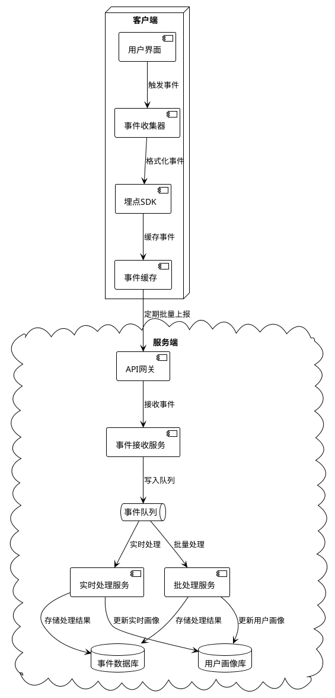
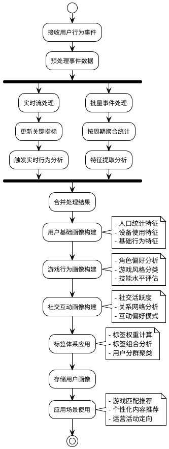

# Task 6.1.5: 用户行为追踪

## 任务描述

为阿瓦隆微信小游戏设计和实现一套完整的用户行为追踪系统，能够记录用户在游戏中的各种操作行为，并基于这些数据构建用户画像，为游戏优化和运营决策提供数据支持。

## 详细要求

### 1. 用户行为事件定义

1. **核心游戏行为**

   - 游戏参与事件（加入/退出房间）
   - 角色选择事件
   - 任务队员选择事件
   - 投票行为记录
   - 任务成功/失败操作

2. **社交互动行为**

   - 好友添加/删除事件
   - 聊天消息统计（频次、对象）
   - 游戏邀请行为
   - 社交分享操作
   - 协作模式偏好

3. **界面操作行为**
   - 页面访问路径与时长
   - 功能按钮点击事件
   - 教程查看行为
   - 设置调整操作
   - 界面导航模式

### 2. 数据采集机制

1. **客户端埋点系统**

   - 事件触发机制设计
   - 参数收集配置
   - 埋点 SDK 集成
   - 离线缓存机制
   - 批量上报策略

2. **实时数据传输**

   - 网络传输协议选择
   - 数据压缩机制
   - 传输安全保障
   - 重传与去重机制
   - 带宽优化策略

3. **后端数据接收处理**
   - 高并发数据接收服务
   - 数据预处理管道
   - 异常数据过滤
   - 数据分流存储
   - 实时处理流程

### 3. 行为数据存储方案

1. **数据模型设计**

   - 事件通用模型
   - 用户会话模型
   - 行为序列模型
   - 统计聚合模型
   - 关联事件模型

2. **存储技术选型**

   - 实时事件流存储（Kafka）
   - 大数据量存储（HDFS）
   - 热数据快速查询（ElasticSearch）
   - 统计结果缓存（Redis）
   - 用户画像存储（MongoDB）

3. **数据生命周期管理**
   - 数据保留策略
   - 冷热数据分层
   - 数据归档方案
   - 数据清理机制
   - 合规数据处理

### 4. 用户画像构建框架

1. **基础属性画像**

   - 人口统计学特征
   - 设备与网络特征
   - 游戏习惯特征
   - 活跃度特征
   - 消费行为特征

2. **游戏行为画像**

   - 游戏风格偏好
   - 角色使用偏好
   - 游戏技巧评分
   - 社交互动模式
   - 决策行为模式

3. **画像计算框架**
   - 实时特征计算
   - 批量特征更新
   - 标签权重计算
   - 画像演进模型
   - 多维度聚类分析

## 技术细节

### 1. 事件追踪架构



### 2. 事件数据模型

```typescript
/**
 * 事件基础模型
 */
interface BaseEvent {
  eventId: string; // 事件唯一ID
  eventType: string; // 事件类型
  userId: string; // 用户ID
  sessionId: string; // 会话ID
  timestamp: number; // 事件发生时间戳
  deviceInfo: {
    // 设备信息
    deviceId: string;
    model: string;
    platform: string;
    osVersion: string;
    networkType: string;
  };
  appInfo: {
    // 应用信息
    version: string;
    channel: string;
  };
}

/**
 * 游戏行为事件
 */
interface GameEvent extends BaseEvent {
  gameId?: string; // 游戏ID
  roomId?: string; // 房间ID
  properties: {
    // 事件属性
    [key: string]: any; // 根据事件类型有不同属性
  };
}

/**
 * 页面访问事件
 */
interface PageViewEvent extends BaseEvent {
  pageName: string; // 页面名称
  pageUrl: string; // 页面路径
  referrer: string; // 来源页面
  duration?: number; // 停留时长(离开时更新)
  properties: {
    // 附加属性
    [key: string]: any;
  };
}

/**
 * 用户交互事件
 */
interface UserInteractionEvent extends BaseEvent {
  elementId: string; // 交互元素ID
  elementType: string; // 元素类型(按钮/链接等)
  action: string; // 交互动作(点击/滑动等)
  properties: {
    // 附加属性
    [key: string]: any;
  };
}
```

### 3. 埋点 SDK 实现示例

```typescript
/**
 * 行为追踪SDK
 */
export class TrackingSDK {
  private userId: string | null = null;
  private sessionId: string;
  private deviceInfo: any;
  private appInfo: any;
  private eventCache: GameEvent[] = [];
  private readonly MAX_CACHE_SIZE = 50;
  private readonly UPLOAD_INTERVAL = 30000; // 30秒
  private uploadTimer: any;
  private isNetworkAvailable = true;

  constructor() {
    this.sessionId = this.generateUUID();
    this.deviceInfo = this.collectDeviceInfo();
    this.appInfo = this.collectAppInfo();
    this.startUploadTimer();
    this.listenToNetworkChanges();
  }

  /**
   * 设置用户ID
   */
  public setUserId(userId: string) {
    this.userId = userId;
  }

  /**
   * 追踪游戏事件
   */
  public trackGameEvent(
    eventType: string,
    properties: any = {},
    gameId?: string,
    roomId?: string
  ) {
    if (!this.userId) {
      console.warn("用户ID未设置，事件将不会被追踪");
      return;
    }

    const event: GameEvent = {
      eventId: this.generateUUID(),
      eventType,
      userId: this.userId,
      sessionId: this.sessionId,
      timestamp: Date.now(),
      deviceInfo: this.deviceInfo,
      appInfo: this.appInfo,
      gameId,
      roomId,
      properties,
    };

    this.addEventToCache(event);
  }

  /**
   * 追踪页面访问
   */
  public trackPageView(
    pageName: string,
    pageUrl: string,
    referrer: string,
    properties: any = {}
  ) {
    if (!this.userId) {
      console.warn("用户ID未设置，事件将不会被追踪");
      return;
    }

    const event: PageViewEvent = {
      eventId: this.generateUUID(),
      eventType: "page_view",
      userId: this.userId,
      sessionId: this.sessionId,
      timestamp: Date.now(),
      deviceInfo: this.deviceInfo,
      appInfo: this.appInfo,
      pageName,
      pageUrl,
      referrer,
      properties,
    };

    this.addEventToCache(event);
  }

  /**
   * 追踪用户交互
   */
  public trackUserInteraction(
    elementId: string,
    elementType: string,
    action: string,
    properties: any = {}
  ) {
    if (!this.userId) {
      console.warn("用户ID未设置，事件将不会被追踪");
      return;
    }

    const event: UserInteractionEvent = {
      eventId: this.generateUUID(),
      eventType: "user_interaction",
      userId: this.userId,
      sessionId: this.sessionId,
      timestamp: Date.now(),
      deviceInfo: this.deviceInfo,
      appInfo: this.appInfo,
      elementId,
      elementType,
      action,
      properties,
    };

    this.addEventToCache(event);
  }

  /**
   * 将事件添加到缓存
   */
  private addEventToCache(event: any) {
    this.eventCache.push(event);

    // 缓存达到阈值时上传
    if (
      this.eventCache.length >= this.MAX_CACHE_SIZE &&
      this.isNetworkAvailable
    ) {
      this.uploadEvents();
    }
  }

  /**
   * 启动定时上传
   */
  private startUploadTimer() {
    this.uploadTimer = setInterval(() => {
      if (this.eventCache.length > 0 && this.isNetworkAvailable) {
        this.uploadEvents();
      }
    }, this.UPLOAD_INTERVAL);
  }

  /**
   * 上传事件数据
   */
  private uploadEvents() {
    if (this.eventCache.length === 0) return;

    const eventsToUpload = [...this.eventCache];
    this.eventCache = [];

    // 压缩数据
    const compressedData = this.compressData(eventsToUpload);

    // 发送到服务器
    fetch("https://api.avalon-game.com/tracking/events", {
      method: "POST",
      headers: {
        "Content-Type": "application/json",
        "X-API-Key": "api_key_here",
      },
      body: JSON.stringify({
        sessionId: this.sessionId,
        events: compressedData,
        timestamp: Date.now(),
      }),
    })
      .then((response) => {
        if (!response.ok) {
          // 上传失败，将事件放回缓存
          this.eventCache = [...eventsToUpload, ...this.eventCache];
          throw new Error("事件上传失败");
        }
        return response.json();
      })
      .then((data) => {
        console.log("事件上传成功", data);
      })
      .catch((error) => {
        console.error("事件上传错误", error);
        // 上传失败，将事件放回缓存
        this.eventCache = [...eventsToUpload, ...this.eventCache];
      });
  }

  /**
   * 监听网络变化
   */
  private listenToNetworkChanges() {
    // 根据平台实现网络监听
    // 这里以微信小游戏为例
    if (typeof wx !== "undefined") {
      wx.onNetworkStatusChange((res) => {
        this.isNetworkAvailable = res.isConnected;

        // 网络恢复后尝试上传缓存事件
        if (res.isConnected && this.eventCache.length > 0) {
          this.uploadEvents();
        }
      });

      // 初始化获取网络状态
      wx.getNetworkType({
        success: (res) => {
          this.isNetworkAvailable = res.networkType !== "none";
        },
      });
    }
  }

  /**
   * 压缩数据
   */
  private compressData(data: any[]): string {
    // 实际项目中应使用更高效的压缩算法
    // 这里仅作示例
    return JSON.stringify(data);
  }

  /**
   * 收集设备信息
   */
  private collectDeviceInfo() {
    // 微信小游戏环境
    if (typeof wx !== "undefined") {
      const systemInfo = wx.getSystemInfoSync();
      return {
        deviceId: this.getDeviceId(),
        model: systemInfo.model,
        platform: systemInfo.platform,
        osVersion: systemInfo.system,
        networkType: "unknown", // 初始化为未知，稍后通过getNetworkType获取
      };
    }

    // Web环境
    return {
      deviceId: this.getDeviceId(),
      model: navigator.userAgent,
      platform: "web",
      osVersion: navigator.platform,
      networkType: navigator.onLine ? "online" : "offline",
    };
  }

  /**
   * 收集应用信息
   */
  private collectAppInfo() {
    // 实际项目中应从配置或构建信息中获取
    return {
      version: "1.0.0",
      channel: "wechat",
    };
  }

  /**
   * 获取或生成设备ID
   */
  private getDeviceId(): string {
    // 尝试从存储获取设备ID
    let deviceId;

    // 微信小游戏环境
    if (typeof wx !== "undefined") {
      deviceId = wx.getStorageSync("device_id");
      if (!deviceId) {
        deviceId = this.generateUUID();
        wx.setStorageSync("device_id", deviceId);
      }
      return deviceId;
    }

    // Web环境
    deviceId = localStorage.getItem("device_id");
    if (!deviceId) {
      deviceId = this.generateUUID();
      localStorage.setItem("device_id", deviceId);
    }
    return deviceId;
  }

  /**
   * 生成UUID
   */
  private generateUUID(): string {
    return "xxxxxxxx-xxxx-4xxx-yxxx-xxxxxxxxxxxx".replace(
      /[xy]/g,
      function (c) {
        const r = (Math.random() * 16) | 0,
          v = c === "x" ? r : (r & 0x3) | 0x8;
        return v.toString(16);
      }
    );
  }

  /**
   * 清理资源
   */
  public dispose() {
    if (this.uploadTimer) {
      clearInterval(this.uploadTimer);
    }

    // 上传剩余事件
    if (this.eventCache.length > 0 && this.isNetworkAvailable) {
      this.uploadEvents();
    }
  }
}
```

### 4. 用户画像构建流程



## 验收标准

1. 完成核心游戏行为的埋点方案设计，覆盖率达到 95%以上
2. 埋点 SDK 能高效收集用户行为数据，对游戏性能影响<5%
3. 数据传输机制稳定可靠，支持离线缓存和断点续传
4. 服务端能承受高并发的事件处理，TPS>10000/s
5. 数据存储方案满足大数据量快速读写需求
6. 用户画像构建框架能有效提取用户特征，标签准确度>90%
7. 系统符合数据隐私法规要求，实现合规的数据处理流程
8. 完成数据分析 API，支持业务团队查询和应用用户行为数据
9. 开发可视化报表，直观展示用户行为和画像分析结果
10. 技术文档完整，包含埋点接入指南和数据字典

## 依赖关系

- 依赖 Task6.1.1 的用户数据模型设计
- 依赖 Task6.1.2 的用户认证与授权系统
- 为 Task6.3.1 的用户行为分析提供数据基础
- 为运营和游戏优化决策提供数据支持

## 工作量估计

- 用户行为事件定义：1 人天
- 埋点 SDK 开发与接入：2.5 人天
- 服务端事件收集系统：2 人天
- 数据存储方案实现：1.5 人天
- 用户画像构建框架：3 人天
- 数据分析 API 开发：2 人天
- 测试与优化：2 人天
- 文档编写：1 人天

总计：约 15 人天
