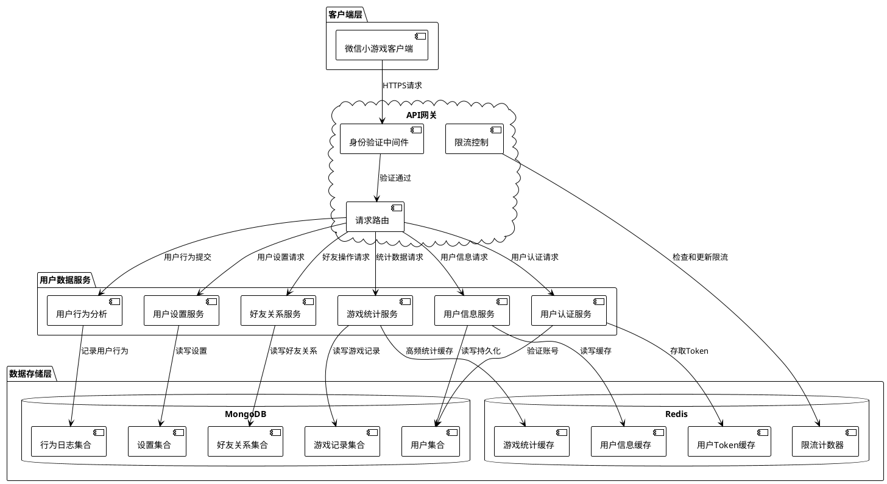
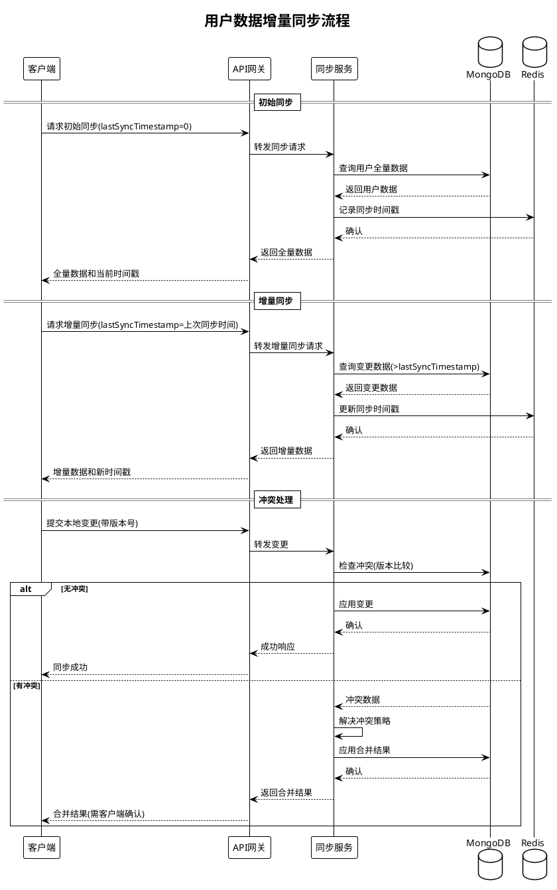
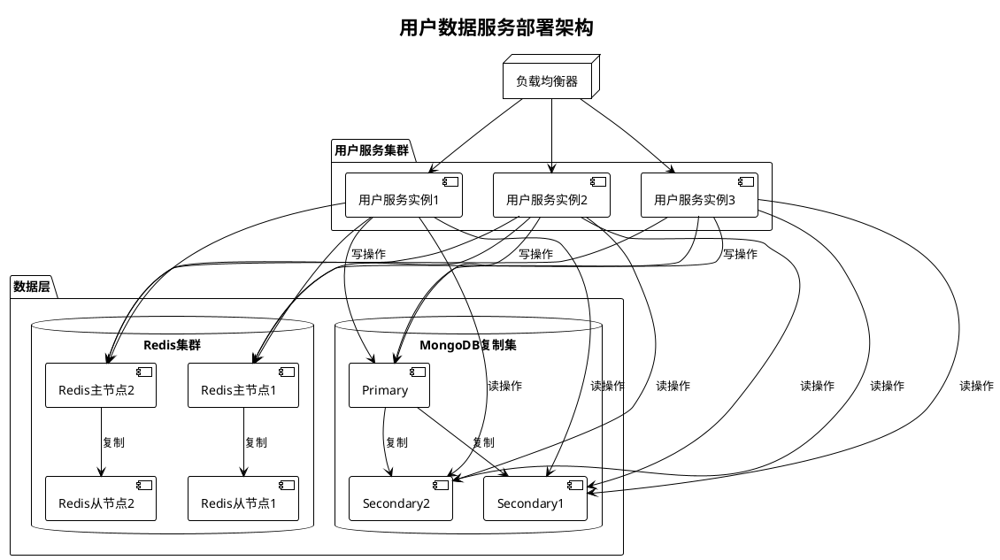

# 技术方案：用户数据管理

## 1. 整体架构

阿瓦隆微信小游戏的用户数据管理系统采用微服务架构，将用户数据存储和访问封装为独立的微服务，确保高可用性、可扩展性和安全性。



## 2. 数据模型设计

### 2.1 用户基本信息模型

```typescript
interface UserBasicInfo {
  _id: ObjectId; // MongoDB文档ID
  userId: string; // 用户唯一标识
  openId: string; // 微信OpenID
  unionId?: string; // 微信UnionID (如果有)
  nickname: string; // 用户昵称
  avatarUrl: string; // 头像URL
  gender?: number; // 性别（0:未知, 1:男, 2:女）
  region?: string; // 地区信息
  createdAt: Date; // 账号创建时间
  lastLoginAt: Date; // 最近登录时间
  isActive: boolean; // 账号是否活跃
  gameLevel: number; // 游戏等级
  reputation: number; // 信誉值
}
```

### 2.2 用户游戏统计模型

```typescript
interface UserGameStats {
  userId: string; // 用户ID
  totalGames: number; // 游戏总场次
  winCount: number; // 获胜场次
  goodSideCount: number; // 好人方场次
  evilSideCount: number; // 坏人方场次
  goodSideWins: number; // 好人方获胜次数
  evilSideWins: number; // 坏人方获胜次数
  roleStats: {
    // 角色统计
    [role: string]: {
      // 如'merlin', 'assassin'等
      count: number; // 扮演次数
      wins: number; // 获胜次数
    };
  };
  successfulMissions: number; // 成功完成的任务数
  failedMissions: number; // 失败的任务数
  voteAccuracy: number; // 投票准确率
  averageGameDuration: number; // 平均每局时长(分钟)
  lastUpdated: Date; // 最后更新时间
}
```

### 2.3 用户设置模型

```typescript
interface UserSettings {
  userId: string; // 用户ID
  preferences: {
    language: string; // 语言偏好
    soundEnabled: boolean; // 声音开关
    vibrationEnabled: boolean; // 震动开关
    notificationsEnabled: boolean; // 通知开关
    darkModeEnabled: boolean; // 暗黑模式
    autoReconnect: boolean; // 自动重连
  };
  gameSettings: {
    preferredRoles: string[]; // 偏好角色
    voteTimer: number; // 投票时间(秒)
    discussionTimer: number; // 讨论时间(秒)
    teamSelectionTimer: number; // 选择团队时间(秒)
  };
  privacy: {
    showOnlineStatus: boolean; // 显示在线状态
    allowFriendRequests: boolean; // 允许好友请求
    showGameHistory: boolean; // 显示游戏历史
  };
  lastUpdated: Date; // 最后更新时间
}
```

### 2.4 好友关系模型

```typescript
interface FriendRelation {
  _id: ObjectId; // MongoDB文档ID
  userId: string; // 用户ID
  friendId: string; // 好友ID
  status: FriendStatus; // 关系状态
  createdAt: Date; // 建立关系时间
  updatedAt: Date; // 关系更新时间
  lastGameTogether?: Date; // 最后一次一起游戏时间
  gameCountTogether: number; // 一起玩游戏次数
}

enum FriendStatus {
  PENDING = "pending", // 请求待通过
  ACCEPTED = "accepted", // 已接受
  BLOCKED = "blocked", // 已屏蔽
}
```

### 2.5 用户行为日志模型

```typescript
interface UserBehaviorLog {
  _id: ObjectId; // MongoDB文档ID
  userId: string; // 用户ID
  eventType: string; // 事件类型
  timestamp: Date; // 事件时间戳
  source: string; // 事件来源
  details: Record<string, any>; // 详细信息
  sessionId?: string; // 会话ID
  ipAddress?: string; // IP地址
  deviceInfo?: {
    // 设备信息
    platform: string; // 平台
    model: string; // 设备型号
    osVersion: string; // 操作系统版本
  };
}
```

## 3. API 设计

### 3.1 用户认证 API

| 路径            | 方法 | 说明       | 参数                  | 返回                           |
| --------------- | ---- | ---------- | --------------------- | ------------------------------ |
| `/auth/login`   | POST | 微信登录   | `code`: 微信登录 code | `token`, `userId`, `expiresIn` |
| `/auth/refresh` | POST | 刷新 Token | `refreshToken`        | 新的`token`和`refreshToken`    |
| `/auth/logout`  | POST | 登出       | 无                    | 成功状态                       |

### 3.2 用户信息 API

| 路径             | 方法  | 说明             | 参数         | 返回             |
| ---------------- | ----- | ---------------- | ------------ | ---------------- |
| `/users/me`      | GET   | 获取当前用户信息 | 无           | 用户基本信息     |
| `/users/me`      | PATCH | 更新用户信息     | 要更新的字段 | 更新后的用户信息 |
| `/users/:userId` | GET   | 获取指定用户信息 | `userId`     | 用户基本信息     |

### 3.3 用户统计 API

| 路径                   | 方法 | 说明             | 参数                            | 返回         |
| ---------------------- | ---- | ---------------- | ------------------------------- | ------------ |
| `/users/me/stats`      | GET  | 获取当前用户统计 | 无                              | 用户游戏统计 |
| `/users/:userId/stats` | GET  | 获取指定用户统计 | `userId`                        | 用户游戏统计 |
| `/leaderboard`         | GET  | 获取排行榜       | `type`: 排行类型, `limit`: 数量 | 排行榜数据   |

### 3.4 用户设置 API

| 路径                 | 方法  | 说明         | 参数         | 返回         |
| -------------------- | ----- | ------------ | ------------ | ------------ |
| `/users/me/settings` | GET   | 获取用户设置 | 无           | 用户设置数据 |
| `/users/me/settings` | PATCH | 更新用户设置 | 要更新的设置 | 更新后的设置 |

### 3.5 好友关系 API

| 路径                           | 方法   | 说明         | 参数                | 返回     |
| ------------------------------ | ------ | ------------ | ------------------- | -------- |
| `/friends`                     | GET    | 获取好友列表 | `status`: 关系状态  | 好友列表 |
| `/friends/request`             | POST   | 发送好友请求 | `friendId`          | 请求状态 |
| `/friends/:friendId`           | DELETE | 删除好友     | `friendId`          | 成功状态 |
| `/friends/requests`            | GET    | 获取好友请求 | 无                  | 请求列表 |
| `/friends/requests/:requestId` | PATCH  | 处理好友请求 | `action`: 接受/拒绝 | 更新状态 |

## 4. 数据安全方案

### 4.1 数据加密策略

1. **传输层加密**

   - 所有 API 通信使用 TLS/HTTPS 加密
   - WebSocket 连接使用 WSS 协议

2. **存储加密**

   - 敏感用户数据使用 AES-256 加密存储
   - 数据库级别使用 MongoDB 内置加密功能

3. **身份验证**
   - 采用 JWT(JSON Web Token)进行身份验证
   - 令牌设置适当的过期时间
   - 实现令牌轮换机制提高安全性

```typescript
// JWT签发示例
function generateTokens(userId: string): {
  accessToken: string;
  refreshToken: string;
} {
  const accessToken = jwt.sign({ userId }, process.env.JWT_SECRET, {
    expiresIn: "2h",
  });

  const refreshToken = jwt.sign(
    { userId, tokenType: "refresh" },
    process.env.JWT_REFRESH_SECRET,
    { expiresIn: "30d" }
  );

  return { accessToken, refreshToken };
}
```

### 4.2 数据访问控制

1. **权限模型**

   - 基于角色的访问控制(RBAC)
   - 用户只能访问自己的数据
   - 管理员有额外的系统管理权限

2. **API 访问限制**
   - 实现请求限流(Rate Limiting)
   - 基于 IP 和用户 ID 的访问频率控制
   - 防止暴力破解和 DDoS 攻击

```typescript
// Redis实现的限流中间件
const rateLimiter = rateLimit({
  windowMs: 15 * 60 * 1000, // 15分钟窗口
  max: 100, // 每个IP限制请求次数
  standardHeaders: true,
  store: new RedisStore({
    client: redisClient,
    prefix: "rate-limit:",
  }),
});
```

### 4.3 数据备份与恢复

1. **定时备份**

   - 每日完整数据库备份
   - 每小时增量备份

2. **多区域备份**

   - 主数据中心备份
   - 异地容灾备份

3. **恢复方案**
   - 自动恢复流程
   - 时间点恢复(Point-in-time Recovery)

## 5. 数据同步机制

### 5.1 增量同步设计



### 5.2 离线数据处理

1. **本地缓存**

   - 客户端保存关键用户数据的本地副本
   - 支持离线查看个人统计和设置

2. **离线操作队列**

   - 客户端维护离线操作日志
   - 重连后按顺序同步至服务器

3. **冲突解决策略**
   - 基于时间戳的冲突检测
   - 服务器端最终一致性原则
   - 特殊字段采用自定义合并策略

## 6. 缓存策略

### 6.1 Redis 缓存层设计

1. **缓存内容**

   - 用户基本信息(高频访问)
   - 认证 Token
   - 游戏统计摘要
   - 好友关系

2. **缓存更新策略**

   - 写穿策略(Write-Through)：同时更新缓存和数据库
   - 设置合理的 TTL(Time-To-Live)
   - 主动失效机制

3. **缓存键设计**
   ```
   用户信息: user:info:{userId}
   用户统计: user:stats:{userId}
   用户设置: user:settings:{userId}
   好友列表: user:friends:{userId}
   令牌存储: user:token:{userId}
   ```

### 6.2 缓存代码实现示例

```typescript
// 用户信息缓存服务示例
export class UserCacheService {
  constructor(
    private readonly redisClient: Redis,
    private readonly userRepository: UserRepository
  ) {}

  private readonly USER_INFO_PREFIX = "user:info:";
  private readonly CACHE_TTL = 3600; // 1小时

  async getUserInfo(userId: string): Promise<UserBasicInfo> {
    const cacheKey = `${this.USER_INFO_PREFIX}${userId}`;

    // 尝试从缓存获取
    const cachedData = await this.redisClient.get(cacheKey);
    if (cachedData) {
      return JSON.parse(cachedData);
    }

    // 缓存未命中，从数据库获取
    const userData = await this.userRepository.findById(userId);
    if (!userData) {
      throw new NotFoundException("User not found");
    }

    // 存入缓存
    await this.redisClient.set(
      cacheKey,
      JSON.stringify(userData),
      "EX",
      this.CACHE_TTL
    );

    return userData;
  }

  async updateUserInfo(
    userId: string,
    updateData: Partial<UserBasicInfo>
  ): Promise<UserBasicInfo> {
    // 更新数据库
    const updatedUser = await this.userRepository.update(userId, updateData);

    // 更新缓存
    const cacheKey = `${this.USER_INFO_PREFIX}${userId}`;
    await this.redisClient.set(
      cacheKey,
      JSON.stringify(updatedUser),
      "EX",
      this.CACHE_TTL
    );

    return updatedUser;
  }

  async invalidateUserCache(userId: string): Promise<void> {
    const cacheKey = `${this.USER_INFO_PREFIX}${userId}`;
    await this.redisClient.del(cacheKey);
  }
}
```

## 7. 用户行为分析框架

### 7.1 行为跟踪设计

1. **关键行为指标**

   - 登录频率和时长
   - 游戏参与度
   - 社交互动情况
   - 功能使用偏好
   - 付费习惯(如适用)

2. **埋点方案**

   - 前端埋点：关键 UI 交互
   - 后端埋点：业务流程完成节点
   - 自动埋点：系统行为(如登录、退出)

3. **数据收集流程**

   ```plantuml
   @startuml
   !theme plain

   participant "客户端" as Client
   participant "行为收集API" as API
   queue "消息队列" as Queue
   participant "数据处理服务" as Processor
   database "MongoDB" as DB

   Client -> API: 提交行为数据
   API -> Queue: 发送到消息队列
   API --> Client: 确认接收

   loop 批量处理
     Queue -> Processor: 消费消息
     Processor -> Processor: 数据验证和转换
     Processor -> DB: 批量写入
   end

   @enduml
   ```

### 7.2 用户行为记录实现

```typescript
// 用户行为记录服务示例
export class UserBehaviorService {
  constructor(
    @InjectQueue("user-behavior") private behaviorQueue: Queue,
    private readonly logRepository: UserBehaviorLogRepository
  ) {}

  // 记录用户行为
  async trackEvent(dto: TrackEventDto): Promise<void> {
    const { userId, eventType, details, source } = dto;

    // 添加到消息队列进行异步处理
    await this.behaviorQueue.add("track-event", {
      userId,
      eventType,
      details,
      source,
      timestamp: new Date(),
      ipAddress: dto.ipAddress,
      deviceInfo: dto.deviceInfo,
    });
  }

  // 批量处理行为日志(由消息队列消费者调用)
  async processBehaviorEvents(events: UserBehaviorLog[]): Promise<void> {
    // 数据验证和清洗
    const validEvents = events.filter(
      (event) => event.userId && event.eventType && event.timestamp
    );

    if (validEvents.length === 0) return;

    // 批量插入数据库
    await this.logRepository.insertMany(validEvents);
  }

  // 查询用户行为
  async getUserBehavior(
    userId: string,
    filters: {
      startDate?: Date;
      endDate?: Date;
      eventTypes?: string[];
    }
  ): Promise<UserBehaviorLog[]> {
    const query: any = { userId };

    if (filters.startDate || filters.endDate) {
      query.timestamp = {};
      if (filters.startDate) query.timestamp.$gte = filters.startDate;
      if (filters.endDate) query.timestamp.$lte = filters.endDate;
    }

    if (filters.eventTypes && filters.eventTypes.length > 0) {
      query.eventType = { $in: filters.eventTypes };
    }

    return this.logRepository.find(query);
  }
}
```

## 8. 性能优化策略

### 8.1 数据库索引策略

MongoDB 索引设计：

```javascript
// 用户集合索引
db.users.createIndex({ userId: 1 }, { unique: true });
db.users.createIndex({ openId: 1 }, { unique: true });
db.users.createIndex({ nickname: 1 });
db.users.createIndex({ gameLevel: -1 });
db.users.createIndex({ lastLoginAt: -1 });

// 游戏统计集合索引
db.gameStats.createIndex({ userId: 1 }, { unique: true });
db.gameStats.createIndex({ totalGames: -1 });
db.gameStats.createIndex({ winCount: -1 });

// 好友关系集合索引
db.friendRelations.createIndex({ userId: 1, friendId: 1 }, { unique: true });
db.friendRelations.createIndex({ userId: 1, status: 1 });

// 行为日志集合索引
db.behaviorLogs.createIndex({ userId: 1, timestamp: -1 });
db.behaviorLogs.createIndex({ eventType: 1, timestamp: -1 });
db.behaviorLogs.createIndex({ timestamp: -1 });
```

### 8.2 查询优化

1. **投影操作**

   - 只查询需要的字段，减少数据传输量
   - 例如：`db.users.find({}, { nickname: 1, avatarUrl: 1 })`

2. **分页查询**

   - 所有列表接口实现分页
   - 使用 cursor-based 分页，避免深度分页问题

3. **批量操作**
   - 使用批量查询和更新减少数据库操作次数
   - 例如：`db.users.updateMany()` 替代循环单条更新

### 8.3 高并发处理

1. **连接池管理**

   - MongoDB 连接池合理配置
   - Redis 连接池优化

2. **请求合并**

   - 客户端批量请求策略
   - 服务端请求合并处理

3. **异步处理**
   - 非关键路径使用消息队列异步处理
   - 例如用户行为日志、统计数据更新等

## 9. 部署与扩展策略

1. **微服务部署**

   - 用户服务独立部署和扩展
   - 使用 Docker 容器化部署
   - Kubernetes 集群编排

2. **数据库扩展**

   - MongoDB 复制集确保高可用
   - 数据分片支持水平扩展
   - 读写分离优化性能

3. **缓存集群**
   - Redis 集群模式部署
   - Redis 哨兵保证高可用
   - 多级缓存策略



## 10. 监控与告警

1. **性能监控**

   - 服务响应时间
   - 数据库查询性能
   - 缓存命中率
   - API 调用频率

2. **错误追踪**

   - 异常日志收集
   - 错误模式分析
   - 实时告警机制

3. **用量监控**
   - 存储空间使用情况
   - API 调用配额
   - 用户增长趋势

## 11. 开发计划与验收标准

1. **开发里程碑**

   - 数据模型设计完成: D+5
   - 基础 API 实现: D+15
   - 缓存层实现: D+20
   - 同步机制实现: D+25
   - 性能优化: D+30
   - 测试与验收: D+35

2. **测试计划**

   - 单元测试覆盖率 >90%
   - API 集成测试
   - 性能测试(模拟 1000 用户并发)
   - 数据一致性测试
   - 安全渗透测试

3. **验收标准**
   - API 响应时间 <100ms(p95)
   - 数据访问成功率 >99.9%
   - 系统可用性 >99.9%
   - 数据同步延迟 <1s
