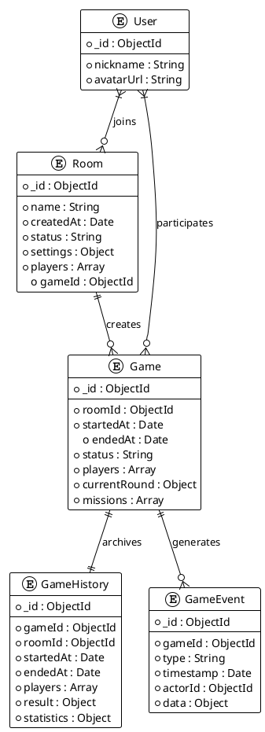

# Task 6.2.1: 游戏数据模型设计

## 任务描述

为阿瓦隆微信小游戏设计完整的游戏数据模型，包括游戏房间、游戏进程、游戏状态和历史记录等核心数据结构，确保数据模型能够准确表示游戏逻辑，并支持高效的数据操作和查询。

## 详细要求

### 1. 游戏房间数据模型

1. **房间基本信息**

   - 房间唯一标识
   - 房间名称和描述
   - 房间创建时间
   - 房间状态（等待中、游戏中、已结束）
   - 房间设置（角色配置、游戏参数）
   - 房间访问控制（公开、私有、密码保护）

2. **玩家信息**

   - 房间中的玩家列表
   - 玩家座位与顺序
   - 玩家准备状态
   - 玩家在线状态
   - 玩家角色分配

3. **房间计时器**
   - 房间生命周期定时
   - 游戏回合计时
   - 玩家操作计时
   - 计时器状态与调整机制

### 2. 游戏进程数据模型

1. **游戏基本信息**

   - 游戏唯一标识
   - 关联房间信息
   - 游戏开始时间
   - 游戏结束时间
   - 游戏当前状态
   - 游戏随机种子

2. **角色分配**

   - 玩家与角色映射
   - 阵营分布（正义/邪恶）
   - 特殊角色能力状态
   - 角色信息可见规则

3. **游戏回合信息**

   - 当前回合编号
   - 回合阶段（组队、投票、任务、刺杀等）
   - 当前队长位置
   - 回合历史记录
   - 回合超时处理

4. **任务信息**
   - 任务编号与状态
   - 任务所需人数
   - 队员选择结果
   - 任务投票结果
   - 任务成功/失败记录

### 3. 游戏状态数据模型

1. **实时游戏状态**

   - 当前游戏阶段
   - 活跃玩家指示
   - 可执行操作列表
   - 操作超时信息
   - 游戏进度指示

2. **玩家操作状态**

   - 等待操作的玩家
   - 已完成操作的玩家
   - 操作超时处理
   - 玩家操作历史

3. **游戏结果状态**
   - 游戏胜利阵营
   - 胜利条件达成描述
   - 关键决策点记录
   - MVP 评选数据

### 4. 游戏历史记录数据模型

1. **游戏对局存档**

   - 对局基本信息摘要
   - 参与玩家列表
   - 游戏结果概要
   - 游戏持续时间
   - 对局评分数据

2. **关键事件记录**

   - 事件时间戳
   - 事件类型
   - 事件参与者
   - 事件结果
   - 事件上下文数据

3. **玩家行为记录**
   - 投票历史
   - 任务成功/失败贡献
   - 队员选择记录
   - 发言时机与内容摘要
   - 关键决策表现

## 技术细节

### 1. 数据模型示例（MongoDB 集合设计）

#### 房间集合 (rooms)

```javascript
{
  _id: ObjectId("507f1f77bcf86cd799439011"),  // 房间ID
  name: "阿瓦隆世界",                         // 房间名称
  description: "欢迎加入我们的游戏",           // 房间描述
  createdAt: ISODate("2023-05-15T10:30:00Z"), // 创建时间
  createdBy: "user_12345",                    // 创建者ID
  status: "waiting",                          // 房间状态：waiting, playing, ended
  settings: {
    roleConfig: {                             // 角色配置
      merlin: true,
      assassin: true,
      percival: true,
      morgana: true,
      mordred: false,
      oberon: false
    },
    playerCount: {                            // 玩家人数配置
      min: 5,
      max: 8,
      current: 0
    },
    voteTimeLimit: 60,                        // 投票时间限制(秒)
    discussionTimeLimit: 120,                 // 讨论时间限制(秒)
    isPublic: true,                           // 是否公开房间
    password: null,                           // 房间密码(如有)
    allowSpeciators: true                     // 是否允许观战
  },
  players: [                                  // 玩家列表
    {
      userId: "user_12345",                   // 用户ID
      nickname: "骑士大人",                    // 昵称
      avatarUrl: "https://example.com/avatar/12345.jpg", // 头像
      isReady: true,                          // 准备状态
      isOnline: true,                         // 在线状态
      joinedAt: ISODate("2023-05-15T10:35:00Z"), // 加入时间
      seatIndex: 0,                           // 座位索引
      isHost: true                            // 是否房主
    },
    // ... 其他玩家
  ],
  spectators: [                               // 观战者列表
    {
      userId: "user_67890",
      nickname: "观察者",
      avatarUrl: "https://example.com/avatar/67890.jpg",
      joinedAt: ISODate("2023-05-15T10:40:00Z")
    }
  ],
  timers: {                                   // 计时器
    roomExpiry: ISODate("2023-05-15T11:30:00Z"), // 房间过期时间
    currentTimer: {                           // 当前活动计时器
      type: "waiting",                        // 计时器类型
      startedAt: ISODate("2023-05-15T10:45:00Z"), // 开始时间
      duration: 600,                          // 持续时间(秒)
      pausedAt: null                          // 暂停时间(如有)
    }
  },
  messages: [                                 // 房间消息
    {
      userId: "user_12345",
      nickname: "骑士大人",
      content: "大家准备好了吗？",
      timestamp: ISODate("2023-05-15T10:42:00Z"),
      type: "chat"                            // 消息类型: chat, system, etc.
    }
  ],
  gameId: null,                               // 关联的游戏ID(游戏开始后设置)
  lastActivityAt: ISODate("2023-05-15T10:45:00Z"), // 最后活动时间
  version: 12                                 // 乐观锁版本号
}
```

#### 游戏集合 (games)

```javascript
{
  _id: ObjectId("507f1f77bcf86cd799439012"),    // 游戏ID
  roomId: ObjectId("507f1f77bcf86cd799439011"), // 关联房间ID
  startedAt: ISODate("2023-05-15T11:00:00Z"),   // 游戏开始时间
  endedAt: null,                                // 游戏结束时间
  status: "playing",                            // 游戏状态: playing, ended
  players: [                                    // 玩家信息
    {
      userId: "user_12345",                     // 用户ID
      nickname: "骑士大人",                      // 昵称
      avatarUrl: "https://example.com/avatar/12345.jpg", // 头像
      role: "merlin",                           // 分配角色
      team: "good",                             // 阵营: good, evil
      seatIndex: 0,                             // 座位顺序
      isConnected: true,                        // 连接状态
      voteHistory: [],                          // 投票历史
      missionHistory: []                        // 任务历史
    },
    // ... 其他玩家
  ],
  roleDistribution: {                           // 角色分布
    good: ["merlin", "percival", "loyal_servant_1", "loyal_servant_2"],
    evil: ["assassin", "morgana", "evil_servant"]
  },
  randomSeed: "1234567890",                     // 随机数种子
  currentRound: {                               // 当前回合
    roundNumber: 1,                             // 回合编号
    phase: "team_selection",                    // 回合阶段: team_selection, team_vote, mission, assassination
    leaderIndex: 0,                             // 队长索引
    teamProposal: ["user_12345", "user_67890"], // 队员提议
    votes: [                                    // 投票情况
      {
        userId: "user_12345",
        vote: null                              // null表示尚未投票
      }
      // ... 其他玩家投票
    ],
    missionResults: [],                         // 任务结果
    startedAt: ISODate("2023-05-15T11:02:00Z"), // 回合开始时间
    timer: {                                    // 回合计时器
      duration: 60,                             // 持续时间(秒)
      startedAt: ISODate("2023-05-15T11:02:00Z"), // 开始时间
      pausedAt: null                            // 暂停时间(如有)
    }
  },
  rounds: [                                     // 回合历史
    // 以前回合的数据，格式同currentRound
  ],
  missions: [                                   // 任务记录
    {
      missionNumber: 1,                         // 任务编号
      requiredPlayers: 2,                       // 所需玩家数
      status: "pending",                        // 任务状态: pending, success, fail
      teamMembers: [],                          // 执行队员
      successVotes: 0,                          // 成功票数
      failVotes: 0,                             // 失败票数
      roundNumber: 1                            // 关联回合编号
    },
    // ... 其他任务
  ],
  voteTrack: 0,                                 // 投票轨道(连续投票失败次数)
  missionTrack: {                               // 任务轨道
    success: 0,                                 // 成功任务数
    fail: 0                                     // 失败任务数
  },
  winner: null,                                 // 胜利方: good, evil
  assassinationTarget: null,                    // 刺客刺杀目标
  specialAbilities: {                           // 特殊能力使用情况
    // 根据游戏具体角色设计
  },
  gameEvents: [                                 // 游戏事件记录
    {
      type: "game_start",                       // 事件类型
      timestamp: ISODate("2023-05-15T11:00:00Z"), // 事件时间
      data: { /* 事件相关数据 */ }
    }
    // ... 其他事件
  ],
  visibilityRules: {                            // 信息可见性规则
    merlin: ["morgana", "assassin", "evil_servant"],
    percival: ["merlin", "morgana"],
    // ... 其他规则
  },
  version: 5                                    // 乐观锁版本号
}
```

#### 游戏历史记录集合 (gameHistories)

```javascript
{
  _id: ObjectId("507f1f77bcf86cd799439013"),    // 历史记录ID
  gameId: ObjectId("507f1f77bcf86cd799439012"), // 关联游戏ID
  roomId: ObjectId("507f1f77bcf86cd799439011"), // 关联房间ID
  startedAt: ISODate("2023-05-15T11:00:00Z"),   // 游戏开始时间
  endedAt: ISODate("2023-05-15T11:45:00Z"),     // 游戏结束时间
  duration: 2700,                               // 游戏持续时间(秒)
  players: [                                    // 玩家摘要
    {
      userId: "user_12345",                     // 用户ID
      nickname: "骑士大人",                      // 昵称
      role: "merlin",                           // 角色
      team: "good",                             // 阵营
      performance: {                            // 表现数据
        votingAccuracy: 0.85,                   // 投票准确率
        teamSelectionQuality: 0.7,              // 队伍选择质量
        missionSuccess: 2,                      // 参与成功任务数
        leadershipCount: 1                      // 担任队长次数
      }
    },
    // ... 其他玩家
  ],
  result: {                                     // 游戏结果
    winner: "good",                             // 胜利方
    winCondition: "missions",                   // 胜利条件: missions, assassination
    mvp: "user_12345",                          // MVP玩家
    keyMoment: {                                // 关键时刻
      type: "critical_vote",                    // 类型
      roundNumber: 3,                           // 回合
      description: "第三轮关键投票成功通过"      // 描述
    }
  },
  missionsSummary: [                            // 任务总结
    {
      missionNumber: 1,
      result: "success",
      teamMembers: ["user_12345", "user_67890"],
      votes: { success: 2, fail: 0 }
    },
    // ... 其他任务
  ],
  roundsSummary: [                              // 回合总结
    {
      roundNumber: 1,
      leader: "user_12345",
      teamProposals: [["user_12345", "user_67890"]],
      votes: [
        { proposal: 0, approvals: 4, rejections: 1 }
      ],
      finalTeam: ["user_12345", "user_67890"],
      missionResult: "success"
    },
    // ... 其他回合
  ],
  statistics: {                                 // 统计数据
    totalVotes: 15,                             // 总投票数
    approvalRate: 0.67,                         // 队伍批准率
    averageTeamSize: 2.5,                       // 平均队伍大小
    rejectedTeams: 2,                           // 被拒绝队伍数
    totalDiscussionTime: 850                    // 总讨论时间(秒)
  },
  replayAvailable: true,                        // 是否可回放
  replayDataUrl: "https://storage.example.com/replays/game_12345.json", // 回放数据URL
  createdAt: ISODate("2023-05-15T11:46:00Z"),   // 记录创建时间
  tags: ["intense", "close_game", "good_win"]   // 标签
}
```

### 2. 数据关联关系图



### 3. 数据版本控制与冲突解决策略

1. **乐观锁机制**

   - 每个文档包含 version 字段，用于检测并发修改
   - 更新操作必须包含当前版本号，不匹配则拒绝更新
   - 使用 MongoDB 的 findOneAndUpdate 操作，查询条件包含版本号
   - 更新成功后递增版本号

   ```javascript
   // 乐观锁更新示例
   const updateResult = await db.collection("games").findOneAndUpdate(
     { _id: gameId, version: currentVersion },
     {
       $set: {
         /* 更新字段 */
       },
       $inc: { version: 1 },
     },
     { returnDocument: "after" }
   );

   if (!updateResult.value) {
     // 版本冲突处理
     throw new ConflictError("游戏状态已被其他操作修改，请重试");
   }
   ```

2. **事件溯源模式**

   - 游戏状态变更以事件形式记录
   - 游戏完整状态可从事件序列重建
   - 冲突处理基于事件顺序和优先级规则
   - 支持游戏回放和状态还原

   ```javascript
   // 事件记录示例
   const gameEvent = {
     gameId: gameId,
     type: "team_proposal",
     timestamp: new Date(),
     actorId: userId,
     data: {
       roundNumber: 1,
       proposedTeam: ["user_1", "user_2"],
     },
     version: 1,
   };

   await db.collection("gameEvents").insertOne(gameEvent);
   ```

3. **字段级冲突解决**

   - 细粒度更新操作，仅更新必要字段
   - 关键字段使用原子操作（如$inc, $push 等）
   - 合并策略取决于字段类型和业务规则
   - 记录冲突日志以便分析和改进

   ```javascript
   // 字段级更新示例 - 添加投票
   await db.collection("games").updateOne(
     { _id: gameId, "currentRound.votes.userId": userId },
     {
       $set: {
         "currentRound.votes.$.vote": vote,
         lastModifiedAt: new Date(),
       },
     }
   );
   ```

4. **冲突自动解决规则**
   - 时间戳优先：较新的修改覆盖较旧的
   - 角色权限优先：特定操作中，优先级较高的角色操作优先
   - 状态转换限制：定义有效的状态转换路径，拒绝无效转换
   - 服务器决策优先：客户端冲突以服务器状态为准

## 验收标准

1. 数据模型完整定义，覆盖游戏全部核心功能
2. 模型设计符合 MongoDB 最佳实践，支持高效查询
3. 关联关系清晰，保证数据完整性和一致性
4. 版本控制机制有效处理并发操作，避免数据覆盖
5. 事件模型支持游戏状态重建和回放功能
6. 字段设计合理，避免文档过大，支持部分更新
7. 冲突解决策略完整并在极端情况下仍能保持数据一致性
8. 索引设计优化查询性能，支持高并发操作
9. 完成模型验证测试，确保数据完整性约束生效
10. 技术文档完整，包含模型定义、使用示例和最佳实践

## 依赖关系

- 依赖 Story6.1 中的用户数据模型设计
- 为 Task6.2.2 游戏数据存储服务提供基础
- 为 Task6.2.3 游戏状态同步机制提供数据结构支持
- 为 Task6.2.4 游戏数据访问 API 提供数据模型参考

## 工作量估计

- 游戏房间数据模型设计：1 人天
- 游戏进程数据模型设计：1.5 人天
- 游戏状态数据模型设计：1 人天
- 历史记录数据模型设计：1 人天
- 关联关系与索引设计：0.5 人天
- 版本控制与冲突解决策略：1 人天
- 数据模型验证与测试：1 人天
- 文档编写：1 人天

总计：约 8 人天
