# Task 6.2.3: 游戏状态同步机制

## 1. 任务描述

本任务旨在设计和实现阿瓦隆游戏的实时状态同步机制，确保游戏进程中的所有玩家能够实时获取游戏状态变更，保持状态一致性，并支持断线重连时的状态恢复。该机制是游戏多人协作体验的核心支撑，将直接影响游戏的流畅度和用户体验。

游戏状态同步机制需要解决以下关键问题：

- 在多玩家环境下如何保持游戏状态的实时同步
- 如何处理网络延迟和不稳定连接导致的状态不一致
- 玩家断线重连后如何快速恢复游戏状态
- 多个客户端同时操作时如何避免冲突和保持数据一致性
- 如何在保证游戏公平性的前提下优化同步性能

通过实现高效、可靠的状态同步机制，使玩家能够沉浸在流畅的游戏体验中，即使在网络环境不佳的情况下也能保持游戏的连贯性。

## 2. 功能需求

### 2.1 实时游戏状态同步协议

实时游戏状态同步协议是游戏客户端与服务器之间交换游戏状态信息的标准化通信规则，需要满足以下功能需求：

- **协议基础要求**：

  - 定义基于 WebSocket 的二进制或 JSON 消息格式
  - 支持全量状态同步和增量状态更新
  - 包含消息序列号和时间戳，确保顺序性
  - 支持消息确认机制，实现可靠传输
  - 内置心跳机制，检测连接健康状态

- **状态消息类型**：

  - 游戏初始状态（全量）：包含完整游戏配置和初始状态
  - 状态变更消息（增量）：仅包含变更的状态字段
  - 玩家操作消息：客户端发送的游戏操作
  - 系统事件消息：服务端产生的游戏事件
  - 同步控制消息：用于协调同步过程的控制信息

- **状态粒度控制**：

  - 按角色权限过滤状态信息（如：邪恶方玩家不应看到梅林身份）
  - 支持细粒度的状态访问控制
  - 区分公开状态和私有状态
  - 提供状态变更范围控制，减少网络传输量

- **优先级与延迟处理**：

  - 为不同类型的状态更新定义优先级
  - 关键操作（如投票）具有高优先级
  - 支持延迟补偿策略
  - 实现平滑状态过渡机制

- **版本与兼容性**：
  - 支持协议版本号，确保向后兼容
  - 客户端与服务端版本协商机制
  - 支持协议升级过程中的平滑过渡
  - 兼容不同设备和网络条件的差异化处理

### 2.2 游戏状态变更推送机制

游戏状态变更推送机制负责将游戏状态的变化实时传递给所有相关玩家，确保游戏体验的连贯性和一致性，需要满足以下功能需求：

- **推送触发机制**：

  - 玩家操作引起的状态变更自动触发推送
  - 系统事件（如计时器到期）触发的状态变更推送
  - 管理员干预操作导致的状态变更推送
  - 定期状态同步检查触发的推送

- **推送目标选择**：

  - 基于玩家角色的定向推送
  - 全房间广播机制
  - 按状态变更相关性进行推送过滤
  - 支持观战者模式的特殊状态推送

- **推送策略优化**：

  - 状态变更批量处理和合并推送
  - 基于网络质量的自适应推送频率
  - 低优先级状态更新的延迟发送
  - 关键状态变更的立即推送

- **推送质量保障**：

  - 关键状态变更的确认回执机制
  - 推送消息的超时重试策略
  - 消息丢失检测与恢复机制
  - 推送执行状态监控和日志记录

- **推送流量控制**：
  - 单个客户端的推送速率限制
  - 推送队列优先级管理
  - 网络拥塞时的降级推送策略
  - 大型状态变更的分片推送

### 2.3 断线重连状态恢复功能

断线重连状态恢复功能确保玩家因网络问题临时断开连接后，能够快速、无缝地重新加入游戏并恢复当前游戏状态，需要满足以下功能需求：

- **会话保持机制**：

  - 客户端断开连接后的会话保持时间（至少 5 分钟）
  - 会话标识符生成与验证
  - 长时间断线的会话过期策略
  - 角色临时 AI 托管选项

- **重连身份验证**：

  - 快速重连认证流程
  - 断线前状态校验机制
  - 防止非授权玩家接管
  - 重连尝试次数限制与冷却时间

- **状态恢复策略**：

  - 根据断线时长选择恢复策略（增量/全量）
  - 状态快照与事件日志结合的恢复机制
  - 优先恢复关键游戏状态
  - 分批次有序恢复完整状态

- **游戏连续性保障**：

  - 重连过程中游戏状态的临时冻结
  - 其他玩家的重连状态通知
  - 重连后的游戏进度对齐
  - 玩家重连后的操作时间补偿

- **多设备重连处理**：

  - 同一账号多设备重连的冲突解决
  - 设备切换时的状态迁移
  - 不同设备类型的状态适配
  - 设备能力差异下的降级恢复策略

- **重连失败处理**：
  - 多次重连失败后的备选方案
  - 长时间无法重连的游戏影响最小化
  - 异常情况下的手动恢复机制
  - 重连过程的完整日志记录

### 2.4 多端状态一致性保障机制

多端状态一致性保障机制确保在不同终端设备、不同网络环境下的玩家能够享有一致的游戏状态和体验，防止状态偏差和不同步问题，需要满足以下功能需求：

- **状态权威认定**：

  - 服务器作为唯一状态权威源
  - 客户端状态预测与服务器状态校正机制
  - 状态变更的确认与验证流程
  - 异常状态的检测与纠正机制

- **状态同步检查点**：

  - 定期全量状态校验点设置
  - 关键游戏阶段的强制同步
  - 状态哈希值快速比对机制
  - 差异检测时的自动恢复流程

- **时间同步机制**：

  - 服务器与客户端的时钟同步
  - 网络延迟的测量与补偿
  - 操作时序的统一处理
  - 时间敏感操作的特殊处理策略

- **多端适配策略**：

  - 不同终端设备的状态表示一致性
  - UI 呈现差异下的状态映射规则
  - 设备性能差异的兼容处理
  - 新旧客户端版本的状态兼容性保障

- **状态同步监控**：

  - 实时监测客户端状态一致性
  - 状态偏差程度的量化评估
  - 异常客户端的标记与处理
  - 系统级别的同步健康度报告

- **降级保障策略**：
  - 严重网络波动时的最小状态同步保障
  - 部分状态不一致时的游戏体验保障
  - 非关键状态的延迟同步处理
  - 极端条件下的服务降级方案

### 2.5 状态冲突解决策略

状态冲突解决策略处理多个客户端同时操作或网络延迟导致的状态冲突问题，确保游戏状态的一致性和公平性，需要满足以下功能需求：

- **冲突检测机制**：

  - 基于版本号的冲突检测
  - 时间戳与序列号结合的判定策略
  - 并发操作的识别与标记
  - 状态偏差程度的评估方法

- **冲突类型分类**：

  - 同一资源的并发修改冲突
  - 操作顺序依赖的时序冲突
  - 客户端状态预测与服务器状态不一致
  - 玩家意图与游戏规则冲突

- **冲突解决策略**：

  - 基于时间优先的解决策略（先到先得）
  - 基于角色权重的优先级策略
  - 游戏规则约束下的有效性判定
  - 服务器最终裁决机制

- **状态回滚与重播**：

  - 冲突检测后的状态回滚机制
  - 基于事件日志的状态重播
  - 最小影响范围的局部回滚
  - 回滚操作的平滑过渡处理

- **用户体验保障**：

  - 冲突解决过程对用户的透明度控制
  - 冲突发生时的用户提示机制
  - 降低冲突感知对游戏体验的影响
  - 特殊冲突情况下的补偿措施

- **异常处理机制**：
  - 无法自动解决的冲突上报机制
  - 严重冲突下的游戏状态保护
  - 长时间冲突的超时处理
  - 冲突解决失败的备选方案

## 3. 技术规格

### 3.1 WebSocket 通信架构

阿瓦隆游戏的实时状态同步将基于 WebSocket 技术实现高效、稳定的双向通信，通信架构技术规格如下：

#### 3.1.1 整体架构

- **服务端架构**：

  - 采用 Node.js + Socket.IO 或 ws 库实现 WebSocket 服务
  - 支持水平扩展的集群模式部署
  - 每个游戏房间独立的通信通道
  - 使用 Redis Pub/Sub 实现跨节点消息同步

- **通信层次结构**：

  ```
  ┌─────────────────────────────────┐
  │           客户端应用层           │
  │  (游戏状态管理、UI渲染、用户交互)  │
  └───────────────┬─────────────────┘
                  │
  ┌───────────────▼─────────────────┐
  │          客户端通信层            │
  │ (WebSocket客户端、消息序列化/反序列化) │
  └───────────────┬─────────────────┘
                  │
                  ▼
          ┌───────────────┐
          │   微信小游戏API  │
          └───────┬───────┘
                  │
                  ▼
          ┌───────────────┐
          │   互联网/NAT    │
          └───────┬───────┘
                  │
                  ▼
  ┌───────────────────────────────────┐
  │          负载均衡层              │
  │      (Nginx/HAProxy)            │
  └───────────────┬─────────────────┘
                  │
  ┌───────────────▼─────────────────┐
  │         WebSocket服务器集群      │
  │ (连接管理、消息路由、会话维护)      │
  └───────────────┬─────────────────┘
                  │
  ┌───────────────▼─────────────────┐
  │           游戏逻辑层             │
  │ (状态处理、事件处理、业务逻辑)      │
  └───────────────┬─────────────────┘
                  │
  ┌───────────────▼─────────────────┐
  │           数据持久层             │
  │ (MongoDB存储、Redis缓存)         │
  └─────────────────────────────────┘
  ```

- **连接管理**：
  - 最大并发连接数：每服务节点支持 10,000+连接
  - 单房间最大连接数：标准 8 人+观战者（最多 20 人）
  - 连接状态监控：活跃/闲置/断开/重连中
  - 房间连接分片：相同房间的连接尽量路由到同一节点

#### 3.1.2 连接规格

- **WebSocket 配置**：

  - 协议：标准 WebSocket 协议（RFC 6455）
  - 子协议：'avalon-game-v1'
  - 压缩：支持 Per-message Deflate 扩展
  - 最大消息大小：256KB
  - 心跳间隔：20 秒

- **连接安全性**：

  - 传输加密：TLS 1.3
  - 连接认证：JWT 令牌验证
  - 消息完整性：包含校验和
  - 防重放攻击：包含随机 nonce 值

- **连接可靠性**：
  - 自动重连策略：指数退避算法（初始 100ms，最大 10s）
  - 重连最大尝试次数：10 次
  - 连接保活机制：双向心跳包
  - 异常检测：30 秒无响应判定为异常

#### 3.1.3 性能指标

- **延迟要求**：

  - 消息传输平均延迟：< 100ms
  - 消息处理时间：< 50ms
  - 状态同步延迟：< 200ms
  - 重连恢复时间：< 2 秒

- **吞吐量指标**：

  - 单房间消息吞吐量：50 条/秒
  - 单服务器节点消息处理能力：10,000 条/秒
  - 单客户端发送限制：10 条/秒
  - 单客户端接收能力：20 条/秒

- **资源占用**：
  - 客户端内存占用：< 10MB
  - 客户端 CPU 占用：< 5%
  - 单连接服务端内存：约 50KB
  - 网络带宽消耗：平均 100KB/min/用户

#### 3.1.4 故障恢复机制

- **服务端故障恢复**：

  - 节点故障自动转移：< 10 秒
  - 会话状态持久化：Redis
  - 集群健康检查频率：5 秒
  - 自动扩缩容触发条件：CPU > 70% 或 内存 > 80%

- **网络故障处理**：
  - 网络抖动容忍度：500ms 内的抖动不触发重连
  - 短暂断线（<30 秒）：自动重连并恢复
  - 长时间断线：会话保持并等待重连
  - 极端网络条件：降级同步策略启动

### 3.2 状态同步协议设计

阿瓦隆游戏的状态同步协议定义了游戏状态数据的交换格式、同步策略和消息处理机制，以确保所有客户端能够保持一致的游戏状态，技术规格如下：

#### 3.2.1 消息格式规范

- **基本消息结构**：

  ```json
  {
    "header": {
      "msgId": "m123456789", // 消息唯一ID
      "msgType": "STATE_UPDATE", // 消息类型
      "gameId": "G987654321", // 游戏ID
      "roomId": "R123456789", // 房间ID
      "senderId": "U123456789", // 发送者ID
      "timestamp": 1623456789123, // 发送时间戳
      "sequence": 42, // 消息序列号
      "version": 2 // 协议版本
    },
    "payload": {
      // 消息主体内容
      // 根据msgType不同，结构不同
    },
    "meta": {
      // 元数据
      "compression": "none", // 压缩方式
      "encryption": "none", // 加密方式
      "priority": 1, // 优先级(0-9)
      "ttl": 30, // 生存时间(秒)
      "nonce": "abc123def456" // 防重放随机值
    }
  }
  ```

- **消息类型定义**：

  | 消息类型      | 描述         | 方向            | 优先级 |
  | ------------- | ------------ | --------------- | ------ |
  | HANDSHAKE     | 连接握手消息 | 双向            | 9      |
  | ACK           | 消息确认回执 | 双向            | 9      |
  | HEARTBEAT     | 心跳包       | 双向            | 8      |
  | FULL_STATE    | 全量游戏状态 | 服务器 → 客户端 | 7      |
  | STATE_UPDATE  | 状态增量更新 | 服务器 → 客户端 | 6      |
  | GAME_EVENT    | 游戏事件通知 | 服务器 → 客户端 | 5      |
  | PLAYER_ACTION | 玩家操作     | 客户端 → 服务器 | 6      |
  | STATE_REQUEST | 状态请求     | 客户端 → 服务器 | 4      |
  | SYNC_CHECK    | 同步状态检查 | 双向            | 3      |
  | ERROR         | 错误通知     | 双向            | 7      |
  | SYSTEM_NOTICE | 系统通知     | 服务器 → 客户端 | 2      |

- **状态更新格式**：
  ```json
  // STATE_UPDATE消息payload示例
  {
    "stateVersion": 103, // 状态版本号
    "baseVersion": 100, // 基准版本号
    "updateType": "incremental", // 更新类型
    "changes": [
      // 变更集合
      {
        "path": "currentRound", // 变更路径
        "op": "replace", // 操作类型
        "value": 2 // 新值
      },
      {
        "path": "players.1.status", // 嵌套路径
        "op": "replace",
        "value": "READY"
      },
      {
        "path": "rounds[1]", // 数组操作
        "op": "add",
        "value": {
          /* round object */
        }
      }
    ],
    "events": [
      // 关联事件
      {
        "eventId": "E123456789",
        "type": "ROUND_STARTED",
        "timestamp": 1623456789123,
        "data": {
          /* event data */
        }
      }
    ]
  }
  ```

#### 3.2.2 同步策略

- **全量同步策略**：

  - 触发条件：
    - 玩家初次加入游戏
    - 玩家断线重连超过阈值时间
    - 状态不一致检测到严重偏差
    - 关键游戏阶段转换点
  - 实现方式：
    - 一次性传输完整游戏状态
    - 可选分块传输（大状态）
    - 包含状态版本号和时间戳
    - 替换客户端整个状态

- **增量同步策略**：

  - 触发条件：
    - 游戏状态发生变化
    - 客户端请求特定状态更新
    - 定期增量同步检查点
  - 实现方式：
    - 仅传输变更部分
    - 使用 JSON Patch 格式描述变更
    - 基于版本号的增量计算
    - 变更路径支持通配符

- **定向同步策略**：

  - 根据玩家角色和权限筛选状态
  - 私有信息仅发送给授权玩家
  - 观战者接收特殊处理后的状态
  - 支持状态字段级别的可见性控制

- **自适应同步策略**：
  - 根据网络条件调整同步频率
  - 高延迟环境下合并非关键更新
  - 弱网环境启用状态压缩
  - 网络质量分层推送策略

#### 3.2.3 序列化与编码

- **序列化选项**：

  - 主要格式：JSON（兼容性好，调试方便）
  - 可选格式：MessagePack（体积小，处理快）
  - 大型二进制数据单独传输
  - 内嵌类型信息确保正确解析

- **消息编码优化**：

  - 字段名压缩：常用字段使用短名称
  - 枚举值数字化：状态常量使用数字代码
  - 数值压缩：使用合适的数据类型
  - 增量编码：仅包含变更部分

- **数据压缩**：
  - 大于 1KB 的消息自动启用压缩
  - 支持 gzip 和 deflate 压缩算法
  - 可配置的压缩级别（速度 vs 压缩比）
  - 客户端声明支持的压缩能力

#### 3.2.4 消息处理流程

- **发送流程**：

  1. 状态变更触发发送请求
  2. 根据接收者过滤状态内容
  3. 增量计算需要发送的变更
  4. 序列化并可选压缩消息
  5. 添加消息头和元数据
  6. 通过 WebSocket 发送消息

- **接收流程**：

  1. 接收 WebSocket 消息
  2. 验证消息完整性和来源
  3. 解压缩并反序列化消息
  4. 检查消息序列号确保顺序
  5. 应用状态变更或处理事件
  6. 发送确认回执（如需要）

- **确认机制**：
  - 关键消息需要接收方确认
  - 确认超时后自动重发策略
  - 批量确认减少消息数量
  - 支持显式和隐式确认方式

### 3.3 状态恢复机制

阿瓦隆游戏的状态恢复机制负责确保玩家断线后能快速恢复游戏状态，提供无缝的游戏体验，技术规格如下：

#### 3.3.1 会话管理与保持

- **会话标识与存储**：

  - 会话标识符格式：`sessionId = uuid-v4`
  - 会话数据存储：Redis 中使用哈希结构
  - 键名格式：`avalon:session:{sessionId}`
  - 过期时间：默认 5 分钟，可配置

- **会话数据内容**：

  ```json
  {
    "sessionId": "1a2b3c4d-5e6f-7g8h-9i0j",
    "userId": "U123456789",
    "gameId": "G987654321",
    "roomId": "R123456789",
    "deviceId": "D123456789",
    "connectionInfo": {
      "ip": "192.168.1.1",
      "userAgent": "...",
      "lastActiveTime": 1623456789123,
      "connectionStatus": "DISCONNECTED"
    },
    "gameState": {
      "lastStateVersion": 103,
      "lastSequenceReceived": 42,
      "lastSequenceSent": 65,
      "playerRole": "MERLIN",
      "inGameStatus": "ACTIVE",
      "disconnectTime": 1623456789123
    }
  }
  ```

- **会话刷新策略**：

  - 活跃会话自动续期（heartbeat 触发）
  - 重要游戏阶段强制会话刷新
  - 会话合并策略（多设备登录）
  - 会话清理时机：游戏结束或过期

- **AI 托管转换**：
  - 会话无响应超过 2 分钟启动 AI 托管
  - AI 托管角色的行为策略定义
  - 托管状态显示与通知机制
  - 玩家重连后的托管解除流程

#### 3.3.2 状态存储与快照

- **状态快照策略**：

  - 生成粒度：
    - 关键游戏节点强制快照
    - 时间间隔自动快照（30 秒）
    - 状态变更累积阈值快照（>10 次变更）
  - 存储结构：
    ```json
    {
      "snapshotId": "S123456789",
      "gameId": "G987654321",
      "roomId": "R123456789",
      "timestamp": 1623456789123,
      "stateVersion": 103,
      "globalState": {
        /* 全局状态 */
      },
      "playerStates": {
        "U123456789": {
          /* 玩家状态 */
        }
        // 其他玩家...
      },
      "gamePhase": "TEAM_BUILDING",
      "roundNumber": 2,
      "checksum": "abc123def456"
    }
    ```
  - 存储位置：Redis + MongoDB 冷备份
  - 淘汰策略：仅保留最近 5 个快照，游戏结束后 12 小时删除

- **增量事件日志**：

  - 格式定义：
    ```json
    {
      "eventId": "E123456789",
      "gameId": "G987654321",
      "roomId": "R123456789",
      "timestamp": 1623456789123,
      "sourceStateVersion": 100,
      "targetStateVersion": 101,
      "eventType": "PLAYER_VOTE",
      "originatorId": "U123456789",
      "payload": {
        /* 事件数据 */
      },
      "stateChanges": [
        { "path": "votes.round2.U123456789", "op": "add", "value": true }
      ]
    }
    ```
  - 存储策略：按房间分区的时序数据库
  - 索引优化：基于游戏 ID、房间 ID、时间范围
  - 查询模式：范围查询（开始版本到结束版本）

- **二级缓存架构**：
  - 热数据层：内存缓存，保存当前活跃游戏状态
  - 温数据层：Redis，保存近期快照和事件日志
  - 冷数据层：MongoDB，保存历史游戏记录
  - 数据流向：内存 →Redis→MongoDB（单向）

#### 3.3.3 重连流程与协议

- **重连握手协议**：

  ```json
  // 客户端重连请求
  {
    "header": {
      "msgId": "m123456789",
      "msgType": "RECONNECT_REQUEST",
      "timestamp": 1623456789123
    },
    "payload": {
      "sessionId": "1a2b3c4d-5e6f-7g8h-9i0j",
      "userId": "U123456789",
      "gameId": "G987654321",
      "roomId": "R123456789",
      "lastStateVersion": 95,
      "lastSequenceReceived": 40,
      "deviceInfo": {
        "deviceId": "D123456789",
        "platform": "iOS",
        "networkType": "4G"
      }
    }
  }

  // 服务器重连响应
  {
    "header": {
      "msgId": "m987654321",
      "msgType": "RECONNECT_RESPONSE",
      "timestamp": 1623456789456
    },
    "payload": {
      "status": "SUCCESS",
      "sessionId": "1a2b3c4d-5e6f-7g8h-9i0j",
      "currentStateVersion": 103,
      "recoveryStrategy": "INCREMENTAL",
      "baseStateVersion": 95,
      "gameStatus": "IN_PROGRESS",
      "missingEventCount": 8
    }
  }
  ```

- **状态恢复策略选择**：

  - 决策矩阵：
    | 断线时长 | 状态变化量 | 选择策略 |
    |---------|----------|---------|
    | <30s | <10 个变更 | 增量恢复 |
    | <2min | <50 个变更 | 增量恢复 |
    | <2min | >=50 个变更 | 快照+增量 |
    | >=2min | 任意 | 全量恢复 |

  - 增量恢复：仅发送断线期间的事件和状态变更
  - 快照+增量：发送最近快照和后续变更
  - 全量恢复：发送当前完整游戏状态

- **多阶段恢复流程**：

  1. **初始化阶段**：

     - 传输基本连接参数
     - 认证会话有效性
     - 协商恢复策略

  2. **数据传输阶段**：

     - 根据选定策略传输状态数据
     - 优先传输关键游戏状态
     - 非关键数据后台异步加载

  3. **同步完成阶段**：
     - 状态一致性校验
     - 确认重连完成
     - 通知房间内其他玩家

- **游戏状态冻结机制**：
  - 触发条件：关键角色玩家（如当前队长）断线
  - 冻结范围：特定游戏阶段的操作
  - 最大冻结时间：30 秒
  - 解冻条件：玩家重连或超时

#### 3.3.4 恢复质量保障

- **状态完整性校验**：

  - 校验方法：JSON Schema 验证 + 业务规则校验
  - 关键状态字段双重检查（服务器和客户端）
  - 状态哈希值比对（SHA-256）
  - 增量状态应用后的一致性验证

- **恢复性能指标**：

  - 重连认证时间：<500ms
  - 状态恢复总时间：<2s（标准网络）
  - 关键状态恢复时间：<1s（优先恢复）
  - 后台资源加载时间：<5s

- **降级恢复策略**：

  - 弱网环境：优先恢复最小可玩状态
  - 高延迟网络：增加批处理，减少往返次数
  - 异常情况：恢复静态观战模式
  - 严重网络问题：提供游戏总结信息

- **恢复过程监控**：
  - 实时恢复进度展示
  - 分阶段恢复状态日志
  - 恢复异常主动上报
  - 关键性能指标收集

### 3.4 冲突检测与解决

阿瓦隆游戏的冲突检测与解决机制确保在高并发操作和网络延迟情况下，游戏状态保持一致性，技术规格如下：

#### 3.4.1 冲突类型与检测

- **版本冲突**：

  - 检测方式：基于状态版本号比对
  - 判定条件：当前操作的基础版本号 != 服务器最新版本号
  - 严重度分级：
    - 轻微：版本差异 <= 2 且不涉及关键状态
    - 中等：2 < 版本差异 <= 5 或涉及半关键状态
    - 严重：版本差异 > 5 或涉及关键状态
  - 检测位置：服务器端和客户端双重检测

- **并发操作冲突**：

  - 检测方式：操作时间戳+目标资源路径组合分析
  - 冲突窗口期：200ms 内的同一资源操作视为并发
  - 顺序确定算法：

    ```typescript
    function determineOperationOrder(op1, op2) {
      // 优先级比较
      if (op1.priority !== op2.priority) {
        return op1.priority > op2.priority ? op1 : op2;
      }

      // 时间戳比较（考虑到时钟偏差的容错）
      const timeDiff = Math.abs(op1.timestamp - op2.timestamp);
      if (timeDiff > CLOCK_TOLERANCE_MS) {
        // 通常为50ms
        return op1.timestamp < op2.timestamp ? op1 : op2;
      }

      // 角色权重比较
      if (op1.roleWeight !== op2.roleWeight) {
        return op1.roleWeight > op2.roleWeight ? op1 : op2;
      }

      // 最后使用操作ID的哈希值作为决胜因素
      return hashCode(op1.operationId) < hashCode(op2.operationId) ? op1 : op2;
    }
    ```

- **客户端预测冲突**：

  - 检测方式：服务器实际执行结果与客户端预测结果比对
  - 判定标准：结果状态差异路径集合非空
  - 差异计算：
    ```typescript
    function calculateStateDifference(predictedState, actualState) {
      return {
        additions: findPaths(actualState).filter(
          (p) => !hasPath(predictedState, p)
        ),
        deletions: findPaths(predictedState).filter(
          (p) => !hasPath(actualState, p)
        ),
        modifications: findPaths(actualState).filter(
          (p) =>
            hasPath(predictedState, p) &&
            getValue(predictedState, p) !== getValue(actualState, p)
        ),
      };
    }
    ```
  - 阈值设置：可忽略的微小差异（如动画状态、UI 状态）

- **状态不一致检测**：
  - 检测触发：
    - 定期检查点（30 秒一次）
    - 关键游戏阶段转换
    - 玩家显式请求同步检查
    - 客户端异常行为检测
  - 检测方法：
    - 轻量级：状态校验和比对（SHA-256）
    - 完整性：关键状态字段值比对
    - 深度检查：完整状态树递归比对

#### 3.4.2 冲突解决策略

- **版本冲突解决**：

  - 基本原则：服务器状态为准
  - 解决流程：

    1. 轻微冲突：自动合并非冲突字段，服务器裁决冲突字段
    2. 中等冲突：客户端重新应用操作到最新状态，服务器验证结果
    3. 严重冲突：放弃客户端操作，获取服务器最新状态，提示用户重试

  - 合并策略矩阵：
    | 状态字段类型 | 轻微冲突 | 中等冲突 | 严重冲突 |
    |------------|---------|---------|---------|
    | UI 状态 | 客户端优先 | 客户端优先 | 服务器优先 |
    | 游戏进度 | 服务器优先 | 服务器优先 | 服务器优先 |
    | 玩家操作 | 智能合并 | 重新应用 | 废弃并重试 |
    | 系统状态 | 服务器优先 | 服务器优先 | 服务器优先 |

- **并发操作冲突解决**：

  - 时间优先策略：先到先得，基于服务器时间戳
  - 角色权重策略：特定场景下角色优先级
    - 队长行动优先级 > 普通队员
    - 当前轮次行动玩家 > 其他玩家
    - 梅林角色特殊阶段优先级最高
  - 操作类型优先级：
    - 系统操作 (10) > 管理员操作 (9) > 游戏规则操作 (8) > 玩家关键操作 (7) > 普通操作 (5) > 聊天/表情 (3)
  - 冲突操作处理：
    - 非互斥操作：尽可能同时应用
    - 互斥操作：应用高优先级，拒绝低优先级
    - 部分冲突：拆分操作，应用非冲突部分

- **状态回滚与重播**：

  - 回滚条件：严重冲突且无法前向解决
  - 回滚深度限制：最多回滚到 5 个版本前
  - 回滚过程：
    1. 确定回滚目标版本
    2. 保存当前临时状态
    3. 加载目标版本状态
    4. 按时间顺序重放有效事件
    5. 验证最终状态一致性
  - 重播优化：跳过非关键或已过期事件

- **客户端调整策略**：
  - 预测结果错误处理：
    - 无痕修正：用户无感知的小差异自动修正
    - 动画过渡：有感知差异通过动画平滑过渡
    - 提示并修正：显著差异提示用户并修正
  - 乐观锁重试机制：
    - 重试最大次数：3 次
    - 重试间隔：指数退避（初始 200ms）
    - 重试前状态更新：与服务器最新状态同步

#### 3.4.3 特殊冲突场景处理

- **投票冲突处理**：

  - 场景描述：多人同时投票，最后一票关键决策
  - 特殊规则：
    - 所有投票必须基于相同的游戏状态版本
    - 投票有效时间窗口设定（通常 10 秒）
    - 投票一旦提交不可更改
    - 系统强制等待所有玩家投票或超时
  - 实现机制：

    ```typescript
    class VotingProtocol {
      constructor(baseStateVersion, votingPlayers, timeoutSeconds) {
        this.baseStateVersion = baseStateVersion;
        this.requiredVoters = new Set(votingPlayers);
        this.votes = new Map();
        this.expirationTime = Date.now() + timeoutSeconds * 1000;
        this.locked = false;
      }

      submitVote(playerId, vote, playerStateVersion) {
        if (this.locked) return { success: false, reason: "VOTING_LOCKED" };
        if (!this.requiredVoters.has(playerId))
          return { success: false, reason: "NOT_AUTHORIZED" };
        if (this.baseStateVersion !== playerStateVersion)
          return { success: false, reason: "VERSION_MISMATCH" };
        if (this.votes.has(playerId))
          return { success: false, reason: "ALREADY_VOTED" };

        this.votes.set(playerId, vote);
        return { success: true };
      }

      isComplete() {
        return (
          this.votes.size === this.requiredVoters.size ||
          Date.now() > this.expirationTime
        );
      }

      lockVoting() {
        this.locked = true;
      }

      getResult() {
        if (!this.isComplete()) return null;
        // 计算投票结果
        const result = {
          /* ... */
        };
        return result;
      }
    }
    ```

- **角色技能冲突**：

  - 场景描述：特殊角色技能使用顺序和效果冲突
  - 优先级定义：
    - 防御类技能 > 攻击类技能
    - 先发动的防御类技能 > 后发动的防御类技能
    - 高等级角色技能 > 低等级角色技能
  - 冲突解决流程：
    1. 确定所有同时发动的技能
    2. 按优先级排序
    3. 逐个应用技能效果
    4. 每次应用后检查状态有效性
    5. 忽略因前序技能导致无效的技能

- **网络极端情况**：
  - 场景描述：严重的网络延迟、丢包或分区
  - 处理策略：
    - 多数派原则：当超过半数玩家状态一致时采纳
    - 超时降级：等待响应超过 5 秒自动降级处理
    - 强制同步点：异常状态比例超过 20%时强制同步
    - 部分功能降级：关闭高实时性要求的功能
  - 恢复机制：
    - 网络恢复后立即强制同步
    - 分批次恢复完整状态
    - 优先恢复游戏核心功能

#### 3.4.4 冲突监控与诊断

- **冲突数据收集**：

  - 收集维度：
    - 冲突类型和频率
    - 冲突发生游戏阶段
    - 冲突解决策略效果
    - 冲突对用户体验的影响
  - 存储结构：
    ```json
    {
      "conflictId": "C123456789",
      "gameId": "G987654321",
      "roomId": "R123456789",
      "timestamp": 1623456789123,
      "conflictType": "VERSION_CONFLICT",
      "severity": "MEDIUM",
      "involvedPlayers": ["U123456789", "U987654321"],
      "stateVersions": {
        "server": 105,
        "client1": 103,
        "client2": 105
      },
      "resolutionStrategy": "CLIENT_RETRY",
      "resolutionSuccess": true,
      "resolutionTime": 320,
      "impactedGamePhase": "TEAM_BUILDING"
    }
    ```
  - 冲突率计算：冲突操作数 / 总操作数

- **实时监控指标**：

  - 关键指标：
    - 冲突发生率（每分钟）
    - 冲突解决成功率
    - 平均冲突解决时间
    - 状态一致性水平（百分比）
  - 阈值告警：
    - 冲突率 > 5%触发警告
    - 解决失败率 > 1%触发警告
    - 任何严重冲突立即通知
  - 监控维度：按游戏房间、游戏阶段、客户端版本

- **诊断工具**：

  - 冲突重放工具：模拟冲突场景验证解决方案
  - 状态比对器：可视化显示状态树差异
  - 操作时序分析：重建操作时间线并分析依赖
  - 网络条件模拟：测试不同网络环境下的冲突处理

- **优化反馈循环**：
  - 冲突热点识别算法
  - 自适应调整冲突解决策略
  - A/B 测试不同冲突解决方案
  - 基于历史数据预测冲突风险

## 4. 实现细节

### 4.1 WebSocket 服务实现

阿瓦隆游戏的 WebSocket 服务是实时状态同步的核心组件，负责维护客户端与服务器之间的持久连接，处理消息的路由和分发。具体实现需要考虑以下关键方面：

#### 4.1.1 服务架构

- **多层架构设计**：

  - 连接层：负责 WebSocket 连接的建立、维护和关闭
  - 会话层：管理用户会话状态和认证
  - 消息处理层：处理消息的序列化/反序列化和路由
  - 业务逻辑层：实现游戏状态的处理和更新
  - 持久化层：负责状态的存储和恢复

- **集群部署考量**：

  - 无状态设计：核心业务逻辑无状态化，便于水平扩展
  - 会话亲和性：同一玩家的连接尽量路由到同一节点
  - 房间分片：基于房间 ID 的一致性哈希分片
  - 节点间通信：使用 Redis Pub/Sub 实现跨节点消息转发

- **服务发现与负载均衡**：

  - 服务注册：WebSocket 服务节点自动注册到服务中心
  - 健康检查：定期心跳检测节点健康状态
  - 负载均衡算法：考虑节点负载和网络延迟的加权轮询
  - 会话保持：确保客户端请求路由到指定节点

- **WebSocket 服务 UML 类图**：

```plantuml
@startuml WebSocket服务类图

package "连接层" {
  class WebSocketServer {
    - port: number
    - connections: Map<string, WebSocketConnection>
    + start(): void
    + stop(): void
    + broadcastToAll(message: Message): void
    + getConnectionCount(): number
  }

  class WebSocketConnection {
    - id: string
    - socket: WebSocket
    - sessionId: string | null
    - userId: string | null
    - roomId: string | null
    - status: ConnectionStatus
    - lastActivity: Date
    - pingTimeout: NodeJS.Timeout | null
    + send(message: Message): boolean
    + close(code: number, reason: string): void
    + isAlive(): boolean
    + updateActivity(): void
  }

  enum ConnectionStatus {
    CONNECTING
    AUTHENTICATING
    ACTIVE
    INACTIVE
    RECONNECTING
    CLOSED
  }

  WebSocketServer "1" *-- "0..*" WebSocketConnection
  WebSocketConnection -- ConnectionStatus
}

package "会话层" {
  class SessionManager {
    - sessions: Map<string, Session>
    + createSession(userId: string, connectionId: string): Session
    + getSession(sessionId: string): Session
    + removeSession(sessionId: string): boolean
    + linkConnectionToSession(connectionId: string, sessionId: string): boolean
  }

  class Session {
    - id: string
    - userId: string
    - connectionIds: string[]
    - createdAt: Date
    - lastAccess: Date
    - data: SessionData
    + isExpired(): boolean
    + refresh(): void
    + setData(key: string, value: any): void
    + getData(key: string): any
  }

  class AuthenticationService {
    + authenticate(token: string): Promise<User>
    + generateToken(user: User): string
    + validateSession(sessionId: string, userId: string): boolean
  }

  SessionManager "1" *-- "0..*" Session
}

package "消息处理层" {
  class MessageRouter {
    - handlers: Map<string, MessageHandler>
    + registerHandler(type: string, handler: MessageHandler): void
    + route(message: Message): Promise<void>
    + broadcastToRoom(roomId: string, message: Message): void
    + sendToUser(userId: string, message: Message): void
  }

  interface MessageHandler {
    + handle(message: Message, connection: WebSocketConnection): Promise<void>
  }

  class MessageSerializer {
    + serialize(message: Message): Buffer
    + deserialize(data: Buffer): Message
    + validate(message: Message): boolean
  }

  class Message {
    + header: MessageHeader
    + payload: any
    + meta: MessageMetadata
  }

  MessageRouter -- MessageHandler
  MessageRouter -- Message
  MessageSerializer -- Message
}

package "房间管理" {
  class RoomManager {
    - rooms: Map<string, GameRoom>
    + createRoom(roomId: string, config: RoomConfig): GameRoom
    + getRoom(roomId: string): GameRoom
    + removeRoom(roomId: string): boolean
    + addUserToRoom(roomId: string, userId: string): boolean
    + removeUserFromRoom(roomId: string, userId: string): boolean
  }

  class GameRoom {
    - id: string
    - userIds: string[]
    - state: GameState
    - createdAt: Date
    - status: RoomStatus
    + broadcastMessage(message: Message): void
    + broadcastToRole(role: PlayerRole, message: Message): void
    + getState(): GameState
    + updateState(changes: StateChange[]): void
  }

  enum RoomStatus {
    CREATED
    WAITING
    IN_PROGRESS
    FINISHED
    ARCHIVED
  }

  RoomManager "1" *-- "0..*" GameRoom
  GameRoom -- RoomStatus
}

package "状态管理" {
  class GameStateManager {
    - stateCache: Map<string, GameState>
    + getState(roomId: string): GameState
    + applyChanges(roomId: string, changes: StateChange[]): GameState
    + saveSnapshot(roomId: string): string
    + restoreFromSnapshot(snapshotId: string): GameState
  }

  class GameState {
    - version: number
    - global: object
    - players: Map<string, PlayerState>
    - timestamp: Date
    + applyChanges(changes: StateChange[]): GameState
    + getVersion(): number
    + calculateDiff(otherState: GameState): StateChange[]
    + validate(): boolean
  }

  class StateChange {
    + path: string
    + operation: ChangeOperation
    + value: any
    + previousValue: any
  }

  enum ChangeOperation {
    ADD
    REPLACE
    REMOVE
    MOVE
  }

  GameStateManager "1" *-- "0..*" GameState
  GameState -- StateChange
  StateChange -- ChangeOperation
}

package "持久化" {
  class StateStorageService {
    + saveState(roomId: string, state: GameState): Promise<string>
    + loadState(roomId: string): Promise<GameState>
    + saveEvent(event: GameEvent): Promise<void>
    + getEvents(roomId: string, fromVersion: number, toVersion: number): Promise<GameEvent[]>
  }

  class GameEvent {
    + id: string
    + roomId: string
    + type: string
    + data: any
    + sourceVersion: number
    + targetVersion: number
    + timestamp: Date
    + createdBy: string
  }

  StateStorageService -- GameEvent
  StateStorageService -- GameState
}

' 关系连接
WebSocketServer -- SessionManager
WebSocketConnection -- Session
SessionManager -- AuthenticationService
WebSocketServer -- MessageRouter
RoomManager -- MessageRouter
GameStateManager -- RoomManager
StateStorageService -- GameStateManager

@enduml
```



#### 4.1.2 连接生命周期管理

- **连接建立流程**：

  1. 握手阶段：验证 WebSocket 协议与子协议
  2. 认证阶段：验证 JWT 令牌的有效性和权限
  3. 初始化阶段：创建连接上下文和会话关联
  4. 加入房间：将连接加入到相应的游戏房间通道
  5. 状态同步：发送初始游戏状态

- **连接维护策略**：

  - 心跳机制：客户端 20 秒发送一次心跳，40 秒无心跳判定断开
  - 连接状态监控：实时监控连接健康状态和延迟
  - 连接恢复优化：断线后快速恢复而非重新建立
  - 网络条件适应：根据网络质量调整消息发送策略

- **连接关闭处理**：

  - 正常关闭：客户端主动关闭或会话结束
  - 异常关闭：网络中断或服务器故障
  - 关闭后处理：保留会话状态，启动重连等待机制
  - 资源清理：释放连接相关资源，但保留必要状态数据

- **连接监控与统计**：

  - 实时指标：活跃连接数、消息吞吐量、平均延迟
  - 异常监控：连接错误率、异常关闭率、重连失败率
  - 性能分析：连接建立时间、消息处理时间
  - 资源占用：内存、CPU、网络带宽使用情况

- **WebSocket 服务核心实现示例**：

```typescript
// WebSocket服务器核心实现示例（基于Node.js和ws库）

import * as WebSocket from "ws";
import * as http from "http";
import { v4 as uuidv4 } from "uuid";
import { authenticate } from "./auth-service";
import { SessionManager } from "./session-manager";
import { MessageRouter } from "./message-router";
import { RoomManager } from "./room-manager";
import { Logger } from "./logger";

enum ConnectionStatus {
  CONNECTING = "connecting",
  AUTHENTICATING = "authenticating",
  ACTIVE = "active",
  INACTIVE = "inactive",
  RECONNECTING = "reconnecting",
  CLOSED = "closed",
}

class WebSocketConnection {
  private id: string;
  private socket: WebSocket;
  private sessionId: string | null;
  private userId: string | null;
  private roomId: string | null;
  private status: ConnectionStatus;
  private lastActivity: Date;
  private pingTimeout: NodeJS.Timeout | null;

  constructor(socket: WebSocket, req: http.IncomingMessage) {
    this.id = uuidv4();
    this.socket = socket;
    this.sessionId = null;
    this.userId = null;
    this.roomId = null;
    this.status = ConnectionStatus.CONNECTING;
    this.lastActivity = new Date();
    this.pingTimeout = null;

    this.setupEventHandlers();
  }

  private setupEventHandlers(): void {
    this.socket.on("message", this.handleMessage.bind(this));
    this.socket.on("close", this.handleClose.bind(this));
    this.socket.on("error", this.handleError.bind(this));
    this.socket.on("pong", this.heartbeat.bind(this));

    // 设置心跳检测定时器
    this.schedulePing();
  }

  private async handleMessage(data: WebSocket.Data): Promise<void> {
    this.updateActivity();

    try {
      const message = JSON.parse(data.toString());
      Logger.debug(`Received message from connection ${this.id}`, {
        messageType: message.header?.msgType,
      });

      // 处理不同消息类型
      switch (this.status) {
        case ConnectionStatus.CONNECTING:
          if (message.header?.msgType === "HANDSHAKE") {
            await this.handleHandshake(message);
          } else {
            this.sendError("Expected HANDSHAKE message");
          }
          break;

        case ConnectionStatus.AUTHENTICATING:
          if (message.header?.msgType === "AUTHENTICATE") {
            await this.handleAuthentication(message);
          } else {
            this.sendError("Expected AUTHENTICATE message");
          }
          break;

        case ConnectionStatus.ACTIVE:
        case ConnectionStatus.RECONNECTING:
          // 路由消息到对应的处理器
          await WebSocketServer.messageRouter.route(message, this);
          break;

        case ConnectionStatus.INACTIVE:
          if (message.header?.msgType === "RECONNECT_REQUEST") {
            await this.handleReconnect(message);
          } else {
            // 非活跃状态下，只处理重连请求
            this.sendError("Connection inactive, reconnect required");
          }
          break;

        case ConnectionStatus.CLOSED:
          Logger.warn(`Received message for closed connection ${this.id}`);
          break;
      }
    } catch (error) {
      Logger.error(`Error handling message for connection ${this.id}`, error);
      this.sendError("Failed to process message");
    }
  }

  private async handleHandshake(message: any): Promise<void> {
    try {
      // 验证子协议版本兼容性
      const clientProtocolVersion = message.payload?.protocolVersion;
      if (!isCompatibleVersion(clientProtocolVersion)) {
        return this.sendError("Incompatible protocol version", true);
      }

      // 发送握手确认
      this.send({
        header: {
          msgId: uuidv4(),
          msgType: "HANDSHAKE_RESPONSE",
          timestamp: Date.now(),
        },
        payload: {
          status: "SUCCESS",
          serverVersion: SERVER_VERSION,
          sessionTimeout: SESSION_TIMEOUT_MS,
          heartbeatInterval: HEARTBEAT_INTERVAL_MS,
        },
        meta: {
          compression: "none",
          encryption: "none",
        },
      });

      // 更新状态为等待认证
      this.status = ConnectionStatus.AUTHENTICATING;
    } catch (error) {
      Logger.error(`Handshake failed for connection ${this.id}`, error);
      this.sendError("Handshake failed", true);
    }
  }

  private async handleAuthentication(message: any): Promise<void> {
    try {
      const authToken = message.payload?.token;
      if (!authToken) {
        return this.sendError("Authentication token required");
      }

      // 验证认证令牌
      const authResult = await authenticate(authToken);
      if (!authResult.success) {
        return this.sendError(`Authentication failed: ${authResult.reason}`);
      }

      this.userId = authResult.userId;

      // 检查是否有现有会话
      const existingSession =
        await WebSocketServer.sessionManager.findSessionByUserId(this.userId);
      if (existingSession) {
        this.sessionId = existingSession.id;
        await WebSocketServer.sessionManager.linkConnectionToSession(
          this.id,
          this.sessionId
        );
      } else {
        // 创建新会话
        const session = await WebSocketServer.sessionManager.createSession(
          this.userId
        );
        this.sessionId = session.id;
        await WebSocketServer.sessionManager.linkConnectionToSession(
          this.id,
          this.sessionId
        );
      }

      // 获取用户要加入的房间ID
      this.roomId = message.payload?.roomId;
      if (this.roomId) {
        // 将用户加入到游戏房间
        const joinResult = await WebSocketServer.roomManager.addUserToRoom(
          this.roomId,
          this.userId,
          this.id
        );
        if (!joinResult.success) {
          return this.sendError(`Failed to join room: ${joinResult.reason}`);
        }
      }

      // 认证成功响应
      this.send({
        header: {
          msgId: uuidv4(),
          msgType: "AUTHENTICATE_RESPONSE",
          timestamp: Date.now(),
        },
        payload: {
          status: "SUCCESS",
          sessionId: this.sessionId,
          userId: this.userId,
        },
        meta: {
          compression: "none",
          encryption: "none",
        },
      });

      this.status = ConnectionStatus.ACTIVE;

      // 如果加入了房间，发送当前游戏状态
      if (this.roomId) {
        await this.sendInitialGameState();
      }
    } catch (error) {
      Logger.error(`Authentication failed for connection ${this.id}`, error);
      this.sendError("Authentication process failed");
    }
  }

  private async sendInitialGameState(): Promise<void> {
    if (!this.roomId || !this.userId) return;

    try {
      // 获取当前游戏状态
      const gameState = await WebSocketServer.roomManager.getGameState(
        this.roomId
      );
      if (!gameState) {
        return this.sendError("Game state not available");
      }

      // 根据玩家角色过滤状态
      const filteredState = WebSocketServer.stateFilter.filterForUser(
        gameState,
        this.userId
      );

      // 发送全量游戏状态
      this.send({
        header: {
          msgId: uuidv4(),
          msgType: "FULL_STATE",
          gameId: gameState.gameId,
          roomId: this.roomId,
          senderId: "SERVER",
          timestamp: Date.now(),
          sequence: 0,
          version: 1,
        },
        payload: filteredState,
        meta: {
          compression: gameState.isLarge ? "gzip" : "none",
          encryption: "none",
          priority: 7,
        },
      });
    } catch (error) {
      Logger.error(
        `Failed to send initial game state for connection ${this.id}`,
        error
      );
      this.sendError("Failed to retrieve game state");
    }
  }

  private async handleReconnect(message: any): Promise<void> {
    try {
      const sessionId = message.payload?.sessionId;
      if (!sessionId) {
        return this.sendError("Session ID required for reconnection");
      }

      // 验证会话是否存在且有效
      const session = await WebSocketServer.sessionManager.getSession(
        sessionId
      );
      if (!session) {
        return this.sendError("Invalid or expired session");
      }

      // 验证会话所有者
      if (session.userId !== this.userId) {
        return this.sendError("Session ownership mismatch");
      }

      this.sessionId = sessionId;
      this.status = ConnectionStatus.RECONNECTING;

      // 更新连接与会话的关联
      await WebSocketServer.sessionManager.linkConnectionToSession(
        this.id,
        this.sessionId
      );

      // 获取最新的房间ID
      this.roomId = session.getData("roomId");

      // 恢复状态
      if (this.roomId) {
        // 重新添加到房间
        await WebSocketServer.roomManager.reconnectUserToRoom(
          this.roomId,
          this.userId,
          this.id
        );

        // 获取断线期间错过的状态更新
        const lastStateVersion = message.payload?.lastStateVersion || 0;
        const recoveryStrategy = determineRecoveryStrategy(
          lastStateVersion,
          session.getData("lastDisconnectTime"),
          Date.now()
        );

        // 发送重连响应
        this.send({
          header: {
            msgId: uuidv4(),
            msgType: "RECONNECT_RESPONSE",
            timestamp: Date.now(),
          },
          payload: {
            status: "SUCCESS",
            recoveryStrategy,
            currentStateVersion:
              await WebSocketServer.roomManager.getCurrentStateVersion(
                this.roomId
              ),
          },
          meta: {
            compression: "none",
            encryption: "none",
          },
        });

        // 根据恢复策略发送相应的状态数据
        await this.sendRecoveryState(recoveryStrategy, lastStateVersion);
      } else {
        // 没有加入房间的情况
        this.send({
          header: {
            msgId: uuidv4(),
            msgType: "RECONNECT_RESPONSE",
            timestamp: Date.now(),
          },
          payload: {
            status: "SUCCESS",
            recoveryStrategy: "NONE",
          },
          meta: {
            compression: "none",
            encryption: "none",
          },
        });
      }

      this.status = ConnectionStatus.ACTIVE;
    } catch (error) {
      Logger.error(`Reconnection failed for connection ${this.id}`, error);
      this.sendError("Reconnection process failed");
    }
  }

  private async sendRecoveryState(
    strategy: string,
    lastStateVersion: number
  ): Promise<void> {
    if (!this.roomId || !this.userId) return;

    try {
      switch (strategy) {
        case "FULL":
          // 发送全量状态
          await this.sendInitialGameState();
          break;

        case "SNAPSHOT_PLUS_DELTA":
          // 发送最近快照和增量更新
          const snapshotId =
            await WebSocketServer.roomManager.getNearestSnapshotId(
              this.roomId,
              lastStateVersion
            );
          const snapshot = await WebSocketServer.roomManager.getStateSnapshot(
            snapshotId
          );

          if (snapshot) {
            // 发送快照状态
            this.send({
              header: {
                msgId: uuidv4(),
                msgType: "SNAPSHOT_STATE",
                gameId: snapshot.gameId,
                roomId: this.roomId,
                senderId: "SERVER",
                timestamp: Date.now(),
                sequence: 0,
                version: 1,
              },
              payload: WebSocketServer.stateFilter.filterForUser(
                snapshot,
                this.userId
              ),
              meta: {
                compression: snapshot.isLarge ? "gzip" : "none",
                encryption: "none",
                priority: 7,
              },
            });

            // 发送快照之后的增量更新
            const events = await WebSocketServer.roomManager.getEventsSince(
              this.roomId,
              snapshot.version
            );
            for (const event of events) {
              this.send({
                header: {
                  msgId: uuidv4(),
                  msgType: "STATE_UPDATE",
                  gameId: event.gameId,
                  roomId: this.roomId,
                  senderId: "SERVER",
                  timestamp: event.timestamp,
                  sequence: event.sequence,
                  version: 1,
                },
                payload: {
                  stateVersion: event.targetVersion,
                  baseVersion: event.sourceVersion,
                  updateType: "incremental",
                  changes: WebSocketServer.stateFilter.filterChangesForUser(
                    event.changes,
                    this.userId
                  ),
                  events: [event],
                },
                meta: {
                  compression: "none",
                  encryption: "none",
                  priority: 6,
                },
              });
            }
          }
          break;

        case "DELTA":
          // 只发送增量更新
          const events = await WebSocketServer.roomManager.getEventsSince(
            this.roomId,
            lastStateVersion
          );
          for (const event of events) {
            this.send({
              header: {
                msgId: uuidv4(),
                msgType: "STATE_UPDATE",
                gameId: event.gameId,
                roomId: this.roomId,
                senderId: "SERVER",
                timestamp: event.timestamp,
                sequence: event.sequence,
                version: 1,
              },
              payload: {
                stateVersion: event.targetVersion,
                baseVersion: event.sourceVersion,
                updateType: "incremental",
                changes: WebSocketServer.stateFilter.filterChangesForUser(
                  event.changes,
                  this.userId
                ),
                events: [event],
              },
              meta: {
                compression: "none",
                encryption: "none",
                priority: 6,
              },
            });
          }
          break;
      }
    } catch (error) {
      Logger.error(
        `Failed to send recovery state for connection ${this.id}`,
        error
      );
      this.sendError("Failed to retrieve recovery state");
    }
  }

  private handleClose(code: number, reason: string): void {
    Logger.info(`Connection ${this.id} closed: ${code} - ${reason}`);

    // 清理心跳检测定时器
    if (this.pingTimeout) {
      clearTimeout(this.pingTimeout);
      this.pingTimeout = null;
    }

    // 记录断开连接时间
    if (this.sessionId) {
      WebSocketServer.sessionManager.updateSessionData(
        this.sessionId,
        "lastDisconnectTime",
        Date.now()
      );
    }

    // 如果处于活动状态，更新状态为非活跃
    if (this.status === ConnectionStatus.ACTIVE) {
      this.status = ConnectionStatus.INACTIVE;

      // 通知房间用户断开连接
      if (this.roomId && this.userId) {
        WebSocketServer.roomManager.notifyUserDisconnected(
          this.roomId,
          this.userId
        );
      }
    }

    // 延迟移除用户，以便支持快速重连
    setTimeout(() => {
      if (this.status === ConnectionStatus.INACTIVE) {
        this.status = ConnectionStatus.CLOSED;

        // 从房间中移除用户
        if (this.roomId && this.userId) {
          WebSocketServer.roomManager.removeUserFromRoom(
            this.roomId,
            this.userId
          );
        }

        // 解除连接与会话的绑定
        if (this.sessionId) {
          WebSocketServer.sessionManager.unlinkConnectionFromSession(
            this.id,
            this.sessionId
          );
        }

        // 从连接池中移除
        WebSocketServer.removeConnection(this.id);
      }
    }, CONNECTION_CLEANUP_DELAY);
  }

  private handleError(error: Error): void {
    Logger.error(`Error on connection ${this.id}`, error);

    // 根据错误类型决定是否关闭连接
    if (isFatalError(error)) {
      this.close(1011, "Internal server error");
    }
  }

  private heartbeat(): void {
    this.updateActivity();

    // 重置心跳检测超时
    if (this.pingTimeout) {
      clearTimeout(this.pingTimeout);
    }
    this.schedulePing();
  }

  private schedulePing(): void {
    this.pingTimeout = setTimeout(() => {
      // 如果连接仍然开放
      if (this.socket.readyState === WebSocket.OPEN) {
        // 发送ping
        this.socket.ping();

        // 设置等待pong的超时，超时后关闭连接
        setTimeout(() => {
          if (Date.now() - this.lastActivity.getTime() > HEARTBEAT_TIMEOUT_MS) {
            Logger.warn(`Connection ${this.id} heartbeat timeout`);
            this.close(1008, "Heartbeat timeout");
          }
        }, HEARTBEAT_WAIT_MS);
      }
    }, HEARTBEAT_INTERVAL_MS);
  }

  public send(message: any): boolean {
    if (this.socket.readyState !== WebSocket.OPEN) {
      Logger.warn(
        `Attempted to send message to non-open connection ${this.id}`
      );
      return false;
    }

    try {
      // 序列化消息
      const serialized = JSON.stringify(message);

      // 根据消息大小决定是否压缩
      if (
        serialized.length > COMPRESSION_THRESHOLD &&
        message.meta.compression === "none"
      ) {
        message.meta.compression = "gzip";
        const compressed = compressMessage(serialized);
        this.socket.send(compressed);
      } else {
        this.socket.send(serialized);
      }

      return true;
    } catch (error) {
      Logger.error(`Failed to send message to connection ${this.id}`, error);
      return false;
    }
  }

  public sendError(errorMessage: string, close: boolean = false): void {
    const errorResponse = {
      header: {
        msgId: uuidv4(),
        msgType: "ERROR",
        timestamp: Date.now(),
      },
      payload: {
        error: errorMessage,
      },
      meta: {
        compression: "none",
        encryption: "none",
      },
    };

    this.send(errorResponse);

    if (close) {
      this.close(1008, errorMessage);
    }
  }

  public close(code: number = 1000, reason: string = "Normal closure"): void {
    if (this.socket.readyState === WebSocket.OPEN) {
      this.socket.close(code, reason);
    }
  }

  public updateActivity(): void {
    this.lastActivity = new Date();
  }

  public isAlive(): boolean {
    return (
      this.status === ConnectionStatus.ACTIVE ||
      this.status === ConnectionStatus.RECONNECTING
    );
  }

  // Getters
  public getId(): string {
    return this.id;
  }

  public getSessionId(): string | null {
    return this.sessionId;
  }

  public getUserId(): string | null {
    return this.userId;
  }

  public getRoomId(): string | null {
    return this.roomId;
  }

  public getStatus(): ConnectionStatus {
    return this.status;
  }
}

class WebSocketServer {
  private static instance: WebSocketServer;
  private server: WebSocket.Server;
  private connections: Map<string, WebSocketConnection>;
  private httpServer: http.Server;

  public static sessionManager: SessionManager;
  public static roomManager: RoomManager;
  public static messageRouter: MessageRouter;
  public static stateFilter: StateFilter;

  private constructor(
    httpServer: http.Server,
    options: WebSocket.ServerOptions
  ) {
    this.httpServer = httpServer;
    this.server = new WebSocket.Server({ ...options, server: httpServer });
    this.connections = new Map();

    this.setupEventHandlers();
  }

  public static getInstance(
    httpServer: http.Server,
    options: WebSocket.ServerOptions
  ): WebSocketServer {
    if (!WebSocketServer.instance) {
      WebSocketServer.instance = new WebSocketServer(httpServer, options);
    }
    return WebSocketServer.instance;
  }

  private setupEventHandlers(): void {
    this.server.on("connection", this.handleConnection.bind(this));
    this.server.on("error", this.handleServerError.bind(this));

    // 设置定期清理无效连接的任务
    setInterval(
      this.cleanupConnections.bind(this),
      CONNECTION_CLEANUP_INTERVAL
    );
  }

  private handleConnection(socket: WebSocket, req: http.IncomingMessage): void {
    // 验证子协议
    const protocol = req.headers["sec-websocket-protocol"];
    if (!protocol || !protocol.includes("avalon-game-v1")) {
      socket.close(1002, "Protocol not supported");
      return;
    }

    // 创建新的连接对象
    const connection = new WebSocketConnection(socket, req);

    // 将连接添加到连接池
    this.connections.set(connection.getId(), connection);

    Logger.info(`New WebSocket connection established: ${connection.getId()}`);
  }

  private handleServerError(error: Error): void {
    Logger.error("WebSocket server error", error);
  }

  private cleanupConnections(): void {
    const now = Date.now();
    for (const [id, connection] of this.connections.entries()) {
      // 关闭长时间非活跃的连接
      if (connection.getStatus() === ConnectionStatus.INACTIVE) {
        const lastActivity = connection["lastActivity"].getTime();
        if (now - lastActivity > SESSION_TIMEOUT_MS) {
          Logger.info(`Closing inactive connection ${id} due to timeout`);
          connection.close(1001, "Session timeout");
        }
      }
    }
  }

  public static removeConnection(connectionId: string): void {
    WebSocketServer.instance.connections.delete(connectionId);
  }

  public broadcast(
    message: any,
    filter?: (connection: WebSocketConnection) => boolean
  ): void {
    for (const connection of this.connections.values()) {
      if (connection.isAlive() && (!filter || filter(connection))) {
        connection.send(message);
      }
    }
  }

  public broadcastToRoom(roomId: string, message: any): void {
    this.broadcast(message, (conn) => conn.getRoomId() === roomId);
  }

  public sendToUser(userId: string, message: any): void {
    for (const connection of this.connections.values()) {
      if (connection.isAlive() && connection.getUserId() === userId) {
        connection.send(message);
        break; // 只发送给该用户的一个连接
      }
    }
  }

  public getConnectionCount(): number {
    return this.connections.size;
  }

  public getActiveConnectionCount(): number {
    let count = 0;
    for (const connection of this.connections.values()) {
      if (connection.isAlive()) {
        count++;
      }
    }
    return count;
  }

  public start(): void {
    Logger.info(
      `WebSocket server started on port ${
        (this.httpServer.address() as any).port
      }`
    );
  }

  public stop(): Promise<void> {
    return new Promise((resolve, reject) => {
      // 关闭所有连接
      for (const connection of this.connections.values()) {
        connection.close(1001, "Server shutting down");
      }

      // 关闭WebSocket服务器
      this.server.close((err) => {
        if (err) {
          Logger.error("Error closing WebSocket server", err);
          reject(err);
        } else {
          Logger.info("WebSocket server stopped");
          resolve();
        }
      });
    });
  }
}

// 辅助函数
function isCompatibleVersion(clientVersion: string): boolean {
  if (!clientVersion) return false;

  // 简单版本兼容性检查
  const serverMajorVersion = parseInt(SERVER_VERSION.split(".")[0]);
  const clientMajorVersion = parseInt(clientVersion.split(".")[0]);

  return clientMajorVersion === serverMajorVersion;
}

function determineRecoveryStrategy(
  lastStateVersion: number,
  disconnectTime: number,
  currentTime: number
): string {
  const timeDiff = currentTime - disconnectTime;

  if (timeDiff > 120000) {
    // 2分钟以上
    return "FULL";
  }

  if (timeDiff > 30000 || !lastStateVersion) {
    // 30秒以上或无版本信息
    return "SNAPSHOT_PLUS_DELTA";
  }

  return "DELTA";
}

function isFatalError(error: Error): boolean {
  // 判断是否为致命错误
  return (
    error.message.includes("ECONNRESET") ||
    error.message.includes("EPIPE") ||
    error.message.includes("ETIMEDOUT")
  );
}

function compressMessage(message: string): Buffer {
  // 压缩消息实现
  // 此处使用gzip或其他压缩算法
  return Buffer.from(message); // 简化实现
}

// 常量定义
const SERVER_VERSION = "1.0.0";
const SESSION_TIMEOUT_MS = 300000; // 5分钟
const HEARTBEAT_INTERVAL_MS = 20000; // 20秒
const HEARTBEAT_TIMEOUT_MS = 40000; // 40秒
const HEARTBEAT_WAIT_MS = 5000; // 5秒
const CONNECTION_CLEANUP_DELAY = 60000; // 1分钟
const CONNECTION_CLEANUP_INTERVAL = 300000; // 5分钟
const COMPRESSION_THRESHOLD = 1024; // 1KB

export { WebSocketServer, WebSocketConnection, ConnectionStatus };
```

#### 4.1.3 房间管理与消息路由

- **房间生命周期**：

  - 房间创建：游戏开始时创建房间通信通道
  - 房间状态管理：维护房间内玩家连接和游戏状态
  - 房间销毁：游戏结束后延迟销毁（保留历史记录）
  - 房间恢复：从持久化存储恢复房间状态

- **消息路由策略**：

  - 点对点路由：特定玩家间的私有消息
  - 房间广播：发送给房间内所有玩家的消息
  - 角色组播：只发送给特定角色玩家的消息
  - 选择性路由：根据消息内容和玩家权限决定路由

- **消息队列与优先级**：
  - 多级队列：基于优先级的消息队列
  - 流量整形：高峰期消息发送速率控制
  - 批量处理：非关键消息的批量发送
  - 超时处理：长时间未发送成功的消息处理策略

#### 4.1.4 安全性与防护措施

- **连接认证与授权**：

  - 多因素认证：结合 JWT、游戏房间码和玩家凭证
  - 细粒度权限控制：基于玩家角色的操作权限
  - 令牌刷新机制：长会话的令牌自动刷新
  - 异常行为检测：识别可疑的认证请求模式

- **通信安全保障**：

  - 传输加密：TLS 1.3 加密所有通信内容
  - 消息完整性：消息摘要和签名验证
  - 防重放攻击：nonce 值和时间戳结合验证
  - 敏感数据处理：关键游戏信息的特殊加密

- **DoS 攻击防护**：

  - 连接限速：单 IP 连接建立速率限制
  - 消息限流：单连接消息发送频率控制
  - 异常连接监测：识别和阻断异常连接模式
  - 优雅降级：高负载时的服务保护机制

- **异常处理与审计**：
  - 安全日志：记录所有安全相关事件
  - 异常报警：严重安全事件的实时告警
  - 操作审计：敏感操作的完整审计跟踪
  - 取证支持：保留关键事件的详细上下文信息

## 5. 测试计划

### 5.1 单元测试

### 5.2 集成测试

### 5.3 性能测试

### 5.4 可靠性测试

## 6. 交付标准

## 7. 工作量估计
