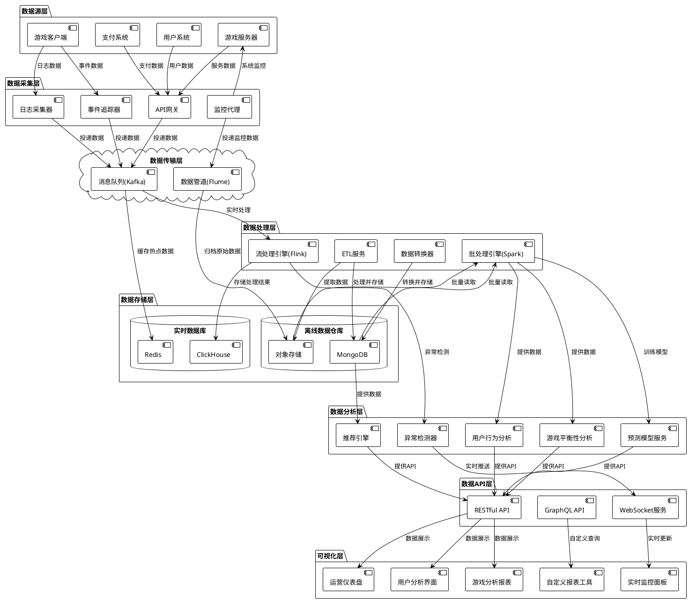

# 技术方案：数据分析服务

## 1. 整体架构

阿瓦隆微信小游戏的数据分析服务采用分层架构设计，结合批处理和流处理两种模式，为游戏运营和开发团队提供全面的数据分析能力。



### 1.1 架构分层说明

1. **数据源层**：负责从游戏各个环节收集原始数据

   - 游戏客户端：收集用户交互和行为数据
   - 游戏服务器：收集游戏逻辑和状态数据
   - 用户系统：收集用户账号和登录数据
   - 支付系统：收集充值和消费数据

2. **数据采集层**：将各类数据标准化并传入数据管道

   - 日志采集器：收集各系统的日志数据
   - 事件追踪器：收集用户行为事件数据
   - API 网关：收集服务调用数据
   - 监控代理：收集系统性能数据

3. **数据传输层**：确保数据高效可靠地从源系统传输到存储系统

   - Kafka：处理高吞吐量的事件和日志数据
   - Flume：处理系统监控和性能数据

4. **数据存储层**：根据数据特性和访问模式分别存储

   - 实时数据库：存储需要快速访问的热点数据
     - Redis：缓存实时统计和临时数据
     - ClickHouse：存储需要快速分析的列式数据
   - 离线数据仓库：存储历史数据和大容量数据
     - MongoDB：存储结构化和半结构化数据
     - 对象存储：存储原始日志和大文件数据

5. **数据处理层**：对数据进行清洗、转换和聚合

   - 批处理引擎：处理历史数据和大规模计算
   - 流处理引擎：处理实时数据流
   - ETL 服务：执行数据抽取、转换和加载
   - 数据转换器：将数据转换为分析友好的格式

6. **数据分析层**：执行各类数据分析和挖掘算法

   - 用户行为分析：分析用户游戏行为和偏好
   - 游戏平衡性分析：评估游戏规则公平性
   - 预测模型服务：预测用户流失和游戏趋势
   - 推荐引擎：为用户提供游戏推荐
   - 异常检测器：监测系统异常和作弊行为

7. **数据 API 层**：为前端和外部系统提供数据访问接口

   - RESTful API：提供标准数据访问接口
   - GraphQL API：提供灵活数据查询接口
   - WebSocket 服务：提供实时数据推送

8. **可视化层**：直观展示数据分析结果
   - 运营仪表盘：显示核心业务指标
   - 用户分析界面：展示用户行为分析
   - 游戏分析报表：展示游戏数据分析
   - 实时监控面板：实时显示系统状态
   - 自定义报表工具：支持自定义数据查询和展示

### 1.2 数据流向说明

1. **实时数据流**：

   - 游戏客户端和服务器产生数据 → 采集层收集 → Kafka 传输 → Flink 实时处理 → ClickHouse 存储 → WebSocket 推送 → 实时监控面板展示
   - 需要实时响应的服务（如异常检测）可直接从 Flink 获取处理结果

2. **离线数据流**：

   - 原始数据 → 对象存储归档 → ETL 处理 → MongoDB 存储 → Spark 批处理 → 分析模型处理 → RESTful API 提供 → 仪表盘展示

3. **混合数据流**：
   - 部分需要同时支持实时和历史分析的数据，会同时进入实时和离线流程
   - 实时处理结果会阶段性地合并入离线数据仓库，确保数据一致性

### 1.3 技术选型依据

1. **Kafka**：高吞吐量的分布式消息系统，适合处理游戏产生的大量事件数据
2. **Flink**：低延迟、高吞吐的流处理引擎，适合实时数据处理和分析
3. **Spark**：高性能的分布式计算引擎，适合大规模数据批处理和机器学习
4. **MongoDB**：灵活的文档存储，适合存储游戏中的半结构化数据
5. **ClickHouse**：高性能列式数据库，适合快速的实时分析查询
6. **Redis**：内存数据存储，适合缓存热点数据和临时统计结果
7. **Grafana/Echarts**：强大的可视化工具，适合构建交互式仪表盘

### 1.4 扩展性设计

1. **水平扩展**：

   - 各组件都支持集群部署，可根据负载动态扩展
   - 使用 Kubernetes 管理容器化部署的服务，支持自动扩缩容

2. **模块化设计**：

   - 采用微服务架构，各功能模块独立部署和扩展
   - 定义标准接口，支持未来添加新的分析模块和可视化组件

3. **数据分区策略**：
   - 按时间和业务维度对数据进行分区，提高查询效率
   - 支持冷热数据分离，优化存储成本和查询性能

## 2. 数据模型设计

数据分析服务需要处理多种类型的数据，包括游戏事件数据、用户行为数据、系统性能数据等。以下是关键数据模型的设计。

### 2.1 游戏事件数据模型

游戏事件数据记录游戏过程中的各种事件，是数据分析的核心输入。

```typescript
interface GameEvent {
  eventId: string; // 事件唯一标识
  eventType: GameEventType; // 事件类型
  gameId: string; // 游戏会话ID
  timestamp: number; // 事件发生时间戳
  userId: string; // 触发事件的用户ID
  roomId: string; // 游戏房间ID
  deviceInfo: {
    // 设备信息
    platform: string; // 平台类型(iOS/Android)
    model: string; // 设备型号
    osVersion: string; // 操作系统版本
    appVersion: string; // 应用版本
  };
  networkType: string; // 网络类型(WiFi/4G/5G)
  position?: {
    // 地理位置(可选)
    country: string; // 国家
    province: string; // 省份
    city: string; // 城市
  };
  eventData: any; // 事件具体数据(因事件类型而异)
}

enum GameEventType {
  // 游戏生命周期事件
  GAME_START = "game_start",
  GAME_END = "game_end",
  GAME_ABORT = "game_abort",
  ROUND_START = "round_start",
  ROUND_END = "round_end",

  // 玩家行为事件
  PLAYER_JOIN = "player_join",
  PLAYER_LEAVE = "player_leave",
  PLAYER_READY = "player_ready",
  PLAYER_VOTE = "player_vote",
  PLAYER_TASK_ACTION = "player_task_action",
  PLAYER_CHAT = "player_chat",
  PLAYER_USE_SKILL = "player_use_skill",

  // 游戏状态事件
  ROLE_ASSIGNED = "role_assigned",
  TEAM_SELECTED = "team_selected",
  TEAM_VOTE_RESULT = "team_vote_result",
  TASK_RESULT = "task_result",
  GAME_RESULT = "game_result",
  ASSASSIN_GUESS = "assassin_guess",

  // 系统事件
  ERROR = "error",
  WARNING = "warning",
  CONFIG_CHANGE = "config_change",
}
```

### 2.2 游戏会话数据模型

游戏会话数据记录完整游戏过程的汇总信息，用于分析游戏质量和平衡性。

```typescript
interface GameSession {
  gameId: string; // 游戏会话ID
  roomId: string; // 游戏房间ID
  startTime: number; // 开始时间戳
  endTime: number; // 结束时间戳
  duration: number; // 游戏持续时长(秒)
  playerCount: number; // 玩家数量
  gameConfig: {
    // 游戏配置
    roles: string[]; // 角色配置
    specialRules: string[]; // 特殊规则配置
    taskConfig: number[]; // 每轮任务人数配置
  };
  players: Array<{
    // 玩家信息
    userId: string; // 用户ID
    nickname: string; // 昵称
    role: string; // 角色
    team: "good" | "evil"; // 阵营
    isHost: boolean; // 是否为房主
    joinTime: number; // 加入时间
    leaveTime?: number; // 离开时间(如有)
    disconnectCount: number; // 断线次数
    reconnectCount: number; // 重连次数
  }>;
  rounds: Array<{
    // 轮次信息
    roundIndex: number; // 轮次索引
    leaderUserId: string; // 队长用户ID
    teamMembers: string[]; // 队员用户ID列表
    teamApproved: boolean; // 队伍是否通过投票
    teamVotes: {
      // 队伍投票结果
      [userId: string]: boolean; // 用户ID -> 投票结果(true表示同意)
    };
    teamVoteCount: number; // 投票轮次计数
    taskSuccess: boolean; // 任务是否成功
    taskVotes: {
      // 任务投票
      success: number; // 成功票数
      fail: number; // 失败票数
    };
    duration: number; // 轮次持续时间(秒)
  }>;
  result: {
    // 游戏结果
    winner: "good" | "evil"; // 获胜阵营
    winReason: string; // 获胜原因
    goodTaskWins: number; // 好人方成功任务数
    evilTaskWins: number; // 坏人方成功任务数
    assassinGuessCorrect: boolean; // 刺客猜测是否正确
    mvpUserId?: string; // MVP玩家ID(如有)
  };
  chatCount: number; // 聊天消息总数
  reportCount: number; // 举报次数
  abnormalActions: Array<{
    // 异常行为记录
    userId: string; // 用户ID
    actionType: string; // 行为类型
    timestamp: number; // 发生时间
    description: string; // 描述
  }>;
  systemPerformance: {
    // 系统性能数据
    averageLatency: number; // 平均延迟(ms)
    maxLatency: number; // 最大延迟(ms)
    serverErrors: number; // 服务器错误次数
    clientErrors: number; // 客户端错误次数
  };
}
```

### 2.3 用户游戏分析数据模型

用户游戏分析数据模型用于存储针对每个用户的游戏行为分析结果。

```typescript
interface UserGameAnalytics {
  userId: string; // 用户ID
  totalGames: number; // 总游戏场次
  lastGameTime: number; // 最后游戏时间
  totalPlayTime: number; // 总游戏时长(分钟)
  averageGameDuration: number; // 平均每局时长(分钟)
  winRate: number; // 胜率(0-1)
  roleStats: {
    // 角色统计
    [role: string]: {
      // 按角色名分组
      count: number; // 扮演次数
      winCount: number; // 获胜次数
      winRate: number; // 该角色胜率
      preferenceScore: number; // 偏好分数(0-1)
    };
  };
  teamStats: {
    // 阵营统计
    good: {
      // 好人阵营
      count: number; // 场次
      winCount: number; // 获胜次数
      winRate: number; // 胜率
    };
    evil: {
      // 坏人阵营
      count: number; // 场次
      winCount: number; // 获胜次数
      winRate: number; // 胜率
    };
  };
  leaderStats: {
    // 队长统计
    count: number; // 担任队长次数
    approvalRate: number; // 队伍通过率
    taskSuccessRate: number; // 任务成功率
  };
  voteStats: {
    // 投票统计
    teamApprovalRate: number; // 队伍赞成率
    alignmentWithMajority: number; // 与多数人一致率
    successfulTaskRate: number; // 执行任务成功率
  };
  socialStats: {
    // 社交统计
    averageChatMessagesPerGame: number; // 平均每局聊天数
    playedWithFriendsRate: number; // 与好友游戏比率
    inviteCount: number; // 邀请他人次数
    beInvitedCount: number; // 被邀请次数
  };
  timeStats: {
    // 时间统计
    weekdayPlayCount: number[]; // 工作日游戏次数[周一~周五]
    weekendPlayCount: number[]; // 周末游戏次数[周六,周日]
    hourlyPlayCount: number[]; // 每小时游戏次数[0-23]
  };
  skillAnalysis: {
    // 技能分析
    reasoning: number; // 推理能力(0-100)
    teamwork: number; // 团队合作(0-100)
    leadership: number; // 领导力(0-100)
    deception: number; // 欺骗能力(0-100)
    observation: number; // 观察力(0-100)
  };
  segments: string[]; // 用户分群标签
  retentionProbability: number; // 留存概率预测(0-1)
  churnRiskScore: number; // 流失风险分数(0-100)
}
```

### 2.4 游戏平衡性分析数据模型

游戏平衡性分析数据用于评估游戏机制的公平性和平衡性。

```typescript
interface GameBalanceAnalytics {
  timeRange: {
    // 时间范围
    start: number; // 开始时间戳
    end: number; // 结束时间戳
  };
  totalGames: number; // 分析的游戏总数
  playerCountDistribution: {
    // 玩家人数分布
    [count: number]: number; // 人数 -> 游戏场次
  };
  overallWinRate: {
    // 整体胜率
    good: number; // 好人阵营胜率
    evil: number; // 坏人阵营胜率
  };
  winRateByPlayerCount: {
    // 按玩家数分组的胜率
    [count: number]: {
      // 玩家数 -> 胜率
      good: number; // 好人阵营胜率
      evil: number; // 坏人阵营胜率
      sampleSize: number; // 样本数量
    };
  };
  roleAnalytics: {
    // 角色分析
    [role: string]: {
      // 按角色名分组
      count: number; // 出现次数
      winRate: number; // 胜率
      impactScore: number; // 对游戏结果的影响分数(-1到1)
      avgGameDuration: number; // 平均游戏时长
    };
  };
  roleComboEffects: Array<{
    // 角色组合效应
    roles: string[]; // 角色组合
    count: number; // 出现次数
    winRate: number; // 胜率
    synergy: number; // 协同效应分数(-1到1)
  }>;
  taskRoundAnalytics: Array<{
    // 任务轮次分析
    round: number; // 轮次(1-5)
    goodSuccessRate: number; // 好人成功率
    evilFailRate: number; // 坏人失败率
    averageTeamVoteRounds: number; // 平均队伍投票轮数
    pivotalRate: number; // 对最终结果的关键程度(0-1)
  }>;
  gameStageImpact: {
    // 游戏阶段影响
    firstRound: number; // 第一轮影响力(-1到1)
    middleRounds: number; // 中间轮次影响力
    finalRound: number; // 最终轮影响力
    assassinGuess: number; // 刺客猜测阶段影响力
  };
  balanceScores: {
    // 平衡性评分(0-100)
    overall: number; // 整体平衡性
    byPlayerCount: {
      // 按玩家数的平衡性
      [count: number]: number; // 玩家数 -> 平衡性评分
    };
    byRoleCombination: {
      // 按角色组合的平衡性
      [combo: string]: number; // 角色组合 -> 平衡性评分
    };
  };
  suggestions: Array<{
    // 平衡性优化建议
    target: string; // 优化目标(角色/规则/机制)
    issue: string; // 问题描述
    suggestionType: string; // 建议类型
    description: string; // 详细描述
    impactEstimation: number; // 预计影响(0-1)
  }>;
  latestUpdate: number; // 最后更新时间戳
}
```

### 2.5 实时监控数据模型

实时监控数据用于系统健康状态监控和性能分析。

```typescript
interface RealTimeMetrics {
  timestamp: number; // 时间戳
  activeUsers: number; // 当前活跃用户数
  activeGames: number; // 当前活跃游戏数
  userActionRate: number; // 用户操作频率(每秒)
  systemMetrics: {
    // 系统指标
    cpu: {
      // CPU指标
      usage: number; // CPU使用率(0-1)
      load: number[]; // 负载(1,5,15分钟)
    };
    memory: {
      // 内存指标
      total: number; // 总内存(MB)
      used: number; // 已用内存(MB)
      free: number; // 空闲内存(MB)
      usageRate: number; // 使用率(0-1)
    };
    network: {
      // 网络指标
      inboundTraffic: number; // 入站流量(KB/s)
      outboundTraffic: number; // 出站流量(KB/s)
      connections: number; // 连接数
    };
    disk: {
      // 磁盘指标
      read: number; // 读取速率(KB/s)
      write: number; // 写入速率(KB/s)
      usageRate: number; // 使用率(0-1)
    };
  };
  serviceMetrics: {
    // 服务指标
    [service: string]: {
      // 按服务名分组
      requestRate: number; // 请求率(每秒)
      averageResponseTime: number; // 平均响应时间(ms)
      errorRate: number; // 错误率(0-1)
      cpuUsage: number; // CPU使用率(0-1)
      memoryUsage: number; // 内存使用率(0-1)
    };
  };
  queueMetrics: {
    // 队列指标
    [queue: string]: {
      // 按队列名分组
      length: number; // 队列长度
      processRate: number; // 处理速率(每秒)
      oldestMessageAge: number; // 最老消息年龄(秒)
    };
  };
  databaseMetrics: {
    // 数据库指标
    [db: string]: {
      // 按数据库名分组
      queryRate: number; // 查询率(每秒)
      averageQueryTime: number; // 平均查询时间(ms)
      connectionCount: number; // 连接数
      cacheHitRate?: number; // 缓存命中率(0-1,可选)
    };
  };
  anomalies: Array<{
    // 异常情况
    type: string; // 异常类型
    service: string; // 相关服务
    metric: string; // 相关指标
    value: number; // 当前值
    threshold: number; // 阈值
    severity: "low" | "medium" | "high"; // 严重程度
    timestamp: number; // 发生时间
  }>;
  alerts: Array<{
    // 告警信息
    id: string; // 告警ID
    type: string; // 告警类型
    message: string; // 告警消息
    timestamp: number; // 发生时间
    acknowledged: boolean; // 是否已确认
  }>;
}
```

### 2.6 数据分析任务模型

数据分析任务模型用于跟踪和管理各种数据分析任务的执行情况。

```typescript
interface AnalyticsTask {
  taskId: string; // 任务ID
  taskType: string; // 任务类型
  name: string; // 任务名称
  description: string; // 任务描述
  createdBy: string; // 创建者
  createdAt: number; // 创建时间
  schedule: {
    // 调度信息
    type: "oneTime" | "recurring"; // 一次性或定期
    cron?: string; // Cron表达式(定期任务)
    nextRunTime?: number; // 下次运行时间
  };
  parameters: Record<string, any>; // 任务参数
  status: "pending" | "running" | "completed" | "failed"; // 任务状态
  progress: number; // 进度(0-100)
  executionHistory: Array<{
    // 执行历史
    startTime: number; // 开始时间
    endTime?: number; // 结束时间
    status: string; // 状态
    duration?: number; // 持续时间(秒)
    resultId?: string; // 结果ID(如有)
    error?: string; // 错误信息(如有)
    metrics?: {
      // 执行指标
      recordsProcessed: number; // 处理记录数
      processingRate: number; // 处理速率(每秒)
      resourceUsage: {
        // 资源使用
        cpu: number; // CPU使用率
        memory: number; // 内存使用(MB)
      };
    };
  }>;
  dependencies: string[]; // 依赖任务ID
  priority: number; // 优先级(1-10)
  timeout: number; // 超时时间(秒)
  retryPolicy: {
    // 重试策略
    maxRetries: number; // 最大重试次数
    retryInterval: number; // 重试间隔(秒)
    backoffRate: number; // 退避率
  };
  result?: {
    // 结果信息
    outputLocation: string; // 输出位置
    summary: Record<string, any>; // 结果摘要
    visualizationId?: string; // 可视化ID
  };
  tags: string[]; // 标签
  lastModified: number; // 最后修改时间
}
```

### 2.7 数据字典

为确保数据分析过程中的一致性和可理解性，我们定义了以下关键术语的数据字典：

| 术语         | 描述             | 类型    | 示例值                      |
| ------------ | ---------------- | ------- | --------------------------- |
| userId       | 用户唯一标识     | string  | "user_123456"               |
| gameId       | 游戏会话唯一标识 | string  | "game_789012"               |
| roomId       | 游戏房间唯一标识 | string  | "room_345678"               |
| role         | 游戏角色名称     | string  | "merlin", "assassin"        |
| team         | 游戏阵营         | string  | "good", "evil"              |
| taskResult   | 任务执行结果     | boolean | true(成功), false(失败)     |
| roundIndex   | 游戏轮次索引     | number  | 0, 1, 2, 3, 4               |
| eventType    | 游戏事件类型     | string  | "game_start", "player_vote" |
| winRate      | 胜率             | number  | 0.75 (75%)                  |
| activeUsers  | 活跃用户数       | number  | 1250                        |
| responseTime | 接口响应时间     | number  | 45 (毫秒)                   |

## 3. API 设计

数据分析服务为前端应用和其他服务提供统一的 API 接口，采用 RESTful 和 GraphQL 两种方式，满足不同的查询需求和灵活性要求。

### 3.1 RESTful API 设计

#### 3.1.1 用户分析相关 API

| 路径                                            | 方法 | 说明                 | 请求参数                        | 响应内容           |
| ----------------------------------------------- | ---- | -------------------- | ------------------------------- | ------------------ |
| `/api/analytics/users/{userId}/summary`         | GET  | 获取用户游戏数据概览 | `userId`: 用户 ID               | 用户游戏数据摘要   |
| `/api/analytics/users/{userId}/stats`           | GET  | 获取用户详细统计数据 | `userId`, `timeRange`           | 用户详细游戏统计   |
| `/api/analytics/users/{userId}/roles`           | GET  | 获取用户角色统计     | `userId`                        | 用户各角色统计数据 |
| `/api/analytics/users/{userId}/sessions`        | GET  | 获取用户游戏会话历史 | `userId`, `page`, `pageSize`    | 用户历史游戏列表   |
| `/api/analytics/users/{userId}/trends`          | GET  | 获取用户数据趋势     | `userId`, `metric`, `timeRange` | 指定指标的时序数据 |
| `/api/analytics/users/{userId}/recommendations` | GET  | 获取用户个性化推荐   | `userId`                        | 游戏和角色推荐     |
| `/api/analytics/users/segments`                 | POST | 创建用户分群         | 分群条件 JSON                   | 分群 ID 和统计信息 |
| `/api/analytics/users/segments/{segmentId}`     | GET  | 获取分群用户列表     | `segmentId`, `page`, `pageSize` | 分群用户列表       |

#### 3.1.2 游戏分析相关 API

| 路径                            | 方法 | 说明                 | 请求参数                          | 响应内容           |
| ------------------------------- | ---- | -------------------- | --------------------------------- | ------------------ |
| `/api/analytics/games/summary`  | GET  | 获取游戏数据概览     | `timeRange`                       | 游戏数据摘要       |
| `/api/analytics/games/{gameId}` | GET  | 获取单局游戏详情     | `gameId`                          | 游戏详细数据       |
| `/api/analytics/games/sessions` | GET  | 查询游戏会话列表     | 筛选条件                          | 游戏会话列表       |
| `/api/analytics/games/balance`  | GET  | 获取游戏平衡性分析   | `timeRange`, `playerCount`        | 平衡性分析数据     |
| `/api/analytics/games/roles`    | GET  | 获取角色数据分析     | `timeRange`                       | 各角色数据分析     |
| `/api/analytics/games/trends`   | GET  | 获取游戏数据趋势     | `metric`, `timeRange`, `interval` | 指定指标的时序数据 |
| `/api/analytics/games/heatmap`  | GET  | 获取游戏活跃度热力图 | `timeRange`, `resolution`         | 时间热力图数据     |
| `/api/analytics/games/funnel`   | GET  | 获取游戏转化漏斗     | `funnel`, `timeRange`             | 漏斗分析数据       |

#### 3.1.3 系统监控相关 API

| 路径                                      | 方法  | 说明             | 请求参数                           | 响应内容     |
| ----------------------------------------- | ----- | ---------------- | ---------------------------------- | ------------ |
| `/api/analytics/monitor/realtime`         | GET   | 获取实时监控数据 | 无                                 | 实时系统指标 |
| `/api/analytics/monitor/metrics`          | GET   | 获取历史监控指标 | `metrics`, `timeRange`, `interval` | 历史监控数据 |
| `/api/analytics/monitor/alerts`           | GET   | 获取系统告警信息 | `status`, `timeRange`              | 告警列表     |
| `/api/analytics/monitor/alerts/{alertId}` | PATCH | 更新告警状态     | `status`                           | 更新后的告警 |
| `/api/analytics/monitor/services`         | GET   | 获取服务健康状况 | 无                                 | 各服务状态   |
| `/api/analytics/monitor/performance`      | GET   | 获取性能分析数据 | `service`, `timeRange`             | 性能数据     |

#### 3.1.4 数据管理相关 API

| 路径                                    | 方法  | 说明             | 请求参数   | 响应内容     |
| --------------------------------------- | ----- | ---------------- | ---------- | ------------ |
| `/api/analytics/tasks`                  | GET   | 获取分析任务列表 | 筛选条件   | 任务列表     |
| `/api/analytics/tasks`                  | POST  | 创建分析任务     | 任务配置   | 创建的任务   |
| `/api/analytics/tasks/{taskId}`         | GET   | 获取任务详情     | `taskId`   | 任务详情     |
| `/api/analytics/tasks/{taskId}`         | PATCH | 更新任务状态     | 更新内容   | 更新后的任务 |
| `/api/analytics/tasks/{taskId}/execute` | POST  | 执行任务         | 执行参数   | 执行状态     |
| `/api/analytics/reports`                | GET   | 获取报表列表     | 筛选条件   | 报表列表     |
| `/api/analytics/reports/{reportId}`     | GET   | 获取报表内容     | `reportId` | 报表内容     |
| `/api/analytics/exports`                | POST  | 创建数据导出任务 | 导出配置   | 导出任务信息 |

### 3.2 GraphQL API 设计

为支持更灵活的数据查询，我们提供 GraphQL API，允许客户端精确指定所需数据字段和查询条件。

#### 3.2.1 GraphQL Schema 概览

```graphql
type Query {
  # 用户分析查询
  userSummary(userId: ID!): UserSummary
  userStats(userId: ID!, timeRange: TimeRangeInput): UserStats
  userGameSessions(
    userId: ID!
    pagination: PaginationInput
  ): GameSessionConnection
  userSegments(filter: SegmentFilterInput): UserSegmentConnection

  # 游戏分析查询
  gameSummary(timeRange: TimeRangeInput): GameSummary
  gameSession(gameId: ID!): GameSession
  gameSessions(
    filter: GameSessionFilterInput
    pagination: PaginationInput
  ): GameSessionConnection
  gameBalanceAnalytics(
    timeRange: TimeRangeInput
    playerCount: Int
  ): GameBalanceAnalytics

  # 监控查询
  realtimeMetrics: RealTimeMetrics
  monitorMetrics(
    metrics: [String!]!
    timeRange: TimeRangeInput
    interval: Interval
  ): MetricsTimeSeries
  alerts(filter: AlertFilterInput): AlertConnection
  serviceHealth: [ServiceHealth!]!

  # 数据任务查询
  analyticsTasks(filter: TaskFilterInput): AnalyticsTaskConnection
  analyticsTask(taskId: ID!): AnalyticsTask
  reports(filter: ReportFilterInput): ReportConnection
  report(reportId: ID!): Report
}

type Mutation {
  # 用户分析变更操作
  createUserSegment(input: CreateUserSegmentInput!): CreateUserSegmentPayload
  updateUserSegment(input: UpdateUserSegmentInput!): UpdateUserSegmentPayload
  deleteUserSegment(id: ID!): DeleteUserSegmentPayload

  # 任务管理变更操作
  createAnalyticsTask(
    input: CreateAnalyticsTaskInput!
  ): CreateAnalyticsTaskPayload
  updateAnalyticsTask(
    input: UpdateAnalyticsTaskInput!
  ): UpdateAnalyticsTaskPayload
  executeAnalyticsTask(id: ID!, parameters: JSON): ExecuteAnalyticsTaskPayload
  cancelAnalyticsTask(id: ID!): CancelAnalyticsTaskPayload

  # 告警管理变更操作
  acknowledgeAlert(id: ID!): AcknowledgeAlertPayload
  resolveAlert(id: ID!): ResolveAlertPayload

  # 报表管理变更操作
  createReport(input: CreateReportInput!): CreateReportPayload
  updateReport(input: UpdateReportInput!): UpdateReportPayload
  shareReport(id: ID!, recipients: [String!]!): ShareReportPayload

  # 数据导出变更操作
  exportData(input: ExportDataInput!): ExportDataPayload
}

# 订阅实时数据更新
type Subscription {
  realtimeMetricsUpdated: RealTimeMetrics
  newAlertCreated: Alert
  taskStatusChanged(taskId: ID): AnalyticsTask
}
```

#### 3.2.2 GraphQL 查询示例

以下是一些典型的 GraphQL 查询示例：

1. **获取用户游戏数据概览**

```graphql
query GetUserSummary($userId: ID!) {
  userSummary(userId: $userId) {
    userId
    totalGames
    winRate
    lastGameTime
    averageGameDuration
    roleStats {
      role
      count
      winRate
    }
    teamStats {
      team
      count
      winRate
    }
  }
}
```

2. **获取游戏平衡性分析数据**

```graphql
query GetGameBalance($timeRange: TimeRangeInput!, $playerCount: Int) {
  gameBalanceAnalytics(timeRange: $timeRange, playerCount: $playerCount) {
    timeRange {
      start
      end
    }
    totalGames
    overallWinRate {
      good
      evil
    }
    roleAnalytics {
      role
      count
      winRate
      impactScore
    }
    balanceScores {
      overall
      byPlayerCount
    }
    suggestions {
      target
      issue
      description
      impactEstimation
    }
  }
}
```

3. **创建分析任务**

```graphql
mutation CreateTask($input: CreateAnalyticsTaskInput!) {
  createAnalyticsTask(input: $input) {
    task {
      taskId
      name
      status
      createdAt
      schedule {
        type
        nextRunTime
      }
    }
    errors {
      field
      message
    }
  }
}
```

### 3.3 WebSocket API 设计

为支持实时数据推送，我们提供基于 WebSocket 的实时 API。

#### 3.3.1 连接与认证

```
WSS://api.avalon-game.com/analytics/realtime?token={auth_token}
```

客户端通过包含身份验证 token 的 URL 连接到 WebSocket 服务。连接建立后，需要发送认证消息：

```json
{
  "type": "auth",
  "payload": {
    "token": "jwt_token_here"
  }
}
```

服务端验证成功后，会返回确认消息：

```json
{
  "type": "auth_success",
  "payload": {
    "userId": "user_id",
    "permissions": ["read:metrics", "read:alerts"]
  }
}
```

#### 3.3.2 订阅主题

客户端可以订阅感兴趣的实时数据主题：

```json
{
  "type": "subscribe",
  "payload": {
    "topics": ["system.metrics", "alerts.new", "games.active"]
  }
}
```

服务端确认订阅：

```json
{
  "type": "subscribe_ack",
  "payload": {
    "topics": ["system.metrics", "alerts.new", "games.active"],
    "success": true
  }
}
```

#### 3.3.3 数据推送

服务端根据订阅主题推送数据：

```json
{
  "type": "message",
  "topic": "system.metrics",
  "payload": {
    "timestamp": 1630000000000,
    "metrics": {
      "cpu": 0.45,
      "memory": 0.62,
      "activeUsers": 1250,
      "activeGames": 78
    }
  }
}
```

或告警消息：

```json
{
  "type": "message",
  "topic": "alerts.new",
  "payload": {
    "alertId": "alert_12345",
    "type": "high_error_rate",
    "severity": "high",
    "message": "API服务错误率超过阈值",
    "timestamp": 1630000500000
  }
}
```

#### 3.3.4 心跳机制

为保持连接活跃，客户端和服务端交换心跳消息：

```json
// 客户端发送
{
  "type": "ping",
  "payload": {
    "timestamp": 1630001000000
  }
}

// 服务端响应
{
  "type": "pong",
  "payload": {
    "timestamp": 1630001000100
  }
}
```

### 3.4 API 安全设计

#### 3.4.1 认证机制

1. **JWT 认证**

   - RESTful 和 GraphQL API 使用 JWT Bearer Token 认证
   - Token 包含用户 ID、权限范围和过期时间
   - 支持 Token 刷新机制，避免频繁登录

2. **WebSocket 认证**
   - 初始连接通过 URL 参数提供临时 Token
   - 连接后通过 auth 消息提供完整 JWT 验证
   - 支持连接有效期和自动重连机制

#### 3.4.2 授权控制

1. **基于角色的访问控制(RBAC)**

   - 定义不同角色：管理员、运营、开发者、普通用户
   - 每个角色关联不同的权限集合
   - API 访问根据用户角色和权限判定

2. **细粒度权限控制**
   - 读权限：`read:users`, `read:games`, `read:metrics`
   - 写权限：`write:tasks`, `write:reports`
   - 管理权限：`manage:users`, `manage:system`

#### 3.4.3 数据访问控制

1. **数据范围限制**

   - 普通用户只能访问自己的数据
   - 运营角色可以访问聚合数据和特定用户数据
   - 管理员可以访问所有数据

2. **敏感数据处理**
   - 个人身份信息(PII)默认脱敏
   - 详细访问日志记录敏感数据访问
   - 支持数据导出审批流程

#### 3.4.4 API 限流与防护

1. **请求限流**

   - 基于用户的请求速率限制
   - 基于 IP 的请求速率限制
   - 针对高消耗查询的特殊限制

2. **安全防护**
   - 输入验证和清洗
   - SQL 注入和 NoSQL 注入防护
   - GraphQL 查询复杂度限制
   - WebSocket 消息验证

## 4. 数据处理流程

数据分析服务涉及从数据采集、处理到分析和可视化的完整流程，包括实时流处理和离线批处理两种模式。

### 4.1 数据采集流程

#### 4.1.1 客户端数据采集

1. **事件触发**

   - 游戏客户端在关键操作和状态变化时生成事件
   - 事件包含上下文信息、时间戳和相关数据

2. **本地缓存**

   - 客户端先将事件保存在本地缓存
   - 支持断网情况下的数据暂存

3. **批量上传**

   - 当网络可用时，按批次上传事件数据
   - 采用压缩传输减少带宽消耗
   - 支持优先级策略，关键事件优先上传

4. **上传确认**
   - 服务端接收数据后返回确认信息
   - 客户端收到确认后清理本地缓存

#### 4.1.2 服务端日志采集

1. **服务日志**

   - 游戏服务器产生运行日志
   - 包含 API 调用、错误信息、性能指标等

2. **日志转发**

   - 使用 Filebeat 收集和转发日志
   - 支持多服务节点的日志聚合

3. **统一接入**
   - 所有日志数据统一接入 Kafka 消息队列
   - 按主题分类存储不同类型的日志

### 4.2 实时数据处理流程

#### 4.2.1 实时处理架构

```
+-------------+     +----------+     +-------------+     +----------------+
| 数据源      |     | 消息队列  |     | 流处理引擎   |     | 数据存储/推送   |
| (客户端/    | --> | (Kafka)  | --> | (Flink)     | --> | (ClickHouse/   |
|  服务器)    |     |          |     |             |     |  WebSocket)    |
+-------------+     +----------+     +-------------+     +----------------+
```

#### 4.2.2 实时处理步骤

1. **数据接收与解析**

   - Flink 从 Kafka 消费数据流
   - 解析 JSON 格式事件数据
   - 验证数据完整性和格式

2. **数据富化**

   - 关联额外上下文信息
   - 补充用户和游戏元数据
   - 标准化数据格式和单位

3. **状态计算**

   - 维护状态窗口(时间窗口或会话窗口)
   - 计算实时统计指标
   - 执行聚合和关联操作

4. **异常检测**

   - 应用异常检测算法
   - 识别异常数据模式
   - 触发告警和通知

5. **实时存储与推送**
   - 将处理结果写入 ClickHouse
   - 通过 WebSocket 推送实时更新
   - 缓存热点数据到 Redis

#### 4.2.3 实时处理应用场景

1. **实时监控指标**

   - 活跃用户数和游戏数
   - 系统性能指标(CPU、内存、网络)
   - 错误率和异常事件

2. **游戏进行中分析**

   - 当前游戏状态和进展
   - 玩家行为实时反馈
   - 实时对战数据

3. **实时告警**
   - 系统异常告警
   - 安全风险告警
   - 业务指标异常告警

### 4.3 离线批处理流程

#### 4.3.1 批处理架构

```
+-------------+     +-------------+     +-------------+     +----------------+
| 数据源      |     | 数据仓库    |     | 批处理引擎   |     | 分析结果存储   |
| (对象存储/  | --> | (MongoDB/   | --> | (Spark)     | --> | (MongoDB/      |
|  数据库)    |     |  文件系统)  |     |             |     |  Redis)        |
+-------------+     +-------------+     +-------------+     +----------------+
```

#### 4.3.2 批处理步骤

1. **数据抽取**

   - 从多个数据源抽取原始数据
   - 按时间范围或数据批次组织
   - 过滤无效或重复数据

2. **数据转换**

   - 清洗数据，处理缺失值和异常值
   - 标准化和归一化数据
   - 特征工程和数据增强

3. **数据聚合分析**

   - 执行复杂分析算法
   - 构建统计模型
   - 生成聚合报表

4. **结果存储**
   - 将分析结果持久化存储
   - 建立索引支持快速查询
   - 与历史数据合并

#### 4.3.3 批处理应用场景

1. **游戏平衡性分析**

   - 角色胜率和影响力分析
   - 游戏机制公平性评估
   - 玩家行为模式挖掘

2. **用户画像构建**

   - 用户行为特征分析
   - 游戏偏好和技能评估
   - 用户分群和标签化

3. **预测模型训练**
   - 用户留存预测模型
   - 游戏趋势预测模型
   - 玩家匹配推荐模型

### 4.4 数据 ETL 流程

ETL(Extract-Transform-Load)流程用于定期将数据从源系统提取、转换并加载到数据仓库。

#### 4.4.1 数据提取(Extract)

1. **增量提取**

   - 基于时间戳识别新增数据
   - 使用变更数据捕获(CDC)技术
   - 支持断点续传和失败重试

2. **全量提取**
   - 定期执行全量数据同步
   - 支持并行分片提取大数据集
   - 记录数据快照和版本信息

#### 4.4.2 数据转换(Transform)

1. **数据清洗**

   - 处理缺失值和异常值
   - 纠正数据错误和不一致
   - 移除重复数据

2. **数据结构转换**

   - 字段映射和类型转换
   - 数据格式标准化
   - 维度扁平化处理

3. **数据聚合**
   - 预计算常用统计指标
   - 构建汇总表和聚合视图
   - 生成数据立方体

#### 4.4.3 数据加载(Load)

1. **分区策略**

   - 按时间或维度分区存储
   - 支持冷热数据分离
   - 优化查询性能

2. **加载模式**

   - 增量追加模式
   - 合并更新模式
   - 全量替换模式

3. **数据验证**
   - 记录计数验证
   - 数据一致性检查
   - 业务规则验证

### 4.5 数据质量管理

#### 4.5.1 数据质量维度

1. **完整性**

   - 必填字段检查
   - 数据覆盖率监控
   - 数据丢失检测

2. **准确性**

   - 值范围验证
   - 业务规则验证
   - 关联一致性检查

3. **及时性**

   - 数据延迟监控
   - 处理时效性评估
   - 时序完整性检查

4. **一致性**
   - 跨系统数据一致性
   - 前后版本一致性
   - 计算逻辑一致性

#### 4.5.2 数据质量控制流程

1. **质量规则定义**

   - 建立数据质量规则库
   - 设置质量指标阈值
   - 定义验证频率

2. **自动化检测**

   - 集成到 ETL 流程中
   - 实时监控关键数据质量
   - 自动执行质量检查脚本

3. **异常处理**

   - 质量问题自动告警
   - 标记异常数据
   - 提供修复建议

4. **质量报告**
   - 生成数据质量分数
   - 追踪质量趋势
   - 提供质量可视化仪表盘

### 4.6 数据生命周期管理

#### 4.6.1 数据分级

1. **热数据**

   - 最近 7 天的活跃数据
   - 存储在高性能存储层
   - 支持实时访问和查询

2. **温数据**

   - 最近 90 天的数据
   - 存储在标准性能存储层
   - 支持常规分析和查询

3. **冷数据**
   - 90 天以上的历史数据
   - 存储在低成本存储层
   - 主要用于归档和深度分析

#### 4.6.2 数据归档策略

1. **时间触发归档**

   - 基于数据时效性自动归档
   - 支持多级归档策略
   - 保留数据访问能力

2. **压缩存储**

   - 归档前应用数据压缩
   - 按主题和时间组织归档文件
   - 优化存储成本

3. **元数据管理**
   - 维护归档数据的元数据
   - 支持归档数据的索引和查询
   - 提供数据血缘关系追踪

#### 4.6.3 数据销毁流程

1. **销毁策略**

   - 基于法规和业务需求确定保留期
   - 遵循数据隐私保护要求
   - 实施分级销毁策略

2. **安全销毁**
   - 使用安全擦除技术
   - 记录销毁操作日志
   - 提供销毁证明

## 5. 可视化设计

## 6. 安全与隐私

## 7. 扩展性设计

## 8. 技术选型与依赖
